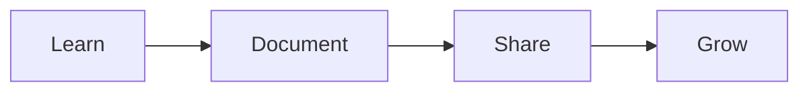

# Welcome to My Digital Brain Blog

Welcome to the blog section of my digital brain! This is where I'll share longer-form thoughts, tutorials, and updates.

<!-- more -->

## What's New

Today I've added several exciting features to this knowledge base:

### 1. Mermaid Diagrams
Beautiful, interactive diagrams right in markdown:

### 2. Wiki Links
Obsidian-style `[[wiki-links]]` for easy cross-referencing between notes.

### 3. Blog Support
This blog! A place for longer articles and updates.

## What's Next

I'm planning to add:
- Graph view to visualize connections
- Backlinks to see what references each page
- More content across all categories

Stay tuned for more updates!
