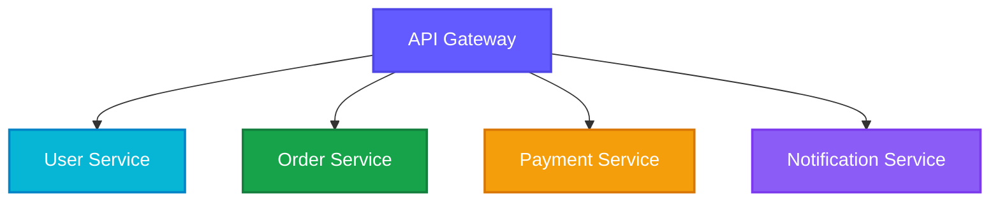

# Microservices Architecture

Microservices is an architectural style that structures an application as a collection of loosely coupled services.

## Overview

Each microservice is independently deployable and focuses on a specific business capability.

## Key Characteristics

- **Decentralized**: Each service owns its data
- **Independent**: Deploy and scale independently
- **Technology agnostic**: Use different tech stacks
- **Resilient**: Failure isolation
- **Organized around business capabilities**

## Benefits

- Scalability
- Flexibility in technology choices
- Faster deployment cycles
- Better fault isolation
- Easier to understand and maintain

## Challenges

- Distributed system complexity
- Data consistency
- Network latency
- Service discovery
- Monitoring and debugging

## Common Patterns

## Best Practices

- Define clear service boundaries
- Use API gateway for routing
- Implement circuit breakers
- Centralized logging and monitoring
- Automate deployment with CI/CD
- Use message queues for async communication
