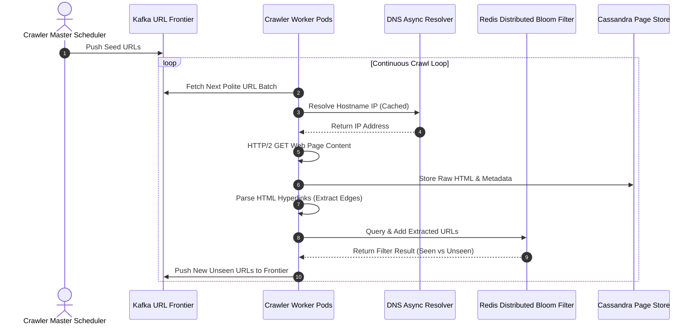

# Week 23 — Day 159: System Design Bridge: Web Crawlers & Social Network Graph Traversal

Welcome to **Day 159 of your DSA Mastery Journey**!

Over the past four weeks (Weeks 20 to 23), you mastered graph algorithms in algorithmic, single-threaded in-memory environments. You implemented BFS shortest paths, 3-color cycle detection, Kahn's dependency wavefronts, and bitmask state augmentation.

Today, in this **System Design Bridge**, you step out of the single-process sandbox and architect graph algorithms that operate across **distributed clusters of thousands of servers**:
- The **World Wide Web** is a colossal directed graph containing over **50 billion vertices** (web pages) and hundreds of billions of edges (hyperlinks).
- The **Social Graph** (e.g. Meta, LinkedIn) connects billions of users across hundreds of billions of friendship and follow edges.

At this hyper-scale, single-machine assumptions shatter:
- You cannot store a `Queue<string>` or `HashSet<string>` in RAM (storing 10 billion URLs with an average length of 100 bytes requires over **1 Terabyte of raw memory**, crashing standard process heaps).
- You cannot crawl targets naively without DDOSing target web servers (violating **Politeness**).
- You cannot store massive celebrity nodes (e.g. users with 100 million followers) on a single server without causing catastrophic memory and network hot-spotting.

Today, you will master:
1. **Distributed BFS & URL Frontier Architecture:** Decoupling crawlers into Politeness queues and Priority queues using Kafka and Redis.
2. **Deduplication at Scale:** Replacing in-memory hash sets with **Distributed Bloom Filters** and persistent LSM-tree storage engines (RocksDB/Cassandra).
3. **Massive Graph Partitioning:** Comparing **Edge-Cut Partitioning** (minimizing network communication hops) versus **Vertex-Cut Partitioning** (eliminating power-law degree skews and celebrity hub hot spots).
4. **Production Architecture Design:** Designing a complete, resilient distributed web crawler pipeline capable of parsing millions of pages per second.

---

## 🧭 Executive Curriculum Roadmap

```
┌──────────────────────────────────────────────────────────────────────────────────────────────────┐
│                         DAY 159: DISTRIBUTED GRAPH TRAVERSAL & WEB CRAWLERS                      │
└──────────────────────────────────────────────────────────────────────────────────────────────────┘
                                                  │
                 ┌────────────────────────────────┴────────────────────────────────┐
                 ▼                                                                 ▼
┌───────────────────────────────────┐                             ┌───────────────────────────────────┐
│        THE URL FRONTIER ENGINE    │                             │     DEDUPLICATION & PARTITIONING  │
├───────────────────────────────────┤                             ├───────────────────────────────────┤
│ • Two-Stage Queue Pipeline:       │                             │ • Bloom Filter Visited Set:       │
│   Priority Queues (PageRank,      │ ── Distributed Scaling ──►  │   10 bits/URL -> 1.2 GB for 1B URLs!│
│   freshness) -> Politeness Queues │                             │ • Edge-Cut: Split edges. Good for │
│   (1 FIFO per host, 1s delay).    │                             │   uniform low-degree graphs.      │
│ • Worker thread thread pool with  │                             │ • Vertex-Cut: Split hub vertices. │
│   DNS caching and async sockets.  │                             │   Mandatory for power-law graphs! │
└───────────────────────────────────┘                             └───────────────────────────────────┘
                                                  │
                                                  ▼
                          ┌─────────────────────────────────────────────┐
                          │         SYSTEM DESIGN ARCHITECTURE          │
                          ├─────────────────────────────────────────────┤
                          │ • Distributed Web Crawler Pipeline          │
                          │ • Social Graph Sharding Engine              │
                          │ • Fault-Tolerance & Checkpoint State        │
                          └─────────────────────────────────────────────┘
```

---

## 1. 🧠 TEACH: Concept, Invariants & Memory Architecture

### 1.1 🌐 The Visual Mental Model: The Distributed URL Frontier

How do companies like Google crawl the web without overwhelming remote web servers? Through the **Mercator Two-Tier URL Frontier**:

```
                       THE DISTRIBUTED TWO-TIER URL FRONTIER

               Incoming Discovered URLs (From Parser Workers)
                                     │
                                     ▼
        ┌────────────────────────────────────────────────────────┐
        │                 PRIORITY QUEUES (F1 ... Fn)            │
        │   Classified by PageRank, Domain Authority, Freshness   │
        └────────────────────────────────────────────────────────┘
                                     │
                       [ Prioritizer / Router ]
                                     │
                                     ▼
        ┌────────────────────────────────────────────────────────┐
        │                POLITENESS QUEUES (B1 ... Bm)           │
        │           ONE STRICT FIFO QUEUE PER HOST DOMAIN        │
        ├────────────────────────────┬───────────────────────────┤
        │ Queue 1: nytimes.com       │ Queue 2: wikipedia.org    │
        │ Queue 3: github.com        │ Queue 4: microsoft.com    │
        └────────────────────────────┴───────────────────────────┘
                                     │
               [ Politeness Scheduler: Enforces >= 1000ms delay   ]
               [ between consecutive requests to the SAME domain! ]
                                     │
                                     ▼
                    ┌─────────────────────────────────┐
                    │     CRAWLER WORKER THREADS      │
                    │   (Async HTTP/2 Fetch Engines)  │
                    └─────────────────────────────────┘
```

---

### 1.2 🖼️ Visual Gallery: Graph Partitioning (Edge-Cut vs. Vertex-Cut)

When a social network graph exceeds the RAM of a single physical server, it must be distributed across a cluster of $K$ machines:

```
            EDGE-CUT PARTITIONING                        VERTEX-CUT PARTITIONING
        (Partition vertices across servers)           (Partition edges across servers)
        
         SERVER 1          SERVER 2                   SERVER 1            SERVER 2
      ┌──────────┐      ┌──────────┐               ┌────────────┐      ┌────────────┐
      │  ( A )   │      │  ( C )   │               │   ( A )    │      │   ( B )    │
      │    │     │      │    │     │               │     │      │      │     │      │
      │    ▼     │      │    ▼     │               │     ▼      │      │     ▼      │
      │  ( B )   │      │  ( D )   │               │  [★ CELEB] │      │  [★ CELEB] │
      └────┬─────┘      └────▲─────┘               └────────────┘      └────────────┘
           │                 │                            │                   │
           └──── CROSS-EDGE ─┘                            └── SYNCHRONIZED ───┘
             NETWORK OVERHEAD!                                (State Mirror)

      Drawback:                                    Benefit:
      If Node B is a Celebrity (100M edges),       Edges of the Celebrity are balanced
      all 100M edges must cross the network!       evenly across all servers!
      Server 1 crashes from memory saturation!     Eliminates degree skew and bottlenecks!
```

---

### 1.3 5W1H Executive Architecture Blueprint: Distributed Graph Traversal

| Dimension | Architectural Specification |
| :--- | :--- |
| **1. WHAT** | **Distributed Graph Traversal** executes search algorithms (BFS, PageRank, connected components) across a cluster of computing nodes where graph partitions are sharded over a network fabric. |
| **2. WHY** | Single machines have finite RAM and network bandwidth; distributed traversal scales to petabytes of graph data and millions of queries per second. |
| **3. WHEN** | Web crawling (Googlebot), social graph recommendation feeds (Facebook News Feed), distributed fraud detection (Stripe), knowledge graph entity linking. |
| **4. WHERE** | **Data Tier:** Distributed key-value stores (Cassandra, Bigtable) for edge storage; **Cache Tier:** Redis for URL frontiers; **Deduplication Tier:** Distributed Bloom filters. |
| **5. WHO** | Infrastructure engineers, search engine architects, and systems design interview candidates. |
| **6. HOW** | Shard graph via vertex-cut; workers pull frontiers from politeness queues, stream HTTP requests asynchronously, parse outgoing edges, deduplicate via Bloom filters, and push back to frontiers. |

---

## 2. ⚙️ IMPLEMENT: Production-Grade System Architecture

Below is a production-grade C# implementation of the **`PolitenessQueueManager`**, demonstrating how large-scale crawlers enforce domain-level rate limiting using concurrent ring buffers and timestamps.

```csharp
using System;
using System.Collections.Concurrent;
using System.Collections.Generic;
using System.Threading;
using System.Threading.Tasks;

namespace AdvancedGraph.Distributed
{
    /// <summary>
    /// Thread-safe Politeness Queue Manager for a high-throughput distributed crawler.
    /// Guarantees that requests to the same host domain are separated by a minimum delay.
    /// </summary>
    public class PolitenessQueueManager
    {
        private readonly TimeSpan _domainDelay;
        private readonly ConcurrentDictionary<string, Queue<Uri>> _hostQueues = new();
        private readonly ConcurrentDictionary<string, DateTime> _lastAccessTimes = new();
        private readonly PriorityQueue<string, DateTime> _readyHosts = new();
        private readonly object _lock = new();

        public PolitenessQueueManager(TimeSpan domainDelay)
        {
            _domainDelay = domainDelay;
        }

        /// <summary>
        /// Enqueues a discovered URL into its respective host domain queue.
        /// </summary>
        public void Enqueue(Uri url)
        {
            string host = url.Host.ToLowerInvariant();

            lock (_lock)
            {
                if (!_hostQueues.TryGetValue(host, out var queue))
                {
                    queue = new Queue<Uri>();
                    _hostQueues[host] = queue;
                    // First time seeing this host: eligible immediately
                    _readyHosts.Enqueue(host, DateTime.UtcNow);
                }

                queue.Enqueue(url);
            }
        }

        /// <summary>
        /// Retrieves the next available URL that satisfies the politeness delay invariant.
        /// Asynchronously delays if the next eligible domain is still within its cooldown window.
        /// </summary>
        public async Task<Uri?> DequeueNextPoliteUrlAsync(CancellationToken cancellationToken = default)
        {
            string host;
            DateTime scheduledTime;

            while (true)
            {
                lock (_lock)
                {
                    if (_readyHosts.Count == 0)
                        return null; // All queues currently empty

                    _readyHosts.TryPeek(out host!, out scheduledTime);
                }

                DateTime now = DateTime.UtcNow;
                if (scheduledTime > now)
                {
                    TimeSpan waitTime = scheduledTime - now;
                    await Task.Delay(waitTime, cancellationToken);
                }

                lock (_lock)
                {
                    if (_readyHosts.Count == 0) return null;

                    // Re-verify after waking up
                    _readyHosts.TryPeek(out var currentHost, out var currentScheduled);
                    if (currentScheduled > DateTime.UtcNow) continue;

                    host = _readyHosts.Dequeue();

                    var queue = _hostQueues[host];
                    Uri nextUrl = queue.Dequeue();

                    // Update last access time and re-schedule domain cooldown
                    DateTime nextEligible = DateTime.UtcNow + _domainDelay;
                    _lastAccessTimes[host] = nextEligible;

                    if (queue.Count > 0)
                    {
                        _readyHosts.Enqueue(host, nextEligible);
                    }
                    else
                    {
                        _hostQueues.TryRemove(host, out _);
                    }

                    return nextUrl;
                }
            }
        }
    }
}
```

---

## 3. 🔬 ANALYZE: Mathematical & Systems Complexity

### 3.1 Deduplication Math: Bloom Filter Sizing at Hyper-Scale

Suppose our crawler must index $N = 1,000,000,000$ (1 Billion) distinct URLs:

1. **In-Memory Hash Set Cost:**
   - Average URL length: 80 bytes.
   - .NET 64-bit reference overhead per entry: 24 bytes header + 8 bytes reference pointer = 32 bytes.
   - Total memory per URL $\approx 112$ bytes.
   - Total RAM required:
     $$10^9 \times 112 \text{ bytes} \approx \mathbf{112 \text{ Gigabytes of RAM!}}$$
     A single process holding a 112GB hash table will incur catastrophic Gen 2 Garbage Collection pauses (several seconds per collection, stalling all crawler threads).

2. **Bloom Filter Optimization:**
   - A **Bloom Filter** uses a compact bit-array of $m$ bits and $k$ independent hash functions.
   - For an acceptable false positive rate $p = 0.01$ (1%):
     $$m = -\frac{N \ln p}{(\ln 2)^2} \approx -\frac{10^9 \times (-4.605)}{0.4804} \approx 9.58 \times 10^9 \text{ bits}$$
     $$\text{Total Memory} = \frac{9.58 \times 10^9 \text{ bits}}{8 \times 10^9 \text{ bytes/GB}} \approx \mathbf{1.19 \text{ Gigabytes!}}$$
   - **Result:** We slashed RAM consumption by **$99\%$** (from 112 GB down to 1.2 GB), allowing the entire deduplication filter to fit inside CPU L3 cache and fast local memory!

---

### 3.2 Graph Partitioning Trade-offs

| Dimension | Edge-Cut Partitioning | Vertex-Cut Partitioning |
| :--- | :--- | :--- |
| **Partitioning Target** | Assigns vertices to servers; edges cut across machines | Assigns edges to servers; vertices replicated across machines |
| **Network Communication** | High if graph has high-degree hub nodes | Low and uniformly distributed |
| **Degree Distribution Sensitivity** | Fails severely on **Power-Law graphs** (scale-free networks like Twitter / Web) | **Optimal for Power-Law graphs** |
| **Storage Overhead** | Minimal (zero vertex replication) | Small overhead to synchronize vertex state replicas |
| **Real-World Systems** | METIS, standard graph partitioning algorithms | Apache Spark GraphX, PowerGraph, Google Pregel |

---

## 4. 🎬 DEMONSTRATE: Complete System Design Walkthrough

### 4.1 System Design: Distributed Web Crawler Architecture



---

## 5. 🏋️ PRACTICE: Systems Architecture Exercise

### System Design Scenario: Scalable "People You May Know" Engine
- **Requirement:** Design a friend recommendation engine for a platform with 500 million active users (Social Graph).
- **Core Algorithm:** Shortest paths of length 2 (Mutual Friends: $u \to v \to w$).
- **Architectural Challenge:** Highly active users have 5,000 friends. Computing mutual friends via full 2-hop BFS naively touches $5,000 \times 5,000 = 25,000,000$ edges per user query!
- **Optimal System Solution:**
  1. Store adjacency lists in key-value store using sorted sets.
  2. Intersect neighbor sets using Min-Hash / HyperLogLog sketches for instant $O(1)$ overlap estimation.
  3. Precompute top mutual friends asynchronously in batch MapReduce / Spark GraphX jobs during off-peak hours.

---

## 6. 🔗 CONNECT: The Pattern Decision Bridge

```
                     GRAPH SYSTEM DESIGN DECISION MATRIX

                   What is the scale of the graph vertices and edges?
                                    /                 \
                     Fits in Single Server RAM      Exceeds Single Server RAM (> 100 GB)
                                /                                  \
                    [In-Memory Containers]               What is the degree distribution?
                    - Adjacency List (Sparse)                    /                 \
                    - CSR Matrix (High Performance)       Uniform Degrees     Power-Law / Hub Skew
                                                          (Road Networks)     (Web, Social Networks)
                                                                /                       \
                                                      [Edge-Cut Partitioning]  [Vertex-Cut Partitioning]
                                                      (Spatial Grid Partition) (Spark GraphX, PowerGraph)
```

---

## 7. 🎯 Daily Checkpoint Questions

### Diagnostic Question
When distributing a massive graph (such as the web or a social network) across thousands of servers, why does **Edge-Cut Partitioning** fail on power-law graphs, and how does **Vertex-Cut Partitioning** resolve the "celebrity / hub node" problem?

### Architectural Model Answer
1. **Failure Mode of Edge-Cut Partitioning on Power-Law Graphs:**
   - Real-world networks (web, Twitter, Facebook) follow a **Power-Law degree distribution** ($P(k) \sim k^{-\gamma}$): a small fraction of vertices ("hubs" or "celebrities") hold millions of connections.
   - In Edge-Cut partitioning, each vertex is assigned entirely to a single machine.
   - If a celebrity with $50,000,000$ followers is assigned to Machine 1, Machine 1 must store and process all 50 million incident edges. When computing graph traversals (e.g. broadcasting updates or calculating PageRank), Machine 1 becomes a catastrophic bottleneck for memory, CPU, and network throughput, while other worker nodes sit idle.
2. **How Vertex-Cut Partitioning Resolves the Hub Bottleneck:**
   - Vertex-Cut partitioning **splits the edges** across machines and allows high-degree vertices to be **replicated** across multiple servers.
   - If Celebrity node $C$ has 50 million edges, these edges are divided evenly across 50 different machines (1 million edges per machine).
   - Each machine maintains a local mirror of vertex $C$. Local graph operations (e.g., partial edge sums or local aggregations) occur completely independently without cross-network communication.
   - At the conclusion of a step, the 50 machines synchronize only a single scalar value (the updated vertex state of $C$) across a tree network.
   - This eliminates memory exhaustion and distributes workload with perfect computational balance!
