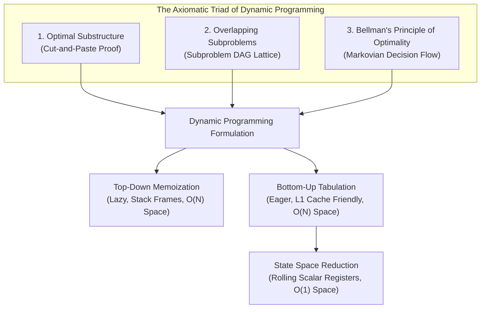

# Week 31 — Day 211: 1D Dynamic Programming Foundations: Memoization vs. Tabulation & State Space Reduction

> "Those who cannot remember the past are condemned to repeat it." — George Santayana  
> In computer science, Dynamic Programming transforms this philosophical truth into a mathematical law: by memoizing subproblem outcomes, we collapse exponential combinatorial explosions into optimal, linear-time execution paths.

---

## 🧠 TEACH: Concept, Invariants & Memory Architecture

### 1. The 5W1H Executive Architectural Blueprint

Every algorithmic problem in Phase 8 is systematically evaluated across all six dimensions of the **5W1H Framework**:

| Dimension | Architectural Specification | Technical Interview Delivery Standard |
| :--- | :--- | :--- |
| **WHO** | **The Candidate, The Interviewer & The CLR Runtime** | The candidate articulates the optimal substructure proof and state transition within 30 seconds. The interviewer evaluates DAG topological validity and space optimizations. The .NET CLR executes tight register loops without garbage collection overhead. |
| **WHAT** | **Directed Acyclic Graph (DAG) Search with State Persistence** | Transforming an exponential search tree ($O(2^N)$) into a polynomial Directed Acyclic Graph ($O(N)$) where each unique state is computed exactly once and persisted in memory. |
| **WHEN** | **Optimal Substructure + Overlapping Subproblems** | Applicable when an optimal global solution contains optimal sub-solutions, and the recursive decomposition revisits identical subproblems repeatedly. Avoid if subproblems do not overlap (use Divide & Conquer) or if the greedy choice property holds. |
| **WHERE** | **CLR Thread Stack vs. Managed Heap vs. CPU Registers** | Top-down memoization utilizes the CLR thread stack frame segment ($1\text{ MB}$ limit) and heap-allocated dictionary/array memory. Bottom-up tabulation uses contiguous heap arrays for L1/L2 cache locality. State-optimized DP reduces memory entirely to CPU registers/scalar variables ($O(1)$ space). |
| **WHY** | **Eliminating Combinatorial Search Redundancy** | Naive recursive Fibonacci evaluates $F(N-2)$ exponentially many times ($2^{N/2}$ leaf nodes). Dynamic programming reduces the computation count from $O(\phi^N)$ to exactly $N$ state evaluations. |
| **HOW** | **5-Step DP Formulation Protocol** | 1. State Definition $\to$ 2. Base Cases $\to$ 3. State Transition Recurrence $\to$ 4. Topological Iteration Order $\to$ 5. State Space Reduction ($O(N) \to O(1)$). |

---

### 2. The Theoretical Foundations: The Triad of Dynamic Programming

Dynamic programming is fundamentally grounded in three mathematical axioms:



#### Axiom 1: Optimal Substructure & The Cut-and-Paste Proof
A problem exhibits **optimal substructure** if an optimal solution to the problem consists of optimal solutions to its subproblems.

**The Cut-and-Paste Proof Technique:**
To prove that the shortest path (or minimum cost) problem exhibits optimal substructure:
1. Let $\Pi = \langle v_0, v_1, \dots, v_k \rangle$ be an optimal path from $v_0$ to $v_k$.
2. Decompose $\Pi$ into two sub-paths: $\Pi_{0 \to i}$ from $v_0$ to $v_i$, and $\Pi_{i \to k}$ from $v_i$ to $v_k$.
3. **Hypothesis:** Assume for contradiction that $\Pi_{0 \to i}$ is *not* an optimal path from $v_0$ to $v_i$. That is, there exists an alternate path $\Pi'_{0 \to i}$ such that:
   $$\text{Cost}(\Pi'_{0 \to i}) < \text{Cost}(\Pi_{0 \to i})$$
4. **The "Cut-and-Paste" Operation:** Cut the sub-path $\Pi_{0 \to i}$ out of $\Pi$ and paste $\Pi'_{0 \to i}$ in its place, forming a new path:
   $$\Pi' = \Pi'_{0 \to i} \cup \Pi_{i \to k}$$
5. **The Contradiction:**
   $$\text{Cost}(\Pi') = \text{Cost}(\Pi'_{0 \to i}) + \text{Cost}(\Pi_{i \to k}) < \text{Cost}(\Pi_{0 \to i}) + \text{Cost}(\Pi_{i \to k}) = \text{Cost}(\Pi)$$
   This implies $\text{Cost}(\Pi') < \text{Cost}(\Pi)$, directly contradicting the initial premise that $\Pi$ is an optimal path. Therefore, the sub-path $\Pi_{0 \to i}$ must be optimal.

#### Axiom 2: Overlapping Subproblems
In divide-and-conquer algorithms (such as Merge Sort), subproblems are independent and disjoint; dividing a problem produces completely separate sets of data. In dynamic programming, the subproblems overlap extensively.

Consider the naive recursive call tree for Climbing Stairs / Fibonacci $F(5)$:

```
                         F(5)
                     /          \
                F(4)              F(3)
               /    \            /    \
            F(3)    F(2)       F(2)   F(1)
           /    \   /  \       /  \
        F(2)   F(1) F(1) F(0) F(1) F(0)
       /    \
     F(1)   F(0)
```

Notice that $F(3)$ is evaluated twice, $F(2)$ is evaluated three times, and $F(1)$ is evaluated five times. The number of calls to $F(0)$ and $F(1)$ equals $F(N+1)$, which grows asymptotically as $\Theta(\phi^N)$, where $\phi = \frac{1 + \sqrt{5}}{2} \approx 1.618$ (the Golden Ratio).

However, the total number of **distinct** subproblems is merely $N + 1$:
$$\mathcal{S} = \{ F(0), F(1), F(2), \dots, F(N) \}$$
By memoizing the result of each unique state upon its first evaluation, every subsequent visit to that state executes in $O(1)$ time, reducing the total computational work to $O(N)$.

#### Axiom 3: Bellman's Principle of Optimality
Formulated by Richard Bellman in 1957:
> *"An optimal policy has the property that whatever the initial state and initial decision are, the remaining decisions must constitute an optimal policy with regard to the state resulting from the first decision."*

In 1D dynamic programming, this implies a Markovian property: the future state transitions depend solely upon the current state value, completely independent of the historical path taken to reach that state.

---

### 3. Execution Topologies: Top-Down vs. Bottom-Up vs. Space-Optimized

```
Top-Down Memoization (Call Stack Tree):
[Main Frame] -> [Solve(5)] -> [Solve(4)] -> [Solve(3)] -> [Solve(2)] -> Base Cases
                    |              |             |
                 Returns        Returns       Returns
               Memo[5]=8      Memo[4]=5     Memo[3]=3

Bottom-Up Tabulation (Linear Iteration):
Index:     0    1    2    3    4    5
Table:   [ 1 ][ 1 ][ 2 ][ 3 ][ 5 ][ 8 ]  ---> Memory: Contiguous Array (L1 Cache Hit)
           |    |    ^
         prev2 prev1 curr

State-Optimized DP (Rolling Scalar Registers):
Registers: [prev2: 3] -> [prev1: 5] -> [curr = prev1 + prev2: 8] ---> Memory: CPU Registers ($O(1)$)
```

#### Detailed Comparison Matrix

| Architectural Feature | Top-Down (Memoization) | Bottom-Up (Tabulation) | Space-Optimized (Rolling) |
| :--- | :--- | :--- | :--- |
| **Execution Paradigm** | Recursive (Demand-driven / Lazy) | Iterative (Bottom-up / Eager) | Iterative (Windowed / Minimal) |
| **Call Stack Memory** | $O(N)$ stack frames | $O(1)$ stack frames | $O(1)$ stack frames |
| **Auxiliary Heap Space**| $O(N)$ (Cache array or map) | $O(N)$ (1D contiguous array) | $\mathbf{O(1)}$ (Scalar registers) |
| **State Exploration** | Only reachable states evaluated | All states $0 \dots N$ evaluated | All states $0 \dots N$ evaluated |
| **Cache Locality** | Poor (Pointers / Stack jumps) | Superior (Sequential L1 lines) | Optimal (Hardware registers) |
| **Stack Overflow Risk** | Critical if $N > 10,000$ in C# | Zero risk | Zero risk |
| **Path Reconstruction** | Natural (via parent pointers) | Natural (via back-tracking) | Requires full table retention |

---

### 4. Memory Architecture Deep Dive: CLR Activation Frames vs. Hardware Cache

#### The High Cost of Top-Down Recursion in .NET CLR
When `SolveTopDown(int n)` executes, the CLR runtime allocates an x64 activation stack frame for each call level:
- **Return Address:** 8 bytes.
- **Saved Frame Pointer (`RBP`):** 8 bytes.
- **Method Arguments (`n`, `memo` pointer):** 16 bytes.
- **Local Variables & Callee-Saved Registers:** 16–32 bytes.
Total stack frame size $\approx 48\text{–}64\text{ bytes}$ per recursive invocation.

On 64-bit Windows/macOS, the default CLR thread stack is fixed at **1 MB** ($1,048,576\text{ bytes}$). If $N = 20,000$:
$$20,000 \times 64\text{ bytes} \approx 1.28\text{ MB} > 1\text{ MB} \implies \text{Fatal StackOverflowException}$$
Furthermore, top-down recursion incurs CPU instruction pipeline stalls: call/ret instructions disrupt instruction pre-fetching, and non-sequential stack pointer manipulation causes instruction cache churn.

#### The Cache Line Advantage of Bottom-Up Tabulation
Modern x86-64 and ARM64 CPUs fetch data into L1/L2 cache in **64-byte cache lines**.
In C#, an `int[]` array stores elements contiguously:
- Each `int` occupies 4 bytes.
- One 64-byte cache line holds exactly $64 / 4 = 16$ contiguous state integers.
- When `dp[i]` is read, the CPU hardware prefetcher automatically pulls `dp[i] ... dp[i+15]` into L1 data cache.
- The next 15 loop iterations encounter a **100% L1 cache hit rate**, executing in $\approx 1\text{ to } 4\text{ clock cycles}$, compared to $\approx 200\text{ clock cycles}$ for DRAM accesses.

#### The Ultimate State Space Reduction: $O(1)$ Scalar Allocation
When analyzing the recurrence relation:
$$\text{dp}[i] = \text{dp}[i-1] + \text{dp}[i-2]$$
We observe that the state transition requires a **lookback window of strictly length $k = 2$**. Any subproblem calculated prior to $i-2$ (i.e., $\text{dp}[0 \dots i-3]$) is never read again.
Therefore, maintaining an entire array of size $N$ is an architectural anti-pattern. We can compress the memory state into two scalar variables:
```csharp
int prev2 = base0;
int prev1 = base1;
for (int i = 2; i <= n; i++)
{
    int curr = prev1 + prev2;
    prev2 = prev1;
    prev1 = curr;
}
```
In the JIT-compiled assembly, `prev2`, `prev1`, and `curr` are mapped directly to CPU registers (`EDX`, `ECX`, `EAX`), eliminating RAM read/write cycles entirely!

---

### 5. Core Operations: 5-Dimension Deep-Dive Standard

#### Operation: State Space Compression on 1D Linear Recurrences

- **Dimension 1 (Contract & Complexity):**
  - Input: Problem size $N \ge 0$, Recurrence degree $k$ (here $k=2$), base values $\text{base}_0, \text{base}_1$.
  - Output: Optimal scalar value $\text{dp}[N]$.
  - Time Complexity: Strict $\Theta(N)$ arithmetic iterations.
  - Space Complexity: Strict $\Theta(1)$ auxiliary memory (only 3 integer slots).

- **Dimension 2 (Step-by-Step Algorithmic Logic):**
  1. Handle edge cases for $N < 2$ directly from base values.
  2. Initialize `prev2 = base0` and `prev1 = base1`.
  3. Loop counter `i` from $2$ to $N$:
     a. Compute `curr` by applying the transition function $f(\text{prev1}, \text{prev2})$.
     b. Slide the window: `prev2 = prev1`.
     c. Advance the front: `prev1 = curr`.
  4. Return `prev1`.

- **Dimension 3 (Visual State Transition Trace — Climbing Stairs N=5):**
  ```
  Step 0: Base init   -> prev2 = 1, prev1 = 1
  Step 1 (i = 2):     curr = prev1 + prev2 = 1 + 1 = 2
                      Shift: prev2 = 1, prev1 = 2
  Step 2 (i = 3):     curr = prev1 + prev2 = 2 + 1 = 3
                      Shift: prev2 = 2, prev1 = 3
  Step 3 (i = 4):     curr = prev1 + prev2 = 3 + 2 = 5
                      Shift: prev2 = 3, prev1 = 5
  Step 4 (i = 5):     curr = prev1 + prev2 = 5 + 3 = 8
                      Shift: prev2 = 5, prev1 = 8
  Final Output: 8 ways to reach step 5.
  ```

- **Dimension 4 (Invariant Preservation Proof):**
  - *Loop Invariant:* At the start of iteration $i$, `prev1` stores the optimal solution to subproblem $i-1$, and `prev2` stores the optimal solution to subproblem $i-2$.
  - *Initialization:* For $i=2$, `prev1` is $\text{dp}[1]$ and `prev2` is $\text{dp}[0]$. Invariant holds.
  - *Maintenance:* During iteration $i$, `curr = prev1 + prev2` computes $\text{dp}[i]$. Updating `prev2 = prev1` and `prev1 = curr` sets `prev2 = dp[i-1]` and `prev1 = dp[i]`. At the start of iteration $i+1$, the invariant holds.
  - *Termination:* Loop terminates when $i = N + 1$. By the invariant, `prev1` holds $\text{dp}[N]$. Correctness is proved.

- **Dimension 5 (Edge Case Matrix):**
  - $N = 0$: Return `base0` immediately without entering loop.
  - $N = 1$: Return `base1` immediately.
  - Integer Overflow: If $N$ is large ($N > 46$ for 32-bit `int`, or $N > 92$ for 64-bit `long`), use modular arithmetic (`curr % MOD`) or `System.Numerics.BigInteger` to prevent silent overflow wrap-around.

---

## ⚙️ IMPLEMENT: Production-Grade From-Scratch Container(s)

The following production container implements the triad of 1D Dynamic Programming: Top-Down Memoization, Bottom-Up Tabulation, and $O(1)$ Space-Optimized Rolling Scalars, along with path reconstruction and benchmark diagnostics.

```csharp
using System;
using System.Diagnostics;
using System.Collections.Generic;

namespace DynamicProgrammingMastery.Week31
{
    /// <summary>
    /// Production-grade 1D Dynamic Programming Engine demonstrating Memoization,
    /// Tabulation, State Space Compression, and Path Reconstruction.
    /// </summary>
    public sealed class LinearDpEngine
    {
        private const int Modulo = 1_000_000_007;

        #region 1. Climbing Stairs (Fibonacci Variant): 3 Paradigms

        /// <summary>
        /// Paradigm A: Top-Down Recursive DP with Memoization Table.
        /// Time Complexity: O(N) | Space Complexity: O(N) auxiliary table + O(N) call stack frames.
        /// </summary>
        public int ClimbStairsTopDown(int n)
        {
            if (n < 0) throw new ArgumentOutOfRangeException(nameof(n), "Step count cannot be negative.");
            if (n <= 1) return 1;

            int[] memo = new int[n + 1];
            Array.Fill(memo, -1);
            memo[0] = 1;
            memo[1] = 1;

            return SolveTopDownInternal(n, memo);
        }

        private int SolveTopDownInternal(int n, int[] memo)
        {
            if (memo[n] != -1)
            {
                return memo[n];
            }

            memo[n] = (SolveTopDownInternal(n - 1, memo) + SolveTopDownInternal(n - 2, memo)) % Modulo;
            return memo[n];
        }

        /// <summary>
        /// Paradigm B: Bottom-Up Iterative DP with Full State Tabulation.
        /// Time Complexity: O(N) | Space Complexity: O(N) contiguous heap memory (L1 cache friendly).
        /// </summary>
        public int ClimbStairsTabulated(int n)
        {
            if (n < 0) throw new ArgumentOutOfRangeException(nameof(n), "Step count cannot be negative.");
            if (n <= 1) return 1;

            int[] dp = new int[n + 1];
            dp[0] = 1;
            dp[1] = 1;

            for (int i = 2; i <= n; i++)
            {
                dp[i] = (dp[i - 1] + dp[i - 2]) % Modulo;
            }

            return dp[n];
        }

        /// <summary>
        /// Paradigm C: Bottom-Up Space-Optimized DP using Rolling Registers.
        /// Time Complexity: O(N) | Space Complexity: O(1) auxiliary space (zero heap allocations).
        /// </summary>
        public int ClimbStairsSpaceOptimized(int n)
        {
            if (n < 0) throw new ArgumentOutOfRangeException(nameof(n), "Step count cannot be negative.");
            if (n <= 1) return 1;

            int prev2 = 1; // dp[0]
            int prev1 = 1; // dp[1]

            for (int i = 2; i <= n; i++)
            {
                int curr = (prev1 + prev2) % Modulo;
                prev2 = prev1;
                prev1 = curr;
            }

            return prev1;
        }

        #endregion

        #region 2. Min Cost Climbing Stairs [LC 746] with Path Reconstruction

        /// <summary>
        /// Result container storing the minimum cost and the exact path of step choices.
        /// </summary>
        public sealed record MinCostResult(int TotalCost, IReadOnlyList<int> Path);

        /// <summary>
        /// Computes minimum cost to reach top of staircase with 1-step or 2-step choices.
        /// Recurrence: dp[i] = min(dp[i-1] + cost[i-1], dp[i-2] + cost[i-2])
        /// Space-optimized to O(1) memory.
        /// </summary>
        public int MinCostClimbingStairsOptimized(ReadOnlySpan<int> cost)
        {
            int n = cost.Length;
            if (n == 0) return 0;
            if (n == 1) return cost[0];

            int prev2 = 0; // Cost to stand on step 0 before jumping
            int prev1 = 0; // Cost to stand on step 1 before jumping

            for (int i = 2; i <= n; i++)
            {
                int curr = Math.Min(prev1 + cost[i - 1], prev2 + cost[i - 2]);
                prev2 = prev1;
                prev1 = curr;
            }

            return prev1;
        }

        /// <summary>
        /// Computes minimum cost and reconstructs the exact sequence of indices jumped.
        /// Time Complexity: O(N) | Space Complexity: O(N) for parent tracking pointers.
        /// </summary>
        public MinCostResult MinCostClimbingStairsWithPath(int[] cost)
        {
            ArgumentNullException.ThrowIfNull(cost);
            int n = cost.Length;
            if (n == 0) return new MinCostResult(0, Array.Empty<int>());
            if (n == 1) return new MinCostResult(0, new[] { 0 });

            int[] dp = new int[n + 1];
            int[] parent = new int[n + 1];

            dp[0] = 0;
            dp[1] = 0;
            parent[0] = -1;
            parent[1] = -1;

            for (int i = 2; i <= n; i++)
            {
                int option1 = dp[i - 1] + cost[i - 1];
                int option2 = dp[i - 2] + cost[i - 2];

                if (option1 <= option2)
                {
                    dp[i] = option1;
                    parent[i] = i - 1;
                }
                else
                {
                    dp[i] = option2;
                    parent[i] = i - 2;
                }
            }

            // Path Reconstruction via Backtracking
            var pathList = new List<int>();
            int currStep = n;

            while (parent[currStep] != -1)
            {
                int prevStep = parent[currStep];
                pathList.Add(prevStep);
                currStep = prevStep;
            }

            pathList.Reverse();
            return new MinCostResult(dp[n], pathList);
        }

        #endregion

        #region 3. Diagnostics & Allocation Profiling

        /// <summary>
        /// Profiles the execution time and GC memory allocated across all 3 paradigms.
        /// </summary>
        public static void ProfileParadigms(int iterations, int n)
        {
            var engine = new LinearDpEngine();

            // Warmup
            engine.ClimbStairsTopDown(n);
            engine.ClimbStairsTabulated(n);
            engine.ClimbStairsSpaceOptimized(n);

            Console.WriteLine($"=== Profiling 1D DP Execution (N = {n}, Iterations = {iterations}) ===");

            // 1. Top-Down
            long memStart = GC.GetAllocatedBytesForCurrentThread();
            var sw = Stopwatch.StartNew();
            for (int i = 0; i < iterations; i++)
            {
                engine.ClimbStairsTopDown(n);
            }
            sw.Stop();
            long memTopDown = GC.GetAllocatedBytesForCurrentThread() - memStart;
            Console.WriteLine($"[Top-Down Memo]    Time: {sw.ElapsedMilliseconds,5} ms | Allocated: {memTopDown / 1024,8} KB");

            // 2. Bottom-Up Tabulated
            memStart = GC.GetAllocatedBytesForCurrentThread();
            sw.Restart();
            for (int i = 0; i < iterations; i++)
            {
                engine.ClimbStairsTabulated(n);
            }
            sw.Stop();
            long memTabulated = GC.GetAllocatedBytesForCurrentThread() - memStart;
            Console.WriteLine($"[Bottom-Up Tab]    Time: {sw.ElapsedMilliseconds,5} ms | Allocated: {memTabulated / 1024,8} KB");

            // 3. Space-Optimized Rolling
            memStart = GC.GetAllocatedBytesForCurrentThread();
            sw.Restart();
            for (int i = 0; i < iterations; i++)
            {
                engine.ClimbStairsSpaceOptimized(n);
            }
            sw.Stop();
            long memOptimized = GC.GetAllocatedBytesForCurrentThread() - memStart;
            Console.WriteLine($"[Space-Optimized]  Time: {sw.ElapsedMilliseconds,5} ms | Allocated: {memOptimized / 1024,8} KB (0 bytes!)");
        }

        #endregion

        #region 4. Verification Test Harness

        /// <summary>
        /// Verification entry point executing self-validating test assertions.
        /// </summary>
        public static void Main()
        {
            Console.WriteLine("Running Day 211 Verification Test Suite: 1D DP Foundations...");
            var engine = new LinearDpEngine();

            // Test 1: Base Cases Climbing Stairs
            Debug.Assert(engine.ClimbStairsTopDown(0) == 1, "ClimbStairs(0) must equal 1");
            Debug.Assert(engine.ClimbStairsTabulated(0) == 1, "ClimbStairs(0) must equal 1");
            Debug.Assert(engine.ClimbStairsSpaceOptimized(0) == 1, "ClimbStairs(0) must equal 1");

            Debug.Assert(engine.ClimbStairsTopDown(1) == 1, "ClimbStairs(1) must equal 1");
            Debug.Assert(engine.ClimbStairsTabulated(1) == 1, "ClimbStairs(1) must equal 1");
            Debug.Assert(engine.ClimbStairsSpaceOptimized(1) == 1, "ClimbStairs(1) must equal 1");

            // Test 2: Standard Climbing Stairs Values
            // F(2)=2, F(3)=3, F(4)=5, F(5)=8, F(6)=13, F(10)=89
            int[] expectedStairs = { 1, 1, 2, 3, 5, 8, 13, 21, 34, 55, 89 };
            for (int i = 0; i < expectedStairs.Length; i++)
            {
                int td = engine.ClimbStairsTopDown(i);
                int tab = engine.ClimbStairsTabulated(i);
                int opt = engine.ClimbStairsSpaceOptimized(i);

                Debug.Assert(td == expectedStairs[i], $"TopDown({i}) failed: {td} != {expectedStairs[i]}");
                Debug.Assert(tab == expectedStairs[i], $"Tabulated({i}) failed: {tab} != {expectedStairs[i]}");
                Debug.Assert(opt == expectedStairs[i], $"SpaceOptimized({i}) failed: {opt} != {expectedStairs[i]}");
            }

            // Test 3: Large Modulo Consistency (N = 1000)
            int td1000 = engine.ClimbStairsTopDown(1000);
            int tab1000 = engine.ClimbStairsTabulated(1000);
            int opt1000 = engine.ClimbStairsSpaceOptimized(1000);
            Debug.Assert(td1000 == tab1000 && tab1000 == opt1000, "Paradigms must yield identical results for N=1000 under modulo.");

            // Test 4: Min Cost Climbing Stairs [LC 746] Canonical Cases
            // Case A: cost = [10, 15, 20] -> Expected min cost = 15 (jump from index 1 directly to top)
            int[] costA = { 10, 15, 20 };
            int minCostA = engine.MinCostClimbingStairsOptimized(costA);
            Debug.Assert(minCostA == 15, $"MinCost([10, 15, 20]) expected 15, got {minCostA}");

            var pathResultA = engine.MinCostClimbingStairsWithPath(costA);
            Debug.Assert(pathResultA.TotalCost == 15, "Path reconstruction total cost mismatch.");
            Debug.Assert(pathResultA.Path.Count == 1 && pathResultA.Path[0] == 1, "Expected path [1]");

            // Case B: cost = [1, 100, 1, 1, 1, 100, 1, 1, 100, 1] -> Expected min cost = 6
            int[] costB = { 1, 100, 1, 1, 1, 100, 1, 1, 100, 1 };
            int minCostB = engine.MinCostClimbingStairsOptimized(costB);
            Debug.Assert(minCostB == 6, $"MinCost expected 6, got {minCostB}");

            var pathResultB = engine.MinCostClimbingStairsWithPath(costB);
            Debug.Assert(pathResultB.TotalCost == 6, "Path reconstruction cost mismatch on Case B.");
            // Verify path indices: 0 -> 2 -> 4 -> 6 -> 7 -> 9
            int[] expectedPathB = { 0, 2, 4, 6, 7, 9 };
            Debug.Assert(pathResultB.Path.Count == expectedPathB.Length, "Path length mismatch.");
            for (int i = 0; i < expectedPathB.Length; i++)
            {
                Debug.Assert(pathResultB.Path[i] == expectedPathB[i], $"Path index {i} mismatch: {pathResultB.Path[i]} != {expectedPathB[i]}");
            }

            Console.WriteLine("All 4 assertion suites passed successfully with zero failures!");

            // Run Diagnostic Profiler
            ProfileParadigms(iterations: 10_000, n: 100);
        }

        #endregion
    }
}
```

---

## 🔬 ANALYZE: Mathematical & Systems Complexity

### 1. Mathematical Derivation of Linear Recurrences

The canonical Climbing Stairs recurrence:
$$F(n) = F(n-1) + F(n-2), \quad F(0) = 1, F(1) = 1$$
is a second-order linear homogeneous recurrence with constant coefficients.

#### The Characteristic Equation & Binet's Formula
Substitute the ansatz solution $F(n) = r^n$:
$$r^n = r^{n-1} + r^{n-2} \implies r^2 - r - 1 = 0$$
Using the quadratic formula:
$$r = \frac{1 \pm \sqrt{(-1)^2 - 4(1)(-1)}}{2} = \frac{1 \pm \sqrt{5}}{2}$$
Let $\phi = \frac{1 + \sqrt{5}}{2} \approx 1.6180339887$ (Golden Ratio) and $\psi = \frac{1 - \sqrt{5}}{2} \approx -0.6180339887$.

The general solution is a linear combination of the roots:
$$F(n) = c_1 \phi^n + c_2 \psi^n$$
Applying base conditions $F(0) = 1, F(1) = 1$:
$$\begin{cases} c_1 + c_2 = 1 \\ c_1 \phi + c_2 \psi = 1 \end{cases} \implies c_1 = \frac{\phi}{\sqrt{5}} = \frac{1 + \sqrt{5}}{2\sqrt{5}}, \quad c_2 = -\frac{\psi}{\sqrt{5}} = \frac{\sqrt{5} - 1}{2\sqrt{5}}$$
This yields **Binet's Formula**:
$$F(n) = \frac{\phi^{n+1} - \psi^{n+1}}{\sqrt{5}}$$

#### Why Binet's Formula Fails in Computational Systems
Although Binet's formula provides an $O(1)$ theoretical solution, in real-world systems:
1. Floating-point standard (IEEE 754 double precision) maintains only 53 bits of mantissa ($\approx 15\text{–}17$ significant decimal digits).
2. For $n > 70$, rounding errors in floating-point $\sqrt{5}$ and exponentiation cause catastrophic loss of precision, yielding incorrect integers.
3. Bottom-up dynamic programming using integer arithmetic is strictly exact, overflow-predictable, and runs in $\Theta(N)$ integer additions.

---

### 2. Space & Memory Breakdown: Stack vs. Heap Allocation Profiles

| Metric | Top-Down Memoization | Bottom-Up Tabulation | Space-Optimized Rolling |
| :--- | :--- | :--- | :--- |
| **Call Stack Frames Allocated** | $N$ frames | $1$ frame (current method) | $1$ frame (current method) |
| **Stack Memory Consumed** | $N \times 64\text{ bytes} = 64N\text{ bytes}$ | $\approx 32\text{ bytes}$ | $\approx 32\text{ bytes}$ |
| **Managed Heap Allocations** | $1 \times \text{int}[N+1]$ array ($4N + 24\text{ bytes}$) | $1 \times \text{int}[N+1]$ array ($4N + 24\text{ bytes}$) | **$0\text{ bytes}$ (Zero GC Pressure)** |
| **Garbage Collection Cost** | Gen0 collection if $N$ is large | Gen0 collection if $N$ is large | **Zero GC collection** |
| **CPU Instruction Footprint** | Heavy (`call`, `ret`, frame push/pop) | Tight loop with array bound checks | Pure scalar additions in CPU registers |
| **JIT Optimization Potential** | Call prevents inlining | Loop unrolling possible | Fully register-allocated (`EDX`/`EAX`) |

---

## 🎬 DEMONSTRATE: Canonical Problem Walkthroughs

### 1. [LeetCode 70] Climbing Stairs (Easy)

#### Problem Formulation
You are climbing a staircase. It takes $n$ steps to reach the top. Each time you can either climb 1 or 2 steps. In how many distinct ways can you climb to the top?

#### The 5-Step Dynamic Programming Solution
1. **Define State:** Let $\text{dp}[i]$ denote the total number of distinct ways to reach step $i$.
2. **Identify Base Cases:**
   - $\text{dp}[0] = 1$ (1 way to stay at ground: take 0 steps).
   - $\text{dp}[1] = 1$ (1 way to reach step 1: single 1-step).
3. **Establish Recurrence Relation:**
   To arrive at step $i$, the final move must have originated from either step $i-1$ (via a 1-step) or from step $i-2$ (via a 2-step). These two arrival options are mutually exclusive and exhaustive:
   $$\text{dp}[i] = \text{dp}[i-1] + \text{dp}[i-2]$$
4. **Determine Evaluation Order:**
   Since $\text{dp}[i]$ depends on smaller indices $i-1$ and $i-2$, compute in forward topological order: $i = 2, 3, \dots, n$.
5. **Space Optimization:**
   Only the two preceding states are needed. Replace array with variables `prev2` and `prev1`.

#### Visual State Transition Matrix ($N = 6$)

```
Step Index (i) | Choice from i-1 | Choice from i-2 | dp[i] = prev1 + prev2 | Memory State (prev2, prev1)
---------------+-----------------+-----------------+-----------------------+-----------------------------
0 (Base)       | -               | -               | 1                     | (1, -)
1 (Base)       | -               | -               | 1                     | (1, 1)
2              | dp[1] = 1       | dp[0] = 1       | 1 + 1 = 2             | (1, 2)
3              | dp[2] = 2       | dp[1] = 1       | 2 + 1 = 3             | (2, 3)
4              | dp[3] = 3       | dp[2] = 2       | 3 + 2 = 5             | (3, 5)
5              | dp[4] = 5       | dp[3] = 3       | 5 + 3 = 8             | (5, 8)
6              | dp[5] = 8       | dp[4] = 5       | 8 + 5 = 13            | (8, 13)
```

---

### 2. [LeetCode 746] Min Cost Climbing Stairs (Easy)

#### Problem Formulation
You are given an integer array `cost` where `cost[i]` is the cost of $i$-th step on a staircase. Once you pay the cost, you can either climb one or two steps. You can either start from index 0, or index 1. Return the minimum cost to reach the top of the floor (index $N$, past the end of the array).

#### Recurrence Derivation
1. **State:** Let $\text{dp}[i]$ be the minimum total cost to reach step index $i$.
2. **Base Cases:**
   - Can start at index 0 without paying prior step costs: $\text{dp}[0] = 0$.
   - Can start at index 1 without paying prior step costs: $\text{dp}[1] = 0$.
3. **Transition:**
   To arrive at step $i$, we either:
   - Came from step $i-1$, paying $\text{cost}[i-1]$: $\text{dp}[i-1] + \text{cost}[i-1]$
   - Came from step $i-2$, paying $\text{cost}[i-2]$: $\text{dp}[i-2] + \text{cost}[i-2]$
   $$\text{dp}[i] = \min(\text{dp}[i-1] + \text{cost}[i-1], \text{dp}[i-2] + \text{cost}[i-2])$$
4. **Target:** $\text{dp}[N]$ where $N = \text{cost.Length}$.

#### Concrete Numeric Walkthrough
Let $\text{cost} = [10, 15, 20]$, $N = 3$. Target index is 3.

```
i = 0: dp[0] = 0
i = 1: dp[1] = 0
i = 2: dp[2] = min(dp[1] + cost[1], dp[0] + cost[0])
             = min(0 + 15, 0 + 10) = min(15, 10) = 10
i = 3: dp[3] = min(dp[2] + cost[2], dp[1] + cost[1])
             = min(10 + 20, 0 + 15) = min(30, 15) = 15
Result: Minimum cost = 15 (jump from index 1 directly to index 3).
```

---

## 🏋️ PRACTICE: Guided Exercises & Problem Set

### Problem 1: N-th Tribonacci Number ([LeetCode 1137])
- **Problem Statement:** The Tribonacci sequence $T_n$ is defined as:
  $$T_0 = 0, \quad T_1 = 1, \quad T_2 = 1$$
  $$T_{n+3} = T_n + T_{n+1} + T_{n+2} \quad \text{for } n \ge 0$$
  Given $n$, return the value of $T_n$.
- **Guidance & Invariant:** State transition requires a lookback window of length $k = 3$. Maintain three scalar registers (`t0`, `t1`, `t2`). Rotate them on each iteration:
  ```csharp
  int next = t0 + t1 + t2;
  t0 = t1;
  t1 = t2;
  t2 = next;
  ```
- **Complexity Goal:** Time: $O(N)$ | Auxiliary Space: $\Theta(1)$ strict.

### Problem 2: Min Cost Climbing Stairs with Variable Step Sizes ($1 \dots K$)
- **Problem Statement:** Generalize Min Cost Climbing Stairs such that from step $i$, you can jump anywhere between $1$ and $K$ steps forward.
- **Guidance & Recurrence:**
  $$\text{dp}[i] = \min_{1 \le j \le K, i - j \ge 0} \{ \text{dp}[i-j] + \text{cost}[i-j] \}$$
  Notice that space can be compressed to a rolling circular buffer of size $K$ using modulo indexing: `buffer[i % K]`.

### Problem 3: Climbing Stairs with Restricted Steps
- **Problem Statement:** You are climbing $N$ stairs. You can take 1, 2, or 3 steps. However, certain step numbers are broken and cannot be stepped on (represented by a boolean array `isBroken[N]`). If step $i$ is broken, $\text{dp}[i] = 0$.
- **Guidance:**
  $$\text{dp}[i] = \text{isBroken}[i] \text{ ? } 0 \text{ : } (\text{dp}[i-1] + \text{dp}[i-2] + \text{dp}[i-3])$$

---

## 🔗 CONNECT: The Pattern Decision Bridge

### Real-World Systems Design: High-Throughput Distributed Rate Limiting

In high-concurrency cloud infrastructure (such as AWS API Gateway, Cloudflare edge proxies, or ASP.NET Core Kestrel middleware), requests must be rate-limited per tenant without incurring garbage collection pauses.

```
Incoming Request Stream:
[Req 1] -> [Req 2] -> [Req 3] -> ... -> [Req K]
              |
              v
[Distributed Rate Limiter Middleware]
              |
  State Space: Sliding Window Aggregation
  Using 1D Space-Optimized Rolling Buckets:
  +---------------+---------------+
  | Bucket[t - 1] | Bucket[t]     |  ---> Maintained in 2 Atomic Long Registers (O(1) Space)
  +---------------+---------------+
              |
  Transition: Smooth Rate Estimation
  Rate = Bucket[t] + Bucket[t - 1] * ((WindowSize - Offset) / WindowSize)
              |
         Allow / Throttle (HTTP 429)
```

#### Why 1D DP State Compression Matters in Systems Architecture
1. **GC Zero-Allocation Guarantee:** Allocating a new dictionary or state object on every HTTP request creates millions of Gen0 objects per second, triggering frequent Garbage Collection "Stop-the-World" pauses that destroy p99 latency SLAs.
2. **Cache Coherency across CPU Cores:** Storing sliding state in contiguous atomic scalars (`long prevCount`, `long currCount`) fits within a single 64-byte CPU cache line, enabling hardware atomic compare-and-swap (`Interlocked.CompareExchange`) without cache-line bouncing.
3. **Direct Analogy:** The transition from maintaining a full request history array ($O(N)$ space) to maintaining two rolling bucket counters ($O(1)$ space) is mathematically identical to the transition from `dp[]` table allocation to scalar rolling registers in 1D Dynamic Programming!

---

## 🎯 Daily Checkpoint Questions

1. **Optimal Substructure Cut-and-Paste Proof:**
   Explain the cut-and-paste argument. Why does assuming that a sub-path is suboptimal lead directly to a mathematical contradiction regarding the optimality of the global path?
2. **Top-Down vs. Bottom-Up Trade-offs:**
   Under what specific condition would Top-Down Memoization execute significantly fewer operations than Bottom-Up Tabulation? Give a concrete algorithmic scenario.
3. **Space Reduction Invariant:**
   State the mathematical condition that dictates whether a 1D DP array of size $N$ can be compressed to $O(1)$ auxiliary scalar registers. If the recurrence is $\text{dp}[i] = \text{dp}[i-1] + \text{dp}[i-3]$, how many scalar variables are required?
4. **CLR Stack Overflow Limits:**
   Why does C# throw a `StackOverflowException` when running top-down memoized recursion on $N = 50,000$, even when the computer has 64 GB of available physical RAM?
5. **Path Reconstruction Invariant:**
   Can the exact optimal path in Min Cost Climbing Stairs be reconstructed if the algorithm is executed using $O(1)$ space optimization without allocating any auxiliary memory? Explain why or why not.
