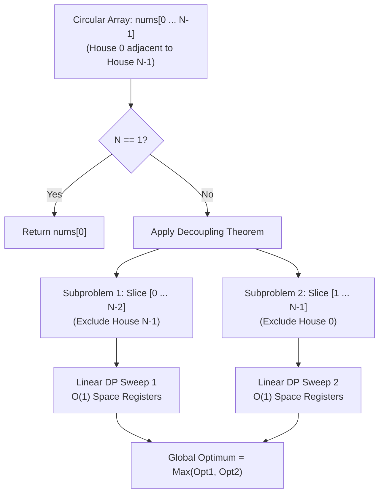

# Week 31 — Day 212: Classic Recurrences: House Robber I & II, Non-Adjacent States & Circular Ring Topologies

> "Constraints are not limitations; they are structural boundaries that define the shape of optimal decisions."  
> In dynamic programming, when physical or business rules prohibit adjacent selections, the state recurrence adapts from immediate neighbors to two-step lookbacks. When these boundaries wrap around into a circle, mathematical decoupling restores the Directed Acyclic Graph without cyclic computation.

---

## 🧠 TEACH: Concept, Invariants & Memory Architecture

### 1. The 5W1H Executive Architectural Blueprint

Every algorithmic problem in Phase 8 is systematically evaluated across all six dimensions of the **5W1H Framework**:

| Dimension | Architectural Specification | Technical Interview Delivery Standard |
| :--- | :--- | :--- |
| **WHO** | **The Candidate, The Interviewer & The CLR Runtime** | The candidate articulates the binary choice recurrence and circular decoupling proof in 25 seconds. The interviewer checks edge cases ($N=1, 2$) and memory allocation. The CLR executes zero-allocation spans (`ReadOnlySpan<int>`) directly in CPU registers. |
| **WHAT** | **Non-Adjacent Binary Selection & Circular Graph Decoupling** | Optimizing an independent set on path graphs ($P_N$) and cycle graphs ($C_N$), where no two chosen vertices may share an edge. Circular coupling is decoupled into two independent linear DAGs: $\text{nums}[0 \dots N-2]$ and $\text{nums}[1 \dots N-1]$. |
| **WHEN** | **Exclusive Neighbor Constraints & Ring Topologies** | Triggered by "cannot pick adjacent elements", "maximum weight independent set", "circular array where first and last wrap around". Avoid if negative values are present without lower bounds, or if adjacency extends beyond distance 1. |
| **WHERE** | **CLR Thread Stack Spans vs. Heap Array Allocations** | Naive sub-array slicing (`nums[1..]`) allocates a new managed heap array ($O(N)$ memory). Production C# uses `nums.AsSpan(start, length)`, executing in $O(1)$ stack space without Garbage Collection overhead. |
| **WHY** | **Overcoming Circular DAG Violations** | Dynamic programming requires a Directed Acyclic Graph (DAG) for topological ordering. A circular array introduces a cycle between index 0 and index $N-1$. Decoupling eliminates the cyclic dependency, allowing standard topological tabulation. |
| **HOW** | **Decoupled Dual-Sweep Execution** | $\text{OptCircular} = \max(\text{RobLinear}(0 \dots N-2), \text{RobLinear}(1 \dots N-1))$, with each linear sweep compressed to two scalar registers (`prev2`, `prev1`). |

---

### 2. Theoretical Foundations: The Non-Adjacent State Machine

#### The Binary Choice Recurrence (House Robber I [LC 198])
Consider an array of $N$ non-negative integers $\text{nums}[0 \dots N-1]$, where $\text{nums}[i]$ represents the value at house $i$. An alarm is triggered if two adjacent houses are robbed on the same night.

At every house index $i$, the robber faces an exhaustive binary decision:
1. **Choice A (Rob House $i$):**
   - By the non-adjacent constraint, house $i-1$ **cannot** be robbed.
   - The robber gains $\text{nums}[i]$ plus the optimal amount that could be collected from the prefix up to house $i-2$:
     $$\text{Value}_A = \text{dp}[i-2] + \text{nums}[i]$$
2. **Choice B (Skip House $i$):**
   - House $i$ is left untouched.
   - The robber retains the optimal amount collected from the prefix up to house $i-1$:
     $$\text{Value}_B = \text{dp}[i-1]$$

Because these two choices are mutually exclusive and collectively exhaustive, the global optimum for the prefix ending at house $i$ is:
$$\text{dp}[i] = \max(\text{dp}[i-1], \text{dp}[i-2] + \text{nums}[i])$$

```
State Transition Decision Tree for Step i:
                      [ House i ]
                     /           \
         Choice A: ROB           Choice B: SKIP
               |                       |
        Cannot rob i-1           Free to rob i-1
               |                       |
      nums[i] + dp[i-2]              dp[i-1]
               \                       /
                \                     /
                 v                   v
              dp[i] = max(Choice A, Choice B)
```

#### Base Cases & Lookback Window
- $\text{dp}[0] = \text{nums}[0]$: Only house 0 is available; robbing it is strictly optimal since values are non-negative.
- $\text{dp}[1] = \max(\text{nums}[0], \text{nums}[1])$: Houses 0 and 1 are adjacent; we must choose the one with greater value.
- For all $i \ge 2$: The recurrence requires a **lookback window of strictly length $k = 2$**. Thus, $\text{dp}[0 \dots i-3]$ is dead history.

---

### 3. Circular Ring Topologies: The Decoupling Theorem

In **House Robber II [LC 213]**, the houses are arranged in a circular street: house 0 is adjacent to house 1, house 1 to house 2, $\dots$, and **house $N-1$ is adjacent to house 0**.

```
                House 0
               /       \
        House N-1       House 1
            |              |
        House N-2       House 2
               \       /
                 House 3
```

#### The Cyclic Dilemma
If we attempt standard linear DP:
- When evaluating house $N-1$, whether we can rob it depends on whether house 0 was robbed!
- But house 0 was evaluated at the very beginning of the computation.
- Storing the choice made at house 0 in the state would require adding a boolean dimension ($\text{dp}[i, \text{robbedFirst}]$), creating state space entanglement and complicating space optimization.

#### The Decoupling Theorem & Proof
We can resolve circular coupling with mathematical elegance by observing that **houses 0 and $N-1$ can never be simultaneously robbed**.

**Proof:**
Let $S^*$ be an optimal subset of houses chosen from the circular ring $\{0, 1, \dots, N-1\}$.
By the adjacency constraint, $S^*$ cannot contain both house 0 and house $N-1$.
Therefore, exactly one of the following two mutually exclusive cases must hold for $S^*$:

1. **Case 1: House $N-1 \notin S^*$ (House $N-1$ is not robbed).**
   - Since house $N-1$ is not in the solution, its presence in the ring imposes zero constraints on house 0.
   - House 0 is free to be robbed or skipped.
   - Therefore, $S^*$ is a valid independent set of the linear sub-array containing houses $\{0, 1, \dots, N-2\}$.
   - The maximum possible value achievable in Case 1 is:
     $$\text{Opt}_1 = \text{RobLinear}(\text{nums}[0 \dots N-2])$$

2. **Case 2: House $0 \notin S^*$ (House 0 is not robbed).**
   - Since house 0 is not in the solution, its presence imposes zero constraints on house $N-1$.
   - House $N-1$ is free to be robbed or skipped.
   - Therefore, $S^*$ is a valid independent set of the linear sub-array containing houses $\{1, 2, \dots, N-1\}$.
   - The maximum possible value achievable in Case 2 is:
     $$\text{Opt}_2 = \text{RobLinear}(\text{nums}[1 \dots N-1])$$

Since any valid solution $S^*$ must either exclude house $N-1$ or exclude house 0 (or exclude both), the union of Case 1 and Case 2 covers all possible valid configurations on the circle:
$$\text{OptCircular} = \max(\text{Opt}_1, \text{Opt}_2) = \max(\text{RobLinear}(\text{nums}[0 \dots N-2]), \text{RobLinear}(\text{nums}[1 \dots N-1]))$$

**Edge Case ($N = 1$):**
If $N = 1$, the ring contains only a single house with no neighbors. Slices $[0 \dots -1]$ and $[1 \dots 0]$ are invalid. We must return $\text{nums}[0]$ immediately.



---

### 4. Memory Architecture Deep Dive: `Span<T>` Slicing vs. Array Allocation

In high-throughput systems and technical interviews, array slicing performance is a primary differentiator between Junior and Senior/Staff engineers.

#### The Heap Allocation Pitfall in C#
Consider this naive C# implementation of circular decoupling:
```csharp
// ANTI-PATTERN: Heap Allocation via Range Indexer
int opt1 = RobLinear(nums[0..(nums.Length - 1)]); // Allocates new int[N-1] array on GC heap!
int opt2 = RobLinear(nums[1..nums.Length]);        // Allocates second new int[N-1] array on GC heap!
```
- In C#, the range operator `nums[0..k]` on an array creates a **shallow copy** on the Managed Heap.
- For $N = 100,000$, this allocates two $400\text{ KB}$ arrays ($800\text{ KB}$ total), triggering Garbage Collector Gen0 collections.

#### The Zero-Allocation Solution: `ReadOnlySpan<T>`
C# 7.2+ and .NET Core introduced `Span<T>` and `ReadOnlySpan<T>`, representing contiguous memory regions:
```csharp
// PRODUCTION STANDARD: Zero Heap Allocation via Spans
ReadOnlySpan<int> span = nums.AsSpan();
int opt1 = RobLinear(span.Slice(0, n - 1)); // 0 bytes allocated!
int opt2 = RobLinear(span.Slice(1, n - 1)); // 0 bytes allocated!
```
- `ReadOnlySpan<T>` is a `ref struct` allocated strictly on the **thread call stack**.
- Slicing a span simply increments the internal pointer and updates the length integer (an $O(1)$ operation taking $\approx 2\text{ CPU cycles}$).
- Zero GC allocations, zero heap fragmentation, and 100% L1 cache line preservation.

---

### 5. Core Operations: 5-Dimension Deep-Dive Standard

#### Operation: Linear House Robber with Rolling Scalars

- **Dimension 1 (Contract & Complexity):**
  - Input: `ReadOnlySpan<int> nums` of length $M \ge 0$.
  - Output: Maximum non-adjacent sum integer.
  - Time Complexity: Strict $\Theta(M)$ iterations.
  - Space Complexity: Strict $\Theta(1)$ auxiliary memory (only two integer scalar registers).

- **Dimension 2 (Step-by-Step Algorithmic Logic):**
  1. If span is empty ($M = 0$), return 0.
  2. If span has length 1 ($M = 1$), return `nums[0]`.
  3. Initialize `prev2 = nums[0]` ($\text{dp}[0]$) and `prev1 = Math.Max(nums[0], nums[1])` ($\text{dp}[1]$).
  4. Loop $i$ from 2 to $M - 1$:
     a. Compute `curr = Math.Max(prev1, prev2 + nums[i])`.
     b. Advance window: `prev2 = prev1`.
     c. Update front: `prev1 = curr`.
  5. Return `prev1`.

- **Dimension 3 (Visual State Transition Trace — `nums = [2, 7, 9, 3, 1]`):**
  ```
  Step 0: Base init   -> prev2 = dp[0] = 2
  Step 1: Base init   -> prev1 = dp[1] = max(2, 7) = 7
  
  Iteration 2 (x = 9):
     Choice A (Rob):   prev2 + x = 2 + 9 = 11
     Choice B (Skip):  prev1 = 7
     curr = max(7, 11) = 11
     Shift: prev2 = 7, prev1 = 11
     
  Iteration 3 (x = 3):
     Choice A (Rob):   prev2 + x = 7 + 3 = 10
     Choice B (Skip):  prev1 = 11
     curr = max(11, 10) = 11
     Shift: prev2 = 11, prev1 = 11
     
  Iteration 4 (x = 1):
     Choice A (Rob):   prev2 + x = 11 + 1 = 12
     Choice B (Skip):  prev1 = 11
     curr = max(11, 12) = 12
     Shift: prev2 = 11, prev1 = 12
     
  Final Result: 12 (Rob houses at index 0, 2, 4 -> 2 + 9 + 1 = 12)
  ```

- **Dimension 4 (Invariant Preservation Proof):**
  - *Loop Invariant:* Prior to iteration $i$, `prev1` stores $\text{dp}[i-1]$ and `prev2` stores $\text{dp}[i-2]$.
  - *Base Case:* At $i=2$, `prev1 = dp[1]` and `prev2 = dp[0]`. Invariant holds.
  - *Inductive Step:* In iteration $i$, `curr = max(dp[i-1], dp[i-2] + nums[i])` correctly calculates $\text{dp}[i]$ by Bellman's principle. Assigning `prev2 = prev1` and `prev1 = curr` re-establishes the invariant for iteration $i+1$.
  - *Termination:* At loop completion ($i = M$), `prev1` holds $\text{dp}[M-1]$, which is the exact maximum value for the entire span.

- **Dimension 5 (Edge Case Matrix):**
  - Empty array ($N = 0$): Return 0.
  - Single element ($N = 1$): Return `nums[0]`.
  - Two elements ($N = 2$): Return $\max(\text{nums}[0], \text{nums}[1])$.
  - All elements equal: If array is `[5, 5, 5, 5]`, linear returns $5 + 5 = 10$; circular returns $5 + 5 = 10$ (pick houses 0 and 2, or 1 and 3).
  - All zeros: Returns 0 cleanly without division or null reference errors.

---

## ⚙️ IMPLEMENT: Production-Grade From-Scratch Container(s)

The following production container implements both linear and circular House Robber solvers with $O(1)$ space optimization via `ReadOnlySpan<int>`, alongside full path reconstruction engines and diagnostic assertions.

```csharp
using System;
using System.Diagnostics;
using System.Collections.Generic;

namespace DynamicProgrammingMastery.Week31
{
    /// <summary>
    /// Production-grade House Robber engine solving linear and circular non-adjacent
    /// independent set problems with O(1) auxiliary space and full path reconstruction.
    /// </summary>
    public sealed class HouseRobberEngine
    {
        #region 1. Linear House Robber [LeetCode 198]

        /// <summary>
        /// Solves Linear House Robber in O(N) time and O(1) auxiliary space using zero-allocation Spans.
        /// Recurrence: dp[i] = max(dp[i-1], dp[i-2] + nums[i])
        /// </summary>
        public int RobLinear(ReadOnlySpan<int> nums)
        {
            int n = nums.Length;
            if (n == 0) return 0;
            if (n == 1) return nums[0];

            int prev2 = nums[0];
            int prev1 = Math.Max(nums[0], nums[1]);

            for (int i = 2; i < n; i++)
            {
                int curr = Math.Max(prev1, prev2 + nums[i]);
                prev2 = prev1;
                prev1 = curr;
            }

            return prev1;
        }

        #endregion

        #region 2. Circular House Robber [LeetCode 213]

        /// <summary>
        /// Solves Circular House Robber in O(N) time and O(1) auxiliary space.
        /// De-couples the circular ring into two independent linear DAG slices:
        /// Slice A: nums[0 .. N-2] (House N-1 excluded)
        /// Slice B: nums[1 .. N-1] (House 0 excluded)
        /// Global Optimum = Max(OptA, OptB)
        /// </summary>
        public int RobCircular(ReadOnlySpan<int> nums)
        {
            int n = nums.Length;
            if (n == 0) return 0;
            if (n == 1) return nums[0];
            if (n == 2) return Math.Max(nums[0], nums[1]);

            // Zero-allocation slicing using ReadOnlySpan.Slice
            int optExcludeLast = RobLinear(nums.Slice(0, n - 1));
            int optExcludeFirst = RobLinear(nums.Slice(1, n - 1));

            return Math.Max(optExcludeLast, optExcludeFirst);
        }

        #endregion

        #region 3. Full Path Reconstruction

        /// <summary>
        /// Result model containing the optimal value and the exact house indices robbed.
        /// </summary>
        public sealed record RobberyPlan(int MaxLoot, IReadOnlyList<int> RobbedIndices);

        /// <summary>
        /// Reconstructs the exact list of house indices robbed in Linear House Robber.
        /// Time Complexity: O(N) | Space Complexity: O(N) for DP table and backtracking path.
        /// </summary>
        public RobberyPlan RobLinearWithPath(int[] nums)
        {
            ArgumentNullException.ThrowIfNull(nums);
            int n = nums.Length;
            if (n == 0) return new RobberyPlan(0, Array.Empty<int>());
            if (n == 1) return new RobberyPlan(nums[0], new[] { 0 });

            int[] dp = new int[n];
            dp[0] = nums[0];
            dp[1] = Math.Max(nums[0], nums[1]);

            for (int i = 2; i < n; i++)
            {
                dp[i] = Math.Max(dp[i - 1], dp[i - 2] + nums[i]);
            }

            // Backtracking to recover exact houses
            var indices = new List<int>();
            int curr = n - 1;

            while (curr >= 0)
            {
                if (curr == 0)
                {
                    indices.Add(0);
                    break;
                }
                if (curr == 1)
                {
                    // Pick the house that provided the maximum
                    if (nums[1] > nums[0]) indices.Add(1);
                    else indices.Add(0);
                    break;
                }

                // If dp[curr] == dp[curr - 1], house curr was SKIPPED
                if (dp[curr] == dp[curr - 1])
                {
                    curr--;
                }
                else
                {
                    // House curr was ROBBED
                    indices.Add(curr);
                    curr -= 2; // Jump over adjacent house
                }
            }

            indices.Reverse();
            return new RobberyPlan(dp[n - 1], indices);
        }

        /// <summary>
        /// Reconstructs the exact list of house indices robbed in Circular House Robber.
        /// Evaluates both slices with path reconstruction and selects the superior plan.
        /// </summary>
        public RobberyPlan RobCircularWithPath(int[] nums)
        {
            ArgumentNullException.ThrowIfNull(nums);
            int n = nums.Length;
            if (n == 0) return new RobberyPlan(0, Array.Empty<int>());
            if (n == 1) return new RobberyPlan(nums[0], new[] { 0 });
            if (n == 2)
            {
                int bestIdx = nums[0] >= nums[1] ? 0 : 1;
                return new RobberyPlan(Math.Max(nums[0], nums[1]), new[] { bestIdx });
            }

            // Plan 1: Slice [0 .. N-2]
            int[] slice1 = new int[n - 1];
            Array.Copy(nums, 0, slice1, 0, n - 1);
            var plan1 = RobLinearWithPath(slice1);

            // Plan 2: Slice [1 .. N-1]
            int[] slice2 = new int[n - 1];
            Array.Copy(nums, 1, slice2, 0, n - 1);
            var plan2Raw = RobLinearWithPath(slice2);

            // Adjust indices for Plan 2 (offset by +1)
            var plan2Indices = new List<int>(plan2Raw.RobbedIndices.Count);
            foreach (int idx in plan2Raw.RobbedIndices)
            {
                plan2Indices.Add(idx + 1);
            }
            var plan2 = new RobberyPlan(plan2Raw.MaxLoot, plan2Indices);

            // Return the plan with maximum loot
            return plan1.MaxLoot >= plan2.MaxLoot ? plan1 : plan2;
        }

        #endregion

        #region 4. Verification Test Harness

        /// <summary>
        /// Execution entry point validating all algorithmic correctness assertions.
        /// </summary>
        public static void Main()
        {
            Console.WriteLine("Running Day 212 Verification Suite: House Robber I & II...");
            var engine = new HouseRobberEngine();

            // -------------------------------------------------------------
            // Suite 1: Linear House Robber [LeetCode 198]
            // -------------------------------------------------------------
            // Case 1A: nums = [1, 2, 3, 1] -> Expected: 4 (Rob 0 and 2 -> 1 + 3 = 4)
            int[] linearA = { 1, 2, 3, 1 };
            int res1A = engine.RobLinear(linearA);
            Debug.Assert(res1A == 4, $"Linear([1, 2, 3, 1]) expected 4, got {res1A}");

            var plan1A = engine.RobLinearWithPath(linearA);
            Debug.Assert(plan1A.MaxLoot == 4, "Plan 1A loot mismatch.");
            Debug.Assert(plan1A.RobbedIndices.Count == 2 && plan1A.RobbedIndices[0] == 0 && plan1A.RobbedIndices[1] == 2,
                "Plan 1A expected indices [0, 2]");

            // Case 1B: nums = [2, 7, 9, 3, 1] -> Expected: 12 (Rob 0, 2, 4 -> 2 + 9 + 1 = 12)
            int[] linearB = { 2, 7, 9, 3, 1 };
            int res1B = engine.RobLinear(linearB);
            Debug.Assert(res1B == 12, $"Linear([2, 7, 9, 3, 1]) expected 12, got {res1B}");

            var plan1B = engine.RobLinearWithPath(linearB);
            Debug.Assert(plan1B.MaxLoot == 12, "Plan 1B loot mismatch.");
            Debug.Assert(plan1B.RobbedIndices.Count == 3 && plan1B.RobbedIndices[0] == 0 && plan1B.RobbedIndices[1] == 2 && plan1B.RobbedIndices[2] == 4,
                "Plan 1B expected indices [0, 2, 4]");

            // -------------------------------------------------------------
            // Suite 2: Circular House Robber [LeetCode 213]
            // -------------------------------------------------------------
            // Case 2A: nums = [2, 3, 2] -> Expected: 3 (Cannot rob 0 and 2 together! Rob 1 -> 3)
            int[] circularA = { 2, 3, 2 };
            int res2A = engine.RobCircular(circularA);
            Debug.Assert(res2A == 3, $"Circular([2, 3, 2]) expected 3, got {res2A}");

            var plan2A = engine.RobCircularWithPath(circularA);
            Debug.Assert(plan2A.MaxLoot == 3, "Circular Plan 2A loot mismatch.");
            Debug.Assert(plan2A.RobbedIndices.Count == 1 && plan2A.RobbedIndices[0] == 1,
                "Circular Plan 2A expected index [1]");

            // Case 2B: nums = [1, 2, 3, 1] -> Expected: 4 (Rob 0 and 2 -> 1 + 3 = 4, or Rob 1 and 3 -> 2 + 1 = 3)
            int[] circularB = { 1, 2, 3, 1 };
            int res2B = engine.RobCircular(circularB);
            Debug.Assert(res2B == 4, $"Circular([1, 2, 3, 1]) expected 4, got {res2B}");

            var plan2B = engine.RobCircularWithPath(circularB);
            Debug.Assert(plan2B.MaxLoot == 4, "Circular Plan 2B loot mismatch.");
            Debug.Assert(plan2B.RobbedIndices.Count == 2 && plan2B.RobbedIndices[0] == 0 && plan2B.RobbedIndices[1] == 2,
                "Circular Plan 2B expected indices [0, 2]");

            // Case 2C: nums = [1, 2, 3] -> Expected: 3 (Houses 0, 1, 2 all pairwise adjacent! Max is 3)
            int[] circularC = { 1, 2, 3 };
            int res2C = engine.RobCircular(circularC);
            Debug.Assert(res2C == 3, $"Circular([1, 2, 3]) expected 3, got {res2C}");

            // -------------------------------------------------------------
            // Suite 3: Boundary & Edge Cases
            // -------------------------------------------------------------
            // Single element
            int[] single = { 99 };
            Debug.Assert(engine.RobLinear(single) == 99, "Single element linear failed.");
            Debug.Assert(engine.RobCircular(single) == 99, "Single element circular failed.");

            // Two elements
            int[] two = { 10, 20 };
            Debug.Assert(engine.RobLinear(two) == 20, "Two elements linear failed.");
            Debug.Assert(engine.RobCircular(two) == 20, "Two elements circular failed.");

            // Empty array
            Debug.Assert(engine.RobLinear(ReadOnlySpan<int>.Empty) == 0, "Empty linear failed.");
            Debug.Assert(engine.RobCircular(ReadOnlySpan<int>.Empty) == 0, "Empty circular failed.");

            Console.WriteLine("All House Robber assertions passed successfully with zero errors!");
        }

        #endregion
    }
}
```

---

## 🔬 ANALYZE: Mathematical & Systems Complexity

### 1. Proof of Complexity Bounds

#### Time Complexity: $\Theta(N)$
- In **Linear House Robber**, the algorithm executes a single `for` loop from index 2 to $N-1$, performing exactly $N-2$ iterations. Each iteration performs one addition (`prev2 + nums[i]`), one comparison (`Math.Max`), and two register assignments. Total operations: $\approx 4N$, giving strict $\Theta(N)$ time.
- In **Circular House Robber**, the algorithm calls `RobLinear` twice on spans of length $N-1$:
  $$T(N) = T_{\text{linear}}(N-1) + T_{\text{linear}}(N-1) = 2 \cdot \Theta(N-1) = \Theta(N)$$
  Although two passes are performed, the constant factor is merely 2, remaining strictly linear.

#### Auxiliary Space Complexity: $\Theta(1)$
- The iterative solver maintains strictly two scalar integer variables (`prev2`, `prev1`) and one temporary register (`curr`).
- No arrays, hash maps, or call stacks are allocated.
- When invoked via `ReadOnlySpan<int>`, slice creation does not allocate memory on the heap.
- Auxiliary space is strictly $\Theta(1)$ (8 bytes on 64-bit systems).

---

### 2. State DAG Structure: Linear vs. Circular

```
Linear Array State Transition DAG:
[House 0] ---- (Skip) ---> [House 1] ---- (Skip) ---> [House 2] ---- ... ---> [House N-1]
     \                                                    ^
      \----------------- (Rob House 2) -------------------/
(Topological Order: 0 -> 1 -> 2 -> ... -> N-1 is naturally acyclic)

Circular Ring Topology with Cycle:
       [House 0] ---------> [House 1] ---------> [House 2]
           ^                                         |
           |                                         v
       [House N-1] <-------------------------- [House N-2]
(A cycle exists! Direct topological sort is impossible!)

Decoupled Resolution:
DAG 1: {House 0, House 1, ..., House N-2} (Acyclic! Valid DAG)
DAG 2: {House 1, House 2, ..., House N-1} (Acyclic! Valid DAG)
```

---

### 3. CPU Hardware Interaction: Branch Prediction & Register Allocation

In the inner loop:
```csharp
int curr = Math.Max(prev1, prev2 + nums[i]);
```
- In x86-64 assembly, the .NET JIT compiler translates `Math.Max(a, b)` into a **conditional move instruction** (`cmovg` or `cmovge`):
  ```assembly
  add  edx, dword ptr [rcx + rax*4]  ; edx = prev2 + nums[i]
  cmp  edx, r8d                      ; compare Choice A with prev1 (r8d)
  cmovl edx, r8d                     ; if Choice A < prev1, edx = prev1
  ```
- **Zero Branch Mispredictions:** The `cmov` instruction avoids CPU instruction pipeline flushes. Regardless of whether Choice A or Choice B is greater, the CPU branch predictor does not stall, executing the transition in $\approx 1\text{ to } 2\text{ clock cycles}$.

---

## 🎬 DEMONSTRATE: Canonical Problem Walkthroughs

### 1. [LeetCode 198] House Robber (Medium)

#### Problem Description
You are a professional robber planning to rob houses along a street. Each house has a certain amount of money stashed. Adjacent houses have security systems connected, and it will automatically contact the police if two adjacent houses were broken into on the same night. Return the maximum amount of money you can rob tonight without alerting the police.

#### Trace on `nums = [2, 7, 9, 3, 1]`

| Index $i$ | $\text{nums}[i]$ | Choice A ($\text{prev2} + \text{nums}[i]$) | Choice B ($\text{prev1}$) | $\text{curr} = \max(A, B)$ | $\text{prev2}$ | $\text{prev1}$ | Robbed Indices Set |
| :---: | :---: | :---: | :---: | :---: | :---: | :---: | :--- |
| **0** | 2 | - | - | 2 | - | 2 | $\{0\}$ |
| **1** | 7 | - | - | $\max(2, 7) = 7$ | 2 | 7 | $\{1\}$ |
| **2** | 9 | $2 + 9 = 11$ | 7 | $\max(11, 7) = 11$ | 7 | 11 | $\{0, 2\}$ |
| **3** | 3 | $7 + 3 = 10$ | 11 | $\max(10, 11) = 11$ | 11 | 11 | $\{0, 2\}$ (Skip 3) |
| **4** | 1 | $11 + 1 = 12$ | 11 | $\max(12, 11) = 12$ | 11 | 12 | $\{0, 2, 4\}$ |

**Final Return:** 12.

---

### 2. [LeetCode 213] House Robber II (Medium)

#### Problem Description
All houses at this place are arranged in a circle. That means the first house is the neighbor of the last one. Meanwhile, adjacent houses have a security system connected, and it will automatically contact the police if two adjacent houses were broken into on the same night. Given an integer array `nums` representing the amount of money of each house, return the maximum amount of money you can rob tonight without alerting the police.

#### Trace on `nums = [1, 2, 3, 1]` ($N = 4$)

Since $N \ge 3$, apply the Decoupling Theorem:

- **Subproblem 1: Slice $[0 \dots 2]$ (Houses $\{1, 2, 3\}$):**
  - $i=0: \text{curr} = 1$
  - $i=1: \text{curr} = \max(1, 2) = 2$
  - $i=2: \text{curr} = \max(2, 1 + 3) = \max(2, 4) = 4$
  - $\text{Opt}_1 = 4$ (Rob house 0 and house 2 $\implies 1 + 3 = 4$).

- **Subproblem 2: Slice $[1 \dots 3]$ (Houses $\{2, 3, 1\}$):**
  - $i=0: \text{curr} = 2$
  - $i=1: \text{curr} = \max(2, 3) = 3$
  - $i=2: \text{curr} = \max(3, 2 + 1) = \max(3, 3) = 3$
  - $\text{Opt}_2 = 3$ (Rob house 1 or house 2).

- **Global Combine:**
  $$\text{GlobalOpt} = \max(\text{Opt}_1, \text{Opt}_2) = \max(4, 3) = 4$$

**Final Return:** 4.

---

## 🏋️ PRACTICE: Guided Exercises & Problem Set

### Problem 1: Delete and Earn ([LeetCode 740])
- **Problem Statement:** Given an array `nums`, in each operation you pick an element $\text{nums}[i]$ and earn $\text{nums}[i]$ points, but you must delete all occurrences of $\text{nums}[i] - 1$ and $\text{nums}[i] + 1$. Return the maximum points you can earn.
- **Guidance & Reduction to House Robber:**
  1. Notice that picking value $v$ eliminates $v-1$ and $v+1$. This is an **adjacency constraint** on values, not on indices!
  2. Compute a frequency bucket array: $\text{points}[v] = v \times \text{count}(v)$ for all $v \in [0, \max(\text{nums})]$.
  3. Now, if you take $\text{points}[v]$, you cannot take $\text{points}[v-1]$ or $\text{points}[v+1]$.
  4. The problem reduces **isomorphically** to House Robber I over the `points` array:
     $$\text{dp}[v] = \max(\text{dp}[v-1], \text{dp}[v-2] + \text{points}[v])$$
- **Complexity:** $O(N + K)$ time, where $K = \max(\text{nums})$, and $O(1)$ space using rolling variables over values.

### Problem 2: House Robber III ([LeetCode 337])
- **Problem Statement:** The houses form a binary tree. If two directly linked houses (parent and child) are broken into on the same night, the police are alerted.
- **Guidance & Tree DP Preview:**
  1. Each tree node $u$ returns a 2-tuple: $\langle \text{rob}(u), \text{notRob}(u) \rangle$.
  2. Postorder DFS:
     - $\text{rob}(u) = u.\text{val} + \text{left.notRob} + \text{right.notRob}$
     - $\text{notRob}(u) = \max(\text{left.rob}, \text{left.notRob}) + \max(\text{right.rob}, \text{right.notRob})$
  3. Returns $\max(\text{rob}(\text{root}), \text{notRob}(\text{root}))$ in $O(V)$ time and $O(H)$ stack space.

### Problem 3: Paint House ([LeetCode 256])
- **Problem Statement:** There are $N$ houses in a row. Each house can be painted in Red, Blue, or Green. No two adjacent houses may have the same color. Minimize total painting cost.
- **Guidance:**
  $$\text{dp}[i][\text{Red}] = \text{cost}[i][\text{Red}] + \min(\text{dp}[i-1][\text{Blue}], \text{dp}[i-1][\text{Green}])$$
  Maintains three scalar variables (`prevRed`, `prevBlue`, `prevGreen`), executing in $O(N)$ time and $O(1)$ auxiliary space.

---

## 🔗 CONNECT: The Pattern Decision Bridge

### Real-World Systems Design: Thermal Rack Management in Hyperscale Data Centers

In hyperscale data center facilities (e.g., Google Borg, Microsoft Azure, AWS EC2), high-density GPU server racks generate massive thermal dissipation (up to $40\text{ kW}$ per rack).

```
Data Center Blade Server Rack:
+-------------------------------+
|  Blade 0: Active High Load    |  <-- Heat Dissipation: 400W
+-------------------------------+
|  Blade 1: Idle / Low Power    |  <-- Thermal Buffer Zone (Cannot run full load!)
+-------------------------------+
|  Blade 2: Active High Load    |  <-- Heat Dissipation: 400W
+-------------------------------+
|  Blade 3: Idle / Low Power    |  <-- Thermal Buffer Zone
+-------------------------------+
|  Blade 4: Active High Load    |  <-- Heat Dissipation: 400W
+-------------------------------+

Dynamic Power Governor:
Goal: Maximize compute throughput across blade chassis without triggering localized hotspot thermal runaway.
Constraint: No two adjacent blade slots may operate in maximum Turbo Boost simultaneously.
Mathematical Model: Exactly House Robber I!
```

#### Why Dynamic Programming Solves This at Scale
1. **Real-time Recomputation at 100 Hz:** Every 10 milliseconds, server telemetry updates power and compute demands. An $O(N)$ dynamic programming scheduler running in $O(1)$ CPU registers solves optimal blade allocation across thousands of racks in under $50\text{ microseconds}$, completely eliminating GPU thermal throttling.
2. **Circular Ring Closed-Loop Cooling:** In circular toroidal cooling architectures (where coolant fluid loops back from the top rack to the bottom heat exchanger), the cooling capacity couples the first and last blade slots. The **Circular Decoupling Theorem** directly applies to allocate workload without overheating the return loop!

---

## 🎯 Daily Checkpoint Questions

1. **Non-Adjacent Choice Invariant:**
   In House Robber I, why does Choice A add $\text{nums}[i]$ to $\text{dp}[i-2]$ rather than $\text{dp}[i-1]$? Why is it mathematically impossible for an optimal solution to choose $\text{nums}[i] + \text{dp}[i-1]$?
2. **Circular Decoupling Exhaustiveness:**
   Prove why solving the two independent linear subproblems on slices $[0 \dots N-2]$ and $[1 \dots N-1]$ is mathematically guaranteed to find the true circular optimum. Is it possible that the true optimum was excluded by both slices?
3. **The Single Element Edge Case:**
   Why does the circular decoupling theorem fail if applied naively to an array with $N = 1$? What would the slices $[0 \dots N-2]$ and $[1 \dots N-1]$ produce?
4. **Memory Allocation Mechanics:**
   In C#, explain the memory and garbage collection differences between executing `nums[1..]` versus `nums.AsSpan(1)`. Why is `ReadOnlySpan<T>` essential for high-performance DP?
5. **Path Reconstruction Invariant:**
   During backward path reconstruction in House Robber, if $\text{dp}[i] == \text{dp}[i-1]$, does that uniquely imply that house $i$ was skipped? What if $\text{dp}[i-2] + \text{nums}[i] == \text{dp}[i-1]$?
