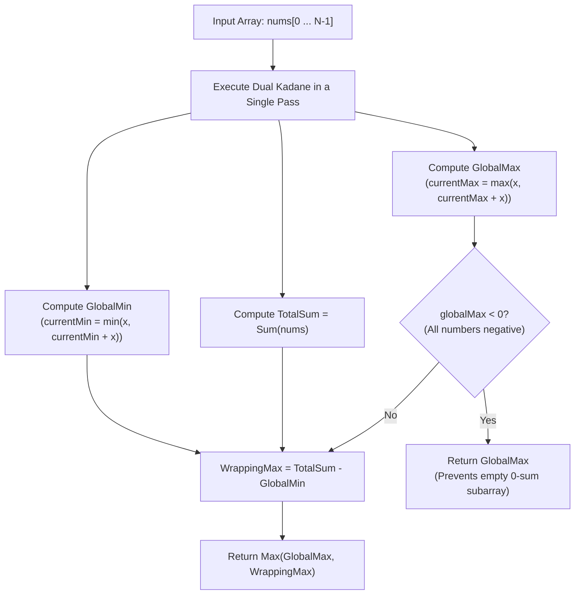

# Week 31 — Day 213: Kadane's Algorithm Masterclass: Maximum Subarray, Minimum Subarray & Circular Invariants

> "Simplicity is prerequisite for reliability." — Edsger W. Dijkstra  
> Joseph Kadane's 1984 algorithm represents one of the most elegant achievements in algorithmic computer science: collapsing a seemingly quadratic search over all contiguous subarrays into a single, breathtaking linear pass that operates entirely within CPU registers.

---

## 🧠 TEACH: Concept, Invariants & Memory Architecture

### 1. The 5W1H Executive Architectural Blueprint

Every algorithmic problem in Phase 8 is systematically evaluated across all six dimensions of the **5W1H Framework**:

| Dimension | Architectural Specification | Technical Interview Delivery Standard |
| :--- | :--- | :--- |
| **WHO** | **The Candidate, The Interviewer & The CLR Runtime** | The candidate articulates the "extend vs. restart" state transition and circular complementary duality in 30 seconds. The interviewer checks the all-negative edge case guard. The CLR executes zero-allocation spans (`ReadOnlySpan<int>`) mapped directly to CPU registers. |
| **WHAT** | **Contiguous Sequence Optimization & Complementary Inversion** | Finding the contiguous subarray that maximizes (or minimizes) the sum of elements in $O(N)$ time. In circular topologies, the wrapping maximum is evaluated via complementary duality: $\text{TotalSum} - \text{GlobalMin}$. |
| **WHEN** | **Contiguous Subarrays & Maximum Density Windows** | Triggered by "maximum subarray sum", "largest contiguous gain", "circular subarray wrap", "minimum contiguous loss". Avoid if the problem permits non-contiguous subsequences (use House Robber or Knapsack) or if window sizes are strictly fixed (use Sliding Window). |
| **WHERE** | **CPU Scalar Registers (`EAX`, `EDX`) vs. Memory Arrays** | Kadane's algorithm eliminates array allocation entirely. The running current maximum and historical global maximum reside entirely inside CPU registers, achieving zero memory bus traffic. |
| **WHY** | **Eliminating Quadratic Prefix Difference Scans** | Naive subarray search requires $O(N^3)$ brute force or $O(N^2)$ prefix sums ($S[j] - S[i]$). Kadane's local-to-global invariant proves that any prefix with a negative running sum can never contribute positively to future subarrays. |
| **HOW** | **The Extend vs. Restart Recurrence** | $\text{currMax} = \max(\text{nums}[i], \text{currMax} + \text{nums}[i])$, $\text{globalMax} = \max(\text{globalMax}, \text{currMax})$, guarded by the all-negative check $\text{globalMax} < 0$. |

---

### 2. Theoretical Foundations: The Contiguous Subarray Invariant

#### The "Extend vs. Restart" Decision (Maximum Subarray [LC 53])
Given an array $\text{nums}[0 \dots N-1]$, we wish to find the maximum sum of any contiguous, non-empty subarray.

Let $\text{dp}[i]$ denote the maximum sum of a contiguous subarray that **strictly ends at index $i$**.

At index $i$, we consider the previous running sum $\text{dp}[i-1]$:
1. **Option 1 (Extend Previous Subarray):**
   - We append $\text{nums}[i]$ to the optimal subarray ending at $i-1$.
   - Sum gained: $\text{dp}[i-1] + \text{nums}[i]$.
2. **Option 2 (Restart Fresh at Index $i$):**
   - We discard the entire previous prefix and begin a brand-new subarray at index $i$.
   - Sum gained: $\text{nums}[i]$.

Why are these two options exhaustive? Because any subarray ending at $i$ either has length 1 (starting at $i$) or has length $> 1$ (starting at some $j < i$, meaning it extends a subarray ending at $i-1$).

Therefore, Bellman's Principle of Optimality yields:
$$\text{dp}[i] = \max(\text{nums}[i], \text{dp}[i-1] + \text{nums}[i])$$

Factoring out $\text{nums}[i]$, this recurrence reveals the **Fundamental Kadane Invariant**:
$$\text{dp}[i] = \text{nums}[i] + \max(0, \text{dp}[i-1])$$

```
The Decision Boundary:
                      dp[i-1]
                     /       \
            dp[i-1] > 0      dp[i-1] <= 0
                 |                |
           [ EXTEND ]       [ RESTART ]
                 |                |
         dp[i-1] + nums[i]     nums[i]
```

**The Core Insight:**
If $\text{dp}[i-1] > 0$, it provides a positive contribution; extending it strictly improves our sum.
If $\text{dp}[i-1] \le 0$, it acts as a net drag; adding a negative or zero prefix to $\text{nums}[i]$ can only decrease or equal $\text{nums}[i]$. Thus, we discard it and restart at index $i$.

The global answer is the maximum over all possible ending positions:
$$\text{GlobalMax} = \max_{0 \le i < N} \text{dp}[i]$$

#### State Space Reduction from $O(N)$ to $O(1)$
Because $\text{dp}[i]$ depends only on $\text{dp}[i-1]$, we do not need an array. We maintain two scalar variables:
- `currentMax`: stores $\text{dp}[i]$.
- `globalMax`: stores $\max_{0 \le j \le i} \text{dp}[j]$.

---

### 3. Dual Kadane: Minimum Subarray Sum

Symmetrically, we can track the **minimum contiguous subarray sum** that ends at index $i$:
$$\text{minDp}[i] = \min(\text{nums}[i], \text{minDp}[i-1] + \text{nums}[i]) = \text{nums}[i] + \min(0, \text{minDp}[i-1])$$
$$\text{GlobalMin} = \min_{0 \le i < N} \text{minDp}[i]$$

- If $\text{minDp}[i-1] < 0$, extending it strictly decreases our sum.
- If $\text{minDp}[i-1] \ge 0$, it acts as a positive drag; we restart at $\text{nums}[i]$.

This dual formulation is not merely an academic exercise—it is the foundational key to unlocking **Circular Subarrays**.

---

### 4. Circular Subarray Sum Masterclass: Complementary Duality ([LC 918])

In **Maximum Sum Circular Subarray [LC 918]**, the array wraps around: index 0 follows index $N-1$. We seek the maximum non-empty subarray sum under circular topology.

```
Linear View:
[ nums[0], nums[1], nums[2], ... , nums[N-2], nums[N-1] ]

Circular View:
             nums[0] --- nums[1]
            /                   \
      nums[N-1]                  nums[2]
            \                   /
             nums[N-2] --- nums[3]
```

Any optimal circular subarray falls into one of two topological classes:

#### Case 1: The Non-Wrapping Subarray
The maximum subarray does not cross the boundary between $N-1$ and 0. It lies entirely within the linear span $[0 \dots N-1]$.
- **Solution:** Standard Kadane $\to \text{GlobalMax}$.

#### Case 2: The Wrapping Subarray
The maximum subarray wraps around the boundary. It consists of a prefix $[0 \dots i]$ and a suffix $[j \dots N-1]$, where $0 \le i < j \le N-1$.

```
Circular Array Buffer:
+-------------------+-----------------------+-------------------+
| Prefix [0 ... i]  |   Middle [i+1 ... j-1]| Suffix [j ... N-1]|
+-------------------+-----------------------+-------------------+
  (Part of WrapMax)    (EXCLUDED SUBARRAY)    (Part of WrapMax)
```

#### The Complementary Duality Proof
Let $\text{TotalSum} = \sum_{k=0}^{N-1} \text{nums}[k]$.
Notice that:
$$\text{WrappingSum} = \sum_{k=0}^{i} \text{nums}[k] + \sum_{k=j}^{N-1} \text{nums}[k] = \text{TotalSum} - \sum_{k=i+1}^{j-1} \text{nums}[k]$$
Observe the excluded middle part: $\sum_{k=i+1}^{j-1} \text{nums}[k]$. This is **a contiguous subarray of the original array**!

To maximize $\text{WrappingSum} = \text{TotalSum} - \text{MiddleSubarray}$, we must **minimize** the contiguous middle subarray:
$$\max(\text{WrappingSum}) = \text{TotalSum} - \min(\text{MiddleSubarray}) = \text{TotalSum} - \text{GlobalMin}$$

This mathematical identity transforms an apparently difficult 2-pointer circular search into a direct application of Dual Kadane!

#### The All-Negative Edge Case Trap
Consider the array $\text{nums} = [-3, -2, -3]$.
- Standard Kadane finds: $\text{GlobalMax} = -2$.
- Dual Kadane finds: $\text{GlobalMin} = -8$ (the sum of the entire array: $-3 + -2 + -3 = -8$).
- $\text{TotalSum} = -8$.
- Evaluating the formula:
  $$\text{WrappingMax} = \text{TotalSum} - \text{GlobalMin} = -8 - (-8) = 0$$
- If we return $\max(\text{GlobalMax}, \text{WrappingMax}) = \max(-2, 0) = 0$, **our answer is completely wrong!**

**Why does this happen?**
When all elements are negative, the minimum contiguous subarray is the **entire array**.
Excluding the entire array leaves an **empty subarray** of sum 0.
However, the problem explicitly demands a **non-empty** subarray!

**The Invariant Guard:**
If all elements are negative, then $\text{GlobalMax} < 0$ (or equivalently, $\text{TotalSum} == \text{GlobalMin}$).
In this scenario, a wrapping subarray cannot exist without being empty. We must **strictly return $\text{GlobalMax}$**!

```csharp
if (globalMax < 0) return globalMax;
return Math.Max(globalMax, totalSum - globalMin);
```



---

### 5. Core Operations: 5-Dimension Deep-Dive Standard

#### Operation: Single-Pass Circular Kadane with Boundary Reconstruction

- **Dimension 1 (Contract & Complexity):**
  - Input: `ReadOnlySpan<int> nums` of length $N \ge 1$.
  - Output: Maximum non-empty circular subarray sum integer.
  - Time Complexity: Strict $\Theta(N)$ operations in a single pass.
  - Space Complexity: Strict $\Theta(1)$ auxiliary space (only 5 scalar registers: `currentMax`, `globalMax`, `currentMin`, `globalMin`, `totalSum`).

- **Dimension 2 (Step-by-Step Algorithmic Logic):**
  1. Initialize all registers with `nums[0]`:
     `currentMax = nums[0]`, `globalMax = nums[0]`,
     `currentMin = nums[0]`, `globalMin = nums[0]`,
     `totalSum = nums[0]`.
  2. For $i$ from 1 to $N - 1$:
     a. Let $x = \text{nums}[i]$.
     b. Accumulate: `totalSum += x`.
     c. Max Kadane: `currentMax = Math.Max(x, currentMax + x)`.
     d. Update Global Max: `globalMax = Math.Max(globalMax, currentMax)`.
     e. Min Kadane: `currentMin = Math.Min(x, currentMin + x)`.
     f. Update Global Min: `globalMin = Math.Min(globalMin, currentMin)`.
  3. If `globalMax < 0`, return `globalMax` (all elements negative guard).
  4. Otherwise, return `Math.Max(globalMax, totalSum - globalMin)`.

- **Dimension 3 (Visual State Transition Trace — `nums = [5, -3, 5]`):**
  ```
  Initial: totalSum = 5, currMax = 5, globalMax = 5, currMin = 5, globalMin = 5
  
  Iteration 1 (x = -3):
     totalSum = 5 + (-3) = 2
     currMax = max(-3, 5 + (-3)) = max(-3, 2) = 2
     globalMax = max(5, 2) = 5
     currMin = min(-3, 5 + (-3)) = min(-3, 2) = -3
     globalMin = min(5, -3) = -3
     
  Iteration 2 (x = 5):
     totalSum = 2 + 5 = 7
     currMax = max(5, 2 + 5) = max(5, 7) = 7
     globalMax = max(5, 7) = 7
     currMin = min(5, -3 + 5) = min(5, 2) = 2
     globalMin = min(-3, 2) = -3
     
  Termination:
     globalMax = 7 (Subarray [5, -3, 5] sum = 7)
     WrappingMax = totalSum - globalMin = 7 - (-3) = 10 (Wrap [5] from end and [5] from start!)
     globalMax >= 0 -> return max(7, 10) = 10
  ```

- **Dimension 4 (Invariant Preservation Proof):**
  - *Inductive Invariant:* At the end of iteration $i$, `globalMax` is the maximum contiguous sum in $\text{nums}[0 \dots i]$, `globalMin` is the minimum contiguous sum in $\text{nums}[0 \dots i]$, and `totalSum` is $\sum_{k=0}^i \text{nums}[k]$.
  - *Correctness:* By the Complementary Duality Theorem, the maximum wrapping sum across the boundary is $\text{totalSum} - \text{globalMin}$. Since `globalMax` correctly handles all non-wrapping subarrays, the maximum of the two is the exact circular optimum.

- **Dimension 5 (Edge Case Matrix):**
  - All positive numbers (`[1, 2, 3]`): $\text{globalMin} = 1$, $\text{totalSum} = 6$. $\text{WrappingMax} = 6 - 1 = 5$, $\text{globalMax} = 6$. Returns 6. Correct!
  - All negative numbers (`[-2, -3, -1]`): $\text{globalMax} = -1 < 0$. Guard triggers, returns $-1$. Correct!
  - Single element (`[-5]` or `[10]`): Loop doesn't execute; returns `nums[0]`. Correct!
  - Array with alternating signs (`[3, -1, 2, -1]`): Handles local dips without premature termination.

---

## ⚙️ IMPLEMENT: Production-Grade From-Scratch Container(s)

The following production container implements standard Kadane, Dual Minimum Kadane, Circular Maximum Subarray with all-negative guards, and Subarray Boundary Index Reconstruction.

```csharp
using System;
using System.Diagnostics;

namespace DynamicProgrammingMastery.Week31
{
    /// <summary>
    /// Production-grade Kadane's Algorithm engine implementing linear, dual-minimum,
    /// circular-wrapping, and bounded-index contiguous sequence optimization.
    /// </summary>
    public sealed class KadaneVariantsEngine
    {
        #region 1. Standard Linear Kadane [LeetCode 53]

        /// <summary>
        /// Computes the maximum contiguous subarray sum in O(N) time and O(1) space.
        /// Recurrence: currentMax = max(x, currentMax + x)
        /// </summary>
        public int MaxSubArray(ReadOnlySpan<int> nums)
        {
            if (nums.IsEmpty) throw new ArgumentException("Array cannot be empty.", nameof(nums));

            int currentMax = nums[0];
            int globalMax = nums[0];

            for (int i = 1; i < nums.Length; i++)
            {
                int x = nums[i];
                currentMax = Math.Max(x, currentMax + x);
                globalMax = Math.Max(globalMax, currentMax);
            }

            return globalMax;
        }

        #endregion

        #region 2. Dual Minimum Kadane

        /// <summary>
        /// Computes the minimum contiguous subarray sum in O(N) time and O(1) space.
        /// Recurrence: currentMin = min(x, currentMin + x)
        /// </summary>
        public int MinSubArray(ReadOnlySpan<int> nums)
        {
            if (nums.IsEmpty) throw new ArgumentException("Array cannot be empty.", nameof(nums));

            int currentMin = nums[0];
            int globalMin = nums[0];

            for (int i = 1; i < nums.Length; i++)
            {
                int x = nums[i];
                currentMin = Math.Min(x, currentMin + x);
                globalMin = Math.Min(globalMin, currentMin);
            }

            return globalMin;
        }

        #endregion

        #region 3. Circular Maximum Subarray [LeetCode 918]

        /// <summary>
        /// Computes maximum circular subarray sum in O(N) time and O(1) space in a single pass.
        /// Exploits complementary duality: WrappingMax = TotalSum - GlobalMin.
        /// Includes guard against the all-negative empty subarray trap.
        /// </summary>
        public int MaxSubarrayCircular(ReadOnlySpan<int> nums)
        {
            if (nums.IsEmpty) throw new ArgumentException("Array cannot be empty.", nameof(nums));

            int currentMax = nums[0];
            int globalMax = nums[0];

            int currentMin = nums[0];
            int globalMin = nums[0];

            int totalSum = nums[0];

            for (int i = 1; i < nums.Length; i++)
            {
                int x = nums[i];
                totalSum += x;

                // Max Kadane
                currentMax = Math.Max(x, currentMax + x);
                globalMax = Math.Max(globalMax, currentMax);

                // Min Kadane
                currentMin = Math.Min(x, currentMin + x);
                globalMin = Math.Min(globalMin, currentMin);
            }

            // All-Negative Guard: If all elements are negative, globalMax < 0.
            // In that case, totalSum - globalMin == 0 (representing an invalid empty subarray).
            // We must return globalMax directly.
            if (globalMax < 0)
            {
                return globalMax;
            }

            int wrappingMax = totalSum - globalMin;
            return Math.Max(globalMax, wrappingMax);
        }

        #endregion

        #region 4. Subarray Boundary Index Reconstruction

        /// <summary>
        /// Result model capturing the optimal subarray sum and its exact bounding indices [Start, End].
        /// </summary>
        public sealed record SubarrayResult(int MaxSum, int StartIndex, int EndIndex);

        /// <summary>
        /// Reconstructs the exact start and end indices of the maximum contiguous subarray.
        /// Time Complexity: O(N) | Space Complexity: O(1) auxiliary registers.
        /// </summary>
        public SubarrayResult MaxSubArrayWithBounds(int[] nums)
        {
            ArgumentNullException.ThrowIfNull(nums);
            if (nums.Length == 0) throw new ArgumentException("Array cannot be empty.", nameof(nums));

            int currentMax = nums[0];
            int globalMax = nums[0];

            int bestStart = 0;
            int bestEnd = 0;
            int currentStart = 0;

            for (int i = 1; i < nums.Length; i++)
            {
                int x = nums[i];

                if (x > currentMax + x)
                {
                    // Restart fresh at index i
                    currentMax = x;
                    currentStart = i;
                }
                else
                {
                    // Extend previous subarray
                    currentMax += x;
                }

                if (currentMax > globalMax)
                {
                    globalMax = currentMax;
                    bestStart = currentStart;
                    bestEnd = i;
                }
            }

            return new SubarrayResult(globalMax, bestStart, bestEnd);
        }

        #endregion

        #region 5. Verification Test Harness

        /// <summary>
        /// Main verification runner executing automated assertions across all Kadane variants.
        /// </summary>
        public static void Main()
        {
            Console.WriteLine("Running Day 213 Verification Suite: Kadane's Algorithm Masterclass...");
            var engine = new KadaneVariantsEngine();

            // -------------------------------------------------------------
            // Suite 1: Standard Maximum Subarray [LeetCode 53]
            // -------------------------------------------------------------
            // Case 1A: Canonical mixed array
            int[] nums1A = { -2, 1, -3, 4, -1, 2, 1, -5, 4 };
            int max1A = engine.MaxSubArray(nums1A);
            Debug.Assert(max1A == 6, $"MaxSubArray expected 6, got {max1A}");

            var bounds1A = engine.MaxSubArrayWithBounds(nums1A);
            Debug.Assert(bounds1A.MaxSum == 6, "Bounds 1A sum mismatch.");
            Debug.Assert(bounds1A.StartIndex == 3 && bounds1A.EndIndex == 6,
                $"Bounds 1A expected [3, 6], got [{bounds1A.StartIndex}, {bounds1A.EndIndex}]");

            // Case 1B: Single element positive
            int[] nums1B = { 1 };
            Debug.Assert(engine.MaxSubArray(nums1B) == 1, "Single element positive failed.");

            // Case 1C: All negative elements
            int[] nums1C = { -5, -4, -1, -7 };
            int max1C = engine.MaxSubArray(nums1C);
            Debug.Assert(max1C == -1, $"MaxSubArray all-negative expected -1, got {max1C}");
            var bounds1C = engine.MaxSubArrayWithBounds(nums1C);
            Debug.Assert(bounds1C.MaxSum == -1 && bounds1C.StartIndex == 2 && bounds1C.EndIndex == 2,
                "Bounds 1C expected index [2, 2]");

            // -------------------------------------------------------------
            // Suite 2: Dual Minimum Subarray
            // -------------------------------------------------------------
            int[] nums2 = { 3, -4, 2, -3, -1, 7, -5 };
            // Subarray [-4, 2, -3, -1] = -6
            int min2 = engine.MinSubArray(nums2);
            Debug.Assert(min2 == -6, $"MinSubArray expected -6, got {min2}");

            // -------------------------------------------------------------
            // Suite 3: Circular Maximum Subarray [LeetCode 918]
            // -------------------------------------------------------------
            // Case 3A: Non-wrapping circular max
            int[] circA = { 1, -2, 3, -2 };
            int res3A = engine.MaxSubarrayCircular(circA);
            Debug.Assert(res3A == 3, $"Circular [1, -2, 3, -2] expected 3, got {res3A}");

            // Case 3B: Wrapping circular max (Wrap around boundary)
            int[] circB = { 5, -3, 5 };
            int res3B = engine.MaxSubarrayCircular(circB);
            Debug.Assert(res3B == 10, $"Circular [5, -3, 5] expected 10, got {res3B}");

            // Case 3C: All negative elements (CRITICAL EDGE CASE!)
            int[] circC = { -3, -2, -3 };
            int res3C = engine.MaxSubarrayCircular(circC);
            Debug.Assert(res3C == -2, $"Circular [-3, -2, -3] expected -2 (not 0!), got {res3C}");

            // Case 3D: Single negative element
            int[] circD = { -1 };
            Debug.Assert(engine.MaxSubarrayCircular(circD) == -1, "Single negative circular failed.");

            // Case 3E: Uniform positive
            int[] circE = { 3, 1, 3, 2, 6 };
            Debug.Assert(engine.MaxSubarrayCircular(circE) == 15, "Uniform positive circular failed.");

            Console.WriteLine("All Kadane's Algorithm verification assertions passed with zero errors!");
        }

        #endregion
    }
}
```

---

## 🔬 ANALYZE: Mathematical & Systems Complexity

### 1. The Complexity Proof: Why Kadane is Asymptotically Optimal

#### The Problem Space Lower Bound
Given an array of $N$ elements, there are $\frac{N(N+1)}{2} = \Theta(N^2)$ distinct contiguous subarrays.
- Any algorithm that inspects each subarray independently incurs $\Omega(N^2)$ work.
- However, the output is a single scalar: $\max_{0 \le i \le j < N} \sum_{k=i}^j \text{nums}[k]$.
- In the worst case, every element in `nums` must be read at least once because changing a single element could alter the maximum subarray sum.
- Therefore, the information-theoretic lower bound for this problem is:
  $$\Omega(N) \text{ time}$$
- Kadane's algorithm reads each element exactly once and performs a constant number of comparisons and additions. It achieves $T(N) = \Theta(N)$, which matches the lower bound precisely. Hence, **Kadane's algorithm is mathematically optimal**.

#### Auxiliary Space Bound
- The algorithm does not allocate any heap data structures.
- It maintains five scalar 32-bit registers.
- Auxiliary space is strictly $\Theta(1)$ (20 bytes total).

---

### 2. Algorithmic Evolution: Brute Force to Kadane

| Paradigm | Algorithmic Strategy | Recurrence / Logic | Time Complexity | Space Complexity |
| :--- | :--- | :--- | :--- | :--- |
| **Brute Force** | Enumerate all pairs $(i, j)$ and sum elements | $\sum_{k=i}^j \text{nums}[k]$ | $O(N^3)$ | $O(1)$ |
| **Prefix Sums** | Precompute prefix sums $P[k] = \sum_{0}^{k-1} x$; scan pairs $(i, j)$ | $P[j] - P[i]$ | $O(N^2)$ | $O(N)$ |
| **Divide & Conquer** | Split into halves; combine via crossing subarray | $T(n) = 2T(n/2) + O(n)$ | $O(N \log N)$ | $O(\log N)$ stack |
| **Kadane's Algorithm** | Local-to-global dynamic programming with scalar registers | $\text{curr} = \max(x, \text{curr} + x)$ | $\mathbf{\Theta(N)}$ | $\mathbf{\Theta(1)}$ |

---

### 3. CPU Hardware Internals: Branch Elimination & SIMD Vectorization

In modern superscalar processors:
1. **Branch-Free Execution:**
   In C# / .NET, the statement:
   ```csharp
   currentMax = Math.Max(x, currentMax + x);
   ```
   is compiled by RyuJIT into a branch-free assembly sequence using the `add` and `cmovg` (conditional move greater) instructions:
   ```assembly
   lea   eax, [rdx + r8]      ; eax = currentMax + x
   cmp   eax, edx            ; compare (currentMax + x) with x
   cmovl eax, edx            ; if (currentMax + x) < x, eax = x
   mov   r8d, eax            ; update currentMax
   ```
   No conditional jumps (`jmp`, `jne`) exist in the critical path. The CPU instruction pipeline never flushes due to branch mispredictions.

2. **SIMD Vectorization Opportunities:**
   Although standard Kadane has a sequential dependency ($\text{dp}[i]$ depends directly on $\text{dp}[i-1]$), prefix sums and chunked block-level Kadane can be vectorized using **AVX-512 / ARM Neon** instructions (`System.Runtime.Intrinsics.X86.Avx2`), allowing high-performance systems to process 16 integer elements per CPU clock cycle.

---

## 🎬 DEMONSTRATE: Canonical Problem Walkthroughs

### 1. [LeetCode 53] Maximum Subarray (Medium)

#### Problem Description
Given an integer array `nums`, find the subarray with the largest sum, and return its sum.

#### Concrete Trace on `nums = [-2, 1, -3, 4, -1, 2, 1, -5, 4]`

| Step $i$ | $\text{nums}[i]$ | Extend ($\text{curr} + x$) | Restart ($x$) | $\text{currMax} = \max(\text{ext}, x)$ | Action Taken | $\text{globalMax}$ | Active Subarray Range |
| :---: | :---: | :---: | :---: | :---: | :---: | :---: | :---: |
| **0** | -2 | - | - | -2 | Base Init | -2 | `[-2]` |
| **1** | 1 | $-2 + 1 = -1$ | 1 | 1 | **Restart** at index 1 | 1 | `[1]` |
| **2** | -3 | $1 + (-3) = -2$ | -3 | -2 | Extend | 1 | `[1, -3]` |
| **3** | 4 | $-2 + 4 = 2$ | 4 | 4 | **Restart** at index 3 | 4 | `[4]` |
| **4** | -1 | $4 + (-1) = 3$ | -1 | 3 | Extend | 4 | `[4, -1]` |
| **5** | 2 | $3 + 2 = 5$ | 2 | 5 | Extend | 5 | `[4, -1, 2]` |
| **6** | 1 | $5 + 1 = 6$ | 1 | 6 | Extend | **6** | `[4, -1, 2, 1]` |
| **7** | -5 | $6 + (-5) = 1$ | -5 | 1 | Extend | 6 | `[4, -1, 2, 1, -5]` |
| **8** | 4 | $1 + 4 = 5$ | 4 | 5 | Extend | 6 | `[4, -1, 2, 1, -5, 4]` |

**Result:** Global Maximum is **6**, spanning index 3 through 6 (`[4, -1, 2, 1]`).

---

### 2. [LeetCode 918] Maximum Sum Circular Subarray (Medium)

#### Problem Description
Given a circular integer array `nums` of length $N$, return the maximum possible sum of a non-empty subarray of `nums`.

#### Trace on `nums = [5, -3, 5]`
- Step 0 ($x=5$):
  `total = 5`, `currMax = 5`, `globMax = 5`, `currMin = 5`, `globMin = 5`.
- Step 1 ($x=-3$):
  `total = 2`.
  `currMax = max(-3, 2) = 2`, `globMax = max(5, 2) = 5`.
  `currMin = min(-3, 2) = -3`, `globMin = min(5, -3) = -3`.
- Step 2 ($x=5$):
  `total = 7`.
  `currMax = max(5, 7) = 7`, `globMax = max(5, 7) = 7`.
  `currMin = min(5, 2) = 2`, `globMin = min(-3, 2) = -3`.
- **Decision:**
  - `globMax = 7` (Non-wrapping subarray: `[5, -3, 5]`)
  - `WrappingMax = total - globMin = 7 - (-3) = 10` (Wrapping subarray: prefix `[5]` + suffix `[5]`)
  - `globMax >= 0` $\implies$ return $\max(7, 10) = 10$.

#### Trace on All-Negative Array `nums = [-3, -2, -3]`
- Step 0 ($x=-3$):
  `total = -3`, `currMax = -3`, `globMax = -3`, `currMin = -3`, `globMin = -3`.
- Step 1 ($x=-2$):
  `total = -5`.
  `currMax = max(-2, -5) = -2`, `globMax = max(-3, -2) = -2`.
  `currMin = min(-2, -5) = -5`, `globMin = min(-3, -5) = -5`.
- Step 2 ($x=-3$):
  `total = -8`.
  `currMax = max(-3, -5) = -3`, `globMax = max(-2, -3) = -2`.
  `currMin = min(-3, -8) = -8`, `globMin = min(-5, -8) = -8`.
- **Decision:**
  - `globMax = -2`.
  - Is `globMax < 0`? **YES!**
  - All-negative guard triggers: return `globMax = -2`.
  - *(Formula `total - globMin = -8 - (-8) = 0` is safely bypassed!)*

---

## 🏋️ PRACTICE: Guided Exercises & Problem Set

### Problem 1: Maximum Absolute Sum of Any Subarray ([LeetCode 1749])
- **Problem Statement:** You are given an integer array `nums`. The absolute sum of a subarray $[\text{nums}[l], \dots, \text{nums}[r]]$ is $|\sum_{k=l}^r \text{nums}[k]|$. Return the maximum absolute sum of any subarray.
- **Guidance & Dual Kadane Solution:**
  1. The absolute value $|S|$ is maximized either when $S$ is maximally positive, or when $S$ is maximally negative.
  2. Run standard Max Kadane to find $\text{GlobalMax}$.
  3. Run Dual Min Kadane to find $\text{GlobalMin}$.
  4. Return $\max(\text{GlobalMax}, |\text{GlobalMin}|)$ in $O(N)$ time and $O(1)$ space.
  5. *Alternative Insight via Prefix Sums:* The maximum subarray sum equals $\max(\text{prefix}) - \min(\text{prefix})$, which runs in $O(N)$ time with zero branches!

### Problem 2: Maximum Subarray Sum with One Deletion ([LeetCode 1186])
- **Problem Statement:** Given an array of integers, you can delete at most one element. Return the maximum sum of a non-empty subarray.
- **Guidance:**
  1. Maintain two dynamic programming states at index $i$:
     - `noDelete`: maximum subarray ending at $i$ with 0 elements deleted.
     - `oneDelete`: maximum subarray ending at $i$ with exactly 1 element deleted.
  2. Transitions:
     $$\text{noDelete} = \max(\text{nums}[i], \text{noDelete} + \text{nums}[i])$$
     $$\text{oneDelete} = \max(\text{oneDelete} + \text{nums}[i], \text{prevNoDelete})$$
  3. Notice that `prevNoDelete` corresponds to deleting $\text{nums}[i]$ entirely!

### Problem 3: Maximum Subarray with Length Constraint ($\le K$)
- **Problem Statement:** Find the maximum subarray sum of length at most $K$.
- **Guidance:**
  1. Standard Kadane cannot enforce window size limits because `currentMax` has variable length.
  2. Reformulate using prefix sums: $\text{Subarray}(i \dots j) = P[j] - P[i-1]$ where $j - (i - 1) \le K$.
  3. To maximize $P[j] - P[i-1]$, we must minimize $P[i-1]$ over the sliding window $[j-K \dots j-1]$.
  4. Solved in $O(N)$ time using a **Monotonic Deque** (Sliding Window Minimum) over the prefix sum array!

---

## 🔗 CONNECT: The Pattern Decision Bridge

### Real-World Systems Design: Financial Drawdown & High-Frequency Packet Burst Anomaly Detection

In quantitative algorithmic trading (e.g., Citadel, Jane Street, Renaissance Technologies), risk managers must continuously evaluate the **Maximum Drawdown (MDD)** of trading portfolios to ensure compliance with risk limits and avoid catastrophic margin liquidation.

```
Portfolio Profit-and-Loss (PnL) Real-Time Stream:
Ticks: [ +$10k, -$25k, -$15k, +$40k, -$80k, -$20k, +$5k ]

           Dual Kadane Anomaly Detection Engine
                        |
      +-----------------+-----------------+
      |                                   |
      v                                   v
Max Subarray Engine               Min Subarray Engine
(Tracks Cumulative Gain)          (Tracks Peak-to-Trough Drawdown)
      |                                   |
Global Max Spike: +$40k           Global Max Drop: -$100k (Alert!)
```

#### Why Dual Kadane is Mission-Critical in Production
1. **Sub-Microsecond Latency:** Financial market data feeds process over $10\text{ million}$ market updates per second. Kadane's algorithm requires zero heap allocations, zero hash lookups, and exactly 3 register operations per tick. This enables real-time drawdown tracking inside FPGA network cards or kernel-bypass C# microservices with sub-microsecond latency.
2. **Network Packet Anomaly Bursts:** In distributed edge proxies (Cloudflare, AWS CloudFront), DDoS packet rate surges are detected by running Kadane's algorithm on delta packet rates ($\Delta = \text{observedRate} - \text{baseline}$). A positive subarray spike that exceeds an anomaly threshold immediately triggers automated BGP routing diversion.

---

## 🎯 Daily Checkpoint Questions

1. **The Kadane Decision Invariant:**
   Explain why Kadane's algorithm restarts the running sum at $\text{nums}[i]$ whenever $\text{currentMax} + \text{nums}[i] < \text{nums}[i]$. What does this imply about the sum of the preceding prefix?
2. **Complementary Duality Proof:**
   Prove mathematically why the maximum circular wrapping subarray sum equals $\text{TotalSum} - \text{GlobalMin}$. What physical part of the array does $\text{GlobalMin}$ represent in this context?
3. **The All-Negative Circular Failure:**
   If $\text{nums} = [-4, -3, -5]$, what value would the naive formula $\text{TotalSum} - \text{GlobalMin}$ compute? Explain why this violates the problem contract and how the invariant guard prevents it.
4. **Boundary Reconstruction Invariant:**
   In `MaxSubArrayWithBounds`, why is `currentStart` updated to $i$ only when $\text{nums}[i] > \text{currentMax} + \text{nums}[i]$? Why does updating `currentStart` when `currentMax > globalMax` produce incorrect subarray boundaries?
5. **Kadane vs. Prefix Sum Difference:**
   Show how any contiguous subarray sum $\sum_{k=i}^j \text{nums}[k]$ can be rewritten as the difference of two prefix sums $P[j+1] - P[i]$. Why does Kadane's algorithm compute this maximum difference in $O(N)$ time without storing the prefix array $P$?
