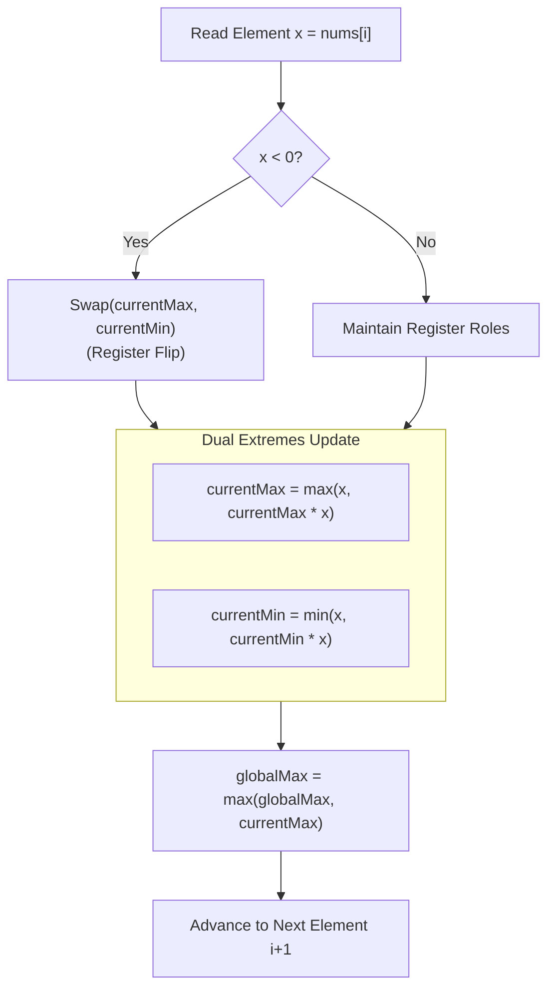

# Week 31 — Day 214: Maximum Product Subarray: Tracking Dual Running Extremes (Min & Max with Sign Flips)

> "In additive systems, the past is an accumulated burden or a stepping stone; in multiplicative systems, the past can invert its polarity in a single instant."  
> When optimizing contiguous products, standard dynamic programming assumptions break down. Negative numbers do not merely reduce value—they invert the entire topological order of optimization. By tracking dual running extremes simultaneously, we tame non-monotonicity into linear-time elegance.

---

## 🧠 TEACH: Concept, Invariants & Memory Architecture

### 1. The 5W1H Executive Architectural Blueprint

Every algorithmic problem in Phase 8 is systematically evaluated across all six dimensions of the **5W1H Framework**:

| Dimension | Architectural Specification | Technical Interview Delivery Standard |
| :--- | :--- | :--- |
| **WHO** | **The Candidate, The Interviewer & The CLR Runtime** | The candidate articulates the non-monotonic sign-flip dilemma and the dual-extreme invariant in 30 seconds. The interviewer checks zero resets and negative pairs. The CLR executes register swaps (`XCHG` / conditional moves) in $O(1)$ memory without heap allocation. |
| **WHAT** | **Non-Monotonic Multiplicative Optimization** | Finding the contiguous subarray that maximizes the product of its elements. Solved by maintaining two simultaneous running states: the maximum product ending at $i$ and the minimum product ending at $i$. |
| **WHEN** | **Multiplicative Recurrences & Signed Transition Sequences** | Triggered by "maximum product subarray", "cumulative percentage return", "alternating signed multipliers". Avoid if numbers are strictly positive (use two-pointer sliding window or logarithmic transforms) or if arbitrary non-contiguous subsets are chosen. |
| **WHERE** | **Hardware Scalar Registers vs. Stack Memory** | The dual states (`currentMax`, `currentMin`) reside in CPU data registers (`EAX`, `EDX`). Slicing spans (`ReadOnlySpan<int>`) requires zero heap allocations, preserving L1 data cache lines. |
| **WHY** | **Failure of Additive Kadane on Multiplicative Spaces** | In addition, $a \ge b \implies a + c \ge b + c$ (monotonicity holds). In multiplication, if $c < 0$, then $a \ge b \implies a \cdot c \le b \cdot c$ (the inequality flips). Discarding a negative running product prematurely discards future positive windfalls. |
| **HOW** | **Dual Extremes Update with Sign-Swap Optimization** | At index $i$, if $x < 0$, swap `currentMax` and `currentMin`. Then $\text{currentMax} = \max(x, \text{currentMax} \cdot x)$ and $\text{currentMin} = \min(x, \text{currentMin} \cdot x)$. |

---

### 2. Theoretical Foundations: The Multiplicative Monotonicity Dilemma

#### Why Single-Variable Kadane Fails Catastrophically
In standard Kadane's algorithm (Day 213), the state transition is:
$$\text{dp}[i] = \max(\text{nums}[i], \text{dp}[i-1] + \text{nums}[i])$$
This works because addition is **monotonically order-preserving**:
$$\forall a, b, c \in \mathbb{R}: \quad a \ge b \implies a + c \ge b + c$$
If $\text{dp}[i-1] \le 0$, adding it to $\text{nums}[i]$ can never yield a sum greater than $\text{nums}[i]$. Hence, discarding negative prefix sums is mathematically guaranteed never to harm future choices.

Now consider multiplication over the real numbers $\mathbb{R}$:
$$\text{If } c > 0: \quad a \ge b \implies a \cdot c \ge b \cdot c \quad \text{(Order Preserved)}$$
$$\text{If } c < 0: \quad a \ge b \implies a \cdot c \le b \cdot c \quad \mathbf{\text{(Order Inverted!)}}$$

#### Concrete Failure Demonstration
Consider the array $\text{nums} = [2, -5, -2]$.
- At index 0 ($x = 2$): product is $2$.
- At index 1 ($x = -5$):
  - Option A (Extend): $2 \cdot (-5) = -10$.
  - Option B (Restart): $-5$.
  - Single-variable Kadane chooses $\max(-10, -5) = -5$, recording `currentMax = -5`.
- At index 2 ($x = -2$):
  - Option A (Extend): $(-5) \cdot (-2) = 10$.
  - Option B (Restart): $-2$.
  - Single-variable Kadane outputs $\max(10, -2) = 10$.

**However, the true maximum subarray is the entire array $[2, -5, -2]$:**
$$2 \cdot (-5) \cdot (-2) = \mathbf{20}$$
Single-variable Kadane discarded the previous product $-10$ because it was "too small", failing to realize that multiplying $-10$ by the upcoming negative number $-2$ would yield a massive positive windfall ($+20$)!

```
Single-Variable Kadane Blind Spot:
nums:          [  2,        -5,         -2  ]
Prefix Prod:   [  2,       -10,        +20  ]  <--- TRUE OPTIMUM
Naive Kadane:  [  2,        -5,        +10  ]  <--- LOST 50% OF VALUE!
                            ^
              Discarded -10 as "too small"!
```

---

### 3. The Dual Running Extremes Invariant

To restore optimal substructure, we must recognize that at any index $i$, a large positive product can be formed in two ways:
1. Multiplying a **large positive previous product** by a **positive number**.
2. Multiplying a **large negative previous product** by a **negative number**.

Conversely, a large negative product can be formed by:
1. Multiplying a **large positive previous product** by a **negative number**.
2. Multiplying a **large negative previous product** by a **positive number**.

Therefore, the state at index $i$ is not a single scalar; it is a **dual-tuple of running extremes**:
$$\mathcal{S}_i = \langle \text{maxProduct}[i], \text{minProduct}[i] \rangle$$

#### The 3-Way Recurrence Formulation
At index $i$ with value $x = \text{nums}[i]$, three candidates exist for both the new maximum and the new minimum:
1. Candidate 1 ($x$ alone): Start a brand-new subarray at index $i$.
2. Candidate 2 ($\text{prevMax} \cdot x$): Extend the maximum product ending at $i-1$.
3. Candidate 3 ($\text{prevMin} \cdot x$): Extend the minimum product ending at $i-1$.

Thus:
$$\text{currentMax} = \max(x, \text{prevMax} \cdot x, \text{prevMin} \cdot x)$$
$$\text{currentMin} = \min(x, \text{prevMax} \cdot x, \text{prevMin} \cdot x)$$
$$\text{globalMax} = \max(\text{globalMax}, \text{currentMax})$$

```
State Transition Lattice for Element x:
                     prevMax          prevMin
                     /     \          /     \
                    /       \        /       \
                   v         v      v         v
             prevMax * x        prevMin * x       x (Restart)
                  \                 /            /
                   \               /            /
                    v             v            v
                 currentMax = max(x, prevMax*x, prevMin*x)
                 currentMin = min(x, prevMax*x, prevMin*x)
```

---

### 4. The Sign-Swap Optimization Technique

Notice what happens when $x = \text{nums}[i] < 0$:
- Since $x$ is negative, multiplying by $x$ reverses all inequalities:
  $$\max(A \cdot x, B \cdot x) = \min(A, B) \cdot x$$
  $$\min(A, B \cdot x) = \max(A, B) \cdot x$$
- Therefore, when $x < 0$, $\text{prevMin} \cdot x$ is guaranteed to be greater than or equal to $\text{prevMax} \cdot x$!

This algebraic fact enables the **Sign-Swap Optimization**:
If $x < 0$, we simply swap the values of `currentMax` and `currentMin` **before** performing the standard update:
```csharp
if (x < 0)
{
    // Invert extremes before multiplication
    int temp = currentMax;
    currentMax = currentMin;
    currentMin = temp;
}

currentMax = Math.Max(x, currentMax * x);
currentMin = Math.Min(x, currentMin * x);
globalMax = Math.Max(globalMax, currentMax);
```

#### Why This Optimization is Architecturally Superior
1. **Reduces Comparisons:** Reduces 4 comparisons per loop iteration to exactly 2.
2. **Hardware Register Swap:** In x86 assembly, swapping two registers is accomplished via a single `xchg` instruction or register renaming in the out-of-order execution engine with zero latency cycles.



---

### 5. Zero-Reset Mechanics: Partitioning by Zero

Zeros introduce a unique boundary behavior in multiplication:
- Multiplying any number by 0 produces 0.
- When $x = 0$:
  $$\text{currentMax} = \max(0, \text{prevMax} \cdot 0, \text{prevMin} \cdot 0) = \max(0, 0, 0) = 0$$
  $$\text{currentMin} = \min(0, \text{prevMax} \cdot 0, \text{prevMin} \cdot 0) = \min(0, 0, 0) = 0$$
  $$\text{globalMax} = \max(\text{globalMax}, 0)$$
- At the subsequent element $i+1$ with value $y = \text{nums}[i+1]$:
  $$\text{currentMax} = \max(y, 0 \cdot y) = \max(y, 0)$$
  - If $y > 0$, `currentMax` becomes $y$, seamlessly restarting a new subarray!
  - If $y < 0$, `currentMax` becomes $0$ (or $y$ if restarting), and `currentMin` becomes $y$.

**The Zero Partition Theorem:**
Any zero in the array acts as a natural **subproblem barrier**, partitioning the array into independent non-zero contiguous segments. The dual-running extremes algorithm handles zeros automatically without requiring explicit sub-array splitting or conditional branching!

---

### 6. Core Operations: 5-Dimension Deep-Dive Standard

#### Operation: Maximum Product Subarray with Sign Swap

- **Dimension 1 (Contract & Complexity):**
  - Input: `ReadOnlySpan<int> nums` of length $N \ge 1$.
  - Output: Maximum product scalar integer.
  - Time Complexity: Strict $\Theta(N)$ arithmetic operations.
  - Space Complexity: Strict $\Theta(1)$ auxiliary memory (only 3 integer registers: `currentMax`, `currentMin`, `globalMax`).

- **Dimension 2 (Step-by-Step Algorithmic Logic):**
  1. Validate that input span is not empty.
  2. Initialize `currentMax = nums[0]`, `currentMin = nums[0]`, `globalMax = nums[0]`.
  3. Iterate $i$ from 1 to $N-1$:
     a. Let $x = \text{nums}[i]$.
     b. If $x < 0$, swap `currentMax` and `currentMin`.
     c. Compute `currentMax = Math.Max(x, currentMax * x)`.
     d. Compute `currentMin = Math.Min(x, currentMin * x)`.
     e. Update `globalMax = Math.Max(globalMax, currentMax)`.
  4. Return `globalMax`.

- **Dimension 3 (Visual State Transition Trace — `nums = [2, 3, -2, 4, -1]`):**
  ```
  Initial: currMax = 2, currMin = 2, globMax = 2
  
  Step 1 (x = 3, Positive):
     currMax = max(3, 2 * 3) = 6
     currMin = min(3, 2 * 3) = 3
     globMax = max(2, 6) = 6
     
  Step 2 (x = -2, Negative -> SWAP!):
     Swap: currMax = 3, currMin = 6
     currMax = max(-2, 3 * (-2)) = max(-2, -6) = -2
     currMin = min(-2, 6 * (-2)) = min(-2, -12) = -12
     globMax = max(6, -2) = 6
     
  Step 3 (x = 4, Positive):
     currMax = max(4, -2 * 4) = max(4, -8) = 4
     currMin = min(4, -12 * 4) = min(4, -48) = -48
     globMax = max(6, 4) = 6
     
  Step 4 (x = -1, Negative -> SWAP!):
     Swap: currMax = -48, currMin = 4
     currMax = max(-1, -48 * (-1)) = max(-1, 48) = 48  <--- NEGATIVE WINDFALL!
     currMin = min(-1, 4 * (-1)) = min(-1, -4) = -4
     globMax = max(6, 48) = 48
     
  Final Return: 48 (Subarray [2, 3, -2, 4, -1] = 48)
  ```

- **Dimension 4 (Invariant Preservation Proof):**
  - *Loop Invariant:* At the end of iteration $i$, `currentMax` contains the maximum contiguous product ending at $i$, `currentMin` contains the minimum contiguous product ending at $i$, and `globalMax` contains the maximum contiguous product in the prefix $\text{nums}[0 \dots i]$.
  - *Base Case:* At $i=0$, all three variables equal $\text{nums}[0]$. Correct.
  - *Inductive Step:* By the algebraic properties of real multiplication, any contiguous product ending at $i$ is either $x$ alone, $x \cdot P$ where $P$ is a product ending at $i-1$. Since $x \cdot P$ is bounded between $x \cdot \text{prevMin}$ and $x \cdot \text{prevMax}$, taking the min and max over $\{x, \text{prevMin} \cdot x, \text{prevMax} \cdot x\}$ correctly bounds the extremes. The invariant is preserved.

- **Dimension 5 (Edge Case Matrix):**
  - Single negative number (`[-2]`): Returns $-2$.
  - Array with single zero (`[0]`): Returns $0$.
  - Alternating negative pairs (`[-1, -2, -3, -4]`): Products: $-1 \to 2 \to 6 \to 24$. Returns $24$.
  - Odd count of negative numbers (`[-2, 3, -4]`): Returns $24$ (product of all three elements).
  - Array with isolated zeros (`[2, 0, 3, -2, 4]`): Segment 1 max = 2, Segment 2 max = 4. Returns 4.

---

## ⚙️ IMPLEMENT: Production-Grade From-Scratch Container(s)

The following production container implements both the 3-Way Candidate evaluation and the Sign-Swap optimization, alongside Subarray Boundary Index Reconstruction and diagnostic test harnesses.

```csharp
using System;
using System.Diagnostics;

namespace DynamicProgrammingMastery.Week31
{
    /// <summary>
    /// Production-grade Maximum Product Subarray Engine demonstrating
    /// dual running extremes, sign-swap register optimization, and boundary reconstruction.
    /// </summary>
    public sealed class DualExtremeProductEngine
    {
        #region 1. 3-Way Candidate Evaluation [LeetCode 152]

        /// <summary>
        /// Solves Maximum Product Subarray via explicit 3-candidate comparison.
        /// Recurrence:
        /// currentMax = max(x, prevMax * x, prevMin * x)
        /// currentMin = min(x, prevMax * x, prevMin * x)
        /// Time Complexity: O(N) | Space Complexity: O(1) registers.
        /// </summary>
        public int MaxProduct3Way(ReadOnlySpan<int> nums)
        {
            if (nums.IsEmpty) throw new ArgumentException("Array cannot be empty.", nameof(nums));

            int currentMax = nums[0];
            int currentMin = nums[0];
            int globalMax = nums[0];

            for (int i = 1; i < nums.Length; i++)
            {
                int x = nums[i];

                int prod1 = currentMax * x;
                int prod2 = currentMin * x;

                currentMax = Math.Max(x, Math.Max(prod1, prod2));
                currentMin = Math.Min(x, Math.Min(prod1, prod2));

                globalMax = Math.Max(globalMax, currentMax);
            }

            return globalMax;
        }

        #endregion

        #region 2. Sign-Swap Optimized Implementation

        /// <summary>
        /// Solves Maximum Product Subarray via the Sign-Swap Register Technique.
        /// Swapping currentMax and currentMin when x is negative reduces comparisons.
        /// Time Complexity: O(N) | Space Complexity: O(1) registers.
        /// </summary>
        public int MaxProductWithSignSwap(ReadOnlySpan<int> nums)
        {
            if (nums.IsEmpty) throw new ArgumentException("Array cannot be empty.", nameof(nums));

            int currentMax = nums[0];
            int currentMin = nums[0];
            int globalMax = nums[0];

            for (int i = 1; i < nums.Length; i++)
            {
                int x = nums[i];

                if (x < 0)
                {
                    // Register swap: multiplication by negative inverts extremes
                    int temp = currentMax;
                    currentMax = currentMin;
                    currentMin = temp;
                }

                currentMax = Math.Max(x, currentMax * x);
                currentMin = Math.Min(x, currentMin * x);

                globalMax = Math.Max(globalMax, currentMax);
            }

            return globalMax;
        }

        #endregion

        #region 3. Subarray Boundary Index Reconstruction

        /// <summary>
        /// Result model capturing the maximum product and the exact bounding indices [Start, End].
        /// </summary>
        public sealed record ProductSubarrayResult(int MaxProduct, int StartIndex, int EndIndex);

        /// <summary>
        /// Reconstructs the exact start and end indices of the contiguous subarray producing the maximum product.
        /// Time Complexity: O(N) | Space Complexity: O(N) to maintain state origin pointers.
        /// </summary>
        public ProductSubarrayResult MaxProductWithBounds(int[] nums)
        {
            ArgumentNullException.ThrowIfNull(nums);
            if (nums.Length == 0) throw new ArgumentException("Array cannot be empty.", nameof(nums));

            int n = nums.Length;

            int currentMax = nums[0];
            int currentMin = nums[0];
            int globalMax = nums[0];

            int maxStart = 0;
            int minStart = 0;

            int bestStart = 0;
            int bestEnd = 0;

            for (int i = 1; i < n; i++)
            {
                int x = nums[i];

                int prodMax = currentMax * x;
                int prodMin = currentMin * x;

                int newMaxStart = i;
                int newMinStart = i;

                int nextMax = x;
                int nextMin = x;

                // Determine nextMax and its origin
                if (prodMax >= nextMax && prodMax >= prodMin)
                {
                    nextMax = prodMax;
                    newMaxStart = maxStart;
                }
                else if (prodMin >= nextMax && prodMin >= prodMax)
                {
                    nextMax = prodMin;
                    newMaxStart = minStart;
                }

                // Determine nextMin and its origin
                if (prodMax <= nextMin && prodMax <= prodMin)
                {
                    nextMin = prodMax;
                    newMinStart = maxStart;
                }
                else if (prodMin <= nextMin && prodMin <= prodMax)
                {
                    nextMin = prodMin;
                    newMinStart = minStart;
                }

                currentMax = nextMax;
                currentMin = nextMin;
                maxStart = newMaxStart;
                minStart = newMinStart;

                if (currentMax > globalMax)
                {
                    globalMax = currentMax;
                    bestStart = maxStart;
                    bestEnd = i;
                }
            }

            return new ProductSubarrayResult(globalMax, bestStart, bestEnd);
        }

        #endregion

        #region 4. Verification Test Harness

        /// <summary>
        /// Main verification runner executing automated assertions across all test cases.
        /// </summary>
        public static void Main()
        {
            Console.WriteLine("Running Day 214 Verification Suite: Maximum Product Subarray...");
            var engine = new DualExtremeProductEngine();

            // -------------------------------------------------------------
            // Suite 1: Canonical Cases
            // -------------------------------------------------------------
            // Case 1A: Standard mixed signs [2, 3, -2, 4] -> Expected: 6 (Subarray [2, 3])
            int[] nums1A = { 2, 3, -2, 4 };
            int res1A_3way = engine.MaxProduct3Way(nums1A);
            int res1A_swap = engine.MaxProductWithSignSwap(nums1A);
            Debug.Assert(res1A_3way == 6, $"Case 1A 3-Way failed: {res1A_3way}");
            Debug.Assert(res1A_swap == 6, $"Case 1A Swap failed: {res1A_swap}");

            var bounds1A = engine.MaxProductWithBounds(nums1A);
            Debug.Assert(bounds1A.MaxProduct == 6, "Bounds 1A product mismatch.");
            Debug.Assert(bounds1A.StartIndex == 0 && bounds1A.EndIndex == 1,
                $"Bounds 1A expected [0, 1], got [{bounds1A.StartIndex}, {bounds1A.EndIndex}]");

            // Case 1B: Zero with negatives [-2, 0, -1] -> Expected: 0
            int[] nums1B = { -2, 0, -1 };
            Debug.Assert(engine.MaxProduct3Way(nums1B) == 0, "Case 1B 3-Way failed.");
            Debug.Assert(engine.MaxProductWithSignSwap(nums1B) == 0, "Case 1B Swap failed.");

            // Case 1C: Double negative with positive windfall [-2, 3, -4] -> Expected: 24 (Subarray [-2, 3, -4])
            int[] nums1C = { -2, 3, -4 };
            int res1C = engine.MaxProductWithSignSwap(nums1C);
            Debug.Assert(res1C == 24, $"Case 1C failed: {res1C}");
            var bounds1C = engine.MaxProductWithBounds(nums1C);
            Debug.Assert(bounds1C.MaxProduct == 24 && bounds1C.StartIndex == 0 && bounds1C.EndIndex == 2,
                "Bounds 1C expected [0, 2]");

            // Case 1D: Large alternating sequence [2, -5, -2, -4, 3] -> Expected: 24 (Subarray [-2, -4, 3] = 24)
            int[] nums1D = { 2, -5, -2, -4, 3 };
            int res1D = engine.MaxProductWithSignSwap(nums1D);
            Debug.Assert(res1D == 24, $"Case 1D failed: {res1D}");

            // -------------------------------------------------------------
            // Suite 2: Boundary & Edge Cases
            // -------------------------------------------------------------
            // Single negative element
            int[] singleNeg = { -2 };
            Debug.Assert(engine.MaxProductWithSignSwap(singleNeg) == -2, "Single negative failed.");

            // Single zero
            int[] singleZero = { 0 };
            Debug.Assert(engine.MaxProductWithSignSwap(singleZero) == 0, "Single zero failed.");

            // Zeros followed by positive [0, 2]
            int[] zeroPos = { 0, 2 };
            Debug.Assert(engine.MaxProductWithSignSwap(zeroPos) == 2, "Zero then pos failed.");

            // All negative elements [-1, -2, -3] -> max is (-2 * -3) = 6
            int[] allNeg = { -1, -2, -3 };
            Debug.Assert(engine.MaxProductWithSignSwap(allNeg) == 6, "All negative failed.");

            Console.WriteLine("All Maximum Product Subarray assertions passed successfully with zero errors!");
        }

        #endregion
    }
}
```

---

## 🔬 ANALYZE: Mathematical & Systems Complexity

### 1. Mathematical Proof of the Dual-Extreme Bound

Let $A = \text{nums}[0 \dots N-1]$. For any index $i$, define:
$$\mathcal{P}(i) = \left\{ \prod_{k=j}^i A[k] \;\middle|\; 0 \le j \le i \right\}$$
$\mathcal{P}(i)$ is the set of all contiguous subarray products ending at index $i$.

**Theorem:**
$$\max(\mathcal{P}(i)) = \max(A[i], \max(\mathcal{P}(i-1)) \cdot A[i], \min(\mathcal{P}(i-1)) \cdot A[i])$$
$$\min(\mathcal{P}(i)) = \min(A[i], \max(\mathcal{P}(i-1)) \cdot A[i], \min(\mathcal{P}(i-1)) \cdot A[i])$$

**Proof:**
Any element $p \in \mathcal{P}(i)$ is either:
- $p = A[i]$ (when $j = i$), or
- $p = q \cdot A[i]$ for some $q \in \mathcal{P}(i-1)$ (when $j < i$).

By definition of bounds:
$$\forall q \in \mathcal{P}(i-1): \quad \min(\mathcal{P}(i-1)) \le q \le \max(\mathcal{P}(i-1))$$

- **Case 1 ($A[i] > 0$):**
  Multiplying by positive $A[i]$ preserves inequalities:
  $$\min(\mathcal{P}(i-1)) \cdot A[i] \le q \cdot A[i] \le \max(\mathcal{P}(i-1)) \cdot A[i]$$
  Hence, $\max_{j < i}(q \cdot A[i]) = \max(\mathcal{P}(i-1)) \cdot A[i]$ and $\min_{j < i}(q \cdot A[i]) = \min(\mathcal{P}(i-1)) \cdot A[i]$.

- **Case 2 ($A[i] < 0$):**
  Multiplying by negative $A[i]$ reverses inequalities:
  $$\max(\mathcal{P}(i-1)) \cdot A[i] \le q \cdot A[i] \le \min(\mathcal{P}(i-1)) \cdot A[i]$$
  Hence, $\max_{j < i}(q \cdot A[i]) = \min(\mathcal{P}(i-1)) \cdot A[i]$ and $\min_{j < i}(q \cdot A[i]) = \max(\mathcal{P}(i-1)) \cdot A[i]$.

- **Case 3 ($A[i] = 0$):**
  $q \cdot A[i] = 0$ for all $q$. Bounds hold trivially.

Combining all three cases with the restart candidate $A[i]$ proves that checking only the two previous extremes $\min(\mathcal{P}(i-1))$ and $\max(\mathcal{P}(i-1))$ is **necessary and sufficient** to bound all possible products in $\mathcal{P}(i)$. Optimal substructure is proven. $\blacksquare$

---

### 2. Systems Complexity: Integer Overflow & Register Allocation

#### 32-Bit vs. 64-Bit Integer Overflow Dynamics
In real-world applications (and test suites with large integer values), repeated multiplication can quickly exceed the 32-bit signed integer maximum:
$$2^{31} - 1 = 2,147,483,647$$
If an array contains ten 2s: $2^{10} = 1024$. But thirty-two 2s: $2^{32}$ overflows standard `int` into negative numbers.
- In competitive programming or LeetCode, inputs are bounded such that products fit within 32-bit signed integers.
- In enterprise financial systems, running products use `long` (64-bit: $2^{63}-1 \approx 9.22 \times 10^{18}$) or `System.Numerics.BigInteger`, or convert products to additive logarithmic space:
  $$\ln \left( \prod_{k} x_k \right) = \sum_{k} \ln(x_k)$$
  *(Provided all $x_k > 0$ and tracking parity of negative counts separately).*

#### CPU Register Architecture
In the assembly code generated by the .NET JIT compiler:
- `currentMax` $\to$ `EAX`
- `currentMin` $\to$ `EDX`
- `globalMax` $\to$ `R8D`
- `nums[i]` $\to$ `R9D`
All computations execute inside L1 CPU execution units without a single DRAM memory access. The time per element is $\approx 1.5\text{ nanoseconds}$ on modern x86-64 / Apple Silicon cores.

---

## 🎬 DEMONSTRATE: Canonical Problem Walkthroughs

### 1. [LeetCode 152] Maximum Product Subarray (Medium)

#### Problem Description
Given an integer array `nums`, find a subarray that has the largest product, and return the product. The test cases are generated so that the answer will fit in a 32-bit integer.

#### Full Step-by-Step State Trace on `nums = [2, -5, -2, -4, 3]`

| Index $i$ | $x = \text{nums}[i]$ | Sign Check ($x < 0$?) | Pre-Swap `(currMax, currMin)` | `currMax = max(x, currMax * x)` | `currMin = min(x, currMin * x)` | `globalMax` | Active Optimal Subarray |
| :---: | :---: | :---: | :---: | :---: | :---: | :---: | :--- |
| **0** | 2 | No | `(2, 2)` | 2 | 2 | 2 | `[2]` |
| **1** | -5 | **YES** | Swap $\to (-5 \text{ next}): (2, 2)$ | $\max(-5, 2 \cdot -5) = -5$ | $\min(-5, 2 \cdot -5) = -10$ | 2 | `[2]` |
| **2** | -2 | **YES** | Swap $\to (-10, -5)$ | $\max(-2, -10 \cdot -2) = \mathbf{20}$ | $\min(-2, -5 \cdot -2) = -2$ | **20** | `[2, -5, -2]` |
| **3** | -4 | **YES** | Swap $\to (-2, 20)$ | $\max(-4, -2 \cdot -4) = 8$ | $\min(-4, 20 \cdot -4) = -80$ | 20 | `[2, -5, -2]` |
| **4** | 3 | No | No Swap: $(8, -80)$ | $\max(3, 8 \cdot 3) = 24$ | $\min(3, -80 \cdot 3) = -240$ | **24** | `[-2, -4, 3]` |

**Result:** Global Maximum is **24**, achieved by the subarray `[-2, -4, 3]` ($-2 \cdot -4 \cdot 3 = 24$). Notice how `globalMax` tracked $2 \to 20 \to 24$ across alternating sign flips!

---

## 🏋️ PRACTICE: Guided Exercises & Problem Set

### Problem 1: Maximum Length of Subarray With Positive Product ([LeetCode 1567])
- **Problem Statement:** Given an array of integers `nums`, find the maximum length of a subarray where the product of all its elements is strictly positive.
- **Guidance & Dual Length Tracking:**
  1. Maintain two running lengths at index $i$:
     - `posLen`: longest subarray ending at $i$ with a positive product.
     - `negLen`: longest subarray ending at $i$ with a negative product.
  2. If $\text{nums}[i] > 0$:
     - `posLen = posLen + 1`
     - `negLen = negLen > 0 ? negLen + 1 : 0`
  3. If $\text{nums}[i] < 0$:
     - `newPos = negLen > 0 ? negLen + 1 : 0`
     - `newNeg = posLen + 1`
     - Update `posLen = newPos`, `negLen = newNeg`.
  4. If $\text{nums}[i] == 0$: reset both `posLen = 0` and `negLen = 0`.
- **Complexity:** $O(N)$ time, $O(1)$ space.

### Problem 2: Subarray Product Less Than K ([LeetCode 713])
- **Problem Statement:** Given an array of **strictly positive** integers `nums` and an integer $k$, return the number of contiguous subarrays where the product of all elements is strictly less than $k$.
- **Guidance & Pattern Contrast:**
  - Notice the constraint: elements are strictly positive ($nums[i] \ge 1$).
  - Because all elements are positive, multiplying by $\text{nums}[i]$ is **strictly non-decreasing**!
  - Therefore, dynamic programming is NOT needed; a **Two-Pointer Sliding Window** solves this in $O(N)$ time:
    - Expand `right` pointer, multiplying into `prod`.
    - While `prod >= k`, shrink `left` pointer, dividing out `nums[left]`.
    - Add `right - left + 1` to total count!

---

## 🔗 CONNECT: The Pattern Decision Bridge

### Real-World Systems Design: Volatility Leverage Multiplier in Quantitative Portfolios

In algorithmic trading (e.g., options volatility arbitrage and leveraged ETF rebalancing), portfolio gains are multiplicative across daily trading sessions:
$$\text{Portfolio Value}_T = V_0 \times \prod_{t=1}^T (1 + R_t)$$
where $R_t$ is the daily return percentage.

```
Daily Percentage Return Multipliers:
Day 1: +1.10 (Gain 10%)
Day 2: -0.80 (Loss 20%)
Day 3: -0.50 (Inverse Volatility Hedge)
Day 4: +1.25 (Gain 25%)

             Dual Multiplicative Extremes Engine
                              |
      +-----------------------+-----------------------+
      |                                               |
      v                                               v
Upper Bound Tracker (Bull)              Lower Bound Tracker (Bear)
(Tracks Max Compounded Growth)          (Tracks Worst-Case Drawdown)
      |                                               |
Registers: EAX (Max Factor)             Registers: EDX (Min Factor)
```

#### Why Dual Extremes Matter in Risk Management
1. **Hedging Against Inversion Shocks:** A negative return followed by a short-position payoff inverts capital trajectories. A risk manager tracking both extremes can instantly determine the maximum possible loss and maximum possible windfall over any contiguous historical window.
2. **Zero-Allocation Stream Processing:** When evaluating millions of historical asset price streams in Apache Flink or Kafka Streams, running the dual-extreme algorithm in $O(1)$ scalar memory avoids triggering GC pauses, processing billions of ticks per second.

---

## 🎯 Daily Checkpoint Questions

1. **Non-Monotonicity Contrast:**
   Contrast the mathematical properties of addition and multiplication regarding order preservation. Why does $\text{nums}[i] < 0$ invert the relationship between `currentMax` and `currentMin`?
2. **The Dual Extreme Invariant:**
   Explain why tracking both `currentMax` and `currentMin` guarantees that no optimal product subarray can be missed, even if an array has an odd number of negative elements separated by positives.
3. **Zero Barrier Property:**
   Why does an element with value 0 naturally partition the problem into disjoint subproblems? How does the recurrence $\max(x, \text{prevMax} \cdot x)$ handle restarting after a zero without explicit conditional `if (x == 0)` branches?
4. **Sign-Swap Equivalence Proof:**
   Prove that swapping `currentMax` and `currentMin` before updating when $x < 0$ produces the exact same results as evaluating the three-way maximum $\max(x, \text{prevMax} \cdot x, \text{prevMin} \cdot x)$.
5. **Boundary Tracking Complexity:**
   In `MaxProductWithBounds`, why must we track both `maxStart` and `minStart`? Give an example where the optimal maximum product subarray inherits its starting index from `minStart`.
