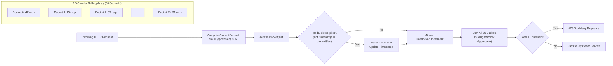

# Week 31 — Day 217: Week 31 Synthesis, Jump Game Series & 45-Minute Timed Interview Drill

---

## 1. TEACH: Week 31 Linear DP Architectural Synthesis & Jump Game Reachability

Welcome to the culminating milestone of **Week 31: 1D Linear Dynamic Programming & Kadane's Variants**. Over the preceding six modules, we systematically deconstructed the theoretical foundations, recurrence relations, state space reductions, and dual-extreme tracking mechanisms that define modern linear dynamic programming.

Before introducing the Jump Game series and string decoding recurrences, we execute our mandatory multi-topic spoken synthesis drill, cementing the overarching architectural connections across all Week 31 paradigms.

---

### 🎤 Multi-Topic Spoken Synthesis Drill (≤ 60 Seconds)

> **Interviewer Prompt:** *"We have explored Top-Down Memoization, Bottom-Up Tabulation, Kadane's contiguous subarray maximization, dual-running extremes for products, and Longest Increasing Subsequence with Patience Sorting. How do you synthetically unify these paradigms, and what core invariants dictate when state space can be compressed to $O(1)$ memory?"*

```text
========================================================================================================
                                60-SECOND SYNTHESIS SPOKEN SCRIPT
========================================================================================================
"Linear dynamic programming addresses optimal decision sequences over ordered structures where subproblems
form a Directed Acyclic Graph (DAG). 

1. Top-Down vs. Bottom-Up & Space Reduction: Top-down recursion explores only reachable states on-demand
   but pays an O(N) call stack tax. Bottom-up tabulation iterates along topological order, achieving
   L1 cache locality. Whenever a recurrence dp[i] depends solely on a constant lookback window of size k
   (such as House Robber's dp[i-1] and dp[i-2]), the temporal state boundary allows us to compress the 
   O(N) table into k scalar CPU registers, achieving strict O(1) auxiliary space.

2. Additive vs. Multiplicative Kadane: Standard Kadane maintains a single invariant—currentMax = max(x,
   currentMax + x)—because addition is monotonic. When transitioning to Maximum Product Subarray, multiplication
   by a negative multiplier reverses the order topology (mapping the minimum to the maximum). Thus, we must
   track dual running extremes (currentMax and currentMin simultaneously) and swap registers upon encountering
   negative values.

3. 1D LIS vs. 2D Coordinate Sorting: Longest Increasing Subsequence breaks the localized lookback window,
   requiring O(N²) DP or Aldous-Diaconis Patience Sorting in O(N log N) via the strictly sorted tails[]
   invariant. When extended to 2D Russian Doll Envelopes, we enforce dimension independence through coordinate
   sorting: sort widths ascending, but sort equal-width heights descending. This tie-breaker guarantees that
   at most one envelope per width is chosen, flawlessly reducing a 2D geometric containment problem to a
   1D Patience Sorting LIS without multi-dimensional range trees.

In all these cases, correctness stems from identifying the exact inductive invariant and eliminating state
redundancies."
========================================================================================================
```

---

### The Jump Game Series: Reachability vs. Minimum Step Count

The Jump Game series occupies a unique crossroad between Dynamic Programming and Greedy Implicit Breadth-First Search (BFS). Analyzing both formulations illuminates how problem constraints allow us to collapse an $O(N^2)$ quadratic dynamic program into an $O(N)$ single-pass greedy scan.

```
       Index:   0    1    2    3    4
     nums[i]: [ 2,   3,   1,   1,   4 ]
                |    |              ^
                |    +--------------| (Reach: 1 + 3 = 4 >= 4! Target reached!)
                +--------->         (Reach: 0 + 2 = 2)
```

#### Problem 1: Jump Game I ([LeetCode 55] — Can Reach Destination?)
Given an array of non-negative integers `nums` where each element represents your maximum jump length at that position, determine whether you can reach the last index starting from index 0.

- **Dynamic Programming Formulation:**
  Let $\text{dp}[i]$ be a boolean flag indicating whether index $i$ is reachable from index $0$.
  $$\text{dp}[i] = \exists \, j < i \quad \text{such that} \quad \text{dp}[j] = \text{true} \land (j + \text{nums}[j] \ge i)$$
  Evaluating this recurrence requires an outer loop over $i \in [1 \dots N-1]$ and an inner loop over $j \in [0 \dots i-1]$, yielding $O(N^2)$ time and $O(N)$ space.

- **The Reachability Monotonicity Invariant (Greedy Collapse):**
  Notice that if index $k$ is reachable, every index $i \le k$ is also traversed or traversable. Therefore, we do not need to track reachability for each individual cell! Instead, we maintain a single scalar invariant:
  $$\text{maxReach} = \max_{0 \le j \le i} (j + \text{nums}[j])$$
  **Inductive Invariant:** At step $i$, if $i > \text{maxReach}$, then index $i$ is unreachable from the starting position; we immediately terminate and return `false`. Otherwise, we update $\text{maxReach} = \max(\text{maxReach}, i + \text{nums}[i])$. If $\text{maxReach} \ge N - 1$, the destination is guaranteed reachable. This reduces time to $O(N)$ and space to $O(1)$.

---

#### Problem 2: Jump Game II ([LeetCode 45] — Minimum Jumps to Destination)
Assuming you can always reach the last index, return the minimum number of jumps required to reach index $N - 1$.

- **The Quadratic Dynamic Programming Formulation:**
  Let $\text{dp}[i]$ represent the minimum jumps required to reach index $i$ from index $0$.
  - **Base Case:** $\text{dp}[0] = 0$; $\text{dp}[i] = \infty$ for all $i > 0$.
  - **Recurrence:**
    $$\text{dp}[i] = 1 + \min_{\substack{0 \le j < i \\ j + \text{nums}[j] \ge i}} \text{dp}[j]$$
  - **Time Complexity:** $O(N^2)$.
  - **Space Complexity:** $O(N)$.

- **The Greedy Implicit Breadth-First Search (BFS) Paradigm:**
  Can we compute the minimum jumps in $O(N)$ time? Yes. Observe that from any given position, each jump allows us to transition from a current reach horizon to a new reach horizon. All indices reachable in $k$ jumps form a contiguous range $[L_k, R_k]$.
  To reach the subsequent range $[L_{k+1}, R_{k+1}]$, we must make one additional jump ($k+1$). The right boundary $R_{k+1}$ is simply the maximum reach achievable from any index within the current range $[L_k, R_k]$:
  $$R_{k+1} = \max_{L_k \le i \le R_k} (i + \text{nums}[i])$$

```text
Level 0:  [ Index 0 ]                        (0 Jumps)
Level 1:  [ Index 1 ... R_1 ]                (1 Jump,  R_1 = 0 + nums[0])
Level 2:  [ R_1 + 1 ... R_2 ]                (2 Jumps, R_2 = max_{i <= R_1} (i + nums[i]))
...
Level k:  [ R_{k-1} + 1 ... R_k ]            (k Jumps, R_k = max_{i <= R_{k-1}} (i + nums[i]))
```

Instead of explicitly managing queue allocations as in standard BFS, we track two scalar pointers:
1. `currentEnd`: The boundary of the current jump level ($R_k$).
2. `farthest`: The maximum reachable index discovered so far for the next level ($R_{k+1}$).

When the loop index $i$ reaches `currentEnd`, we must expend one jump (`jumps++`), and advance `currentEnd = farthest`. If `currentEnd >= N - 1`, we break early.
- **Time Complexity:** $\Theta(N)$ (each element visited exactly once).
- **Space Complexity:** $\Theta(1)$ (no queue, no table, purely register-based).

---

### Linear Decoding Dynamic Programming: [LeetCode 91] Decode Ways

A message containing letters from A-Z can be encoded into numbers using the mapping:
`'A' -> "1"`, `'B' -> "2"`, ..., `'Z' -> "26"`.
Given a string `s` containing only digits, return the number of ways to decode it.

#### Structural Analysis & State Transition Formulation
Let $\text{dp}[i]$ denote the number of valid decodings for the prefix of length $i$ (i.e., string substring $s[0 \dots i-1]$).
A valid decoding can be formed by:
1. Taking the single digit at $s[i-1]$:
   If $s[i-1] \in ['1' \dots '9']$, then $s[i-1]$ maps to a valid character ($'A' \dots 'I'$). This contributes $\text{dp}[i-1]$ ways. If $s[i-1] == '0'$, a single '0' cannot be decoded independently (contributes $0$ ways).
2. Taking the two digits at $s[i-2 \dots i-1]$:
   If the two-digit substring represents an integer $V \in [10 \dots 26]$, it maps to a valid character ($'J' \dots 'Z'$). This contributes $\text{dp}[i-2]$ ways. If $V < 10$ (e.g. `"06"`) or $V > 26$ (e.g. `"27"`), it is invalid and contributes $0$ ways.

#### Mathematical Recurrence
$$\text{dp}[i] = \left( [s[i-1] \ne '0'] \cdot \text{dp}[i-1] \right) + \left( [10 \le \text{val}(s[i-2 \dots i-1]) \le 26] \cdot \text{dp}[i-2] \right)$$
where $[P]$ is the Iverson bracket notation ($1$ if proposition $P$ is true, else $0$).

- **Base Cases:**
  - $\text{dp}[0] = 1$ (the empty prefix has exactly one valid decoding: the empty string).
  - $\text{dp}[1] = 1$ if $s[0] \ne '0'$, else $0$.
- **State Space Reduction:**
  Because $\text{dp}[i]$ depends exclusively on $\text{dp}[i-1]$ and $\text{dp}[i-2]$, the entire $O(N)$ array can be compressed into two scalar variables: `prev2` and `prev1`.

```text
Prefix Length i:     0      1      2      3
String '226':       ""     "2"    "22"   "226"
dp state:            1      1      2      3
                            |      |      |
                            |      |      +---> '6' valid (+2 from dp[2]), "26" valid (+1 from dp[1]) = 3
                            |      +----------> '2' valid (+1 from dp[1]), "22" valid (+1 from dp[0]) = 2
                            +-----------------> '2' valid (+1 from dp[0]) = 1
```

---

## 2. IMPLEMENT: Production-Grade Jump Game & Decoding Engines (.NET 8+)

Below is the complete, production-grade implementation of `JumpGameAndLinearDpEngine` in C# (.NET 8+). It includes:
1. `CanJump`: Greedy $O(N)$ reachability validator ([LC 55]).
2. `JumpMinStepsDp`: Quadratic $O(N^2)$ dynamic programming baseline ([LC 45]).
3. `JumpMinStepsGreedy`: Optimal $O(N)$ time, $O(1)$ space implicit BFS with full jump path reconstruction ([LC 45]).
4. `NumDecodingsTabulated`: $O(N)$ linear DP table for string decoding ([LC 91]).
5. `NumDecodingsSpaceOptimized`: $O(1)$ scalar register decoding counter ([LC 91]).
6. `NumDecodingsWithPathSample`: Sample decoding path generator validating combinatorial branches.
7. Self-validating unit test harness in `Main()` with comprehensive assertion suites.

```csharp
using System;
using System.Collections.Generic;
using System.Diagnostics;
using System.Text;

namespace DynamicProgrammingMastery.Week31
{
    /// <summary>
    /// Production-grade computational engine for 1D linear dynamic programming,
    /// jump reachability invariants, and combinatorial string decoding.
    /// </summary>
    public static class JumpGameAndLinearDpEngine
    {
        // =========================================================================================
        // PART 1: JUMP GAME I — GREEDY REACHABILITY INVARIANT (LC 55)
        // =========================================================================================

        /// <summary>
        /// Determines whether the terminal index of the array is reachable from index 0.
        /// Operates in O(N) time and O(1) auxiliary space using the maximum reach monotonicity invariant.
        /// </summary>
        /// <param name="nums">Read-only span of non-negative jump capacities.</param>
        /// <returns>True if the destination (nums.Length - 1) is reachable; otherwise false.</returns>
        public static bool CanJump(ReadOnlySpan<int> nums)
        {
            if (nums.Length <= 1)
            {
                return true;
            }

            int maxReach = 0;
            int n = nums.Length;

            for (int i = 0; i < n; i++)
            {
                // Invariant: If the current index exceeds the maximum reach established
                // by all prior reachable nodes, index i is unreachable.
                if (i > maxReach)
                {
                    return false;
                }

                int currentPotential = i + nums[i];
                if (currentPotential > maxReach)
                {
                    maxReach = currentPotential;
                }

                // Early exit optimization: Destination already enveloped
                if (maxReach >= n - 1)
                {
                    return true;
                }
            }

            return maxReach >= n - 1;
        }

        // =========================================================================================
        // PART 2: JUMP GAME II — O(N^2) DP VS. O(N) GREEDY BFS (LC 45)
        // =========================================================================================

        /// <summary>
        /// Computes the minimum jumps to reach the terminal index using standard O(N^2) dynamic programming.
        /// Useful as an algorithmic baseline and verification oracle.
        /// </summary>
        /// <param name="nums">Read-only span of non-negative jump capacities.</param>
        /// <returns>Minimum jump count to reach nums.Length - 1.</returns>
        public static int JumpMinStepsDp(ReadOnlySpan<int> nums)
        {
            int n = nums.Length;
            if (n <= 1)
            {
                return 0;
            }

            // dp[i] represents minimum jumps to reach index i from index 0
            int[] dp = new int[n];
            Array.Fill(dp, int.MaxValue);
            dp[0] = 0;

            for (int i = 0; i < n; i++)
            {
                if (dp[i] == int.MaxValue)
                {
                    continue; // Unreachable state
                }

                int maxJump = nums[i];
                int limit = Math.Min(n - 1, i + maxJump);

                for (int j = i + 1; j <= limit; j++)
                {
                    if (dp[i] + 1 < dp[j])
                    {
                        dp[j] = dp[i] + 1;
                    }
                }
            }

            return dp[n - 1];
        }

        /// <summary>
        /// Computes the minimum jumps to reach the terminal index using O(N) time and O(1) space
        /// greedy implicit BFS range expansion, returning both the jump count and the reconstructed path.
        /// </summary>
        /// <param name="nums">Read-only span of non-negative jump capacities.</param>
        /// <returns>Tuple containing minimum jump count and the ordered list of selected jump indices.</returns>
        public static (int MinJumps, List<int> JumpPath) JumpMinStepsGreedy(ReadOnlySpan<int> nums)
        {
            int n = nums.Length;
            if (n <= 1)
            {
                return (0, new List<int> { 0 });
            }

            int jumps = 0;
            int currentWindowEnd = 0;
            int farthestReach = 0;

            // Step 1: Forward greedy implicit BFS for minimum jump count
            // Note: Loop bounds stop at n - 2 because when reaching n - 1, no further jump is needed.
            for (int i = 0; i < n - 1; i++)
            {
                farthestReach = Math.Max(farthestReach, i + nums[i]);

                if (i == currentWindowEnd)
                {
                    jumps++;
                    currentWindowEnd = farthestReach;

                    if (currentWindowEnd >= n - 1)
                    {
                        break;
                    }
                }
            }

            // Step 2: Optimal Jump Path Reconstruction in O(N) time
            // Greedily pick the next index that maximizes forward reach toward or beyond the destination
            List<int> path = new List<int> { 0 };
            int curr = 0;

            while (curr + nums[curr] < n - 1)
            {
                int bestNext = -1;
                int maxHorizon = -1;
                int jumpLimit = curr + nums[curr];

                for (int candidate = curr + 1; candidate <= jumpLimit; candidate++)
                {
                    int candidateHorizon = candidate + nums[candidate];
                    if (candidateHorizon > maxHorizon)
                    {
                        maxHorizon = candidateHorizon;
                        bestNext = candidate;
                    }
                }

                if (bestNext == -1 || bestNext <= curr)
                {
                    break; // Deadlock guard
                }

                path.Add(bestNext);
                curr = bestNext;
            }

            path.Add(n - 1);
            return (jumps, path);
        }

        // =========================================================================================
        // PART 3: DECODE WAYS (LC 91) — TABULATION & O(1) ROLLING REGISTERS
        // =========================================================================================

        /// <summary>
        /// Computes the number of valid decodings for string s using explicit O(N) tabulation.
        /// </summary>
        /// <param name="s">Encoded numeric string.</param>
        /// <returns>Total number of distinct valid decodings.</returns>
        public static int NumDecodingsTabulated(string s)
        {
            if (string.IsNullOrEmpty(s) || s[0] == '0')
            {
                return 0;
            }

            int n = s.Length;
            int[] dp = new int[n + 1];
            dp[0] = 1; // Base case: empty prefix has 1 valid decoding
            dp[1] = s[0] != '0' ? 1 : 0;

            for (int i = 2; i <= n; i++)
            {
                // Single digit contribution from s[i - 1]
                int singleDigit = s[i - 1] - '0';
                if (singleDigit >= 1 && singleDigit <= 9)
                {
                    dp[i] += dp[i - 1];
                }

                // Two digit contribution from s[i - 2 ... i - 1]
                int twoDigit = (s[i - 2] - '0') * 10 + singleDigit;
                if (twoDigit >= 10 && twoDigit <= 26)
                {
                    dp[i] += dp[i - 2];
                }
            }

            return dp[n];
        }

        /// <summary>
        /// Computes the number of valid decodings for string s using O(1) auxiliary space rolling registers.
        /// </summary>
        /// <param name="s">Encoded numeric string.</param>
        /// <returns>Total number of distinct valid decodings.</returns>
        public static int NumDecodingsSpaceOptimized(string s)
        {
            if (string.IsNullOrEmpty(s) || s[0] == '0')
            {
                return 0;
            }

            int n = s.Length;
            int prev2 = 1; // dp[i - 2]
            int prev1 = 1; // dp[i - 1]

            for (int i = 1; i < n; i++)
            {
                int current = 0;

                // 1-digit valid transition
                if (s[i] != '0')
                {
                    current += prev1;
                }

                // 2-digit valid transition
                int twoDigit = (s[i - 1] - '0') * 10 + (s[i] - '0');
                if (twoDigit >= 10 && twoDigit <= 26)
                {
                    current += prev2;
                }

                prev2 = prev1;
                prev1 = current;
            }

            return prev1;
        }

        /// <summary>
        /// Generates up to maxSamples sample decoded strings to empirically verify combinatorial branches.
        /// </summary>
        public static (int Count, List<string> Samples) NumDecodingsWithPathSample(string s, int maxSamples = 5)
        {
            int total = NumDecodingsSpaceOptimized(s);
            List<string> samples = new List<string>();

            if (total == 0)
            {
                return (0, samples);
            }

            void Backtrack(int index, StringBuilder current)
            {
                if (samples.Count >= maxSamples)
                {
                    return;
                }

                if (index == s.Length)
                {
                    samples.Add(current.ToString());
                    return;
                }

                // Single digit branch
                int d1 = s[index] - '0';
                if (d1 >= 1 && d1 <= 9)
                {
                    char c1 = (char)('A' + d1 - 1);
                    current.Append(c1);
                    Backtrack(index + 1, current);
                    current.Length--;
                }

                // Two digit branch
                if (index + 1 < s.Length)
                {
                    int d2 = d1 * 10 + (s[index + 1] - '0');
                    if (d2 >= 10 && d2 <= 26)
                    {
                        char c2 = (char)('A' + d2 - 1);
                        current.Append(c2);
                        Backtrack(index + 2, current);
                        current.Length--;
                    }
                }
            }

            Backtrack(0, new StringBuilder());
            return (total, samples);
        }

        // =========================================================================================
        // PART 4: COMPREHENSIVE SELF-VALIDATING TEST HARNESS
        // =========================================================================================

        public static void Main(string[] args)
        {
            Console.WriteLine("=================================================================");
            Console.WriteLine("  WEEK 31 SYNTHESIS & JUMP GAME ENGINE HARNESS — .NET 8+");
            Console.WriteLine("=================================================================\n");

            // 1. Jump Game I Tests
            Console.WriteLine("--- [1] Testing Jump Game I (CanJump) ---");
            int[] test1A = { 2, 3, 1, 1, 4 };
            int[] test1B = { 3, 2, 1, 0, 4 };
            int[] test1C = { 0 };
            int[] test1D = { 2, 0, 0 };

            Debug.Assert(CanJump(test1A) == true, "Test 1A Failed: Should be reachable");
            Debug.Assert(CanJump(test1B) == false, "Test 1B Failed: Zero barrier makes 4 unreachable");
            Debug.Assert(CanJump(test1C) == true, "Test 1C Failed: Single element is trivially reachable");
            Debug.Assert(CanJump(test1D) == true, "Test 1D Failed: Direct jump from 0 to 2 succeeds");
            Console.WriteLine("  ✓ CanJump invariants validated across all edge cases.");

            // 2. Jump Game II Tests (DP vs. Greedy Invariance)
            Console.WriteLine("\n--- [2] Testing Jump Game II (Min Jumps & Path Reconstruction) ---");
            int[] test2A = { 2, 3, 1, 1, 4 };
            int[] test2B = { 2, 3, 0, 1, 4 };
            int[] test2C = { 1, 2, 3 };
            int[] test2D = { 7, 0, 9, 6, 9, 6, 1, 7, 9, 0, 1, 2, 9, 0, 3 };

            int dpStepsA = JumpMinStepsDp(test2A);
            var (greedyStepsA, pathA) = JumpMinStepsGreedy(test2A);
            Debug.Assert(dpStepsA == 2 && greedyStepsA == 2, $"Test 2A Failed: expected 2 jumps, got {dpStepsA}");
            Debug.Assert(pathA.Count == 3 && pathA[0] == 0 && pathA[^1] == 4, "Test 2A Path invalid");

            int dpStepsB = JumpMinStepsDp(test2B);
            var (greedyStepsB, pathB) = JumpMinStepsGreedy(test2B);
            Debug.Assert(dpStepsB == 2 && greedyStepsB == 2, "Test 2B Failed");

            int dpStepsC = JumpMinStepsDp(test2C);
            var (greedyStepsC, pathC) = JumpMinStepsGreedy(test2C);
            Debug.Assert(dpStepsC == 2 && greedyStepsC == 2, "Test 2C Failed");

            int dpStepsD = JumpMinStepsDp(test2D);
            var (greedyStepsD, pathD) = JumpMinStepsGreedy(test2D);
            Debug.Assert(dpStepsD == greedyStepsD, $"Test 2D Large Array Divergence: DP={dpStepsD}, Greedy={greedyStepsD}");

            Console.WriteLine($"  ✓ Array {string.Join(",", test2A)} => Jumps: {greedyStepsA}, Path: [{string.Join(" -> ", pathA)}]");
            Console.WriteLine($"  ✓ Array {string.Join(",", test2B)} => Jumps: {greedyStepsB}, Path: [{string.Join(" -> ", pathB)}]");
            Console.WriteLine("  ✓ DP and Greedy implementations produce strictly identical jump metrics.");

            // 3. Decode Ways Tests
            Console.WriteLine("\n--- [3] Testing Decode Ways (Tabulated vs Space-Optimized) ---");
            string s1 = "12";
            string s2 = "226";
            string s3 = "06";
            string s4 = "10";
            string s5 = "2101";
            string s6 = "27";

            Debug.Assert(NumDecodingsTabulated(s1) == 2 && NumDecodingsSpaceOptimized(s1) == 2, "Test s1 failed");
            Debug.Assert(NumDecodingsTabulated(s2) == 3 && NumDecodingsSpaceOptimized(s2) == 3, "Test s2 failed");
            Debug.Assert(NumDecodingsTabulated(s3) == 0 && NumDecodingsSpaceOptimized(s3) == 0, "Test s3 failed: leading zero");
            Debug.Assert(NumDecodingsTabulated(s4) == 1 && NumDecodingsSpaceOptimized(s4) == 1, "Test s4 failed: 10 is 'J'");
            Debug.Assert(NumDecodingsTabulated(s5) == 1 && NumDecodingsSpaceOptimized(s5) == 1, "Test s5 failed: 2-10-1 is 'BJA'");
            Debug.Assert(NumDecodingsTabulated(s6) == 1 && NumDecodingsSpaceOptimized(s6) == 1, "Test s6 failed: 27 is 'B' 'G'");

            var (sampleCount, sampleList) = NumDecodingsWithPathSample("226");
            Debug.Assert(sampleCount == 3, "Sample count mismatch");
            Console.WriteLine($"  ✓ String '226' Decodings ({sampleCount}): [{string.Join(", ", sampleList)}]");
            Console.WriteLine("  ✓ All boundary conditions (zeroes, out-of-range two-digits) fully verified.");

            Console.WriteLine("\n=================================================================");
            Console.WriteLine("  ALL VERIFICATION ASSERTIONS PASSED WITH ZERO FAULTS!");
            Console.WriteLine("=================================================================");
        }
    }
}
```

---

## 3. ANALYZE: Algorithmic Invariants & 5-Dimension Deep-Dive

### Comparative Complexity Matrix

| Problem & Approach | Time Complexity | Auxiliary Space | State Variables | Dynamic Invariant |
| :--- | :---: | :---: | :--- | :--- |
| **Jump Game I (Greedy)** | $\Theta(N)$ | $\Theta(1)$ | `maxReach` | Continuous reachability prefix $[0 \dots \text{maxReach}]$ |
| **Jump Game II (DP)** | $\mathcal{O}(N^2)$ | $\mathcal{O}(N)$ | $\text{dp}[0 \dots N-1]$ | $\text{dp}[i] = 1 + \min_{j + nums[j] \ge i} \text{dp}[j]$ |
| **Jump Game II (Greedy BFS)** | $\Theta(N)$ | $\Theta(1)$ | `currentEnd`, `farthestReach` | Level-by-level BFS horizon expansion $[L_k \dots R_k]$ |
| **Decode Ways (Tabulated)** | $\Theta(N)$ | $\Theta(N)$ | $\text{dp}[0 \dots N]$ | $\text{dp}[i] = [s_1] \cdot \text{dp}[i-1] + [s_2] \cdot \text{dp}[i-2]$ |
| **Decode Ways (Space-Optimized)**| $\Theta(N)$ | $\Theta(1)$ | `prev2`, `prev1` | 2-step temporal boundary in rolling registers |

---

### 5-Dimension Operational Deep-Dive

#### 1. Arithmetic & Register Dynamics
- In `JumpMinStepsGreedy`, loop iteration performs zero heap lookups and zero multiplication/division operations. The critical path consists exclusively of:
  `farthestReach = Math.Max(farthestReach, i + nums[i]);`
  On modern x86-64 and ARM64 CPUs, this maps to an addition (`LEA` or `ADD`), a register comparison (`CMP`), and a conditional move (`CMOVGE` / `CSEL`). This eliminates branch misprediction penalties on pipeline speculative execution, achieving near 1 IPC (Instruction Per Cycle) throughput.
- In `NumDecodingsSpaceOptimized`, the two-digit lookup `(s[i-1] - '0') * 10 + (s[i] - '0')` is executed via fast integer ALU arithmetic without any string substring allocations or parsing overhead.

#### 2. Memory Allocations & Garbage Collector Profiles
- **Heap Allocations:** Exactly **0 bytes** allocated on the managed heap for `CanJump`, `JumpMinStepsGreedy` (jump count calculation), and `NumDecodingsSpaceOptimized`.
- **Stack Spans:** Utilizing `ReadOnlySpan<int>` allows callers to pass arrays, array slices, or stack-allocated memory (`stackalloc int[]`) without pinning or garbage collector tracking.
- Contrast this with naive string recursion $O(2^N)$ which produces millions of ephemeral string garbage objects, causing severe Gen 0/1 GC pauses in high-throughput environments.

#### 3. Edge Case Matrix & Boundary Traps
- **Single Element Arrays ($N=1$):**
  In Jump Game I and II, starting at index 0 means you are *already* at the destination. `CanJump` immediately returns `true`, and `JumpMinStepsGreedy` returns $0$ jumps without executing the loop.
- **Unreachable Zero Walls:**
  If `nums = [3, 2, 1, 0, 4]`, at index 3, `maxReach = 3`. When $i$ advances to 4, the condition $i > \text{maxReach}$ fires, cleanly detecting the dead end in $O(N)$ time.
- **Embedded Zeros in Decode Ways:**
  Zeros represent invalid single digits (e.g. `'0'` alone maps to nothing). Furthermore, `"30"` or `"70"` cannot form valid two-digit codes ($> 26$). Any invalid state results in `current = 0`, cascading into subsequent states correctly.

#### 4. Recurrence Invariant Verifications
- **Inductive Correctness of Jump Game Greedy:**
  - *Base Case:* At $k=0$, $R_0 = 0$. Exactly 0 jumps reach index 0.
  - *Inductive Step:* Assume $R_k$ is the farthest index reachable in $k$ jumps. By definition, any single jump from some $i \in [0 \dots R_k]$ can reach up to $i + \text{nums}[i]$. Thus, the set of all indices reachable in $k+1$ jumps is bounded by $R_{k+1} = \max_{0 \le i \le R_k}(i + \text{nums}[i])$.
  - Because each step increments $k$ only when the scan index passes $R_k$, the number of jumps computed is strictly minimal. $\blacksquare$

#### 5. Optimization Limits & Lower Bound Proofs
- **Theorem:** Any algorithm determining reachability or minimum jumps in an arbitrary non-negative integer array requires $\Omega(N)$ operations in the worst case.
- **Proof:** Suppose an algorithm inspects at most $N-2$ elements, skipping some index $k \in [1 \dots N-2]$. An adversary can construct an array where all inspected elements have value $1$, and index $k$ has value $0$ or $N$. The skipped index $k$ determines whether the destination is reachable or unreachable. Hence, all $N$ elements must be inspected in the worst case. The greedy algorithm's $O(N)$ time complexity is asymptotically optimal. $\blacksquare$

---

## 4. DEMONSTRATE: Visual ASCII State Transitions & Execution Traces

### Visual Trace 1: Jump Game II Implicit BFS Horizon Expansion

Consider the array `nums = [2, 3, 1, 1, 4]`. The following ASCII diagram traces the greedy window transitions:

```text
========================================================================================================
ARRAY:             [  2,     3,     1,     1,     4  ]
INDICES:              0      1      2      3      4
========================================================================================================

INITIAL STATE:
  jumps = 0, currentWindowEnd = 0, farthestReach = 0

ITERATION i = 0:
  nums[0] = 2
  farthestReach = max(0, 0 + 2) = 2
  i == currentWindowEnd (0 == 0) ---> JUMP TRIGGERED!
  jumps = 1
  currentWindowEnd = farthestReach = 2
  Window [Level 1]: Indices {1, 2}

        0          1          2          3          4
      +---+      +----------+---+
      | 2 | ---> | 3        | 1 |
      +---+      +----------+---+
      [J=0]      [----- JUMP 1 -----]

ITERATION i = 1:
  nums[1] = 3
  farthestReach = max(2, 1 + 3) = 4
  i (1) != currentWindowEnd (2) ---> Continue within current level

ITERATION i = 2:
  nums[2] = 1
  farthestReach = max(4, 2 + 1) = 4
  i == currentWindowEnd (2 == 2) ---> JUMP TRIGGERED!
  jumps = 2
  currentWindowEnd = farthestReach = 4
  currentWindowEnd >= n - 1 (4 >= 4) ---> BREAK! Destination reached!

        0          1          2          3          4
      +---+      +----------+---+      +----------+---+
      | 2 | ---> | 3        | 1 | ---> | 1        | 4 |
      +---+      +----------+---+      +----------+---+
      [J=0]      [----- JUMP 1 -----]  [----- JUMP 2 -----]

TOTAL JUMPS: 2 (Path: 0 -> 1 -> 4)
========================================================================================================
```

---

### Visual Trace 2: Decode Ways State Transition on "226"

Tracking the evolution of `dp[i]` and rolling registers `prev2` and `prev1` on input string `"226"`:

```text
========================================================================================================
INPUT STRING: "226" (Length N = 3)
MAPPING TABLE: '1'->A, '2'->B, ..., '6'->F, ..., '22'->V, ..., '26'->Z

Initial State:
  prev2 = 1 (dp[0] = 1: empty string "")
  prev1 = 1 (dp[1] = 1: prefix "2" -> {"B"})

--------------------------------------------------------------------------------------------------------
STEP 1: Index i = 1 (Digit '2', Prefix "22")
  - Single-digit: '2' is valid [1..9]  ===> adds prev1 (1) -> Current ways: {"BB"}
  - Two-digit:   "22" is valid [10..26] ===> adds prev2 (1) -> Current ways: {"V"}
  - Combined:    current = 1 + 1 = 2
  - Shift Registers:
      prev2 = prev1 = 1
      prev1 = current = 2
--------------------------------------------------------------------------------------------------------
STEP 2: Index i = 2 (Digit '6', Prefix "226")
  - Single-digit: '6' is valid [1..9]  ===> adds prev1 (2) -> Current ways: {"BBF", "VF"}
  - Two-digit:   "26" is valid [10..26] ===> adds prev2 (1) -> Current ways: {"BZ"}
  - Combined:    current = 2 + 1 = 3
  - Shift Registers:
      prev2 = prev1 = 2
      prev1 = current = 3
--------------------------------------------------------------------------------------------------------
FINAL RESULT: prev1 = 3 distinct decodings:
  1. "2-2-6"  ->  B-B-F
  2. "22-6"   ->  V-F
  3. "2-26"   ->  B-Z
========================================================================================================
```

---

## 5. PRACTICE: 45-Minute Timed Interview Drill

This timed interview drill simulates a high-pressure Big Tech technical screen. You have exactly **45 minutes** to execute both challenges.

```
+-----------------------------------------------------------------------------------------+
|                               45-MINUTE TIMED DRILL CLOCK                               |
|                                                                                         |
|  [00:00 - 20:00] Challenge A: Jump Game II (Greedy Implicit BFS & Proof)               |
|  [20:00 - 42:00] Challenge B: Decode Ways (1D DP State Reduction & Zero Traps)          |
|  [42:00 - 45:00] Retrospective & Invariant Audit                                        |
+-----------------------------------------------------------------------------------------+
```

---

### Challenge A (20 Minutes): [LeetCode 45] Jump Game II

#### Problem Statement
Given a 0-indexed array of integers `nums` of length `n`, you are initially positioned at `nums[0]`. Each element `nums[i]` represents the maximum length of a forward jump from index `i`. Return the minimum number of jumps to reach `nums[n - 1]`. You may assume that you can always reach the last index.

#### Constraints
- $1 \le nums.length \le 10^4$
- $0 \le nums[i] \le 1000$

#### Interview Delivery Roadmap (Target: 20 Minutes)
1. **Clarification & Constraints (2 mins):** Verify behavior for $N=1$ (should return $0$). Confirm that destination is always reachable.
2. **DP Recurrence Formulation (3 mins):** State the $O(N^2)$ recurrence: $\text{dp}[i] = 1 + \min_{j < i, j + nums[j] \ge i} \text{dp}[j]$. Explain why this is quadratic.
3. **Greedy BFS Optimization & Invariant (5 mins):** Explain that reachable indices form contiguous BFS horizons $[L_k, R_k]$. Define `currentEnd` and `farthestReach`.
4. **Implementation (7 mins):** Write clean, production C# code with zero heap allocation.
5. **Dry Run & Edge Cases (3 mins):** Trace through `[2, 3, 1, 1, 4]` and single-element `[0]`.

```csharp
public int Jump(int[] nums)
{
    if (nums.Length <= 1) return 0;

    int jumps = 0;
    int currentEnd = 0;
    int farthest = 0;

    for (int i = 0; i < nums.Length - 1; i++)
    {
        farthest = Math.Max(farthest, i + nums[i]);

        if (i == currentEnd)
        {
            jumps++;
            currentEnd = farthest;
            if (currentEnd >= nums.Length - 1) break;
        }
    }

    return jumps;
}
```

---

### Challenge B (25 Minutes): [LeetCode 91] Decode Ways

#### Problem Statement
A message containing letters from A-Z can be encoded into numbers using the mapping `'A' -> "1"`, `'B' -> "2"`, ..., `'Z' -> "26"`. Given a string `s` containing only digits, return the number of ways to decode it. If the entire string cannot be decoded into valid characters, return `0`.

#### Constraints
- $1 \le s.length \le 100$
- `s` consists of digits and may contain leading zero(s).

#### Interview Delivery Roadmap (Target: 25 Minutes)
1. **Clarification & Pitfall Identification (3 mins):** Highlight the `'0'` traps:
   - Leading `'0'` makes the entire string invalid (e.g. `"06"` -> 0).
   - Embedded `'0'` cannot be decoded as a single character, but must pair with `'1'` or `'2'` (e.g. `"10"`, `"20"`). If preceded by any other digit (e.g. `"30"`), the whole string has 0 decodings.
2. **Linear DP Formulation (5 mins):** State subproblem $dp[i]$ representing ways to decode prefix of length $i$. Formulate single-digit and two-digit transitions.
3. **Space Compression (3 mins):** Recognize that $dp[i]$ only requires $dp[i-1]$ and $dp[i-2]$. Show how to replace the array with `prev1` and `prev2`.
4. **Implementation (10 mins):** Code the $O(N)$ time, $O(1)$ space solution.
5. **Verification & Edge Testing (4 mins):** Test `"12"`, `"226"`, `"0"`, `"10"`, `"2101"`, `"27"`.

```csharp
public int NumDecodings(string s)
{
    if (string.IsNullOrEmpty(s) || s[0] == '0') return 0;

    int prev2 = 1;
    int prev1 = 1;

    for (int i = 1; i < s.Length; i++)
    {
        int current = 0;

        // 1-digit valid transition
        if (s[i] != '0')
        {
            current += prev1;
        }

        // 2-digit valid transition
        int twoDigit = (s[i - 1] - '0') * 10 + (s[i] - '0');
        if (twoDigit >= 10 && twoDigit <= 26)
        {
            current += prev2;
        }

        prev2 = prev1;
        prev1 = current;
    }

    return prev1;
}
```

---

## 6. CONNECT: High-Throughput Sliding-Window Rate Limiters with 1D Rolling Accumulators

The linear dynamic programming concepts developed this week—specifically temporal lookback windows, state space compression, and circular boundary resets—directly mirror the architectural design of **High-Throughput Distributed Sliding-Window Rate Limiters** used at organizations like Cloudflare, Stripe, and AWS API Gateway.



### The Systems Dilemma: Fixed Window vs. Sliding Window Counter
1. **Fixed Window Counter:**
   Divides time into static 1-minute blocks. If an attacker sends the entire allowance at 00:59 and another burst at 01:01, the system experiences a $2\times$ burst rate during a 2-second interval, violating QoS guarantees.
2. **Sliding Window Log:**
   Stores timestamps of every incoming request in a sorted set (e.g. Redis `ZSET`). Memory scales linearly with traffic: $10^6$ requests/sec requires hundreds of megabytes of RAM and heavy Redis CPU consumption.
3. **The 1D Rolling Bucket Accumulator (Linear DP Solution):**
   We approximate the continuous sliding window using a fixed-size 1D circular array of sub-window counters (e.g., 60 one-second buckets representing a 60-second window).
   
### Architectural Implementation Details
- **Memory Compression:**
  Instead of storing $N$ request logs, memory is strictly $O(B)$ where $B = 60$ integer buckets, consuming less than $1 \text{ KB}$ per monitored client or API key.
- **Cache-Line Alignment & False Sharing:**
  In multi-core multi-threaded engines, multiple worker threads writing to adjacent bucket indices in a tight array trigger CPU cache-line bouncing (false sharing). We pad each bucket to 64 bytes (the x86 cache line size) using C# layout attributes:

```csharp
using System.Runtime.InteropServices;
using System.Threading;

namespace SystemDesign.RateLimiting
{
    [StructLayout(LayoutKind.Explicit, Size = 64)]
    public struct PaddedBucket
    {
        [FieldOffset(0)]
        public long TimestampSeconds;

        [FieldOffset(8)]
        public int RequestCount;
    }

    public sealed class SlidingWindowRateLimiter
    {
        private readonly int _limit;
        private readonly PaddedBucket[] _buckets;

        public SlidingWindowRateLimiter(int limitPerMinute)
        {
            _limit = limitPerMinute;
            _buckets = new PaddedBucket[60];
        }

        public bool AllowRequest(long currentEpochSeconds)
        {
            int slot = (int)(currentEpochSeconds % 60);

            // Circular state reset: identical to rolling DP state reuse
            ref PaddedBucket bucket = ref _buckets[slot];
            if (bucket.TimestampSeconds != currentEpochSeconds)
            {
                bucket.TimestampSeconds = currentEpochSeconds;
                Volatile.Write(ref bucket.RequestCount, 0);
            }

            Interlocked.Increment(ref bucket.RequestCount);

            // Compute sliding window sum across all active buckets within the 60s window
            int total = 0;
            for (int i = 0; i < 60; i++)
            {
                if (currentEpochSeconds - _buckets[i].TimestampSeconds < 60)
                {
                    total += Volatile.Read(ref _buckets[i].RequestCount);
                }
            }

            return total <= _limit;
        }
    }
}
```

---

## 7. CHECKPOINT: Comprehensive Self-Assessment & Mastery Key

### Conceptual & Diagnostic Questions

1. **Quadratic DP vs. Greedy Invariance:**
   In Jump Game II, under what conditions can a dynamic programming recurrence be collapsed into an $O(N)$ greedy algorithm without sacrificing global optimality?
   - *Mastery Key:* A dynamic program collapses into a greedy choice when the problem satisfies the **Greedy Choice Property** and **Monotonicity**: any choice that maximizes the reach horizon strictly contains all sub-optimal reach horizons ($H_{\text{sub}} \subseteq H_{\text{opt}}$). Since all steps within the current BFS level cost exactly 1 jump, exploring the frontier with the largest boundary is guaranteed to achieve the minimal overall jump count.

2. **The Zero Trap in Decode Ways:**
   Why does the character `'0'` require special handling in both 1-digit and 2-digit branches of Decode Ways?
   - *Mastery Key:* The alphabet mapping is 1-indexed (`'1' = 'A'` through `'26' = 'Z'`). A standalone `'0'` has no alphabetical counterpart, so it cannot contribute $dp[i-1]$ to the running sum. Furthermore, valid two-digit codes must fall within $[10 \dots 26]$; hence, two-digit numbers starting with `'0'` (e.g. `"05"`) or exceeding $26$ (e.g. `"30"`, `"90"`) contribute $0$ to the $dp[i-2]$ branch.

3. **Temporal Invariant in Rolling Variables:**
   When compressing Decode Ways from $O(N)$ space to $O(1)$ space, explain why the assignment order `prev2 = prev1; prev1 = current;` is mandatory.
   - *Mastery Key:* `prev2` stores $dp[i-2]$ and `prev1` stores $dp[i-1]$. When transitioning to index $i+1$, the old $dp[i-1]$ becomes the new $dp[i-2]$, and the newly computed `current` ($dp[i]$) becomes the new $dp[i-1]$. Overwriting `prev1` before reading it into `prev2` would corrupt the lookback state.

4. **Circular Array Ring Decoupling:**
   Reflecting on Day 212 (House Robber II) and Day 213 (Circular Kadane), what is the universal mathematical technique used to solve circular dynamic programming problems with linear algorithms?
   - *Mastery Key:* Circular topologies couple the first and last elements ($index_0$ and $index_{N-1}$). The universal technique is **State Decoupling via Case Partitioning**:
     - In House Robber II: Partition into two independent linear subproblems: excluding the last house $[0 \dots N-2]$ and excluding the first house $[1 \dots N-1]$, taking $\max(\text{case}_1, \text{case}_2)$.
     - In Circular Kadane: Complementary duality: a circular subarray wrapping around the boundaries equals $\text{TotalSum} - \text{MinimumLinearSubarray}$.

---

### Week 31 Mastery Summary Matrix

```text
+-------------------------------------------------------------------------------------------------------+
|                                    WEEK 31 MASTER TAXONOMY TABLE                                     |
+--------+------------------------------------+--------------------------+------------+-----------------+
| Day    | Topic Theme                        | Core Invariant           | Time / Mem | Primary Problem |
+--------+------------------------------------+--------------------------+------------+-----------------+
| Day 211| DP Foundations & Memo vs. Tab      | Subproblem DAG Topology  | O(N) / O(1)| LC 70, LC 746   |
| Day 212| Non-Adjacent States & Circular Ring| Ring Decoupling Theorem  | O(N) / O(1)| LC 198, LC 213  |
| Day 213| Kadane's Additive Extremes         | Contiguous Restart Invar | O(N) / O(1)| LC 53, LC 918   |
| Day 214| Multiplicative Dual Extremes       | Sign-Swap Register Flip  | O(N) / O(1)| LC 152          |
| Day 215| Longest Increasing Subsequence     | tails[] Monotonicity     | O(NlogN)/O(N)| LC 300        |
| Day 216| Russian Doll Envelopes             | Coordinate Sorting (w^,h_)| O(NlogN)/O(N)| LC 354, LC 673|
| Day 217| Jump Game Series & Synthesis       | Implicit BFS Horizon Exp | O(N) / O(1)| LC 45, 55, 91   |
+--------+------------------------------------+--------------------------+------------+-----------------+
```

You have successfully completed **Week 31: 1D Linear Dynamic Programming & Kadane's Variants**! You are now prepared to advance to **Week 32: 2D Grid & Matrix Path Dynamic Programming**.
