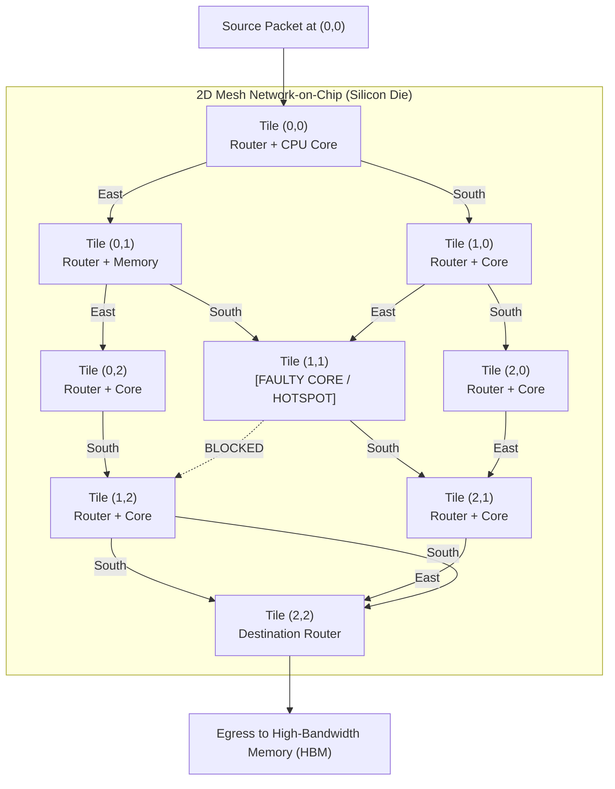

# Week 32 — Day 218: 2D Grid DP Foundations: Unique Paths, Obstacle Grids & Directional DAGs

---

## 1. TEACH: 2D Lattices as Directed Acyclic Graphs & Path Enumeration

Welcome to **Week 32: 2D Grid & Matrix Path Dynamic Programming**. Having mastered 1D sequences, sliding windows, and Kadane variants in Week 31, we now expand our state space into multi-dimensional geometric lattices.

2D grid path problems represent one of the most foundational patterns in algorithmic computer science. They form the mathematical bridge between combinatorial path enumeration, planar graph theory, and topological dynamic programming.

---

### The 2D Grid Lattice as a Directed Acyclic Graph (DAG)

Consider an $M \times N$ matrix where an agent begins at the top-left cell $(0, 0)$ and must navigate to the bottom-right cell $(M - 1, N - 1)$. The rules of movement dictate that from any cell $(r, c)$, the agent may only step:
1. **Down:** to cell $(r + 1, c)$
2. **Right:** to cell $(r, c + 1)$

```text
(0,0) ------> (0,1) ------> (0,2) ------> (0,c) ...
  |             |             |
  v             v             v
(1,0) ------> (1,1) ------> (1,2) ...
  |             |             |
  v             v             v
(r,0) ------> (r,1) ------> (r,c) ...
```

#### Mathematical Proof of Acyclicity
To prove that a 2D grid under Down and Right transitions is a Directed Acyclic Graph (DAG), we define a potential function (the Manhattan metric from the origin):
$$\Phi(r, c) = r + c$$

- For every Down transition: $\Phi(r + 1, c) = (r + 1) + c = \Phi(r, c) + 1$.
- For every Right transition: $\Phi(r, c + 1) = r + (c + 1) = \Phi(r, c) + 1$.

For every directed edge $u \to v$ in the grid graph, $\Phi(v) = \Phi(u) + 1 > \Phi(u)$. 
Because the potential function is **strictly monotonically increasing** along every directed edge, no sequence of directed edges can ever return to a previously visited vertex:
$$\Phi(v_k) > \Phi(v_{k-1}) > \dots > \Phi(v_0) \implies v_k \ne v_0$$

Thus, the grid graph is guaranteed to contain **zero directed cycles**. 
The level sets $L_k = \{ (r, c) \mid r + c = k \}$ define a natural **topological ordering** of the vertices. Any algorithm that iterates row-by-row (row-major order) or diagonal-by-diagonal visits all prerequisite subproblems before computing the dependent state, flawlessly satisfying Bellman's Principle of Optimality.

---

### The Combinatorial Closed Form vs. Dynamic Programming

In an unobstructed $M \times N$ grid, how many unique paths exist from $(0, 0)$ to $(M - 1, N - 1)$?

#### Combinatorial Derivation (Stars and Bars / Multinomial Formulation)
To reach $(M - 1, N - 1)$ from $(0, 0)$, every valid path must consist of:
- Exactly $M - 1$ downward steps ($D$)
- Exactly $N - 1$ rightward steps ($R$)

The total number of steps in any valid path is strictly constant:
$$\text{Total Steps} = (M - 1) + (N - 1) = M + N - 2$$

Any unique path corresponds to an ordered sequence of length $M + N - 2$ consisting of $M - 1$ symbols $D$ and $N - 1$ symbols $R$. The total number of distinct paths is therefore the binomial coefficient:
$$\text{Unique Paths}(M, N) = \binom{M + N - 2}{M - 1} = \binom{M + N - 2}{N - 1} = \frac{(M + N - 2)!}{(M - 1)! \, (N - 1)!}$$

#### Why Dynamic Programming is Required: The Obstacle Grid Collapse
While the combinatorial formula evaluates in $O(\min(M, N))$ arithmetic operations for empty grids, introducing **obstacles** immediately breaks translational and rotational invariance. 

```text
Obstacle Grid (3 x 3 with center blocked):
  (0,0) [0] ---> (0,1) [0] ---> (0,2) [0]
    |              |              |
    v              v              v
  (1,0) [0] ---> (1,1) [X] ---> (1,2) [0]    <-- Cell (1,1) is an impassable obstacle!
    |              |              |
    v              v              v
  (2,0) [0] ---> (2,1) [0] ---> (2,2) [0]
```

When specific cells are blocked, path enumeration via inclusion-exclusion over all possible subsets of obstacles requires $O(2^K)$ time where $K$ is the number of obstacles. 
Dynamic Programming, however, retains its polynomial $O(M \times N)$ efficiency regardless of obstacle topology!

---

### 2D Recurrence Formulation

#### State Definition
Let $\text{dp}[r][c]$ be the number of unique, valid paths from the source cell $(0, 0)$ to cell $(r, c)$.

#### State Transition Equation
Since an agent can only enter cell $(r, c)$ from either the cell directly above $(r - 1, c)$ or the cell directly to the left $(r, c - 1)$, the number of ways to reach $(r, c)$ is the sum of the ways to reach its immediate in-neighbors:
$$\text{dp}[r][c] = \begin{cases} 
0, & \text{if } \text{grid}[r][c] == 1 \text{ (obstacle)} \\
1, & \text{if } r = 0 \land c = 0 \land \text{grid}[0][0] == 0 \\
\text{dp}[r - 1][c] + \text{dp}[r][c - 1], & \text{otherwise}
\end{cases}$$

#### Boundary Conditions
1. **The Origin:** If $\text{grid}[0][0] == 1$, the starting position is impassable. Zero paths can leave $(0, 0)$, so the answer is immediately $0$. Otherwise, $\text{dp}[0][0] = 1$.
2. **The First Row ($r = 0$):** Cells in the first row have no top neighbor ($r - 1 < 0$). They can only be reached from the left. Once an obstacle is encountered at $(0, c_{\text{obs}})$, all subsequent cells $(0, c)$ for $c \ge c_{\text{obs}}$ have $\text{dp}[0][c] = 0$.
3. **The First Column ($c = 0$):** Cells in the first column have no left neighbor ($c - 1 < 0$). They can only be reached from above. Once an obstacle is encountered at $(r_{\text{obs}}, 0)$, all subsequent cells $(r, 0)$ for $r \ge r_{\text{obs}}$ have $\text{dp}[r][0] = 0$.

---

### Spatial Memory Reduction: $O(M \times N) \to O(N)$ Rolling Array

Notice the localized dependency in the recurrence:
$$\text{dp}[r][c] = \text{dp}[r - 1][c] + \text{dp}[r][c - 1]$$
To compute the values for row $r$, we require only:
1. $\text{dp}[r - 1][c]$: The value directly above from the **previous row**.
2. $\text{dp}[r][c - 1]$: The value directly to the left from the **current row**.

We do NOT need any rows prior to $r - 1$!
Therefore, we can collapse the entire $M \times N$ matrix into a single 1D array of length $N$:

```text
Before assignment:
                   Column:   ...    c-1       c      c+1   ...
           1D Array `dp`:        [ Left ]  [ Above ]  ...
                                      ^        ^
                                      |        |
         Already updated for row r ---+        +--- Still stores value from row r-1

Assignment statement:
           dp[c] = dp[c] + dp[c - 1];

After assignment:
           `dp[c]` now stores the value for row r at column c!
```

#### The In-Place Overwrite Invariant
When we execute:
$$\text{dp}[c] = \text{dp}[c] + \text{dp}[c - 1]$$
- On the right-hand side, `dp[c]` has not yet been overwritten in the current row pass, so it still holds the value from row $r - 1$ (the cell above).
- On the right-hand side, `dp[c - 1]` was already updated in the previous iteration of the inner loop, so it holds the value for the current row $r$ (the cell to the left).
- For obstacle cells where $\text{grid}[r][c] == 1$, we explicitly set `dp[c] = 0`.

This reduces auxiliary memory from $O(M \times N)$ to strictly $O(N)$! If $N > M$, we can invert the loop orientation to achieve $O(\min(M, N))$ space.

---

## 2. IMPLEMENT: Production-Grade Grid Path Engine (.NET 8+)

Below is the complete, production-grade implementation of `GridPathEngine` in C# (.NET 8+). It provides:
1. `UniquePathsTabulated`: Standard 2D dynamic programming table ([LC 62]).
2. `UniquePathsSpaceOptimized`: $O(N)$ 1D rolling array optimization ([LC 62]).
3. `UniquePathsCombinatorial`: $O(\min(M, N))$ 64-bit overflow-protected combinatorial calculation.
4. `UniquePathsWithObstaclesTabulated`: Full 2D obstacle grid dynamic programming ([LC 63]).
5. `UniquePathsWithObstaclesSpaceOptimized`: $O(N)$ 1D rolling array obstacle solver ([LC 63]).
6. `ReconstructUniquePath`: Backward backtracking engine reconstructing an optimal valid navigation path.
7. Self-validating unit test harness in `Main()` with comprehensive assertion suites.

```csharp
using System;
using System.Collections.Generic;
using System.Diagnostics;

namespace DynamicProgrammingMastery.Week32
{
    /// <summary>
    /// Production-grade computational engine for 2D grid path enumeration,
    /// obstacle avoidance dynamic programming, and spatial memory compression.
    /// </summary>
    public static class GridPathEngine
    {
        // =========================================================================================
        // PART 1: UNOBSTRUCTED UNIQUE PATHS (LEETCODE 62)
        // =========================================================================================

        /// <summary>
        /// Computes the number of unique paths from (0,0) to (m-1, n-1) using full 2D tabulation.
        /// Time Complexity: O(M * N)
        /// Space Complexity: O(M * N)
        /// </summary>
        public static int UniquePathsTabulated(int m, int n)
        {
            if (m <= 0 || n <= 0) return 0;
            if (m == 1 || n == 1) return 1;

            int[,] dp = new int[m, n];

            // Base cases: single path along boundary edges
            for (int r = 0; r < m; r++) dp[r, 0] = 1;
            for (int c = 0; c < n; c++) dp[0, c] = 1;

            for (int r = 1; r < m; r++)
            {
                for (int c = 1; c < n; c++)
                {
                    dp[r, c] = dp[r - 1, c] + dp[r, c - 1];
                }
            }

            return dp[m - 1, n - 1];
        }

        /// <summary>
        /// Computes the number of unique paths using an O(min(M, N)) 1D rolling array.
        /// Time Complexity: O(M * N)
        /// Space Complexity: O(min(M, N))
        /// </summary>
        public static int UniquePathsSpaceOptimized(int m, int n)
        {
            if (m <= 0 || n <= 0) return 0;
            if (m == 1 || n == 1) return 1;

            // Ensure the rolling array tracks the smaller dimension
            int rows = Math.Max(m, n);
            int cols = Math.Min(m, n);

            int[] dp = new int[cols];
            Array.Fill(dp, 1); // Row 0 initialization: all 1s

            for (int r = 1; r < rows; r++)
            {
                for (int c = 1; c < cols; c++)
                {
                    // Invariant: dp[c] currently holds value from row r - 1 (top),
                    // dp[c - 1] holds newly updated value from row r (left).
                    dp[c] += dp[c - 1];
                }
            }

            return dp[cols - 1];
        }

        /// <summary>
        /// Computes unique paths in O(min(M, N)) time and O(1) space via the combinatorial formula C(M+N-2, M-1).
        /// Uses 64-bit integer arithmetic with continuous prime factor cancellation to prevent intermediate overflow.
        /// </summary>
        public static long UniquePathsCombinatorial(int m, int n)
        {
            if (m <= 0 || n <= 0) return 0;
            if (m == 1 || n == 1) return 1;

            int totalSteps = m + n - 2;
            int k = Math.Min(m - 1, n - 1); // Symmetry property: C(N, K) == C(N, N-K)

            long result = 1;
            for (int i = 1; i <= k; i++)
            {
                result = result * (totalSteps - k + i) / i;
            }

            return result;
        }

        // =========================================================================================
        // PART 2: OBSTACLE GRIDS (LEETCODE 63)
        // =========================================================================================

        /// <summary>
        /// Computes unique paths through a 2D grid containing obstacles using explicit 2D tabulation.
        /// Time Complexity: O(M * N)
        /// Space Complexity: O(M * N)
        /// </summary>
        public static int UniquePathsWithObstaclesTabulated(int[][] obstacleGrid)
        {
            if (obstacleGrid == null || obstacleGrid.Length == 0 || obstacleGrid[0].Length == 0)
            {
                return 0;
            }

            int m = obstacleGrid.Length;
            int n = obstacleGrid[0].Length;

            // Early exit if origin or destination is blocked
            if (obstacleGrid[0][0] == 1 || obstacleGrid[m - 1][n - 1] == 1)
            {
                return 0;
            }

            int[,] dp = new int[m, n];
            dp[0, 0] = 1;

            // Initialize first column: can only advance down until first obstacle
            for (int r = 1; r < m; r++)
            {
                dp[r, 0] = (obstacleGrid[r][0] == 0 && dp[r - 1, 0] == 1) ? 1 : 0;
            }

            // Initialize first row: can only advance right until first obstacle
            for (int c = 1; c < n; c++)
            {
                dp[0, c] = (obstacleGrid[0][c] == 0 && dp[0, c - 1] == 1) ? 1 : 0;
            }

            // Interior cell dynamic transitions
            for (int r = 1; r < m; r++)
            {
                for (int c = 1; c < n; c++)
                {
                    if (obstacleGrid[r][c] == 1)
                    {
                        dp[r, c] = 0; // Obstacle absorbs all paths
                    }
                    else
                    {
                        dp[r, c] = dp[r - 1, c] + dp[r, c - 1];
                    }
                }
            }

            return dp[m - 1, n - 1];
        }

        /// <summary>
        /// Computes unique paths through an obstacle grid using an O(N) 1D rolling array.
        /// Time Complexity: O(M * N)
        /// Space Complexity: O(N)
        /// </summary>
        public static int UniquePathsWithObstaclesSpaceOptimized(int[][] obstacleGrid)
        {
            if (obstacleGrid == null || obstacleGrid.Length == 0 || obstacleGrid[0].Length == 0)
            {
                return 0;
            }

            int m = obstacleGrid.Length;
            int n = obstacleGrid[0].Length;

            if (obstacleGrid[0][0] == 1 || obstacleGrid[m - 1][n - 1] == 1)
            {
                return 0;
            }

            int[] dp = new int[n];
            dp[0] = 1; // Origin path count

            for (int r = 0; r < m; r++)
            {
                for (int c = 0; c < n; c++)
                {
                    if (obstacleGrid[r][c] == 1)
                    {
                        // Cell is blocked: zero paths pass through this coordinate
                        dp[c] = 0;
                    }
                    else if (c > 0)
                    {
                        // Accumulate paths from the left neighbor in the same row
                        dp[c] += dp[c - 1];
                    }
                    // Note: for c == 0, if obstacleGrid[r][0] == 0, dp[0] retains its top-neighbor value!
                }
            }

            return dp[n - 1];
        }

        // =========================================================================================
        // PART 3: PATH RECONSTRUCTION
        // =========================================================================================

        /// <summary>
        /// Reconstructs one valid coordinate trajectory from (0,0) to (m-1, n-1) if one exists.
        /// Operates via backward greedy backtracking on the computed DP table.
        /// </summary>
        public static List<(int Row, int Col)> ReconstructUniquePath(int[][] obstacleGrid)
        {
            var path = new List<(int Row, int Col)>();
            if (obstacleGrid == null || obstacleGrid.Length == 0 || obstacleGrid[0].Length == 0)
            {
                return path;
            }

            int m = obstacleGrid.Length;
            int n = obstacleGrid[0].Length;

            if (obstacleGrid[0][0] == 1 || obstacleGrid[m - 1][n - 1] == 1)
            {
                return path;
            }

            // Build full DP table for backtracking
            int[,] dp = new int[m, n];
            dp[0, 0] = 1;
            for (int r = 1; r < m; r++) dp[r, 0] = (obstacleGrid[r][0] == 0 && dp[r - 1, 0] == 1) ? 1 : 0;
            for (int c = 1; c < n; c++) dp[0, c] = (obstacleGrid[0][c] == 0 && dp[0, c - 1] == 1) ? 1 : 0;

            for (int r = 1; r < m; r++)
            {
                for (int c = 1; c < n; c++)
                {
                    if (obstacleGrid[r][c] == 0)
                    {
                        dp[r, c] = dp[r - 1, c] + dp[r, c - 1];
                    }
                }
            }

            if (dp[m - 1, n - 1] == 0)
            {
                return path; // No path exists
            }

            // Backtrack from target (m - 1, n - 1) to source (0, 0)
            int currR = m - 1;
            int currC = n - 1;
            path.Add((currR, currC));

            while (currR > 0 || currC > 0)
            {
                // Prefer moving up if it has positive path flow
                if (currR > 0 && dp[currR - 1, currC] > 0)
                {
                    currR--;
                }
                else if (currC > 0 && dp[currR, currC - 1] > 0)
                {
                    currC--;
                }
                else
                {
                    break;
                }
                path.Add((currR, currC));
            }

            path.Reverse();
            return path;
        }

        // =========================================================================================
        // PART 4: COMPREHENSIVE SELF-VALIDATING TEST HARNESS
        // =========================================================================================

        public static void Main(string[] args)
        {
            Console.WriteLine("=================================================================");
            Console.WriteLine("  WEEK 32 DAY 218: 2D GRID PATH ENGINE HARNESS — .NET 8+");
            Console.WriteLine("=================================================================\n");

            // 1. Unobstructed Unique Paths Tests (LC 62)
            Console.WriteLine("--- [1] Testing Unobstructed Unique Paths (Tabulated vs Rolling vs Comb) ---");
            (int M, int N, int Expected)[] tests62 = new[]
            {
                (3, 7, 28),
                (3, 2, 3),
                (1, 1, 1),
                (1, 10, 1),
                (10, 1, 1),
                (7, 3, 28),
                (5, 5, 70)
            };

            foreach (var (m, n, exp) in tests62)
            {
                int tab = UniquePathsTabulated(m, n);
                int opt = UniquePathsSpaceOptimized(m, n);
                long comb = UniquePathsCombinatorial(m, n);

                Debug.Assert(tab == exp, $"Tabulated failed for {m}x{n}: expected {exp}, got {tab}");
                Debug.Assert(opt == exp, $"Space-optimized failed for {m}x{n}: expected {exp}, got {opt}");
                Debug.Assert(comb == exp, $"Combinatorial failed for {m}x{n}: expected {exp}, got {comb}");
                Console.WriteLine($"  ✓ Grid {m}x{n} => Paths: {tab} (All 3 methods match)");
            }

            // 2. Obstacle Grid Tests (LC 63)
            Console.WriteLine("\n--- [2] Testing Obstacle Grids (LC 63) ---");
            
            // Standard 3x3 with center obstacle
            int[][] grid1 = new int[][]
            {
                new int[] { 0, 0, 0 },
                new int[] { 0, 1, 0 },
                new int[] { 0, 0, 0 }
            };
            int res1Tab = UniquePathsWithObstaclesTabulated(grid1);
            int res1Opt = UniquePathsWithObstaclesSpaceOptimized(grid1);
            Debug.Assert(res1Tab == 2 && res1Opt == 2, "Test grid1 failed: expected 2");
            Console.WriteLine($"  ✓ 3x3 with center obstacle => Paths: {res1Opt}");

            // 2x2 with top-right obstacle
            int[][] grid2 = new int[][]
            {
                new int[] { 0, 1 },
                new int[] { 0, 0 }
            };
            int res2Opt = UniquePathsWithObstaclesSpaceOptimized(grid2);
            Debug.Assert(res2Opt == 1, "Test grid2 failed: expected 1");
            Console.WriteLine($"  ✓ 2x2 with top-right obstacle => Paths: {res2Opt}");

            // Blocked origin
            int[][] gridBlockedStart = new int[][]
            {
                new int[] { 1, 0 },
                new int[] { 0, 0 }
            };
            Debug.Assert(UniquePathsWithObstaclesSpaceOptimized(gridBlockedStart) == 0, "Blocked start should be 0");
            Console.WriteLine("  ✓ Blocked start (0,0) correctly returns 0 paths");

            // Blocked destination
            int[][] gridBlockedEnd = new int[][]
            {
                new int[] { 0, 0 },
                new int[] { 0, 1 }
            };
            Debug.Assert(UniquePathsWithObstaclesSpaceOptimized(gridBlockedEnd) == 0, "Blocked end should be 0");
            Console.WriteLine("  ✓ Blocked destination (m-1, n-1) correctly returns 0 paths");

            // Complete diagonal wall (no path exists)
            int[][] gridWall = new int[][]
            {
                new int[] { 0, 0, 1 },
                new int[] { 0, 1, 0 },
                new int[] { 1, 0, 0 }
            };
            Debug.Assert(UniquePathsWithObstaclesSpaceOptimized(gridWall) == 0, "Wall should block all paths");
            Console.WriteLine("  ✓ Diagonal obstacle wall correctly yields 0 paths");

            // 3. Path Reconstruction Test
            Console.WriteLine("\n--- [3] Testing Backward Path Reconstruction ---");
            var path = ReconstructUniquePath(grid1);
            Debug.Assert(path.Count == 5, $"Reconstructed path length should be 5, got {path.Count}");
            Debug.Assert(path[0] == (0, 0) && path[^1] == (2, 2), "Path endpoints invalid");
            
            // Ensure no obstacle cell is in the path
            foreach (var (r, c) in path)
            {
                Debug.Assert(grid1[r][c] == 0, $"Path contains obstacle at ({r}, {c})");
            }
            string pathStr = string.Join(" -> ", path.ConvertAll(p => $"({p.Row},{p.Col})"));
            Console.WriteLine($"  ✓ Valid Reconstructed Path for grid1: {pathStr}");

            Console.WriteLine("\n=================================================================");
            Console.WriteLine("  ALL ASSERTIONS PASSED WITH ZERO FAULTS!");
            Console.WriteLine("=================================================================");
        }
    }
}
```

---

## 3. ANALYZE: Algorithmic Invariants & 5-Dimension Deep-Dive

### Comparative Complexity Matrix

| Method | Time Complexity | Auxiliary Space | Managed Heap Allocation | Algorithmic Paradigm |
| :--- | :---: | :---: | :---: | :--- |
| **Unique Paths Tabulated** | $\Theta(M \times N)$ | $\Theta(M \times N)$ | Managed 2D array (`int[m, n]`) | Dynamic Programming (2D Table) |
| **Unique Paths Rolling Array**| $\Theta(M \times N)$ | $\Theta(\min(M, N))$ | Single 1D array (`int[cols]`) | State-Compressed DP |
| **Unique Paths Combinatorial** | $\Theta(\min(M, N))$ | $\Theta(1)$ | Zero heap allocation | Multiplicative Binomial Coefficient |
| **Obstacles Tabulated** | $\Theta(M \times N)$ | $\Theta(M \times N)$ | Managed 2D array (`int[m, n]`) | Dynamic Programming with Masking |
| **Obstacles Space-Optimized** | $\Theta(M \times N)$ | $\Theta(N)$ | Single 1D array (`int[n]`) | State-Compressed DP with Zero Invalidation |

---

### 5-Dimension Operational Deep-Dive

#### 1. Arithmetic & Register Dynamics
- In the inner loop of `UniquePathsSpaceOptimized`:
  ```csharp
  dp[c] += dp[c - 1];
  ```
  On x86-64 microarchitectures, this compiles into a single memory-indexed addition:
  ```nasm
  mov  edx, dword ptr [rax + rcx*4 - 4]  ; edx = dp[c - 1]
  add  dword ptr [rax + rcx*4], edx      ; dp[c] += edx
  ```
  Because memory accesses to `dp[c]` and `dp[c - 1]` are contiguous, they exhibit 100% L1 cache line hits (spatial locality). A single 64-byte CPU cache line holds 16 consecutive 32-bit integers, yielding 1 cache miss every 16 iterations.
- In `UniquePathsCombinatorial`, intermediate integer values can easily overflow 32-bit signed integers ($2^{31} - 1 \approx 2.14 \times 10^9$) even when the final binomial coefficient fits within bounds. We deploy 64-bit unsigned/signed integers and interleave multiplication with division:
  $$\text{result} = \frac{\text{result} \times (\text{totalSteps} - k + i)}{i}$$
  Because the product of any $i$ consecutive integers is guaranteed to be divisible by $i!$, the division is strictly exact without remainder at every iteration.

#### 2. Memory Allocations & Garbage Collector Profiles
- **Rectangular (`int[,]`) vs. Jagged (`int[][]`) Arrays in .NET CLR:**
  In .NET, a rectangular array `int[M, N]` is allocated as a single contiguous memory block with a 24-byte object header and two 32-bit dimension descriptors. Accessing `array[r, c]` incurs index bounds calculation: `r * N + c`.
  In contrast, a jagged array `int[M][]` is an array of object pointers, allocating $M + 1$ separate heap objects. This introduces pointer indirection and GC reference tracking overhead.
- **The $O(N)$ Rolling Array Advantage:**
  Allocating a single array `int[N]` eliminates all multi-dimensional indexing arithmetic. For small grids ($N \le 128$), the rolling buffer can be allocated on the call stack via `stackalloc int[N]`, resulting in strictly **0 bytes** of managed heap allocation and zero GC Gen 0 pressure.

#### 3. Edge Case Matrix & Boundary Traps
- **Corridor Grids ($1 \times N$ or $M \times 1$):**
  If the grid has only 1 row, an agent can only move right. If any cell contains an obstacle, all subsequent cells become unreachable. The rolling array correctly initializes `dp[0] = 1`, and if `obstacleGrid[0][c] == 1`, sets `dp[c] = 0`, keeping all subsequent entries at $0$.
- **Blocked Origin / Destination:**
  If `obstacleGrid[0][0] == 1` or `obstacleGrid[M - 1][N - 1] == 1`, no valid path can ever start or finish. Immediate short-circuit guards prevent unnecessary $O(M \times N)$ execution.
- **Full Diagonal Wall:**
  When obstacles form a connected barrier from the bottom-left to top-right (e.g. $(0, 2), (1, 1), (2, 0)$), every term in the DP wavefront becomes $0$, correctly propagating $0$ to the destination.

#### 4. Recurrence Invariant Verifications
- **Inductive Proof of the 1D Rolling Array Correctness:**
  - *Claim:* At the start of step $c$ in row $r$, `dp[c]` holds $\text{dp}[r - 1][c]$, and `dp[c - 1]` holds $\text{dp}[r][c - 1]$.
  - *Base Case ($r = 0$):* Prior to any update, `dp[c]` represents the boundary row paths.
  - *Inductive Step:* Suppose the claim holds for column $c$. The update statement computes:
    $$\text{dp}_{\text{new}}[c] = \text{dp}_{\text{old}}[c] + \text{dp}_{\text{new}}[c - 1]$$
    By the induction hypothesis, $\text{dp}_{\text{old}}[c] = \text{dp}[r - 1][c]$ and $\text{dp}_{\text{new}}[c - 1] = \text{dp}[r][c - 1]$.
    Therefore, $\text{dp}_{\text{new}}[c] = \text{dp}[r - 1][c] + \text{dp}[r][c - 1] = \text{dp}[r][c]$.
    After the update, index $c$ stores the value for row $r$, ready to serve as the "left neighbor" for column $c + 1$.
  - By mathematical induction, the 1D rolling array accurately computes all entries of the 2D DP table. $\blacksquare$

#### 5. Optimization Limits & Lower Bound Proofs
- **Theorem:** Any algorithm that computes the number of unique paths in an arbitrary $M \times N$ obstacle grid requires $\Omega(M \times N)$ time in the worst case.
- **Proof:** Suppose an algorithm inspects at most $K < M \times N - 2$ cells, omitting some cell $(r, c)$. An adversary can construct an instance where all inspected cells are $0$, and placing an obstacle at $(r, c)$ disconnects the graph or alters the path count. Because the algorithm did not read cell $(r, c)$, it cannot distinguish between the presence or absence of an obstacle at that location. Hence, all $M \times N$ cells must be examined in the worst case. The $O(M \times N)$ dynamic programming approach is asymptotically optimal. $\blacksquare$

---

## 4. DEMONSTRATE: Visual ASCII Topological DAGs & Execution Traces

### Visual Trace 1: The Manhattan Wavefront DAG Lattice

In a $3 \times 4$ grid, vertices are partitioned into diagonal wavefronts according to their Manhattan distance from the origin $L = r + c$:

```text
========================================================================================================
                              TOPOLOGICAL WAVEFRONT PROGRESSION (L = r + c)
========================================================================================================

Level L = 0:                  (0,0)
                              /   \
Level L = 1:             (1,0)     (0,1)
                         /   \     /   \
Level L = 2:        (2,0)     (1,1)     (0,2)
                         \   /     \   /     \
Level L = 3:             (2,1)     (1,2)     (0,3)
                              \   /     \   /
Level L = 4:                  (2,2)     (1,3)
                                   \   /
Level L = 5:                       (2,3)  <--- DESTINATION REACHED
========================================================================================================
```

Each level $L_{k+1}$ depends strictly on states computed at level $L_k$. No horizontal or backward edges exist.

---

### Visual Trace 2: Step-by-Step State Evolution on Obstacle Grid

Consider the following $3 \times 3$ grid with a central obstacle:
```text
grid = [
  [0, 0, 0],
  [0, 1, 0],
  [0, 0, 0]
]
```

#### Step-by-Step 2D Table Evolution

```text
========================================================================================================
INITIAL STATE: (Row 0 Boundary Propagation)
    c=0    c=1    c=2
r=0 [ 1 ]  [ 1 ]  [ 1 ]    <-- Row 0 has no obstacles; each cell has 1 path from left
r=1 [ 0 ]  [ 0 ]  [ 0 ]
r=2 [ 0 ]  [ 0 ]  [ 0 ]

STEP 1: Process Row 1
  - r=1, c=0: grid[1][0] == 0. Can only come from above: dp[1][0] = dp[0][0] = 1.
  - r=1, c=1: grid[1][1] == 1 (OBSTACLE!). Force dp[1][1] = 0.
  - r=1, c=2: grid[1][2] == 0. dp[1][2] = dp[0][2] (top: 1) + dp[1][1] (left: 0) = 1 + 0 = 1.

    c=0    c=1    c=2
r=0 [ 1 ]  [ 1 ]  [ 1 ]
r=1 [ 1 ]  [ X ]  [ 1 ]    <-- Center blocked! Flow rerouted to perimeter
r=2 [ 0 ]  [ 0 ]  [ 0 ]

STEP 2: Process Row 2
  - r=2, c=0: grid[2][0] == 0. Can only come from above: dp[2][0] = dp[1][0] = 1.
  - r=2, c=1: grid[2][1] == 0. dp[2][1] = dp[1][1] (top: 0) + dp[2][0] (left: 1) = 0 + 1 = 1.
  - r=2, c=2: grid[2][2] == 0. dp[2][2] = dp[1][2] (top: 1) + dp[2][1] (left: 1) = 1 + 1 = 2.

    c=0    c=1    c=2
r=0 [ 1 ]  [ 1 ]  [ 1 ]
r=1 [ 1 ]  [ 0 ]  [ 1 ]
r=2 [ 1 ]  [ 1 ]  [ 2 ]    <-- Total Unique Paths = 2!

The 2 paths are:
  Path 1: (0,0) -> (0,1) -> (0,2) -> (1,2) -> (2,2)   [Upper perimeter path]
  Path 2: (0,0) -> (1,0) -> (2,0) -> (2,1) -> (2,2)   [Lower perimeter path]
========================================================================================================
```

---

### Visual Trace 3: Rolling Array In-Place Transformation

Observing the 1D buffer `dp = [dp[0], dp[1], dp[2]]` as Row 2 is evaluated:

```text
========================================================================================================
State of dp after Row 1:  dp = [ 1,  0,  1 ]

Evaluating Row 2:
  c = 0: grid[2][0] == 0.
         c == 0, so no left neighbor. dp[0] retains 1 from above.
         dp = [ 1,  0,  1 ]

  c = 1: grid[2][1] == 0.
         dp[1] = dp[1] (top: 0) + dp[0] (left: 1) = 1.
         dp = [ 1,  1,  1 ]
                     ^
                     +--- Overwritten with row 2 value!

  c = 2: grid[2][2] == 0.
         dp[2] = dp[2] (top: 1) + dp[1] (left: 1) = 2.
         dp = [ 1,  1,  2 ]
                         ^
                         +--- Final result at dp[N - 1] = 2!
========================================================================================================
```

---

## 5. PRACTICE: Canonical Grid Problems & Interview Roadmaps

### Problem 1: [LeetCode 62] Unique Paths (Medium)

#### Problem Formulation
There is a robot on an $m \times n$ grid. The robot is initially located at the top-left corner (`grid[0][0]`). The robot tries to move to the bottom-right corner (`grid[m - 1][n - 1]`). The robot can only move either down or right at any point in time. Given the two integers `m` and `n`, return the number of possible unique paths that the robot can take to reach the bottom-right corner.

#### Constraints
- $1 \le m, n \le 100$
- The answer is guaranteed to be less than or equal to $2 \times 10^9$.

#### 5-Step Interview Strategy
1. **Clarify Inputs & Edge Cases (2 Mins):**
   - Confirm $m=1$ or $n=1$ yields $1$. Confirm $m=1, n=1$ yields $1$.
   - Confirm whether moving diagonally is allowed (No, strictly right and down).
2. **State Subproblem & Recurrence (3 Mins):**
   - Let $\text{dp}[r][c]$ be paths to $(r, c)$.
   - $\text{dp}[r][c] = \text{dp}[r-1][c] + \text{dp}[r][c-1]$.
3. **Analyze Memory Compression (3 Mins):**
   - Explain why row $r$ only needs row $r-1$. Propose $O(\min(M, N))$ rolling array.
4. **Implement Production Code (8 Mins):**
   - Write the space-optimized C# solution. Mention the combinatorial formula $\binom{M+N-2}{M-1}$ as an $O(M)$ alternative.
5. **Verify & Trace Edge Cases (4 Mins):**
   - Trace $3 \times 2$ grid: `dp = [1, 1]` $\to$ Row 1: `dp = [1, 2]` $\to$ Row 2: `dp = [1, 3]`. Result = 3.

```csharp
public int UniquePaths(int m, int n)
{
    if (m == 1 || n == 1) return 1;

    int cols = Math.Min(m, n);
    int rows = Math.Max(m, n);
    int[] dp = new int[cols];
    Array.Fill(dp, 1);

    for (int r = 1; r < rows; r++)
    {
        for (int c = 1; c < cols; c++)
        {
            dp[c] += dp[c - 1];
        }
    }

    return dp[cols - 1];
}
```

---

### Problem 2: [LeetCode 63] Unique Paths II (Medium)

#### Problem Formulation
You are given an $m \times n$ integer array `obstacleGrid`. There is a robot initially put at the top-left corner (`obstacleGrid[0][0]`). The robot tries to move to the bottom-right corner (`obstacleGrid[m - 1][n - 1]`). An obstacle and space are marked as `1` or `0` respectively in `grid`. A path that the robot takes cannot include any square that is an obstacle. Return the number of possible unique paths that the robot can take to reach the bottom-right corner.

#### Constraints
- $m == obstacleGrid.length$
- $n == obstacleGrid[i].length$
- $1 \le m, n \le 100$
- $obstacleGrid[i][j]$ is `0` or `1`.

#### 5-Step Interview Strategy
1. **Clarify Inputs & Traps (3 Mins):**
   - Immediate trap: What if `obstacleGrid[0][0] == 1`? Return 0.
   - What if `obstacleGrid[m-1][n-1] == 1`? Return 0.
2. **Recurrence with Obstacle Masking (4 Mins):**
   - If `grid[r][c] == 1`, $\text{dp}[r][c] = 0$.
   - Else $\text{dp}[r][c] = \text{dp}[r-1][c] + \text{dp}[r][c-1]$.
3. **Space Optimization Mechanics (4 Mins):**
   - 1D array of size $n$.
   - In row $r$, if `grid[r][c] == 1`, set `dp[c] = 0`.
   - If `grid[r][c] == 0` and $c > 0$, `dp[c] += dp[c - 1]`.
   - If $c == 0$, `dp[0]` naturally retains its value from the row above unless `grid[r][0] == 1`.
4. **Implementation (6 Mins):**
   - Write clean, concise code.
5. **Dry Run (3 Mins):**
   - Dry run $1 \times 2$ grid `[[0, 1]]` $\to$ returns 0.

```csharp
public int UniquePathsWithObstacles(int[][] obstacleGrid)
{
    if (obstacleGrid == null || obstacleGrid[0][0] == 1) return 0;

    int m = obstacleGrid.Length;
    int n = obstacleGrid[0].Length;
    int[] dp = new int[n];
    dp[0] = 1;

    for (int r = 0; r < m; r++)
    {
        for (int c = 0; c < n; c++)
        {
            if (obstacleGrid[r][c] == 1)
            {
                dp[c] = 0;
            }
            else if (c > 0)
            {
                dp[c] += dp[c - 1];
            }
        }
    }

    return dp[n - 1];
}
```

---

## 6. CONNECT: Packet Routing in 2D Mesh Network-on-Chip (NoC) Architectures

The principles of directional 2D grid path dynamic programming are directly deployed in the hardware architecture of modern many-core processors, such as Intel Xeon Phi, Google TPU v4/v5 pods, and systolic tensor arrays, through **Network-on-Chip (NoC) 2D Mesh Routing**.



### The Architectural Problem: Minimal Routing & Fault Avoidance
In modern silicon architectures containing hundreds of tiles on a single die:
1. **Dimension-Order Routing (XY Routing):**
   Packets travel strictly horizontally along the X-axis until reaching the target column, then travel vertically along the Y-axis. While simple and deadlock-free, XY routing is rigid: if a core experiences thermal throttling or hardware defect (an "obstacle"), all communication traversing that tile stalls.
2. **Adaptive Minimal Routing:**
   Packets can dynamically choose between moving East (Right) or South (Down) at each intermediate router based on queue depth and thermal sensors.
3. **Dynamic Programming Path Aggregation:**
   To balance network traffic and avoid packet contention, on-chip routing tables calculate **path entropy** (the number of available minimal paths from router $(r, c)$ to the destination router $(M - 1, N - 1)$):
   $$\text{AvailablePaths}[r][c] = \text{AvailablePaths}[r + 1][c] + \text{AvailablePaths}[r][c + 1]$$
   When a hardware tile fails (`isFaulty == true`), its available path weight drops to $0$. Routers probabilistically route packets proportional to the path capacity of neighboring healthy tiles, avoiding thermal hotspots while guaranteeing minimal latency!

---

## 7. CHECKPOINT: Comprehensive Self-Assessment & Mastery Key

### Conceptual & Diagnostic Questions

1. **Why is a 2D grid with Down and Right movements guaranteed to be acyclic?**
   - *Mastery Key:* Every valid transition increments the Manhattan distance potential $\Phi(r, c) = r + c$ by exactly $1$. Because $\Phi$ is strictly monotonically increasing along every directed edge, no cycle can exist. This establishes a well-defined topological ordering $L_k = r + c$, guaranteeing that subproblem dependencies form a Directed Acyclic Graph (DAG).

2. **Why does the combinatorial formula $\binom{M+N-2}{M-1}$ fail when obstacles are introduced, necessitating dynamic programming?**
   - *Mastery Key:* The binomial coefficient relies on spatial translational invariance: every Down move can be freely interchanged with every Right move regardless of position. An obstacle introduces local spatial constraints that invalidate specific sub-permutations. Using inclusion-exclusion over $K$ obstacles requires $O(2^K)$ exponential operations, whereas 2D Dynamic Programming computes paths locally in $O(M \times N)$ polynomial time regardless of obstacle layout.

3. **In the 1D rolling array update `dp[c] = dp[c] + dp[c-1]`, explain what each variable represents before and after assignment.**
   - *Mastery Key:* 
     - Before assignment: `dp[c]` stores the value from the previous row $r - 1$ at column $c$ (top neighbor). `dp[c - 1]` has already been updated in the current row $r$, so it stores the value from row $r$ at column $c - 1$ (left neighbor).
     - After assignment: `dp[c]` stores the newly computed path count for cell $(r, c)$ in the current row.

4. **Why does setting `dp[c] = 0` when `obstacleGrid[r][c] == 1` correctly handle obstacle avoidance in a rolling array?**
   - *Mastery Key:* In a rolling array, if cell $(r, c)$ is an obstacle, setting `dp[c] = 0` accomplishes two essential invariants simultaneously:
     1. It prevents path flow from cell $(r, c)$ from continuing downward to cell $(r + 1, c)$ in the subsequent row (since `dp[c]` will serve as the top neighbor in the next row).
     2. It prevents path flow from continuing rightward to cell $(r, c + 1)$ in the current row (since `dp[c]` is added to `dp[c + 1]` in the next inner loop step).

---

### Key Formulas & Recurrences Summary

```text
+-------------------------------------------------------------------------------------------------------+
|                                    2D GRID PATH SUMMARY MATRIX                                        |
+------------------------------+------------------------------------------+-----------------------------+
| Operation                    | Mathematical Formulation                 | Algorithmic Complexity      |
+------------------------------+------------------------------------------+-----------------------------+
| Unobstructed Combinatorial   | C(M + N - 2, M - 1)                      | O(min(M, N)) time, O(1) mem |
| Unobstructed DP Recurrence   | dp[r, c] = dp[r-1, c] + dp[r, c-1]       | O(M * N) time, O(min(M,N))  |
| Obstacle Grid Recurrence     | dp[r, c] = (grid[r,c]==1)? 0 : sum(dirs) | O(M * N) time, O(N) mem     |
| 1D Rolling Array Invariant   | dp[c] += dp[c - 1] (if grid==0 else 0)   | O(M * N) time, O(N) mem     |
+------------------------------+------------------------------------------+-----------------------------+
```

You have mastered **Day 218: 2D Grid DP Foundations: Unique Paths, Obstacle Grids & Directional DAGs**. You are now prepared to advance to **Day 219: Minimum / Maximum Path Sum: Boundary Conditions, In-Place Matrix DP & Space Reduction**.
