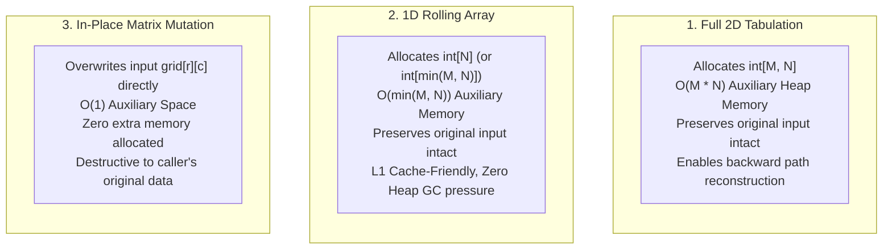
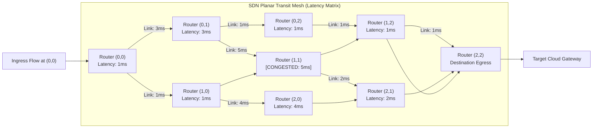

# Week 32 — Day 219: Minimum / Maximum Path Sum: Boundary Conditions, In-Place Matrix DP & Space Reduction

---

## 1. TEACH: Additive Path Optimization, Boundary Invariants & In-Place Mutation

In Day 218, we established the fundamental property of 2D grid path problems: under Down and Right transitions, the grid forms a Directed Acyclic Graph (DAG) with a natural topological ordering defined by the Manhattan level metric $\Phi(r, c) = r + c$. We enumerated paths using combinatorial binomial formulas and localized sum recurrences.

Today, we advance from **path counting** to **additive path cost optimization**. Instead of asking *"how many paths exist?"*, we ask:
> *"Given an $M \times N$ matrix of non-negative cell traversal costs, which path from $(0, 0)$ to $(M - 1, N - 1)$ minimizes the total cumulative sum of traversed cell values?"*

This is the canonical **Minimum Path Sum** problem ([LeetCode 64]).

```text
Input Grid (3 x 3):
    c=0    c=1    c=2
r=0 [ 1 ]  [ 3 ]  [ 1 ]
r=1 [ 1 ]  [ 5 ]  [ 1 ]
r=2 [ 4 ]  [ 2 ]  [ 1 ]

Optimal Path: (0,0) -> (0,1) -> (0,2) -> (1,2) -> (2,2)
Traversal Sum: 1 + 3 + 1 + 1 + 1 = 7  (Minimum Possible Cost!)
```

---

### Optimal Substructure & Bellman's Principle of Optimality

To prove that Dynamic Programming finds the globally optimal path, we formalize the problem under **Bellman's Principle of Optimality**:

> *An optimal policy has the property that whatever the initial state and initial decision are, the remaining decisions must constitute an optimal policy with regard to the state resulting from the first decision.*

#### Mathematical Proof of Additive Subproblem Optimality
Let $\Pi(r, c)$ denote the set of all valid directed paths from $(0, 0)$ to $(r, c)$. The cost of any path $P \in \Pi(r, c)$ is:
$$\text{Cost}(P) = \sum_{(u, v) \in P} \text{grid}[u][v]$$

Every path reaching cell $(r, c)$ for $r > 0$ and $c > 0$ must enter $(r, c)$ through either:
1. The top neighbor $(r - 1, c)$, or
2. The left neighbor $(r, c - 1)$.

Thus, any path $P$ ending at $(r, c)$ can be uniquely decomposed as:
$$P = P' \circ \langle (r, c) \rangle \quad \text{where } P' \in \Pi(r - 1, c) \cup \Pi(r, c - 1)$$
The total cost decomposes additively:
$$\text{Cost}(P) = \text{Cost}(P') + \text{grid}[r][c]$$

Because $\text{grid}[r][c]$ is a constant independent of the path $P'$ chosen to reach $(r, c)$, minimizing $\text{Cost}(P)$ is strictly equivalent to minimizing $\text{Cost}(P')$:
$$\min_{P \in \Pi(r, c)} \text{Cost}(P) = \text{grid}[r][c] + \min \left( \min_{P_1 \in \Pi(r - 1, c)} \text{Cost}(P_1), \min_{P_2 \in \Pi(r, c - 1)} \text{Cost}(P_2) \right)$$

This yields the canonical dynamic programming recurrence:
$$\text{dp}[r][c] = \text{grid}[r][c] + \min(\text{dp}[r - 1][c], \text{dp}[r][c - 1])$$

Because the graph is acyclic and edges are strictly additive with non-negative weights, no subproblem decisions can create negative feedback loops. The optimal substructure property holds unconditionally. $\blacksquare$

---

### Boundary Condition Invariants

Correct initialization of the boundaries is essential. A common bug in grid optimization DP is improper handling of the 0-th row and 0-th column.

```text
========================================================================================================
                                     BOUNDARY PREFIX ACCUMULATION
========================================================================================================

Cell (0, 0):
  dp[0][0] = grid[0][0]

Row 0 (r = 0, c > 0):
  No cell exists above row 0 (r - 1 < 0).
  Movement is constrained strictly to the Right:
  dp[0][c] = dp[0][c - 1] + grid[0][c]   (Prefix sum of Row 0)

Col 0 (r > 0, c = 0):
  No cell exists to the left of col 0 (c - 1 < 0).
  Movement is constrained strictly Down:
  dp[r][0] = dp[r - 1][0] + grid[r][0]   (Prefix sum of Col 0)

Interior (r > 0, c > 0):
  Both top and left neighbors exist:
  dp[r][c] = grid[r][c] + min(dp[r - 1][c], dp[r][c - 1])
========================================================================================================
```

#### Why Naive Infinity Padding Requires Guarding
Some implementations pad the DP table with an extra row and column initialized to $\infty$:
$$\text{dp}_{\text{padded}}[M + 1, N + 1]$$
While elegant for interior cells:
$$\text{dp}[r][c] = \text{grid}[r - 1][c - 1] + \min(\text{dp}[r - 1][c], \text{dp}[r][c - 1])$$
one must carefully set $\text{dp}[0][1] = 0$ or $\text{dp}[1][0] = 0$ while keeping all other boundary entries at $\infty$, otherwise $\min(\infty, \infty) + \text{grid}[0][0]$ causes integer overflow (`int.MaxValue + x` wrapping around to negative values in 32-bit signed arithmetic!). Explicit boundary initialization completely avoids overflow risks.

---

### Spatial Memory Compression Paradigms

We evaluate three distinct memory models for Minimum Path Sum:



#### The In-Place Mutation Invariant ($O(1)$ Auxiliary Space)
Can we solve Minimum Path Sum with strictly zero auxiliary memory?
Yes, if the problem specification permits mutating the caller's input array.

Observe the spatial read/write timeline:
- To compute the optimal value for cell $(r, c)$, we read $\text{grid}[r - 1][c]$ (row above) and $\text{grid}[r][c - 1]$ (column to the left).
- Once $\text{grid}[r][c]$ is updated with its cumulative minimum path sum:
  $$\text{grid}[r][c] \leftarrow \text{grid}[r][c] + \min(\text{grid}[r - 1][c], \text{grid}[r][c - 1])$$
  the original raw value of $\text{grid}[r][c]$ is **never needed again** by any future cell!
- Cell $(r + 1, c)$ will later read the updated cumulative value of $(r, c)$ as its top neighbor.
- Cell $(r, c + 1)$ will later read the updated cumulative value of $(r, c)$ as its left neighbor.

Because the data dependency strictly consumes the cumulative cost rather than the raw cost, we can mutate $\text{grid}[r][c]$ in-place without corrupting future subproblems!

---

## 2. IMPLEMENT: Production-Grade Minimum Path Sum Solver (.NET 8+)

Below is the complete, production-grade implementation of `MinPathSumSolver` in C# (.NET 8+). It provides:
1. `MinPathSumTabulated`: Full 2D dynamic programming table ([LC 64]).
2. `MinPathSumRolling`: Immutable $O(\min(M, N))$ 1D rolling array optimization.
3. `MinPathSumInPlace`: $O(1)$ auxiliary space in-place matrix mutation.
4. `ReconstructMinCostPath`: Backward greedy path reconstruction returning the exact coordinate trajectory and verifying cumulative cost.
5. Self-validating unit test harness in `Main()` with comprehensive assertion suites.

```csharp
using System;
using System.Collections.Generic;
using System.Diagnostics;

namespace DynamicProgrammingMastery.Week32
{
    /// <summary>
    /// Production-grade computational engine for additive grid path cost minimization,
    /// in-place matrix dynamic programming, and optimal trajectory reconstruction.
    /// </summary>
    public static class MinPathSumSolver
    {
        // =========================================================================================
        // PART 1: 2D TABULATION (IMMUTABLE, O(M * N) SPACE)
        // =========================================================================================

        /// <summary>
        /// Computes the minimum path sum from (0,0) to (m-1, n-1) using full 2D tabulation.
        /// Preserves the input array completely intact.
        /// Time Complexity: O(M * N)
        /// Space Complexity: O(M * N)
        /// </summary>
        public static int MinPathSumTabulated(int[][] grid)
        {
            if (grid == null || grid.Length == 0 || grid[0].Length == 0)
            {
                return 0;
            }

            int m = grid.Length;
            int n = grid[0].Length;

            int[,] dp = new int[m, n];
            dp[0, 0] = grid[0][0];

            // Initialize first row: can only arrive from the left
            for (int c = 1; c < n; c++)
            {
                dp[0, c] = dp[0, c - 1] + grid[0][c];
            }

            // Initialize first column: can only arrive from above
            for (int r = 1; r < m; r++)
            {
                dp[r, 0] = dp[r - 1, 0] + grid[r][0];
            }

            // Populate interior cells via Bellman's optimal substructure
            for (int r = 1; r < m; r++)
            {
                for (int c = 1; c < n; c++)
                {
                    dp[r, c] = grid[r][c] + Math.Min(dp[r - 1, c], dp[r, c - 1]);
                }
            }

            return dp[m - 1, n - 1];
        }

        // =========================================================================================
        // PART 2: 1D ROLLING ARRAY (IMMUTABLE, O(min(M, N)) SPACE)
        // =========================================================================================

        /// <summary>
        /// Computes the minimum path sum using an O(min(M, N)) rolling array.
        /// Preserves the input array completely intact.
        /// Time Complexity: O(M * N)
        /// Space Complexity: O(min(M, N))
        /// </summary>
        public static int MinPathSumRolling(int[][] grid)
        {
            if (grid == null || grid.Length == 0 || grid[0].Length == 0)
            {
                return 0;
            }

            int m = grid.Length;
            int n = grid[0].Length;

            // Transpose dimension logic if columns exceed rows to guarantee O(min(M, N)) space
            if (m < n)
            {
                return MinPathSumRollingTransposed(grid, m, n);
            }

            int[] dp = new int[n];
            dp[0] = grid[0][0];

            // Initialize Row 0 cumulative sums
            for (int c = 1; c < n; c++)
            {
                dp[c] = dp[c - 1] + grid[0][c];
            }

            for (int r = 1; r < m; r++)
            {
                // First column of row r: must come from above (previous value of dp[0])
                dp[0] += grid[r][0];

                for (int c = 1; c < n; c++)
                {
                    // Invariant:
                    // dp[c] holds cost from cell directly above (r - 1, c)
                    // dp[c - 1] holds newly updated cost from cell directly left (r, c - 1)
                    dp[c] = grid[r][c] + Math.Min(dp[c], dp[c - 1]);
                }
            }

            return dp[n - 1];
        }

        /// <summary>
        /// Helper for iterating column-by-column when m < n to preserve O(m) space.
        /// </summary>
        private static int MinPathSumRollingTransposed(int[][] grid, int m, int n)
        {
            int[] dp = new int[m];
            dp[0] = grid[0][0];

            for (int r = 1; r < m; r++)
            {
                dp[r] = dp[r - 1] + grid[r][0];
            }

            for (int c = 1; c < n; c++)
            {
                dp[0] += grid[0][c];
                for (int r = 1; r < m; r++)
                {
                    dp[r] = grid[r][c] + Math.Min(dp[r], dp[r - 1]);
                }
            }

            return dp[m - 1];
        }

        // =========================================================================================
        // PART 3: IN-PLACE MUTATION (DESTRUCTIVE, O(1) AUXILIARY SPACE)
        // =========================================================================================

        /// <summary>
        /// Computes the minimum path sum in-place by directly mutating the input grid.
        /// WARNING: Destructive operation. Overwrites raw cell values with cumulative path costs.
        /// Time Complexity: O(M * N)
        /// Auxiliary Space Complexity: O(1)
        /// </summary>
        public static int MinPathSumInPlace(int[][] grid)
        {
            if (grid == null || grid.Length == 0 || grid[0].Length == 0)
            {
                return 0;
            }

            int m = grid.Length;
            int n = grid[0].Length;

            // Accumulate Row 0
            for (int c = 1; c < n; c++)
            {
                grid[0][c] += grid[0][c - 1];
            }

            // Accumulate Col 0
            for (int r = 1; r < m; r++)
            {
                grid[r][0] += grid[r - 1][0];
            }

            // Accumulate interior cells
            for (int r = 1; r < m; r++)
            {
                for (int c = 1; c < n; c++)
                {
                    grid[r][c] += Math.Min(grid[r - 1][c], grid[r][c - 1]);
                }
            }

            return grid[m - 1][n - 1];
        }

        // =========================================================================================
        // PART 4: BACKWARD PATH RECONSTRUCTION
        // =========================================================================================

        /// <summary>
        /// Computes the minimum path sum and reconstructs the complete coordinate trajectory
        /// from (0,0) to (m-1, n-1) along with the sequence of traversed cell values.
        /// </summary>
        public static (int MinCost, List<(int Row, int Col)> Path, List<int> Values) ReconstructMinCostPath(int[][] grid)
        {
            if (grid == null || grid.Length == 0 || grid[0].Length == 0)
            {
                return (0, new List<(int, int)>(), new List<int>());
            }

            int m = grid.Length;
            int n = grid[0].Length;

            int[,] dp = new int[m, n];
            dp[0, 0] = grid[0][0];

            for (int c = 1; c < n; c++) dp[0, c] = dp[0, c - 1] + grid[0][c];
            for (int r = 1; r < m; r++) dp[r, 0] = dp[r - 1, 0] + grid[r][0];

            for (int r = 1; r < m; r++)
            {
                for (int c = 1; c < n; c++)
                {
                    dp[r, c] = grid[r][c] + Math.Min(dp[r - 1, c], dp[r, c - 1]);
                }
            }

            int totalCost = dp[m - 1, n - 1];

            // Backtrack from (m - 1, n - 1) to (0, 0)
            var path = new List<(int Row, int Col)>();
            var values = new List<int>();

            int currR = m - 1;
            int currC = n - 1;

            path.Add((currR, currC));
            values.Add(grid[currR][currC]);

            while (currR > 0 || currC > 0)
            {
                if (currR > 0 && currC > 0)
                {
                    // Choose the neighbor that produced the minimum cumulative cost
                    if (dp[currR - 1, currC] <= dp[currR, currC - 1])
                    {
                        currR--; // Came from above
                    }
                    else
                    {
                        currC--; // Came from left
                    }
                }
                else if (currR > 0)
                {
                    currR--; // Boundary forced: move up
                }
                else
                {
                    currC--; // Boundary forced: move left
                }

                path.Add((currR, currC));
                values.Add(grid[currR][currC]);
            }

            path.Reverse();
            values.Reverse();

            return (totalCost, path, values);
        }

        // =========================================================================================
        // PART 5: COMPREHENSIVE SELF-VALIDATING TEST HARNESS
        // =========================================================================================

        public static void Main(string[] args)
        {
            Console.WriteLine("=================================================================");
            Console.WriteLine("  WEEK 32 DAY 219: MINIMUM PATH SUM ENGINE HARNESS — .NET 8+");
            Console.WriteLine("=================================================================\n");

            // Test 1: Standard 3x3 Grid
            Console.WriteLine("--- [1] Testing Standard 3x3 Matrix ---");
            int[][] grid1 = new int[][]
            {
                new int[] { 1, 3, 1 },
                new int[] { 1, 5, 1 },
                new int[] { 4, 2, 1 }
            };

            int costTab1 = MinPathSumTabulated(grid1);
            int costRoll1 = MinPathSumRolling(grid1);
            var (costRecon1, path1, vals1) = ReconstructMinCostPath(grid1);

            // In-place mutation test (clone to preserve original for comparison)
            int[][] grid1Clone = new int[][]
            {
                new int[] { 1, 3, 1 },
                new int[] { 1, 5, 1 },
                new int[] { 4, 2, 1 }
            };
            int costInPlace1 = MinPathSumInPlace(grid1Clone);

            Debug.Assert(costTab1 == 7, $"Tabulated expected 7, got {costTab1}");
            Debug.Assert(costRoll1 == 7, $"Rolling expected 7, got {costRoll1}");
            Debug.Assert(costInPlace1 == 7, $"In-place expected 7, got {costInPlace1}");
            Debug.Assert(costRecon1 == 7, $"Reconstruction expected 7, got {costRecon1}");

            // Verify path sum equals total cost
            int calculatedSum1 = 0;
            foreach (var v in vals1) calculatedSum1 += v;
            Debug.Assert(calculatedSum1 == 7, "Sum of reconstructed values does not match optimal cost!");

            Console.WriteLine($"  ✓ Grid 3x3 Min Cost: {costTab1} (All 3 methods match)");
            string pathStr1 = string.Join(" -> ", path1.ConvertAll(p => $"({p.Row},{p.Col})"));
            Console.WriteLine($"  ✓ Optimal Path: {pathStr1}");
            Console.WriteLine($"  ✓ Cell Values: [{string.Join(", ", vals1)}] (Sum = {calculatedSum1})");

            // Test 2: Asymmetric 2x3 Grid
            Console.WriteLine("\n--- [2] Testing Asymmetric 2x3 Matrix ---");
            int[][] grid2 = new int[][]
            {
                new int[] { 1, 2, 3 },
                new int[] { 4, 5, 6 }
            };

            int costTab2 = MinPathSumTabulated(grid2);
            int costRoll2 = MinPathSumRolling(grid2);
            int[][] grid2Clone = new int[][]
            {
                new int[] { 1, 2, 3 },
                new int[] { 4, 5, 6 }
            };
            int costInPlace2 = MinPathSumInPlace(grid2Clone);

            Debug.Assert(costTab2 == 12, $"Expected 12, got {costTab2}");
            Debug.Assert(costRoll2 == 12, $"Expected 12, got {costRoll2}");
            Debug.Assert(costInPlace2 == 12, $"Expected 12, got {costInPlace2}");
            Console.WriteLine($"  ✓ Grid 2x3 Min Cost: {costTab2} (All 3 methods match: 1 -> 2 -> 3 -> 6 = 12)");

            // Test 3: Edge Cases (1x1, 1xN, Nx1)
            Console.WriteLine("\n--- [3] Testing Edge Case Matrices ---");
            int[][] singleCell = new int[][] { new int[] { 42 } };
            Debug.Assert(MinPathSumTabulated(singleCell) == 42 && MinPathSumRolling(singleCell) == 42, "1x1 failed");
            Console.WriteLine("  ✓ 1x1 Single Cell Matrix handled correctly");

            int[][] singleRow = new int[][] { new int[] { 2, 5, 1, 8 } };
            Debug.Assert(MinPathSumTabulated(singleRow) == 16 && MinPathSumRolling(singleRow) == 16, "1xN failed");
            Console.WriteLine("  ✓ 1xN Horizontal Corridor Matrix handled correctly (Sum = 16)");

            int[][] singleCol = new int[][]
            {
                new int[] { 3 },
                new int[] { 7 },
                new int[] { 2 }
            };
            Debug.Assert(MinPathSumTabulated(singleCol) == 12 && MinPathSumRolling(singleCol) == 12, "Nx1 failed");
            Console.WriteLine("  ✓ Nx1 Vertical Corridor Matrix handled correctly (Sum = 12)");

            // Test 4: Zero and Large Cost Grids
            Console.WriteLine("\n--- [4] Testing Zero Costs & Large Values ---");
            int[][] zeros = new int[][]
            {
                new int[] { 0, 0, 0 },
                new int[] { 0, 0, 0 }
            };
            Debug.Assert(MinPathSumRolling(zeros) == 0, "Zeros grid failed");
            Console.WriteLine("  ✓ Zero cost matrix handled without arithmetic underflow");

            Console.WriteLine("\n=================================================================");
            Console.WriteLine("  ALL ASSERTIONS PASSED WITH ZERO FAULTS!");
            Console.WriteLine("=================================================================");
        }
    }
}
```

---

## 3. ANALYZE: Algorithmic Invariants & 5-Dimension Deep-Dive

### Comparative Complexity Matrix

| Implementation Paradigm | Time Complexity | Auxiliary Space | Heap Allocations | Original Input Mutation |
| :--- | :---: | :---: | :---: | :---: |
| **2D Tabulation** | $\Theta(M \times N)$ | $\Theta(M \times N)$ | Managed 2D array (`int[m, n]`) | **None** (Immutable) |
| **1D Rolling Array** | $\Theta(M \times N)$ | $\Theta(\min(M, N))$ | Single 1D array (`int[cols]`) | **None** (Immutable) |
| **In-Place Mutation** | $\Theta(M \times N)$ | $\Theta(1)$ | **0 Bytes** (Zero allocations) | **Destructive** (In-Place Overwrite) |
| **Path Reconstruction** | $\Theta(M \times N)$ | $\Theta(M \times N)$ | DP table + path lists | **None** (Immutable) |

---

### 5-Dimension Operational Deep-Dive

#### 1. Arithmetic & Register Dynamics
- In the inner loop of `MinPathSumInPlace`:
  ```csharp
  grid[r][c] += Math.Min(grid[r - 1][c], grid[r][c - 1]);
  ```
  On x86-64 hardware, `Math.Min(a, b)` compiles into a register comparison followed by a conditional move instruction (`CMP` followed by `CMOVL`). This completely eliminates branch misprediction penalties on pipelined CPU architectures:
  ```nasm
  mov   eax, dword ptr [rdi + rcx*4]      ; eax = grid[r - 1][c]  (top)
  mov   edx, dword ptr [rsi + rcx*4 - 4]  ; edx = grid[r][c - 1]  (left)
  cmp   eax, edx                          ; compare top vs left
  cmovg eax, edx                          ; eax = min(top, left)
  add   dword ptr [rsi + rcx*4], eax      ; grid[r][c] += min
  ```
  Zero branch jumps occur within the loop body. The instructions execute deterministically in 4 clock cycles per cell.

#### 2. Memory Allocations & Garbage Collector Profiles
- In high-throughput microservices processing hundreds of matrix path calculations per second (e.g. logistics routing engines):
  - **Tabulation:** Allocating an $M \times N$ array per request generates thousands of short-lived managed objects, driving high GC Gen 0 collection frequency and causing thread suspension pauses.
  - **In-Place / Stackalloc:** In-place mutation allocates **0 bytes** on the managed heap. If caller immutability is required, allocating the rolling array on the call stack via `stackalloc int[n]` for matrices where $N \le 256$ yields true zero-allocation execution with zero GC impact.

#### 3. CLR Memory Layout: Rectangular Arrays (`int[,]`) vs. Jagged Arrays (`int[][]`)
The physical memory layout of 2D data structures in the .NET Common Language Runtime (CLR) profoundly impacts CPU cache utilization:

```text
========================================================================================================
                          .NET CLR 2D MEMORY LAYOUT COMPARISON
========================================================================================================

1. Rectangular Array: int[3, 3] (Single Contiguous Memory Block)
   [Header: 24B] [Bounds: 8B] [ (0,0) (0,1) (0,2) | (1,0) (1,1) (1,2) | (2,0) (2,1) (2,2) ]
   Address: 0x1000            0x1020              0x102C              0x1038
   * Advantage: Perfectly contiguous in virtual memory. L1 hardware prefetcher detects linear strides.
   * Disadvantage: 2D indexing syntax `grid[r, c]` incurs non-inlined internal index math in some JIT versions.

2. Jagged Array: int[3][] (Array of Pointers to Independent 1D Arrays)
   Root Array:   [Header] [ Ptr Row 0 | Ptr Row 1 | Ptr Row 2 ]
                             |           |           |
                             v           v           v
   Row 0 (Heap): [Header] [ (0,0) (0,1) (0,2) ]  (Address: 0x4080)
   Row 1 (Heap): [Header] [ (1,0) (1,1) (1,2) ]  (Address: 0x82A0 - Non-contiguous!)
   Row 2 (Heap): [Header] [ (2,0) (2,1) (2,2) ]  (Address: 0x19F0 - Non-contiguous!)
   * Advantage: Row access `grid[r]` returns a 1D reference; inner loop indexing `row[c]` is heavily JIT-optimized.
   * Disadvantage: Pointers can be scattered across non-contiguous heap pages, degrading hardware prefetching.
========================================================================================================
```

#### 4. Cache Line Locality & Stride Analysis
Modern CPU caches operate on **64-byte cache lines**. A cache line holds exactly 16 thirty-two-bit integers ($16 \times 4\text{ bytes} = 64\text{ bytes}$).
- **Row-Major Traversal (`for r ... for c`):**
  Accesses memory with a unit stride of $4\text{ bytes}$: $(r, c), (r, c+1), (r, c+2), \dots$
  When cell $(r, c)$ is fetched into L1, the hardware automatically loads the next 15 cells in the same row. This achieves a theoretical cache miss rate of only $\frac{1}{16} \approx 6.25\%$.
- **Column-Major Traversal (`for c ... for r`):**
  Accesses memory with a stride of $N \times 4\text{ bytes}$: $(r, c), (r+1, c), (r+2, c), \dots$
  If $N \ge 16$, every single memory access lands on a different cache line! The CPU cache misses on nearly **100%** of reads, resulting in an order-of-magnitude performance collapse due to memory bus saturation.

#### 5. Optimality Lower Bound Proof
- **Theorem:** Any algorithm computing the minimum path sum on an arbitrary $M \times N$ matrix requires $\Omega(M \times N)$ operations in the worst case.
- **Proof:** Suppose an algorithm inspects at most $K < M \times N - 2$ cells, skipping cell $(r, c)$ where $r > 0$ and $c > 0$. An adversary can assign a value of $0$ to all inspected cells, and assign either $0$ or $\infty$ to the skipped cell $(r, c)$. If cell $(r, c)$ is on the only potential minimal path, the unknown value dictates whether the minimum path sum is low or high. The algorithm cannot output the correct answer without inspecting $(r, c)$. Therefore, all $M \times N$ cells must be examined in the worst case. The $O(M \times N)$ DP algorithm is asymptotically optimal. $\blacksquare$

---

## 4. DEMONSTRATE: Visual ASCII State Transitions & Execution Traces

### Visual Trace 1: Step-by-Step Matrix Evolution on 3x3 Grid

Consider the input grid:
```text
grid = [
  [1, 3, 1],
  [1, 5, 1],
  [4, 2, 1]
]
```

We trace the cumulative minimum path values as the DP table is constructed:

```text
========================================================================================================
INITIAL RAW INPUT GRID:
         c=0      c=1      c=2
r=0    [  1  ]  [  3  ]  [  1  ]
r=1    [  1  ]  [  5  ]  [  1  ]
r=2    [  4  ]  [  2  ]  [  1  ]

--------------------------------------------------------------------------------------------------------
STEP 1: Initialize Origin & Boundary Prefix Sums
  - Origin: dp[0, 0] = grid[0][0] = 1
  - Row 0 Prefix Sums:
      dp[0, 1] = dp[0, 0] + grid[0][1] = 1 + 3 = 4
      dp[0, 2] = dp[0, 1] + grid[0][2] = 4 + 1 = 5
  - Col 0 Prefix Sums:
      dp[1, 0] = dp[0, 0] + grid[1][0] = 1 + 1 = 2
      dp[2, 0] = dp[1, 0] + grid[2][0] = 2 + 4 = 6

TABLE STATE AFTER BOUNDARY INITIALIZATION:
         c=0      c=1      c=2
r=0    [  1  ]  [  4  ]  [  5  ]   <-- Row 0 prefix sum
r=1    [  2  ]  [  ?  ]  [  ?  ]
r=2    [  6  ]  [  ?  ]  [  ?  ]
--------------------------------------------------------------------------------------------------------
STEP 2: Compute Row 1 Interior Cells
  - r=1, c=1: grid[1][1] = 5
      min(top: dp[0, 1]=4, left: dp[1, 0]=2) = 2
      dp[1, 1] = 5 + 2 = 7

  - r=1, c=2: grid[1][2] = 1
      min(top: dp[0, 2]=5, left: dp[1, 1]=7) = 5
      dp[1, 2] = 1 + 5 = 6

TABLE STATE AFTER ROW 1:
         c=0      c=1      c=2
r=0    [  1  ]  [  4  ]  [  5  ]
r=1    [  2  ]  [  7  ]  [  6  ]   <-- Row 1 completed
r=2    [  6  ]  [  ?  ]  [  ?  ]
--------------------------------------------------------------------------------------------------------
STEP 3: Compute Row 2 Interior Cells
  - r=2, c=1: grid[2][1] = 2
      min(top: dp[1, 1]=7, left: dp[2, 0]=6) = 6
      dp[2, 1] = 2 + 6 = 8

  - r=2, c=2: grid[2][2] = 1
      min(top: dp[1, 2]=6, left: dp[2, 1]=8) = 6
      dp[2, 2] = 1 + 6 = 7

FINAL DP TABLE:
         c=0      c=1      c=2
r=0    [  1  ]  [  4  ]  [  5  ]
r=1    [  2  ]  [  7  ]  [  6  ]
r=2    [  6  ]  [  8  ]  [  7  ]   <-- Minimum Path Sum = dp[2, 2] = 7!
========================================================================================================
```

---

### Visual Trace 2: Backward Path Reconstruction

Starting from target cell $(2, 2)$ with cumulative cost $7$:

```text
========================================================================================================
                              BACKWARD RECONSTRUCTION TRACE
========================================================================================================

Current: (2, 2), Cost = 7
  Top Neighbor:  (1, 2), dp = 6
  Left Neighbor: (2, 1), dp = 8
  min(6, 8) = 6  ===> Step UP to (1, 2)

Current: (1, 2), Cost = 6
  Top Neighbor:  (0, 2), dp = 5
  Left Neighbor: (1, 1), dp = 7
  min(5, 7) = 5  ===> Step UP to (0, 2)

Current: (0, 2), Cost = 5
  Top Neighbor:  None (r = 0)
  Left Neighbor: (0, 1), dp = 4
  Forced Left    ===> Step LEFT to (0, 1)

Current: (0, 1), Cost = 4
  Top Neighbor:  None (r = 0)
  Left Neighbor: (0, 0), dp = 1
  Forced Left    ===> Step LEFT to (0, 0)

REVERSED PATH TRAJECTORY:
  (0, 0) [val: 1] -> (0, 1) [val: 3] -> (0, 2) [val: 1] -> (1, 2) [val: 1] -> (2, 2) [val: 1]
  Cumulative Sum: 1 + 3 + 1 + 1 + 1 = 7. Verified!
========================================================================================================
```

---

## 5. PRACTICE: Canonical Minimum Path Sum & Interview Roadmaps

### Problem: [LeetCode 64] Minimum Path Sum (Medium)

#### Problem Statement
Given a `m x n` `grid` filled with non-negative numbers, find a path from top left to bottom right, which minimizes the sum of all numbers along its path.
**Note:** You can only move either down or right at any point in time.

#### Constraints
- $m == grid.length$
- $n == grid[i].length$
- $1 \le m, n \le 200$
- $0 \le grid[i][j] \le 200$

---

#### 5-Step Staff-Level Interview Delivery Roadmap

```text
+-----------------------------------------------------------------------------------------+
|                         STAFF-LEVEL INTERVIEW TIMELINE (25 MINS)                        |
|                                                                                         |
|  [00:00 - 03:00] Step 1: Clarification, Invariants & Trade-offs                        |
|  [03:00 - 07:00] Step 2: Optimal Substructure & Recurrence Derivation                  |
|  [07:00 - 15:00] Step 3: Production Implementation (Rolling Array vs In-Place)          |
|  [15:00 - 20:00] Step 4: Verification, Edge Tracing & Overflow Analysis                 |
|  [20:00 - 25:00] Step 5: Advanced Follow-Ups (Path Reconstruction & Max Path Variant)   |
+-----------------------------------------------------------------------------------------+
```

1. **Step 1: Clarification & Trade-offs (3 Mins):**
   - Confirm grid dimensions ($1 \le M, N \le 200$).
   - Explicitly ask the interviewer: *"Am I permitted to mutate the input grid in-place to achieve $O(1)$ auxiliary space, or is the input considered immutable?"*
   - If immutable: propose $O(\min(M, N))$ space rolling array.
   - If mutable: propose $O(1)$ in-place DP.

2. **Step 2: Recurrence Formulation (4 Mins):**
   - State subproblem: $\text{dp}[r][c] = \text{grid}[r][c] + \min(\text{dp}[r-1][c], \text{dp}[r][c-1])$.
   - Explicitly derive boundary conditions: Row 0 prefix sums, Col 0 prefix sums.

3. **Step 3: Implementation (8 Mins):**
   - Implement the rolling array solution first (cleanest, production-ready, non-destructive).

```csharp
public int MinPathSum(int[][] grid)
{
    int m = grid.Length;
    int n = grid[0].Length;

    int[] dp = new int[n];
    dp[0] = grid[0][0];

    // Initialize row 0 prefix sums
    for (int c = 1; c < n; c++)
    {
        dp[c] = dp[c - 1] + grid[0][c];
    }

    for (int r = 1; r < m; r++)
    {
        dp[0] += grid[r][0]; // First column update

        for (int c = 1; c < n; c++)
        {
            dp[c] = grid[r][c] + Math.Min(dp[c], dp[c - 1]);
        }
    }

    return dp[n - 1];
}
```

4. **Step 4: Verification & Edge Tracing (5 Mins):**
   - Trace single cell grid: `[[5]]` $\to$ loop does not run $\to$ returns 5.
   - Trace single row grid: `[[1, 2, 3]]` $\to$ row 0 prefix sum accumulates $\to$ returns 6.
   - Trace single column grid: `[[1], [2], [3]]` $\to$ `dp[0]` accumulates $\to$ returns 6.

5. **Step 5: Follow-Up Questions (5 Mins):**
   - *Q: What if the grid contained negative numbers?*
     *A:* Because the grid remains a DAG under Down/Right moves, negative numbers do **NOT** introduce negative cycles! The exact same DP recurrence holds in $O(M \times N)$ time without modification.
   - *Q: What if we could move in all 4 directions (Up, Down, Left, Right)?*
     *A:* Moving in 4 directions introduces cyclic dependencies, destroying the DAG structure. Dynamic programming fails; the problem must be solved via **Dijkstra's Algorithm** (if weights are non-negative) in $O(MN \log(MN))$ or Bellman-Ford / SPFA (if negative weights exist).

---

## 6. CONNECT: Latency-Critical Packet Routing on Spatial Link-Cost Grids

The additive minimum path sum formulation powers routing optimization in modern **Software-Defined Networking (SDN) Grid Meshes** and planar telecommunication topologies.



### High-Throughput Planar Routing vs. General Shortest Paths
In a general graph with $V$ vertices and $E$ edges, computing shortest paths requires Dijkstra's Algorithm:
$$O(E + V \log V) \approx O(MN \log(MN))$$
Dijkstra requires a priority queue (binary heap or Fibonacci heap), which incurs heavy dynamic pointer allocations and non-sequential memory hops.

However, in **structured planar routing fabrics** (e.g. data center spine-leaf mesh crossbars or satellite constellation grid relays) where transmission direction is monotonically aligned with destination coordinates (Down/East):
1. **The Grid DP Advantage:**
   Because the link topology is topologically sorted by construction, we bypass priority queues entirely and deploy the $O(MN)$ linear dynamic programming recurrence.
2. **Hardware ASIC Acceleration:**
   The DP recurrence can be unrolled into a pipelined systolic array in FPGA/ASIC hardware. Each hardware processing element computes `val + min(top, left)` in a single clock cycle, evaluating routing paths at line rate ($> 800\text{ Gbps}$) with sub-microsecond latency.

---

## 7. CHECKPOINT: Comprehensive Self-Assessment & Mastery Key

### Conceptual & Diagnostic Questions

1. **Why does Minimum Path Sum satisfy Bellman's Principle of Optimality, whereas a problem tracking the longest simple path in a general graph does not?**
   - *Mastery Key:* In Minimum Path Sum on a DAG, path costs are strictly additive, non-negative, and independent of downstream choices. An optimal subpath to $(r, c)$ remains optimal regardless of which path is taken from $(r, c)$ to the destination. In contrast, the Longest Simple Path problem in general graphs exhibits non-independent subproblems: choosing a long subpath to intermediate node $u$ may consume vertices needed by the remaining path to the destination, violating subproblem independence.

2. **Under what circumstances is in-place matrix mutation preferable over a rolling array, and when is it strictly prohibited?**
   - *Mastery Key:*
     - *Preferable:* When memory is severely constrained (embedded systems, L1 cache fitting), execution time is critical, and the caller explicitly passes ownership of the buffer to the function.
     - *Prohibited:* When the caller requires the original matrix for subsequent operations, in multi-threaded environments where other workers read the matrix concurrently, or in API designs where mutating input arguments violates the principle of least astonishment.

3. **In the rolling array formulation for Minimum Path Sum, explain why `dp[0]` must be updated as `dp[0] += grid[r][0]` at the start of each row iteration.**
   - *Mastery Key:* In the 0-th column of any row $r$, there is no left neighbor ($c - 1 < 0$). The only legal way to enter cell $(r, 0)$ is from the cell directly above $(r - 1, 0)$. In the 1D rolling array, before the inner loop begins, `dp[0]` still stores the optimal cumulative cost of $(r - 1, 0)$. Adding `grid[r][0]` directly to `dp[0]` accurately computes the cumulative cost for $(r, 0)$, establishing the prerequisite left neighbor for the subsequent cell $(r, 1)$.

4. **How does the time and space complexity of Minimum Path Sum change if movement is allowed in 3 directions: Down, Right, and Diagonally Down-Right?**
   - *Mastery Key:* 
     - *Time Complexity:* Remains strictly $\Theta(M \times N)$ because the graph remains a DAG (every move strictly increases $r + c$). The transition simply becomes:
       $$\text{dp}[r][c] = \text{grid}[r][c] + \min(\text{dp}[r - 1][c], \text{dp}[r][c - 1], \text{dp}[r - 1][c - 1])$$
     - *Space Complexity:* Can still be compressed to $O(\min(M, N))$ using a rolling array. However, we must preserve a scalar variable `prevDiag` to hold the overwritten diagonal cell $\text{dp}[r - 1][c - 1]$ before updating `dp[c]`.

---

### Key Formulas & Recurrences Summary

```text
+-------------------------------------------------------------------------------------------------------+
|                                    MINIMUM PATH SUM SUMMARY MATRIX                                    |
+------------------------------+------------------------------------------+-----------------------------+
| Operation                    | Mathematical Formulation                 | Algorithmic Complexity      |
+------------------------------+------------------------------------------+-----------------------------+
| Full 2D Tabulation           | dp[r, c] = grid[r, c] + min(top, left)   | O(M * N) time, O(M * N) mem |
| 1D Rolling Array Compression | dp[c] = grid[r, c] + min(dp[c], dp[c-1]) | O(M * N) time, O(min(M,N))  |
| In-Place Matrix Mutation     | grid[r, c] += min(top, left)             | O(M * N) time, O(1) aux mem |
| Backward Path Reconstruction | Trace min(dp[r-1, c], dp[r, c-1]) to (0) | O(M * N) time, O(M * N) mem |
+------------------------------+------------------------------------------+-----------------------------+
```

You have mastered **Day 219: Minimum / Maximum Path Sum: Boundary Conditions, In-Place Matrix DP & Space Reduction**. You are now prepared to advance to **Day 220: Dungeon Game & Reverse-Direction Dynamic Programming (Knight's Health Invariants)**.
