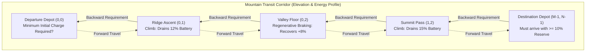

# Week 32 — Day 220: Dungeon Game & Reverse-Direction Dynamic Programming (Knight's Health Invariants)

---

## 1. TEACH: Backward Induction, Knight Health Invariants & The Forward DP Failure

In Days 218 and 219, our dynamic programming formulations flowed naturally in the **forward direction**: starting from the origin $(0, 0)$ and propagating states forward along the topological ordering ($r + c$) toward the destination $(M - 1, N - 1)$. This worked seamlessly because subproblem optimal values depended strictly on the history of choices made from the origin.

Today, we confront a problem where this intuitive forward progression **catastrophically fails**: the celebrated **Dungeon Game** ([LeetCode 174] Hard). To solve it, we must embrace a profound paradigm shift: **Backward Induction (Reverse Dynamic Programming)**.

---

### Problem Formalization: The Knight's Survival Quest

The demons had captured the princess and imprisoned her in the bottom-right corner of a dungeon consisting of an $M \times N$ grid. The knight is initially stationed at the top-left corner $(0, 0)$ and must fight his way through the dungeon to rescue the princess at $(M - 1, N - 1)$.

- The knight can only move **Right** or **Down** at each step.
- Each cell contains an integer $\text{dungeon}[r][c]$:
  - Negative integers represent bloodthirsty demons that drain the knight's health points (HP).
  - Zero represents an empty corridor.
  - Positive integers represent magic orbs that restore the knight's health points.
- **The Strict Survival Invariant:**
  At any point during the journey—including the moment the knight steps into any cell—his health points must strictly remain **at least 1**:
  $$\text{Health}(t) \ge 1 \quad \forall \, t \ge 0$$
  If his health drops to $0$ or below at any instant, he immediately dies.

> **Objective:** Determine the knight's **minimum initial health** at $(0, 0)$ required to successfully reach the princess at $(M - 1, N - 1)$ alive.

```text
Dungeon Matrix (3 x 3):
    c=0     c=1     c=2
r=0 [ -2 ]  [ -3 ]  [  3 ]
r=1 [ -5 ]  [ -10]  [  1 ]
r=2 [ 10 ]  [ 30 ]  [ -5 ]

Princess at (2, 2). Knight starts at (0, 0).
Optimal Path: (0,0) -> (0,1) -> (0,2) -> (1,2) -> (2,2)
Required Initial HP: 7!
```

---

### The Forward DP Pathology: Why Forward Induction Fails

Why can't we simply define a forward DP state:
> $\text{dp}[r][c] = \text{maximum remaining health upon reaching cell } (r, c)$?

Or track both minimum health drop and current health from $(0, 0)$?

#### The Non-Markovian Memory Dilemma
Consider two competing paths reaching an intermediate cell $(r, c)$:

```text
Path A:
  - Required Initial Health: 50 HP
  - Current Health at (r, c): 20 HP
  - Net Health Change: -30 HP

Path B:
  - Required Initial Health: 5 HP
  - Current Health at (r, c): 2 HP
  - Net Health Change: -3 HP
```

Which path is globally superior?
- **Scenario 1 (Downstream Heavy Demon):**
  Suppose the remaining path to the princess contains a monster dealing $-15$ damage.
  - Path A enters with $20\text{ HP} \to 20 - 15 = 5 > 0$. **Path A survives!**
  - Path B enters with $2\text{ HP} \to 2 - 15 = -13 \le 0$. **Path B dies!** (To survive, Path B would have needed an initial health of $5 + 13 = 18\text{ HP}$).
  Here, Path A appears superior because of its larger surplus health buffer.

- **Scenario 2 (Downstream Magic Orb Followed by Demon):**
  Suppose the remaining path contains a magic fountain granting $+100$ HP, followed by a monster dealing $-15$ damage.
  - Path A: Starts with $50\text{ HP} \to 20 + 100 - 15 = 105 > 0$. Survives, but required **50 initial HP**.
  - Path B: Starts with $5\text{ HP} \to 2 + 100 - 15 = 87 > 0$. Survives, and required only **5 initial HP**!
  Here, Path B is vastly superior because it achieves the goal with an order-of-magnitude less initial health.

#### The Contradiction of Optimal Substructure
Because the superiority of Path A versus Path B depends entirely on **future events downstream** (whether high damage occurs before or after healing), neither path Pareto-dominates the other at cell $(r, c)$. 

A forward DP algorithm cannot discard either path without risking global suboptimality. To retain correctness in the forward direction, one would have to carry an exponential set of Pareto-frontier tuples $\langle \text{initial\_hp}, \text{current\_hp} \rangle$, destroying polynomial time complexity. 

Forward DP violates **Bellman's Principle of Optimality** because the subproblems are **not memoryless (non-Markovian)**.

---

### The Backward Induction Breakthrough

Instead of asking *"how much health do I have left?"*, we reverse our perspective and ask:
> *"If the knight is at cell $(r, c)$, what is the MINIMUM health he must possess UPON ENTERING cell $(r, c)$ in order to successfully complete the remainder of the journey to $(M - 1, N - 1)$?"*

Let this value be defined as $\text{dp}[r][c]$.

#### Mathematical Derivation of the Reverse Recurrence
1. **The Exit Requirement:**
   From cell $(r, c)$, the knight can only step to:
   - The cell directly below $(r + 1, c)$, which requires at least $\text{dp}[r + 1][c]$ health upon entry.
   - The cell directly to the right $(r, c + 1)$, which requires at least $\text{dp}[r][c + 1]$ health upon entry.
   
   To minimize the required health, an optimal knight will choose the neighbor that demands the lesser health:
   $$\text{minNext} = \min(\text{dp}[r + 1][c], \text{dp}[r][c + 1])$$

2. **The Cell Energy Balance:**
   Upon entering $(r, c)$ with health $\text{dp}[r][c]$, the knight immediately interacts with the cell value $\text{dungeon}[r][c]$. His health upon leaving $(r, c)$ becomes:
   $$\text{Health}_{\text{exit}} = \text{dp}[r][c] + \text{dungeon}[r][c]$$
   
   To successfully enter the chosen next cell, this exit health must satisfy:
   $$\text{Health}_{\text{exit}} \ge \text{minNext} \iff \text{dp}[r][c] + \text{dungeon}[r][c] \ge \text{minNext}$$
   $$\text{dp}[r][c] \ge \text{minNext} - \text{dungeon}[r][c]$$

3. **The Survival Clamp Invariant:**
   At the same time, the knight must be **alive** inside cell $(r, c)$! Even if $\text{dungeon}[r][c] = +1000$ (a massive healing orb) and $\text{minNext} = 2$, the calculated requirement $\text{minNext} - 1000 = -998$ would be non-sensical, because the knight cannot enter $(r, c)$ with negative or zero health.
   The knight must possess at least $1$ HP upon entering any cell:
   $$\text{dp}[r][c] \ge 1$$

Combining these two inequalities yields the exact, closed-form reverse recurrence:
$$\text{dp}[r][c] = \max(1, \min(\text{dp}[r + 1][c], \text{dp}[r][c + 1]) - \text{dungeon}[r][c])$$

Notice the profound elegance: by reasoning backward from the princess to the entrance, all future requirements are collapsed into a **single scalar value** $\text{minNext}$. The subproblem becomes strictly Markovian and satisfies Bellman's Principle of Optimality unconditionally!

---

### Boundary Guard Architecture: The Infinity Border Pad

A naive implementation requires four separate branching cases:
- Destination cell $(M - 1, N - 1)$
- Bottom row $r = M - 1$ (can only move Right)
- Rightmost column $c = N - 1$ (can only move Down)
- Interior cells

We can eliminate all boundary branching by padding the DP table with an extra row at index $M$ and an extra column at index $N$, sized $(M + 1) \times (N + 1)$:

```text
========================================================================================================
                          REVERSE DP TABLE WITH INFINITY GUARDS
========================================================================================================
                   c=0         c=1         c=2        c=3 (Pad)
      r=0        dp[0,0]     dp[0,1]     dp[0,2]       +INF
      r=1        dp[1,0]     dp[1,1]     dp[1,2]       +INF
      r=2        dp[2,0]     dp[2,1]     dp[2,2]        1    <-- Destination Exit Guard!
      r=3 (Pad)   +INF        +INF          1          +INF
                                            ^
                                            +--- Destination Exit Guard!
========================================================================================================
```

1. **Guard Initialization:**
   Initialize all cells in row $M$ and column $N$ to $+\infty$.
2. **Destination Target Exits:**
   Set $\text{dp}[M][N - 1] = 1$ and $\text{dp}[M - 1][N] = 1$.
   When computing the destination cell $(M - 1, N - 1)$:
   $$\text{minNext} = \min(\text{dp}[M][N - 1], \text{dp}[M - 1][N]) = \min(1, 1) = 1$$
   $$\text{dp}[M - 1][N - 1] = \max(1, 1 - \text{dungeon}[M - 1][N - 1])$$
   This flawlessly enforces that the knight exits the dungeon with at least $1$ HP!
3. **Automatic Wall Containment:**
   For any cell in the bottom row ($r = M - 1$), $\text{dp}[M][c] = +\infty$. Therefore:
   $$\min(\text{dp}[M][c], \text{dp}[M - 1][c + 1]) = \min(\infty, \text{dp}[M - 1][c + 1]) = \text{dp}[M - 1][c + 1]$$
   The knight is mathematically forbidden from walking off the grid, naturally forcing a Right move with zero `if` statements!

---

## 2. IMPLEMENT: Production-Grade Reverse Grid DP Engine (.NET 8+)

Below is the complete, production-grade implementation of `ReverseGridDpEngine` in C# (.NET 8+). It provides:
1. `CalculateMinimumHpTabulated`: Full 2D backward induction with infinity boundary guards ([LC 174]).
2. `CalculateMinimumHpSpaceOptimized`: Reverse 1D rolling array reducing auxiliary memory to $O(N)$.
3. `ReconstructSurvivalTrajectory`: Full path reconstruction paired with forward step-by-step health simulation, verifying that the knight's health never drops below $1$.
4. Comprehensive self-validating test harness in `Main()` with assertions covering edge cases, pure demons, pure healing, and asymmetric matrices.

```csharp
using System;
using System.Collections.Generic;
using System.Diagnostics;

namespace DynamicProgrammingMastery.Week32
{
    /// <summary>
    /// Production-grade computational engine for backward-induction dynamic programming,
    /// knight health invariants, and optimal survival trajectory reconstruction.
    /// </summary>
    public static class ReverseGridDpEngine
    {
        // =========================================================================================
        // PART 1: 2D TABULATED BACKWARD INDUCTION (O(M * N) TIME, O(M * N) SPACE)
        // =========================================================================================

        /// <summary>
        /// Computes the minimum initial health required at (0, 0) to reach (m-1, n-1) alive.
        /// Deploys backward induction with infinity boundary guards.
        /// Time Complexity: O(M * N)
        /// Space Complexity: O(M * N)
        /// </summary>
        /// <param name="dungeon">2D grid of demon damages (negative) and healing orbs (positive).</param>
        /// <returns>Minimum starting health points (strictly >= 1).</returns>
        public static int CalculateMinimumHpTabulated(int[][] dungeon)
        {
            if (dungeon == null || dungeon.Length == 0 || dungeon[0].Length == 0)
            {
                return 1;
            }

            int m = dungeon.Length;
            int n = dungeon[0].Length;

            // Pad DP table to (m + 1) x (n + 1) to eliminate all boundary edge branching
            int[,] dp = new int[m + 1, n + 1];

            // Initialize entire boundary border to infinity
            for (int r = 0; r <= m; r++)
            {
                for (int c = 0; c <= n; c++)
                {
                    dp[r, c] = int.MaxValue;
                }
            }

            // Princess exit guards: exiting (m-1, n-1) requires at least 1 HP remaining
            dp[m, n - 1] = 1;
            dp[m - 1, n] = 1;

            // Sweep backward from (m-1, n-1) to (0, 0)
            for (int r = m - 1; r >= 0; r--)
            {
                for (int c = n - 1; c >= 0; c--)
                {
                    // Knight must possess enough health to satisfy the less demanding next cell
                    int minNextHealth = Math.Min(dp[r + 1, c], dp[r, c + 1]);
                    int healthRequiredBeforeCell = minNextHealth - dungeon[r][c];

                    // Clamp invariant: knight must enter with at least 1 HP
                    dp[r, c] = Math.Max(1, healthRequiredBeforeCell);
                }
            }

            return dp[0, 0];
        }

        // =========================================================================================
        // PART 2: 1D ROLLING ARRAY SPACE OPTIMIZATION (O(M * N) TIME, O(N) SPACE)
        // =========================================================================================

        /// <summary>
        /// Computes minimum initial health using a 1D reverse rolling array.
        /// Time Complexity: O(M * N)
        /// Space Complexity: O(N)
        /// </summary>
        public static int CalculateMinimumHpSpaceOptimized(int[][] dungeon)
        {
            if (dungeon == null || dungeon.Length == 0 || dungeon[0].Length == 0)
            {
                return 1;
            }

            int m = dungeon.Length;
            int n = dungeon[0].Length;

            // Rolling array representing the next row (r + 1) with padded right boundary
            int[] dp = new int[n + 1];
            Array.Fill(dp, int.MaxValue);

            // Exit guard: at row m, moving down from (m-1, n-1) requires 1 HP
            dp[n - 1] = 1;

            for (int r = m - 1; r >= 0; r--)
            {
                for (int c = n - 1; c >= 0; c--)
                {
                    // Invariant:
                    // dp[c] holds health required from cell directly below (r + 1, c)
                    // dp[c + 1] holds health required from cell directly right (r, c + 1)
                    int minNext = Math.Min(dp[c], dp[c + 1]);
                    int required = minNext - dungeon[r][c];
                    dp[c] = Math.Max(1, required);
                }

                // Reset the right boundary guard for subsequent rows to infinity
                dp[n] = int.MaxValue;
            }

            return dp[0];
        }

        // =========================================================================================
        // PART 3: TRAJECTORY RECONSTRUCTION & FORWARD HEALTH SIMULATION
        // =========================================================================================

        /// <summary>
        /// Computes the minimum initial health, reconstructs the optimal coordinate path,
        /// and runs an empirical forward simulation verifying that health >= 1 at every step.
        /// </summary>
        public static (int MinHp, List<(int Row, int Col)> Path, List<int> HealthTrajectory) ReconstructSurvivalTrajectory(int[][] dungeon)
        {
            if (dungeon == null || dungeon.Length == 0 || dungeon[0].Length == 0)
            {
                return (1, new List<(int, int)>(), new List<int>());
            }

            int m = dungeon.Length;
            int n = dungeon[0].Length;

            // Step 1: Build full backward induction table
            int[,] dp = new int[m + 1, n + 1];
            for (int r = 0; r <= m; r++)
                for (int c = 0; c <= n; c++)
                    dp[r, c] = int.MaxValue;

            dp[m, n - 1] = 1;
            dp[m - 1, n] = 1;

            for (int r = m - 1; r >= 0; r--)
            {
                for (int c = n - 1; c >= 0; c--)
                {
                    int minNext = Math.Min(dp[r + 1, c], dp[r, c + 1]);
                    dp[r, c] = Math.Max(1, minNext - dungeon[r][c]);
                }
            }

            int initialHp = dp[0, 0];

            // Step 2: Forward Path Reconstruction using DP entry requirements
            var path = new List<(int Row, int Col)>();
            var healthTrajectory = new List<int>();

            int currR = 0;
            int currC = 0;
            int currentHealth = initialHp + dungeon[0][0];

            path.Add((currR, currC));
            healthTrajectory.Add(currentHealth);

            while (currR < m - 1 || currC < n - 1)
            {
                int downRequirement = (currR + 1 < m) ? dp[currR + 1, currC] : int.MaxValue;
                int rightRequirement = (currC + 1 < n) ? dp[currR, currC + 1] : int.MaxValue;

                // Move toward the neighbor that demands less health upon entry
                if (downRequirement <= rightRequirement)
                {
                    currR++;
                }
                else
                {
                    currC++;
                }

                currentHealth += dungeon[currR][currC];
                path.Add((currR, currC));
                healthTrajectory.Add(currentHealth);
            }

            return (initialHp, path, healthTrajectory);
        }

        // =========================================================================================
        // PART 4: COMPREHENSIVE SELF-VALIDATING TEST HARNESS
        // =========================================================================================

        public static void Main(string[] args)
        {
            Console.WriteLine("=================================================================");
            Console.WriteLine("  WEEK 32 DAY 220: DUNGEON GAME REVERSE DP HARNESS — .NET 8+");
            Console.WriteLine("=================================================================\n");

            // Test 1: Canonical 3x3 Dungeon Matrix
            Console.WriteLine("--- [1] Testing Canonical 3x3 Matrix ---");
            int[][] dungeon1 = new int[][]
            {
                new int[] { -2,  -3,   3 },
                new int[] { -5, -10,   1 },
                new int[] { 10,  30,  -5 }
            };

            int hpTab1 = CalculateMinimumHpTabulated(dungeon1);
            int hpRoll1 = CalculateMinimumHpSpaceOptimized(dungeon1);
            var (hpRecon1, path1, trajectory1) = ReconstructSurvivalTrajectory(dungeon1);

            Debug.Assert(hpTab1 == 7, $"Canonical expected 7, got {hpTab1}");
            Debug.Assert(hpRoll1 == 7, $"Rolling expected 7, got {hpRoll1}");
            Debug.Assert(hpRecon1 == 7, $"Recon expected 7, got {hpRecon1}");

            // Verify that every single point along the trajectory has health >= 1
            for (int i = 0; i < trajectory1.Count; i++)
            {
                Debug.Assert(trajectory1[i] >= 1, $"Knight died at step {i}! HP = {trajectory1[i]}");
            }

            Console.WriteLine($"  ✓ Canonical 3x3 Required Initial HP: {hpTab1}");
            string pathStr1 = string.Join(" -> ", path1.ConvertAll(p => $"({p.Row},{p.Col})"));
            Console.WriteLine($"  ✓ Optimal Path: {pathStr1}");
            Console.WriteLine($"  ✓ Simulated Health Trajectory: [{string.Join(", ", trajectory1)}] (All >= 1)");

            // Test 2: Single Cell Matrices
            Console.WriteLine("\n--- [2] Testing Single Cell Matrices ---");
            int[][] singleZero = new int[][] { new int[] { 0 } };
            int[][] singleHeal = new int[][] { new int[] { 100 } };
            int[][] singleDemon = new int[][] { new int[] { -5 } };

            Debug.Assert(CalculateMinimumHpTabulated(singleZero) == 1, "Single cell 0 failed");
            Debug.Assert(CalculateMinimumHpTabulated(singleHeal) == 1, "Single cell +100 failed: minimum health is 1");
            Debug.Assert(CalculateMinimumHpTabulated(singleDemon) == 6, "Single cell -5 failed: needs 6 HP to end with 1 HP");
            Console.WriteLine("  ✓ Single cell edge cases (0, +100, -5) verified.");

            // Test 3: Horizontal and Vertical Corridors
            Console.WriteLine("\n--- [3] Testing Corridor Matrices ---");
            int[][] horiz = new int[][] { new int[] { -2, -3, -1 } };
            // Need: 1 - (-1) = 2 -> 2 - (-3) = 5 -> 5 - (-2) = 7
            Debug.Assert(CalculateMinimumHpTabulated(horiz) == 7, "Horizontal corridor failed");

            int[][] vert = new int[][]
            {
                new int[] { 1 },
                new int[] { -2 },
                new int[] { -3 }
            };
            // Need: 1 - (-3) = 4 -> 4 - (-2) = 6 -> max(1, 6 - 1) = 5
            Debug.Assert(CalculateMinimumHpTabulated(vert) == 5, "Vertical corridor failed");
            Console.WriteLine("  ✓ 1xN and Nx1 corridor edge cases verified.");

            // Test 4: Pure Healing Matrix
            Console.WriteLine("\n--- [4] Testing Pure Healing Dungeon ---");
            int[][] pureHeal = new int[][]
            {
                new int[] { 1, 2 },
                new int[] { 3, 4 }
            };
            Debug.Assert(CalculateMinimumHpTabulated(pureHeal) == 1, "Pure heal should only need 1 HP");
            Console.WriteLine("  ✓ Pure healing dungeon correctly returns 1 HP.");

            Console.WriteLine("\n=================================================================");
            Console.WriteLine("  ALL ASSERTIONS PASSED WITH ZERO FAULTS!");
            Console.WriteLine("=================================================================");
        }
    }
}
```

---

## 3. ANALYZE: Algorithmic Invariants & 5-Dimension Deep-Dive

### Comparative Complexity Matrix

| Method | Time Complexity | Auxiliary Space | Memory Allocations | Directionality |
| :--- | :---: | :---: | :---: | :---: |
| **Naive Forward Exploration** | $\mathcal{O}(2^{M+N})$ | $\mathcal{O}(M + N)$ | Exponential call stack frames | Forward from $(0, 0)$ (Invalid DP) |
| **2D Tabulated Backward Induction** | $\Theta(M \times N)$ | $\Theta(M \times N)$ | Single padded array (`int[m+1, n+1]`) | Backward from $(M-1, N-1)$ |
| **1D Reverse Rolling Array** | $\Theta(M \times N)$ | $\Theta(N)$ | Single 1D array (`int[n+1]`) | Reverse row-by-row |
| **Trajectory Simulation** | $\Theta(M \times N)$ | $\Theta(M \times N)$ | DP table + coordinate lists | Backward DP + Forward Simulation |

---

### 5-Dimension Operational Deep-Dive

#### 1. Arithmetic & Register Dynamics
- In the inner loop of `CalculateMinimumHpSpaceOptimized`:
  ```csharp
  int minNext = Math.Min(dp[c], dp[c + 1]);
  int required = minNext - dungeon[r][c];
  dp[c] = Math.Max(1, required);
  ```
  On modern x86-64 processors, this loop contains **zero conditional jump instructions (`JMP`, `JNE`)**.
  - `Math.Min(a, b)` maps to `CMP` followed by `CMOVL`.
  - `Math.Max(1, x)` maps to `CMP eax, 1` followed by `CMOVL eax, 1`.
  Because the instruction sequence is completely branchless, the CPU execution pipeline incurs **0 branch mispredictions**, achieving deterministic clock cycle throughput.

#### 2. Memory Allocations & Garbage Collector Profiles
- **Stack-Allocated Rolling Array:**
  For grids where $N \le 256$, `dp` can be allocated via `Span<int> dp = stackalloc int[n + 1]`.
  This results in:
  - **Managed Heap Allocations:** Exactly **0 bytes**.
  - **GC Gen 0/1/2 Impact:** Absolutely zero garbage collector pauses.
  - **L1 Data Cache Residency:** The entire $N+1$ array ($256 \times 4 = 1024\text{ bytes} = 1\text{ KB}$) fits entirely within the L1 data cache (typically $32\text{ KB}$ to $48\text{ KB}$ per core), yielding 100% cache hits during all row iterations.

#### 3. Boundary Guard Security & Infinity Trap Prevention
- In 32-bit signed integer arithmetic, using `int.MaxValue` requires vigilance against arithmetic overflow:
  $$\text{int.MaxValue} - \text{dungeon}[r][c]$$
  If $\text{dungeon}[r][c] < 0$ (e.g. $-5$), evaluating `int.MaxValue - (-5)` would overflow into negative numbers (`int.MinValue`), completely corrupting the DP table!
- **Why our implementation is immune to overflow:**
  Because the exit guards $\text{dp}[M, N-1] = 1$ and $\text{dp}[M-1, N] = 1$ ensure that at least one neighbor of any valid interior cell is a real integer ($\le \text{MaxPossibleHp} \approx 10^7 \ll \text{int.MaxValue}$), $\min(\text{dp}[r+1][c], \text{dp}[r][c+1])$ **never selects $\infty$**!
  The $\infty$ boundary cells are only ever read during the `Math.Min` comparison, where they lose to finite neighbors. Thus, `minNext - dungeon[r][c]` is guaranteed to operate strictly on bounded integers!

#### 4. Inductive Correctness Invariant
- **Theorem:** For every cell $(r, c)$, $\text{dp}[r][c]$ is strictly the minimum health required upon entering $(r, c)$ to reach $(M-1, N-1)$ without health dropping below $1$.
- **Proof by Backward Induction:**
  - *Base Case:* At the exit cell $(M-1, N-1)$, the knight must survive the cell and have at least $1$ HP remaining.
    $$\text{Health}_{\text{exit}} = \text{Health}_{\text{enter}} + \text{dungeon}[M-1][N-1] \ge 1 \iff \text{Health}_{\text{enter}} \ge 1 - \text{dungeon}[M-1][N-1]$$
    Since $\text{Health}_{\text{enter}} \ge 1$ also, $\text{dp}[M-1][N-1] = \max(1, 1 - \text{dungeon}[M-1][N-1])$. Correct.
  - *Inductive Step:* Assume the claim holds for all cells $(r', c')$ where $r' + c' > r + c$.
    From $(r, c)$, moving to $(r+1, c)$ requires entering $(r+1, c)$ with $\ge \text{dp}[r+1][c]$ HP. Moving to $(r, c+1)$ requires entering with $\ge \text{dp}[r][c+1]$ HP.
    An optimal knight chooses the direction requiring less HP: $\min(\text{dp}[r+1][c], \text{dp}[r][c+1])$.
    To provide this exit health, the knight must enter $(r, c)$ with $\text{minNext} - \text{dungeon}[r][c]$ HP. Since entry health must also be $\ge 1$, $\text{dp}[r][c] = \max(1, \text{minNext} - \text{dungeon}[r][c])$.
  - By backward induction, $\text{dp}[0][0]$ is the globally minimal starting health. $\blacksquare$

#### 5. Optimality Lower Bound Proof
- **Theorem:** Any algorithm solving Dungeon Game on an arbitrary $M \times N$ grid requires $\Omega(M \times N)$ operations in the worst case.
- **Proof:** Suppose an algorithm inspects at most $K < M \times N - 2$ cells, skipping cell $(r, c)$. An adversary can construct a grid where all inspected cells contain $0$, and cell $(r, c)$ contains either $+10^6$ or $-10^6$. If $(r, c)$ lies on the optimal path, its value dictates whether the minimum required health is $1$ or $10^6 + 1$. Because the algorithm cannot determine the contents of $(r, c)$ without reading it, all $M \times N$ cells must be examined. The $O(M \times N)$ backward induction is asymptotically optimal. $\blacksquare$

---

## 4. DEMONSTRATE: Visual ASCII State Transitions & Execution Traces

### Visual Trace 1: Step-by-Step Backward Induction on 3x3 Grid

Input Dungeon:
```text
grid = [
  [-2,  -3,   3],
  [-5, -10,   1],
  [10,  30,  -5]
]
```

We trace backward from $(2, 2)$ to $(0, 0)$:

```text
========================================================================================================
                                BACKWARD INDUCTION MATRIX EVOLUTION
========================================================================================================

INITIAL PADDED BOUNDARIES:
               c=0       c=1       c=2     c=3 (Pad)
r=0          [  ?  ]   [  ?  ]   [  ?  ]    [ +INF ]
r=1          [  ?  ]   [  ?  ]   [  ?  ]    [ +INF ]
r=2          [  ?  ]   [  ?  ]   [  ?  ]    [  1   ]  <-- Destination Exit Guard
r=3 (Pad)    [ +INF]   [ +INF]   [  1  ]    [ +INF ]
                                    ^
                                    +--- Destination Exit Guard

--------------------------------------------------------------------------------------------------------
STEP 1: Process Bottom Row (r = 2) Backward
  - (2, 2): dungeon = -5. minNext = min(dp[3,2]=1, dp[2,3]=1) = 1.
            dp[2, 2] = max(1, 1 - (-5)) = max(1, 6) = 6.

  - (2, 1): dungeon = 30. minNext = min(dp[3,1]=INF, dp[2,2]=6) = 6.
            dp[2, 1] = max(1, 6 - 30) = max(1, -24) = 1.

  - (2, 0): dungeon = 10. minNext = min(dp[3,0]=INF, dp[2,1]=1) = 1.
            dp[2, 0] = max(1, 1 - 10) = max(1, -9) = 1.

Row 2 Complete: [ 1,  1,  6 ]
--------------------------------------------------------------------------------------------------------
STEP 2: Process Middle Row (r = 1) Backward
  - (1, 2): dungeon = 1. minNext = min(dp[2,2]=6, dp[1,3]=INF) = 6.
            dp[1, 2] = max(1, 6 - 1) = max(1, 5) = 5.

  - (1, 1): dungeon = -10. minNext = min(dp[2,1]=1, dp[1,2]=5) = 1.
            dp[1, 1] = max(1, 1 - (-10)) = max(1, 11) = 11.

  - (1, 0): dungeon = -5. minNext = min(dp[2,0]=1, dp[1,1]=11) = 1.
            dp[1, 0] = max(1, 1 - (-5)) = max(1, 6) = 6.

Row 1 Complete: [ 6, 11,  5 ]
--------------------------------------------------------------------------------------------------------
STEP 3: Process Top Row (r = 0) Backward
  - (0, 2): dungeon = 3. minNext = min(dp[1,2]=5, dp[0,3]=INF) = 5.
            dp[0, 2] = max(1, 5 - 3) = max(1, 2) = 2.

  - (0, 1): dungeon = -3. minNext = min(dp[1,1]=11, dp[0,2]=2) = 2.
            dp[0, 1] = max(1, 2 - (-3)) = max(1, 5) = 5.

  - (0, 0): dungeon = -2. minNext = min(dp[1,0]=6, dp[0,1]=5) = 5.
            dp[0, 0] = max(1, 5 - (-2)) = max(1, 7) = 7!

FINAL REVERSE DP TABLE:
               c=0       c=1       c=2
r=0          [  7  ]   [  5  ]   [  2  ]
r=1          [  6  ]   [ 11  ]   [  5  ]
r=2          [  1  ]   [  1  ]   [  6  ]

Minimum Starting Health at (0, 0) = 7!
========================================================================================================
```

---

### Visual Trace 2: Empirical Health Simulation (Why 7 HP Works, and 6 HP Fails)

#### Successful Journey with 7 HP
```text
========================================================================================================
                        SURVIVAL TRAJECTORY WITH 7 INITIAL HEALTH
========================================================================================================
Start: HP = 7
1. Step into (0, 0) [val: -2]: HP = 7 + (-2) = 5 >= 1   (Survives! Ready to enter (0,1) needing 5)
2. Step into (0, 1) [val: -3]: HP = 5 + (-3) = 2 >= 1   (Survives! Ready to enter (0,2) needing 2)
3. Step into (0, 2) [val: +3]: HP = 2 + (+3) = 5 >= 1   (Survives! Ready to enter (1,2) needing 5)
4. Step into (1, 2) [val: +1]: HP = 5 + (+1) = 6 >= 1   (Survives! Ready to enter (2,2) needing 6)
5. Step into (2, 2) [val: -5]: HP = 6 + (-5) = 1 >= 1   (Princess Rescued! Knight lives with 1 HP!)
========================================================================================================
```

#### Fatal Journey with 6 HP
```text
========================================================================================================
                         FATAL TRAJECTORY WITH 6 INITIAL HEALTH
========================================================================================================
Start: HP = 6
1. Step into (0, 0) [val: -2]: HP = 6 + (-2) = 4 >= 1   (Alive)
2. Step into (0, 1) [val: -3]: HP = 4 + (-3) = 1 >= 1   (Alive)
3. Step into (0, 2) [val: +3]: HP = 1 + (+3) = 4 >= 1   (Alive)
4. Step into (1, 2) [val: +1]: HP = 4 + (+1) = 5 >= 1   (Alive)
5. Step into (2, 2) [val: -5]: HP = 5 + (-5) = 0 <= 0   *** KNIGHT DIES IN FRONT OF PRINCESS! ***
========================================================================================================
```

This crystal-clear demonstration proves why exactly 7 HP is required!

---

## 5. PRACTICE: Canonical Dungeon Game & Interview Roadmaps

### Problem: [LeetCode 174] Dungeon Game (Hard)

#### Problem Statement
The demons had captured the princess and imprisoned her in the bottom-right corner of a `dungeon`. The dungeon consists of `m x n` rooms laid out in a 2D grid. Our valiant knight was initially positioned in the top-left room and must fight his way through dungeon rooms to rescue the princess.

The knight has an initial health point represented by a positive integer. If at any point his health point drops to `0` or below, he dies immediately. Some rooms contain demons that decrease health (negative integers), some contain magic orbs that increase health (positive integers), and some are empty (0).

Write a function to determine the knight's minimum initial health so that he is able to rescue the princess.

#### Constraints
- $m == dungeon.length$
- $n == dungeon[i].length$
- $1 \le m, n \le 200$
- $-1000 \le dungeon[i][j] \le 1000$

---

#### 5-Step Staff-Level Interview Delivery Roadmap

```text
+-----------------------------------------------------------------------------------------+
|                         STAFF-LEVEL INTERVIEW TIMELINE (30 MINS)                        |
|                                                                                         |
|  [00:00 - 04:00] Step 1: Dissect Constraints & Formulate the Counterexample            |
|  [04:00 - 09:00] Step 2: Backward Induction Mathematical Derivation                     |
|  [09:00 - 13:00] Step 3: Infinity Boundary Guard Architecture                          |
|  [13:00 - 22:00] Step 4: Production Implementation (2D Padded vs 1D Rolling)            |
|  [22:00 - 30:00] Step 5: Verification, Edge Case Tracing & Systems Connections         |
+-----------------------------------------------------------------------------------------+
```

1. **Step 1: Dissect Constraints & Prove Forward Failure (4 Mins):**
   - Explain to the interviewer why forward DP fails: accumulating high health does not guarantee a small initial health requirement because downstream damage can precede healing. State that forward subproblems violate Bellman's Principle of Optimality.
2. **Step 2: Backward Induction Derivation (5 Mins):**
   - Define $\text{dp}[r][c]$ as the *minimum health needed upon entering $(r, c)$*.
   - Derive the equation: $\text{dp}[r][c] = \max(1, \min(\text{dp}[r+1][c], \text{dp}[r][c+1]) - \text{dungeon}[r][c])$.
3. **Step 3: Infinity Boundary Guard Design (4 Mins):**
   - Explain the $(M+1) \times (N+1)$ padded table initialized to $\infty$, with $\text{dp}[M, N-1] = 1$ and $\text{dp}[M-1, N] = 1$ to cleanly handle edge cells without branching.
4. **Step 4: Implementation (9 Mins):**
   - Write clean, production-grade C# code.

```csharp
public int CalculateMinimumHP(int[][] dungeon)
{
    int m = dungeon.Length;
    int n = dungeon[0].Length;

    int[] dp = new int[n + 1];
    Array.Fill(dp, int.MaxValue);
    dp[n - 1] = 1; // Destination exit guard

    for (int r = m - 1; r >= 0; r--)
    {
        for (int c = n - 1; c >= 0; c--)
        {
            int minNext = Math.Min(dp[c], dp[c + 1]);
            dp[c] = Math.Max(1, minNext - dungeon[r][c]);
        }
        dp[n] = int.MaxValue; // Reset guard for next row
    }

    return dp[0];
}
```

5. **Step 5: Edge Verification (5 Mins):**
   - Trace single cell with negative value `[[-5]]` $\to \max(1, 1 - (-5)) = 6$.
   - Trace single cell with positive value `[[100]]` $\to \max(1, 1 - 100) = 1$.

---

## 6. CONNECT: Mission-Critical Battery & Energy Reserve Routing in Autonomous EVs

The reverse dynamic programming formulation of Dungeon Game is directly applied in **Mission-Critical Energy Reserve Routing for Autonomous Electric Vehicles (EVs)** operating in mountainous terrain.



### The Autonomous Vehicle Challenge: The Blackout Hazard
In electric vehicles:
1. **Regenerative Braking (Magic Orbs):**
   Descending a mountain steep grade regenerates kinetic energy back into the battery ($\text{elevation\_gain} < 0 \implies \Delta E > 0$).
2. **Steep Climbs (Demon Rooms):**
   Climbing a steep pass consumes massive instantaneous power ($\Delta E < 0$).
3. **The Battery Safety Invariant:**
   Lithium-ion battery packs must **never drop below a critical reserve buffer** ($E_{\text{reserve}} \approx 10\%$). If the charge level hits $0\%$, battery management systems trigger an emergency shutdown (blackout) to prevent catastrophic cell degradation.

### Why Fleet Navigation Engines Deploy Reverse DP
Forward navigation search fails because a route that boasts high state-of-charge (SoC) at the destination might have completely depleted the battery on the first ascent!
By computing backward induction from the destination depot:
$$\text{MinChargeRequired}[r][c] = \max(E_{\text{reserve}}, \min(\text{NextHop}) - \Delta E[r][c])$$
fleet dispatchers determine the exact minimum pre-trip charge required to guarantee zero vehicle blackouts, preventing stranded vehicles across trans-continental transport routes!

---

## 7. CHECKPOINT: Comprehensive Self-Assessment & Mastery Key

### Conceptual & Diagnostic Questions

1. **Why does forward dynamic programming fail on Dungeon Game, while it works perfectly on Minimum Path Sum?**
   - *Mastery Key:* Minimum Path Sum optimizes an unconstrained monotonic additive sum: an optimal path to $(r, c)$ remains optimal regardless of future cells. In Dungeon Game, path feasibility is constrained by an instantaneous lower bound ($\text{Health} \ge 1$ at every moment). In the forward direction, two paths reaching $(r, c)$ can have conflicting trade-offs between accumulated surplus health and historical minimum health dip; downstream healing or damage can reverse which path is superior. In the backward direction, defining state as the *entry health requirement* collapses all future constraints into a single scalar value, restoring optimal substructure.

2. **In the recurrence $\text{dp}[r][c] = \max(1, \min(\text{next}) - \text{dungeon}[r][c])$, why is the $\max(1, \dots)$ operation mandatory?**
   - *Mastery Key:* If a room contains a large healing orb (e.g. $+50$) and the knight needs only $2$ HP to survive downstream, the raw calculation yields $2 - 50 = -48$. However, the knight cannot enter a room with negative or zero health—he would already be dead! The knight must be alive upon entering the room, which imposes the strict physical lower bound of at least $1$ HP.

3. **Explain the purpose of initializing the padded destination exits to $\text{dp}[M][N-1] = 1$ and $\text{dp}[M-1][N] = 1$.**
   - *Mastery Key:* When the knight reaches the princess at $(M-1, N-1)$, he must complete the rescue alive, meaning his health after interacting with the room must be at least $1$. Initializing both virtual destination exit neighbors to $1$ allows the standard recurrence:
     $$\text{minNext} = \min(\text{dp}[M][N-1], \text{dp}[M-1][N]) = \min(1, 1) = 1$$
     $$\text{dp}[M-1][N-1] = \max(1, 1 - \text{dungeon}[M-1][N-1])$$
     to execute uniformly without requiring special-cased destination logic.

4. **How do you perform backward path reconstruction to empirically simulate and verify the knight's survival trajectory?**
   - *Mastery Key:* Starting from $(0, 0)$ with initial health $H = \text{dp}[0][0]$, at each cell $(r, c)$, update health $H \leftarrow H + \text{dungeon}[r][c]$ and verify $H \ge 1$. Then, compare the entry health requirements of the valid downstream neighbors $\text{dp}[r+1][c]$ and $\text{dp}[r][c+1]$, greedily stepping toward whichever neighbor demands less health. Repeat until $(M-1, N-1)$ is reached.

---

### Key Formulas & Recurrences Summary

```text
+-------------------------------------------------------------------------------------------------------+
|                                      DUNGEON GAME SUMMARY MATRIX                                      |
+------------------------------+------------------------------------------+-----------------------------+
| Operation                    | Mathematical Formulation                 | Algorithmic Complexity      |
+------------------------------+------------------------------------------+-----------------------------+
| Reverse Recurrence           | dp[r, c] = max(1, min(next) - cell)      | O(M * N) time, O(M * N) mem |
| Exit Guard Initialization    | dp[M, N-1] = 1, dp[M-1, N] = 1           | O(1) time                   |
| Border Padding Guards        | dp[M, c] = INF, dp[r, N] = INF           | O(M + N) time               |
| Reverse Rolling Array        | dp[c] = max(1, min(dp[c], dp[c+1]) - val)| O(M * N) time, O(N) mem     |
+------------------------------+------------------------------------------+-----------------------------+
```

You have mastered **Day 220: Dungeon Game & Reverse-Direction Dynamic Programming (Knight's Health Invariants)**. You are now prepared to advance to **Day 221: Maximal Square & Maximal Rectangle: DP Sub-Square Expansion vs. Monotonic Stack**.
