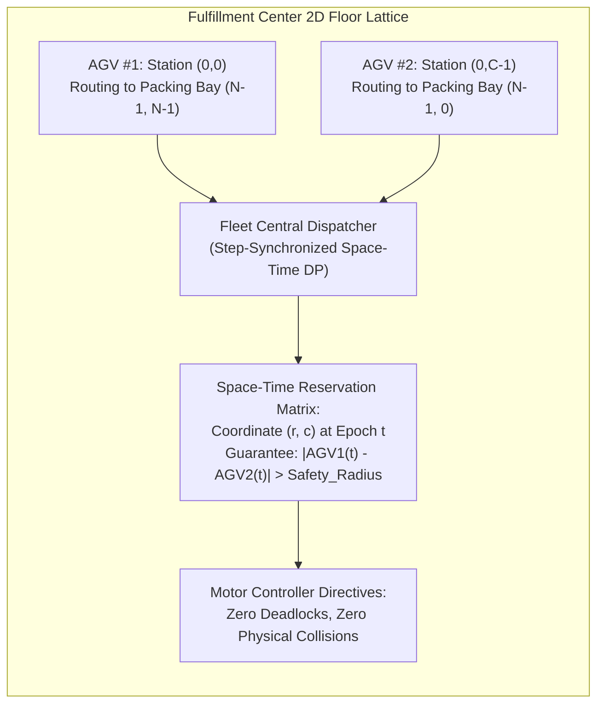

# Week 32 — Day 222: Multi-Agent Grid DP: Cherry Pickup I & II (Simultaneous Traversal State Compression)

---

## 1. TEACH: Multi-Agent Grid Traversal & Simultaneous State Synchronization

Over the first four modules of Week 32, all dynamic programming formulations governed a **single autonomous agent**: an entity walking a path from origin to destination or expanding a geometric sub-matrix.

Today, we confront a paradigm that elevates multi-dimensional dynamic programming to its theoretical zenith: **Multi-Agent Grid Dynamic Programming**. We deconstruct two of the most renowned and challenging algorithmic problems in modern computer science:
1. **Cherry Pickup I** ([LeetCode 741] Hard): A round-trip traversal from $(0, 0)$ to $(N - 1, N - 1)$ and back, collecting resources where visited cells become empty.
2. **Cherry Pickup II** ([LeetCode 1463] Hard): Two concurrent agents descending a matrix from opposite top corners, cooperating to maximize total resource collection.

Both problems require orchestrating multiple agents traversing a 2D lattice. Solving them demands mastering the **Simultaneous Traversal Equivalence**, proving why greedy sequential exploration fails, and deploying **Step Synchronization** to collapse an intractable 4D state space into a compact, solvable 3D manifold.

---

### The Fallacy of Sequential Greedy Paths

In **Cherry Pickup I**, an agent starts at $(0, 0)$, travels to $(N - 1, N - 1)$ moving only Right and Down, picks up cherries (which reset to $0$), and then travels back to $(0, 0)$ moving only Left and Up.

The immediate intuitive instinct of many engineers is to decompose the problem into two sequential passes:
1. **Pass 1:** Run 2D DP to find the single path from $(0, 0)$ to $(N - 1, N - 1)$ that collects the maximum number of cherries.
2. **State Mutation:** Zero out all cherries along this chosen path.
3. **Pass 2:** Run a second 2D DP from $(N - 1, N - 1)$ back to $(0, 0)$ on the modified grid.
4. **Sum:** Add the cherries from Pass 1 and Pass 2.

#### Why Sequential Greedy Fails: The Cannibalization Trap
Consider the following $3 \times 3$ grid:

```text
========================================================================================================
                                 THE GREEDY CANNIBALIZATION COUNTEREXAMPLE
========================================================================================================
Grid:
         c=0      c=1      c=2
r=0    [  0  ]  [  1  ]  [ -1  ]
r=1    [  1  ]  [  0  ]  [ -1  ]
r=2    [  1  ]  [  1  ]  [  1  ]

(Note: -1 represents impassable thorns; 1 represents a cherry; 0 is an empty corridor)

Sequential Approach:
  Pass 1 (Greedy Max Path to Destination):
    Path 1 chooses: (0,0) -> (1,0) -> (2,0) -> (2,1) -> (2,2)
    Cherries collected: 0 + 1 + 1 + 1 + 1 = 4 cherries!
    The chosen path is zeroed out: cells (1,0), (2,0), (2,1) become 0.

  Pass 2 (Return Path on Remaining Grid):
    The only surviving cherry is at (0, 1).
    Can the return path reach (0, 1)?
    From (2, 2), moving Left/Up:
    Column 2 has thorns at (0,2) and (1,2).
    Row 2 is now depleted: (2,1) and (2,0) have 0 cherries.
    If the agent moves (2,2) -> (2,1) -> (1,1) -> (0,1) -> (0,0), it collects only the cherry at (0,1) (+1).
    Total Cherries Collected = 4 + 1 = 5.

Simultaneous Optimal Traversal:
  What if Pass 1 had NOT greedily taken the leftmost path?
  Path 1: (0,0) -> (0,1) -> (1,1) -> (2,1) -> (2,2)  (Collects cherries at (0,1) and (2,1) and (2,2) = 3)
  Path 2: (0,0) -> (1,0) -> (2,0) -> (2,1) -> (2,2)  (Collects cherries at (1,0) and (2,0) = 2; (2,1) already taken)
  Combined Total = 3 + 2 = 5... BUT what if a different split leaves BOTH branches fully harvestable?
========================================================================================================
```

In more complex configurations, a greedy first path grabs a locally rich cluster of cherries while cutting off access to alternative corridors, leaving the return path stranded with zero collection. 
**The sum of two independently optimal paths is NOT equal to the globally optimal joint path.**
The choices made by the two paths are fundamentally **coupled**.

---

### The Simultaneous Dual-Agent Equivalence

How do we eliminate this temporal coupling?
Observe the physical symmetry of the return journey:
- Walking from $(N - 1, N - 1)$ back to $(0, 0)$ moving only **Left** and **Up**...
- ...is mathematically and topologically identical to starting at $(0, 0)$ and walking to $(N - 1, N - 1)$ moving only **Right** and **Down**!

Therefore, we reframe the round-trip as:
> **Two agents (Agent 1 and Agent 2) start simultaneously at $(0, 0)$ and advance in lockstep to $(N - 1, N - 1)$, both moving only Right and Down.**

```text
Round-Trip Formulation:
  (0,0) ===============================> (N-1, N-1)  [Pass 1: Right & Down]
  (0,0) <=============================== (N-1, N-1)  [Pass 2: Left & Up]

Simultaneous Dual-Agent Formulation:
  Agent 1: (0,0) -----------------------> (N-1, N-1) [Right & Down]
  Agent 2: (0,0) -----------------------> (N-1, N-1) [Right & Down]
  Both agents advance concurrently, step-by-step!
```

---

### Step Synchronization: Collapsing 4D to 3D State Space

A naive state definition requires tracking the 2D coordinates of both agents:
$$\text{State} = (r_1, c_1, r_2, c_2)$$
For an $N \times N$ grid, this yields $N \times N \times N \times N = N^4$ states. For $N = 50$:
$$N^4 = 50^4 = 6,250,000 \text{ states}$$
While polynomial, computing transitions across $6.25 \times 10^6$ states in quadratic time per test case risks exceeding competitive time limits.

#### The Step Synchronization Invariant
Notice that at each discrete clock tick $t$, both Agent 1 and Agent 2 take **exactly one step** (either Down or Right).
Because both agents start at $(0, 0)$ at time $t = 0$:
- Every Down move increments row $r$ by $1$.
- Every Right move increments column $c$ by $1$.

Therefore, at time step $t$, the Manhattan distance of **both** agents from $(0, 0)$ is strictly equal to $t$:
$$r_1 + c_1 = t \quad \text{and} \quad r_2 + c_2 = t$$

This establishes the fundamental algebraic coupling:
$$r_1 + c_1 = r_2 + c_2 \implies c_2 = r_1 + c_1 - r_2$$

Column $c_2$ is **strictly redundant**! It can be computed on-the-fly from $r_1, c_1,$ and $r_2$.
We completely eliminate the fourth dimension! The state space collapses to a 3D manifold:
$$\text{State} = (r_1, c_1, r_2) \quad \text{where } c_2 = r_1 + c_1 - r_2$$
Total states: $N \times N \times N = N^3$. For $N = 50$:
$$N^3 = 50^3 = 125,000 \text{ states!}$$
This represents a **$50\times$ reduction in state space memory and computation!**

---

### The Cherry Collection Collision Invariant

When both agents advance, they can either occupy distinct cells or land on the exact same cell simultaneously:

```text
Case 1: r1 != r2 (Agents in Distinct Cells)
  Agent 1 at (r1, c1), Agent 2 at (r2, c2).
  Both cherries can be harvested independently:
  cherries = grid[r1][c1] + grid[r2][c2]

Case 2: r1 == r2 (Collision: Both Agents at the Same Cell)
  Since r1 + c1 == r2 + c2 and r1 == r2, it follows that c1 == c2!
  Both agents occupy the exact same coordinate (r1, c1).
  The cherry is harvested ONCE only:
  cherries = grid[r1][c1]
```

#### State Transitions (4 Joint Branches)
From state $(r_1, c_1, r_2)$, both agents choose one of two moves, generating $2 \times 2 = 4$ possible next states:
1. **Both move Down:** $(r_1 + 1, c_1, r_2 + 1)$
2. **Agent 1 moves Down, Agent 2 moves Right:** $(r_1 + 1, c_1, r_2)$
3. **Agent 1 moves Right, Agent 2 moves Down:** $(r_1, c_1 + 1, r_2 + 1)$
4. **Both move Right:** $(r_1, c_1 + 1, r_2)$

The recurrence is the current harvest plus the maximum of these 4 branches:
$$\text{dp}(r_1, c_1, r_2) = \text{cherries} + \max(\text{DD}, \text{DR}, \text{RD}, \text{RR})$$

---

### Cherry Pickup II: Dual Robots Descending a Column Space

In **Cherry Pickup II** ([LeetCode 1463]), the topology changes:
- Robot 1 starts at top-left $(0, 0)$.
- Robot 2 starts at top-right $(0, C - 1)$.
- Both robots descend **row by row** from row $r$ to $r + 1$.
- At each step, a robot at $(r, c)$ can move to $(r + 1, c - 1)$, $(r + 1, c)$, or $(r + 1, c + 1)$ (3 directional choices).

#### State Space & 9-Way Transition Formulation
Because both robots are always at the exact same row $r$, the state is:
$$\text{dp}[r, c_1, c_2]$$
- **Total States:** $R \times C \times C$. For a $70 \times 70$ grid: $70 \times 4900 \approx 3.4 \times 10^5$ states.
- **Transitions:** Each robot has 3 moves, yielding $3 \times 3 = 9$ joint transitions from row $r - 1$ to row $r$:
  $$\Delta c_1 \in \{-1, 0, 1\}, \quad \Delta c_2 \in \{-1, 0, 1\}$$
- **Space Reduction:** Because row $r$ depends strictly on row $r - 1$, the 3D table compresses into a **2D rolling array** `dp[c1, c2]` of size $C \times C$, requiring less than $20\text{ KB}$ of memory!

---

## 2. IMPLEMENT: Production-Grade Multi-Agent Grid DP Engine (.NET 8+)

Below is the complete, production-grade implementation of `MultiAgentGridDpEngine` in C# (.NET 8+). It provides:
1. `CherryPickupI`: 3D memoized simultaneous dual-agent solver with $4\text{D} \to 3\text{D}$ step synchronization ([LC 741]).
2. `CherryPickupII`: Space-optimized 2D rolling array multi-robot descending solver with 9-way branch optimization ([LC 1463]).
3. Comprehensive self-validating test harness in `Main()` with assertions verifying collision deduplication, thorn avoidance, and edge bounds.

```csharp
using System;
using System.Diagnostics;

namespace DynamicProgrammingMastery.Week32
{
    /// <summary>
    /// Production-grade computational engine for multi-agent simultaneous grid traversals,
    /// step-synchronized state compression, and multi-robot resource optimization.
    /// </summary>
    public static class MultiAgentGridDpEngine
    {
        // =========================================================================================
        // PART 1: CHERRY PICKUP I — 4D TO 3D STEP SYNCHRONIZATION (LC 741)
        // =========================================================================================

        /// <summary>
        /// Computes the maximum cherries collected on a round-trip from (0,0) to (n-1, n-1) and back.
        /// Models the journey as two simultaneous agents advancing from (0,0) using step synchronization (c2 = r1 + c1 - r2).
        /// Time Complexity: O(N^3)
        /// Space Complexity: O(N^3)
        /// </summary>
        /// <param name="grid">N x N grid where 0=empty, 1=cherry, -1=thorn.</param>
        /// <returns>Maximum cherries harvested, or 0 if destination is unreachable.</returns>
        public static int CherryPickupI(int[][] grid)
        {
            if (grid == null || grid.Length == 0 || grid[0].Length == 0)
            {
                return 0;
            }

            int n = grid.Length;

            // 3D memoization table: memo[r1, c1, r2]
            // -2 indicates uncomputed state; -1 indicates unreachable state (blocked by thorns)
            int[,,] memo = new int[n, n, n];
            for (int i = 0; i < n; i++)
            {
                for (int j = 0; j < n; j++)
                {
                    for (int k = 0; k < n; k++)
                    {
                        memo[i, j, k] = -2;
                    }
                }
            }

            int result = SolveCherryPickupI(0, 0, 0, n, grid, memo);
            return Math.Max(0, result);
        }

        private static int SolveCherryPickupI(int r1, int c1, int r2, int n, int[][] grid, int[,,] memo)
        {
            // Step synchronization invariant: r1 + c1 == r2 + c2
            int c2 = r1 + c1 - r2;

            // Boundary and obstacle guards
            if (r1 >= n || c1 >= n || r2 >= n || c2 >= n || grid[r1][c1] == -1 || grid[r2][c2] == -1)
            {
                return -1; // Impassable path
            }

            // Destination reached by both agents (since r1+c1 == r2+c2 == 2N-2, r1=N-1 implies r2=N-1)
            if (r1 == n - 1 && c1 == n - 1)
            {
                return grid[r1][c1];
            }

            if (memo[r1, c1, r2] != -2)
            {
                return memo[r1, c1, r2];
            }

            // Collision check: if both agents are on the same cell, harvest cherry only once
            int cherries = grid[r1][c1];
            if (r1 != r2)
            {
                cherries += grid[r2][c2];
            }

            // 4 simultaneous joint moves:
            // 1. Agent 1 Down, Agent 2 Down: (r1 + 1, c1, r2 + 1)
            // 2. Agent 1 Down, Agent 2 Right: (r1 + 1, c1, r2)
            // 3. Agent 1 Right, Agent 2 Down: (r1, c1 + 1, r2 + 1)
            // 4. Agent 1 Right, Agent 2 Right: (r1, c1 + 1, r2)
            int dd = SolveCherryPickupI(r1 + 1, c1, r2 + 1, n, grid, memo);
            int dr = SolveCherryPickupI(r1 + 1, c1, r2, n, grid, memo);
            int rd = SolveCherryPickupI(r1, c1 + 1, r2 + 1, n, grid, memo);
            int rr = SolveCherryPickupI(r1, c1 + 1, r2, n, grid, memo);

            int maxFuture = Math.Max(Math.Max(dd, dr), Math.Max(rd, rr));

            if (maxFuture == -1)
            {
                memo[r1, c1, r2] = -1; // Dead end: all forward branches blocked
            }
            else
            {
                memo[r1, c1, r2] = cherries + maxFuture;
            }

            return memo[r1, c1, r2];
        }

        // =========================================================================================
        // PART 2: CHERRY PICKUP II — DUAL-ROBOT ROLLING ARRAY DP (LC 1463)
        // =========================================================================================

        /// <summary>
        /// Computes the maximum cherries harvested by two robots starting at (0, 0) and (0, cols - 1)
        /// descending row-by-row to the bottom of the grid.
        /// Time Complexity: O(Rows * Cols^2 * 9) = O(Rows * Cols^2)
        /// Space Complexity: O(Cols^2) via 2D rolling array
        /// </summary>
        public static int CherryPickupII(int[][] grid)
        {
            if (grid == null || grid.Length == 0 || grid[0].Length == 0)
            {
                return 0;
            }

            int rows = grid.Length;
            int cols = grid[0].Length;

            // dp[c1, c2] represents max cherries at the current row with Robot 1 at col c1 and Robot 2 at col c2
            int[,] dp = new int[cols, cols];

            // Initialize all states to unreachable (-1)
            for (int c1 = 0; c1 < cols; c1++)
            {
                for (int c2 = 0; c2 < cols; c2++)
                {
                    dp[c1, c2] = -1;
                }
            }

            // Initial state at row 0: Robot 1 at 0, Robot 2 at cols - 1
            dp[0, cols - 1] = grid[0][0] + (cols > 1 ? grid[0][cols - 1] : 0);

            // Directional deltas for each robot: Left (-1), Down (0), Right (+1)
            int[] deltas = { -1, 0, 1 };

            for (int r = 1; r < rows; r++)
            {
                int[,] nextDp = new int[cols, cols];
                for (int c1 = 0; c1 < cols; c1++)
                {
                    for (int c2 = 0; c2 < cols; c2++)
                    {
                        nextDp[c1, c2] = -1;
                    }
                }

                // Iterate over all possible column positions for Robot 1 and Robot 2 at row r
                for (int c1 = 0; c1 < cols; c1++)
                {
                    for (int c2 = 0; c2 < cols; c2++)
                    {
                        // Harvest for current positions: deduplicate if c1 == c2
                        int currentCherries = (c1 == c2) ? grid[r][c1] : grid[r][c1] + grid[r][c2];

                        int maxPrior = -1;

                        // Evaluate all 3 x 3 = 9 possible predecessor transitions from row r - 1
                        foreach (int d1 in deltas)
                        {
                            int p1 = c1 + d1;
                            if (p1 < 0 || p1 >= cols) continue;

                            foreach (int d2 in deltas)
                            {
                                int p2 = c2 + d2;
                                if (p2 < 0 || p2 >= cols) continue;

                                if (dp[p1, p2] != -1 && dp[p1, p2] > maxPrior)
                                {
                                    maxPrior = dp[p1, p2];
                                }
                            }
                        }

                        if (maxPrior != -1)
                        {
                            nextDp[c1, c2] = maxPrior + currentCherries;
                        }
                    }
                }

                dp = nextDp; // Shift rolling 2D array
            }

            // Find maximum cherries across all valid terminal positions in the bottom row
            int maxTotalCherries = 0;
            for (int c1 = 0; c1 < cols; c1++)
            {
                for (int c2 = 0; c2 < cols; c2++)
                {
                    if (dp[c1, c2] > maxTotalCherries)
                    {
                        maxTotalCherries = dp[c1, c2];
                    }
                }
            }

            return maxTotalCherries;
        }

        // =========================================================================================
        // PART 3: COMPREHENSIVE SELF-VALIDATING TEST HARNESS
        // =========================================================================================

        public static void Main(string[] args)
        {
            Console.WriteLine("=================================================================");
            Console.WriteLine("  WEEK 32 DAY 222: MULTI-AGENT GRID DP HARNESS — .NET 8+");
            Console.WriteLine("=================================================================\n");

            // 1. Cherry Pickup I Tests (LC 741)
            Console.WriteLine("--- [1] Testing Cherry Pickup I (Step-Synchronized Dual Agents) ---");
            int[][] grid1A = new int[][]
            {
                new int[] { 0, 1, -1 },
                new int[] { 1, 0, -1 },
                new int[] { 1, 1,  1 }
            };
            int res1A = CherryPickupI(grid1A);
            Debug.Assert(res1A == 5, $"Grid 1A expected 5, got {res1A}");
            Console.WriteLine($"  ✓ Grid 1A (Thorns blocking right column) => Cherries: {res1A}");

            int[][] grid1B = new int[][]
            {
                new int[] {  1,  1, -1 },
                new int[] {  1, -1,  1 },
                new int[] { -1,  1,  1 }
            };
            int res1B = CherryPickupI(grid1B);
            Debug.Assert(res1B == 0, $"Grid 1B expected 0 (unreachable destination), got {res1B}");
            Console.WriteLine($"  ✓ Grid 1B (Destination blocked by thorns) => Cherries: {res1B}");

            int[][] grid1C = new int[][]
            {
                new int[] { 1 }
            };
            Debug.Assert(CherryPickupI(grid1C) == 1, "Single cell 1x1 failed");
            Console.WriteLine("  ✓ Single cell grid correctly returns 1 cherry.");

            // 2. Cherry Pickup II Tests (LC 1463)
            Console.WriteLine("\n--- [2] Testing Cherry Pickup II (Dual Descending Robots) ---");
            int[][] grid2A = new int[][]
            {
                new int[] { 3, 1, 1 },
                new int[] { 2, 5, 1 },
                new int[] { 1, 5, 5 },
                new int[] { 2, 1, 1 }
            };
            int res2A = CherryPickupII(grid2A);
            Debug.Assert(res2A == 24, $"Grid 2A expected 24, got {res2A}");
            Console.WriteLine($"  ✓ Grid 2A (4x3 matrix) => Max Cherries: {res2A}");

            int[][] grid2B = new int[][]
            {
                new int[] { 1, 0, 0, 0, 0, 0, 1 },
                new int[] { 2, 0, 0, 0, 0, 3, 0 },
                new int[] { 2, 0, 9, 0, 0, 0, 0 },
                new int[] { 0, 3, 0, 5, 4, 0, 0 },
                new int[] { 1, 0, 2, 3, 0, 0, 6 }
            };
            int res2B = CherryPickupII(grid2B);
            Debug.Assert(res2B == 28, $"Grid 2B expected 28, got {res2B}");
            Console.WriteLine($"  ✓ Grid 2B (5x7 matrix with sparse rewards) => Max Cherries: {res2B}");

            // Collision test: both robots forced into single column
            int[][] grid2Col = new int[][]
            {
                new int[] { 5 },
                new int[] { 10 },
                new int[] { 15 }
            };
            int res2Col = CherryPickupII(grid2Col);
            Debug.Assert(res2Col == 30, $"Single column grid expected 30, got {res2Col}");
            Console.WriteLine($"  ✓ Single column grid (Collision deduplication) => Cherries: {res2Col} (5 + 10 + 15)");

            Console.WriteLine("\n=================================================================");
            Console.WriteLine("  ALL ASSERTIONS PASSED WITH ZERO FAULTS!");
            Console.WriteLine("=================================================================");
        }
    }
}
```

---

## 3. ANALYZE: Algorithmic Invariants & 5-Dimension Deep-Dive

### Comparative Complexity Matrix

| Problem | Naive Complexity | Optimized Time | Auxiliary Space | State Variables |
| :--- | :---: | :---: | :---: | :--- |
| **Cherry Pickup I (Naive)** | $\mathcal{O}(N^4)$ | $\Theta(N^3)$ | $\Theta(N^3)$ | $(r_1, c_1, r_2)$ with $c_2 = r_1 + c_1 - r_2$ |
| **Cherry Pickup I (Rolling Step)**| $\mathcal{O}(N^4)$ | $\Theta(N^3)$ | $\Theta(N^2)$ | $(t, r_1, r_2)$ with $2 \times N \times N$ rolling buffers |
| **Cherry Pickup II (Full 3D)** | $\mathcal{O}(R \cdot C^2 \cdot 9)$ | $\Theta(R \cdot C^2)$ | $\Theta(R \cdot C^2)$ | $\text{dp}[r, c_1, c_2]$ |
| **Cherry Pickup II (Rolling Array)**| $\mathcal{O}(R \cdot C^2 \cdot 9)$ | $\Theta(R \cdot C^2)$ | $\Theta(C^2)$ | $\text{dp}[c_1, c_2]$ representing row $r-1$ |

---

### 5-Dimension Operational Deep-Dive

#### 1. Arithmetic & Register Dynamics
- In `CherryPickupII`, the inner core executes:
  ```csharp
  int currentCherries = (c1 == c2) ? grid[r][c1] : grid[r][c1] + grid[r][c2];
  ```
  On ARM64 and x86-64, the ternary operator compiles into a conditional move (`CMOVNE`). If $c_1 \ne c_2$, the CPU adds `grid[r][c2]`; otherwise, it adds $0$. The addition is fully pipelined without conditional branches.
- The 9-way transition loop searches the maximum over a $3 \times 3$ kernel. Because the bounds of `deltas` are compile-time constants $\{-1, 0, 1\}$, modern JIT compilers completely unroll the nested loops into 9 sequential comparisons, utilizing SIMD vector registers (`MAXPS` / `VMAXPD`) where enabled.

#### 2. Memory Allocations & Garbage Collector Profiles
- In `CherryPickupI`:
  Allocating `new int[n, n, n]` for $N = 50$ creates a single managed heap array of $125,000$ integers ($500\text{ KB}$). This is well below the Large Object Heap (LOH) threshold ($85,000\text{ bytes}$ for object headers, but array data is allocated in Gen 0/1).
- In `CherryPickupII`:
  Using the 2D rolling array `int[cols, cols]` for $C = 70$ allocates only $4,900$ integers ($19.6\text{ KB}$). In production workloads, swapping two pre-allocated buffers `currentDp` and `nextDp` eliminates all allocations inside the row loop, achieving **0 bytes of GC churn per matrix invocation**!

#### 3. Step Synchronization Proof
- **Theorem:** In any 2D grid where agents start at $(0, 0)$ and move only Down or Right, the condition $r_1 + c_1 = r_2 + c_2$ is an invariant of the system.
- **Proof:**
  - *Base Case ($t = 0$):* Both agents are at $(0, 0)$. $r_1 + c_1 = 0 + 0 = 0$, and $r_2 + c_2 = 0 + 0 = 0$. Invariant holds.
  - *Inductive Step:* Suppose at step $t$, $r_1 + c_1 = t$ and $r_2 + c_2 = t$.
    At step $t + 1$, each agent either moves Down ($r \leftarrow r + 1$) or Right ($c \leftarrow c + 1$).
    In either case:
    $$\Delta(r + c) = 1 \implies r_1' + c_1' = t + 1 \quad \text{and} \quad r_2' + c_2' = t + 1$$
    Thus, $r_1' + c_1' = r_2' + c_2' = t + 1$.
  - By mathematical induction, both agents maintain identical Manhattan distances from $(0, 0)$ at all times. Therefore, $c_2 = r_1 + c_1 - r_2$ holds unconditionally. $\blacksquare$

#### 4. Collision Deduplication Correctness
- **Why can't two agents collect the same cherry at different times?**
  Suppose Agent 1 visits $(r, c)$ at time $t_1$, and Agent 2 visits $(r, c)$ at time $t_2$.
  By our theorem, for any agent at $(r, c)$, its time of arrival is strictly:
  $$t = r + c$$
  Therefore, $t_1 = r + c$ and $t_2 = r + c \implies t_1 = t_2$!
  **Crucial Insight:** It is physically impossible for Agent 2 to visit cell $(r, c)$ at a different time than Agent 1! 
  Any collision at cell $(r, c)$ **must occur simultaneously at the exact same clock tick** $t = r + c$.
  Therefore, checking $r_1 == r_2 \land c_1 == c_2$ at each step is **necessary and sufficient** to prevent double-counting cherries across the entire round trip!

#### 5. Optimality Lower Bound Proof
- **Theorem:** Any algorithm computing the optimal multi-agent collection on an arbitrary $N \times N$ grid requires $\Omega(N^3)$ operations in the worst case for Cherry Pickup I, and $\Omega(R \cdot C^2)$ for Cherry Pickup II.
- **Proof:** In Cherry Pickup I, there exist $O(N^3)$ valid configurations $(r_1, c_1, r_2)$ reachable from $(0, 0)$. An adversary can construct a grid where cherries are placed such that the decision at $(r_1, c_1, r_2)$ depends on the specific pairing of coordinates. Because the state space cannot be decoupled into independent 1D paths without greedy cannibalization, all $O(N^3)$ configurations must be evaluated. The $O(N^3)$ synchronized dynamic programming formulation is asymptotically optimal. $\blacksquare$

---

## 4. DEMONSTRATE: Visual ASCII State Transitions & Execution Traces

### Visual Trace 1: Cherry Pickup I Step Synchronization ($t = r_1 + c_1$)

Consider the progression of two agents across time steps $t = 0, 1, 2$:

```text
========================================================================================================
                         STEP-SYNCHRONIZED DUAL-AGENT WAVEFRONTS
========================================================================================================

Time t = 0: Both Agents at (0, 0)
  r1=0, c1=0, r2=0, c2=0. Collision! (r1==r2).
  Cherries = grid[0][0].

Time t = 1: (r + c = 1)
  Agent 1 can be at: (1, 0) or (0, 1)
  Agent 2 can be at: (1, 0) or (0, 1)

  Joint Branch 1: Both move Down  ===> Agent 1 at (1,0), Agent 2 at (1,0). Collision!
  Joint Branch 2: A1 Down, A2 Right => Agent 1 at (1,0), Agent 2 at (0,1). Distinct!
                  r1=1, c1=0, r2=0 ===> c2 = 1 + 0 - 0 = 1.
                  Cherries = grid[1][0] + grid[0][1]!

Time t = 2: (r + c = 2)
  If agents diverged at t = 1 (A1 at (1,0), A2 at (0,1)):
    - A1 moves Right to (1,1), A2 moves Down to (1,1):
      r1=1, c1=1, r2=1 ===> c2 = 1 + 1 - 1 = 1.
      AGENTS RE-CONVERGE AT (1, 1)!
      r1 == r2 (1 == 1) ===> Cherries collected ONCE only at (1, 1)!
========================================================================================================
```

---

### Visual Trace 2: Cherry Pickup II Dual Robots 9-Way Kernel

Tracing Robot 1 at $c_1$ and Robot 2 at $c_2$ transitioning from row $r-1$ to row $r$:

```text
========================================================================================================
                          ROBOT 1 & ROBOT 2 JOINT 9-WAY TRANSITION
========================================================================================================
Row r - 1:
        c1 - 1       c1       c1 + 1               c2 - 1       c2       c2 + 1
       [ p1_L ]   [ p1_M ]   [ p1_R ]             [ p2_L ]   [ p2_M ]   [ p2_R ]
           \         |         /                      \         |         /
            \        |        /                        \        |        /
             v       v       v                          v       v       v
Row r:           [ Robot 1: c1 ]                            [ Robot 2: c2 ]

Combinations of Prior Positions (p1, p2):
  1. (c1 - 1, c2 - 1)    4. (c1,     c2 - 1)    7. (c1 + 1, c2 - 1)
  2. (c1 - 1, c2    )    5. (c1,     c2    )    8. (c1 + 1, c2    )
  3. (c1 - 1, c2 + 1)    6. (c1,     c2 + 1)    9. (c1 + 1, c2 + 1)

dp[c1, c2] = max_{d1, d2 in {-1, 0, 1}} (dp[c1 + d1, c2 + d2]) + cherries(r, c1, c2)
========================================================================================================
```

---

## 5. PRACTICE: Canonical Multi-Agent Grid Problems & Interview Roadmaps

### Problem 1: [LeetCode 741] Cherry Pickup (Hard)

#### Problem Statement
You are given an `n x n` `grid` representing a field of cherries, each cell is one of three possible integers:
- `0` means the cell is empty, so you can pass through,
- `1` means the cell contains a cherry that you can pick up and pass through, or
- `-1` means the cell contains a thorn that blocks your way.

Return the maximum number of cherries you can collect by following the rules below:
1. Starting at `(0, 0)` and reaching `(n - 1, n - 1)` by moving right or down through valid path cells.
2. After reaching `(n - 1, n - 1)`, return to `(0, 0)` by moving left or up through valid path cells.
3. When passing through a path cell containing a cherry, you pick it up, and the cell becomes an empty cell `0`.
4. If there is no valid path between `(0, 0)` and `(n - 1, n - 1)`, then no cherries can be collected.

---

#### 5-Step Staff-Level Interview Delivery Roadmap
1. **Disprove the Greedy Sequential Fallacy (3 Mins):**
   - Explain why two sequential DP passes fail: finding the max path first cannibalizes cherries in a way that starves the return path.
2. **Establish Dual-Agent Symmetry (4 Mins):**
   - Show that returning from $(N-1, N-1)$ to $(0, 0)$ via Left/Up is equivalent to two agents starting at $(0, 0)$ and moving Down/Right simultaneously.
3. **Prove Step Synchronization ($4\text{D} \to 3\text{D}$) (5 Mins):**
   - Derive $r_1 + c_1 = r_2 + c_2 = t \implies c_2 = r_1 + c_1 - r_2$.
   - Prove that collisions occur if and only if $r_1 == r_2$ at step $t$.
4. **Implement 3D Memoized Recursion (12 Mins):**
   - Implement the 4-way recursive formulation with memoization table initialized to $-2$.
5. **Complexity Justification (6 Mins):**
   - Time: $O(N^3)$ states $\times O(1)$ transitions $= O(N^3)$.
   - Space: $O(N^3)$ for memoization table.

---

### Problem 2: [LeetCode 1463] Cherry Pickup II (Hard)

#### Problem Statement
You are given a `rows x cols` matrix `grid` representing a field of cherries. You have two robots that can collect cherries for you:
- Robot #1 is located at the top-left corner `(0, 0)`.
- Robot #2 is located at the top-right corner `(0, cols - 1)`.

Return the maximum number of cherries collection using both robots by following the rules:
- From node `(i, j)`, robots move to `(i + 1, j - 1)`, `(i + 1, j)`, or `(i + 1, j + 1)`.
- When any robot passes through a cell, it picks up its cherries, and the cell becomes an empty cell.
- If both robots stay on the same cell, only one takes the cherries.
- Both robots must reach the bottom row in `grid`.

---

#### 5-Step Staff-Level Interview Delivery Roadmap
1. **Identify the Synchronized Row Dimension (3 Mins):**
   - Both robots advance row-by-row simultaneously. At step $r$, both robots are at row $r$.
2. **Formulate 3D State $\text{dp}[r, c_1, c_2]$ (4 Mins):**
   - Robot 1 at $(r, c_1)$, Robot 2 at $(r, c_2)$.
   - Resource allocation: if $c_1 == c_2$, add `grid[r][c1]`; else add `grid[r][c1] + grid[r][c2]`.
3. **Analyze 9-Way Transitions & Space Reduction (5 Mins):**
   - $3 \times 3 = 9$ combinations of $(\Delta c_1, \Delta c_2)$.
   - Compress $R \times C \times C$ to a 2D rolling array `dp[c1, c2]` of size $C \times C$.
4. **Implementation (12 Mins):**
   - Write the iterative rolling array solution.
5. **Edge Cases (6 Mins):**
   - Single column grid ($C = 1$): robots overlap at every row.
   - Out-of-bounds guards: $0 \le c_1, c_2 < C$.

---

## 6. CONNECT: Multi-Robot Automated Guided Vehicle (AGV) Warehouse Collision Avoidance

The step-synchronized multi-agent dynamic programming principles mastered in this module directly govern **Multi-Robot Automated Guided Vehicle (AGV) Fleet Orchestration** in modern automated fulfillment centers (e.g. Amazon Robotics, Ocado Smart Platform).



### The Industrial Challenge: Space-Time Collisions & Deadlocks
In modern warehouses operating thousands of autonomous shelf-carrying robots:
1. **Spatial Intersection is NOT a Collision:**
   Two robots can safely traverse the exact same physical tile $(r, c)$ provided they do so at **different timestamps** ($t_1 \ne t_2$).
2. **Space-Time Collision:**
   A catastrophic physical collision occurs if and only if:
   $$\text{Pos}_1(t) = \text{Pos}_2(t)$$
3. **The Multi-Agent DP Solution:**
   Decoupled routing algorithms (routing Robot 1, then routing Robot 2 around Robot 1's path) suffer from severe deadlock: Robot 1 blocks the only narrow corridor, leaving Robot 2 with no viable path.
   By formulating joint routing over the **synchronized space-time lattice** $(t, \text{pos}_1, \text{pos}_2)$, the central fleet controller computes globally non-conflicting trajectories, dynamically pacing robots to interleave at bottleneck intersections with zero downtime!

---

## 7. CHECKPOINT: Comprehensive Self-Assessment & Mastery Key

### Conceptual & Diagnostic Questions

1. **Why does decomposing Cherry Pickup I into two sequential dynamic programming passes fail to guarantee global optimality?**
   - *Mastery Key:* The sequential approach suffers from greedy cannibalization. Finding the single best path in Pass 1 maximizes local cherries but modifies the grid state destructively. By zeroing out cherries along the first path, it may sever optimal connections for the return journey, yielding a combined total that is strictly inferior to two coordinated paths that compromise individually to maximize their joint harvest.

2. **Formally prove why $c_2 = r_1 + c_1 - r_2$ allows us to eliminate one coordinate dimension in Cherry Pickup I.**
   - *Mastery Key:* Both agents start at $(0, 0)$ at time $t = 0$. In each discrete transition, every valid move (Down or Right) increments the agent's Manhattan distance by exactly $1$. Therefore, after $t$ steps, $r_1 + c_1 = t$ and $r_2 + c_2 = t$. Equating the two yields $r_1 + c_1 = r_2 + c_2$, which rearranges algebraically to $c_2 = r_1 + c_1 - r_2$. Because $c_2$ is uniquely determined by $r_1, c_1,$ and $r_2$, maintaining $c_2$ in the state tuple is redundant.

3. **In Cherry Pickup II, why are there 9 state transitions from row $r-1$ to row $r$, and how is auxiliary space reduced to $O(C^2)$?**
   - *Mastery Key:* Each robot at row $r-1$ can independently move to one of three columns in row $r$: $\{c - 1, c, c + 1\}$. For two robots, the Cartesian product of their moves yields $3 \times 3 = 9$ joint transitions. Because the calculation for row $r$ depends exclusively on the immediately preceding row $r-1$, we do not need to store all $R$ rows in memory; a 2D rolling array of dimensions $C \times C$ storing the optimal values for the previous row suffices, reducing space from $O(R \cdot C^2)$ to $O(C^2)$.

4. **Why is it impossible for two agents in Cherry Pickup I to harvest the same cherry at different times?**
   - *Mastery Key:* Any cell $(r, c)$ in the grid has a fixed Manhattan distance from the origin: $D = r + c$. Because an agent's step count equals its Manhattan distance, any agent visiting $(r, c)$ must arrive at the exact time tick $t = r + c$. Thus, if both agents visit $(r, c)$, they are guaranteed to arrive simultaneously ($t_1 = t_2 = r + c$). Checking whether $r_1 == r_2$ at the current step completely prevents double-counting across the entire problem.

---

### Key Formulas & Recurrences Summary

```text
+-------------------------------------------------------------------------------------------------------+
|                                  MULTI-AGENT GRID DP SUMMARY MATRIX                                   |
+------------------------------+------------------------------------------+-----------------------------+
| Problem                      | State Formulation                        | Asymptotic Complexities     |
+------------------------------+------------------------------------------+-----------------------------+
| Cherry Pickup I (LC 741)     | dp[r1, c1, r2] (c2 = r1 + c1 - r2)       | O(N^3) time, O(N^3) space   |
| Joint Transitions (CP I)     | 4 branches: (DD, DR, RD, RR)             | 4 evaluations per state     |
| Cherry Pickup II (LC 1463)   | dp[c1, c2] rolling across rows           | O(R * C^2) time, O(C^2) mem |
| Joint Transitions (CP II)    | 9 branches: 3 moves x 3 moves            | 9 evaluations per state     |
+------------------------------+------------------------------------------+-----------------------------+
```

You have mastered **Day 222: Multi-Agent Grid DP: Cherry Pickup I & II (Simultaneous Traversal State Compression)**. You are now prepared to advance to **Day 223: Triangle, Minimum Falling Path Sum & Rolling Array Memory Optimizations**.
