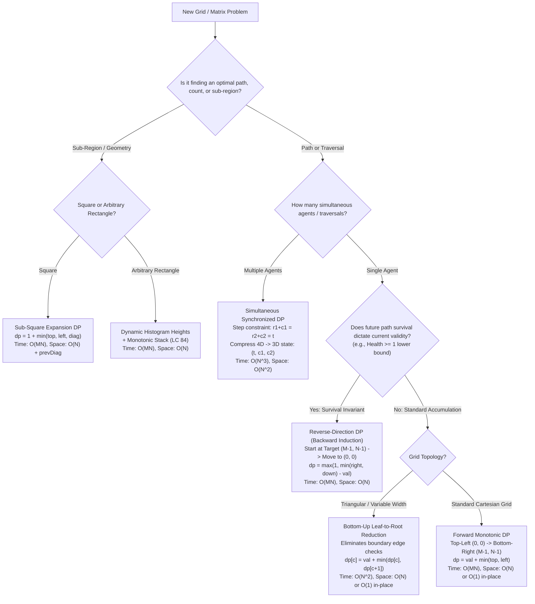

# Week 32 — Day 224: Week 32 Synthesis, 2D Grid State Transition Matrix & 45-Minute Timed Interview Drill

---

## 1. TEACH: Unified 2D Grid State Transition Topology & Algorithmic Decision Tree

Over the course of Week 32 (Days 218 to 223), we dissected 2D grid and matrix dynamic programming from basic combinatorial path counting to multi-agent simultaneous traversals and variable-width lattices. A 2D matrix is not merely a tabular collection of scalar values; in dynamic programming, it represents a **discrete topological state space** where coordinate transitions define directed acyclic graphs (DAGs). 

Every 2D grid problem is fundamentally governed by three topological properties:
1. **DAG Orientation & Directional Invariants**: Whether state flows forward from source $(0, 0)$ to destination $(M-1, N-1)$, backwards from destination to source, or symmetrically across simultaneous frontiers.
2. **Subproblem Overlap & Local Neighborhood Topologies**: Whether transitions depend on orthogonal steps (right/down), geometric sub-squares (min of 3 neighbors), multi-branch cones (left/center/right diagonals), or non-adjacent column selections.
3. **Memory Locality & Mutation Safety**: Whether the recurrence permits in-place mutation of the input matrix ($O(1)$ auxiliary space) or necessitates rolling buffers ($O(N)$ space) with diagonal preservation registers (`prevDiag`).

---

### 🎤 Multi-Topic Spoken Synthesis Drill (≤ 60 Seconds)

> *"In Staff-level technical interviews, you must articulate the structural boundary conditions that separate different 2D grid DP paradigms in under a minute without hesitation. Practice delivering the following synthesis aloud verbatim until it flows smoothly in under 60 seconds:"*

```
"When evaluating a 2D matrix dynamic programming problem, I immediately classify it along three architectural axes: Directionality, Frontier Synchronization, and Neighborhood Topology.

For simple path accumulation like Unique Paths or Minimum Path Sum, transitions flow monotonically forward. A potential function Phi = r + c guarantees a strict DAG, allowing us to compute row-by-row and reduce space from O(MN) to O(N) rolling memory, or even O(1) in-place mutation.

However, when future constraints dictate current viability—such as the Knight's health in Dungeon Game—forward DP greedily fails because optimal prefix sums can violate the health >= 1 lower bound later in the path. Here, backward induction from the destination (M-1, N-1) back to (0, 0) is mandatory, enforcing an invariant that isolates terminal requirements from prefix history.

For multi-agent traversals like Cherry Pickup, independent sequential runs fail because the first path cannibalizes resources needed by the second. We must advance both agents simultaneously, utilizing step synchronization r1 + c1 = r2 + c2 = t to eliminate an entire coordinate dimension, collapsing a 4D state space into a tractable 3D manifold.

Finally, for geometric optimization like Maximal Square, the minimum of three adjacent neighbors establishes an unviolated square expansion invariant, whereas variable-width lattices like Triangle are solved most cleanly bottom-up, eliminating all boundary guards and avoiding a terminal row scan."
```

---

### 1.1 The Grand 2D Grid State Transition Taxonomy

Every classic 2D dynamic programming problem fits squarely into the taxonomy synthesized below.

| Problem Archetype | Canonical Example | Direction of State Flow | Neighborhood Dependencies | State Recurrence | Space Optimization | In-Place Safe? |
| :--- | :--- | :--- | :--- | :--- | :--- | :--- |
| **Monotonic Forward Path** | [LC 62] Unique Paths<br/>[LC 64] Min Path Sum | Forward: $(0,0) \to (M-1, N-1)$ | Top $(r-1, c)$ and Left $(r, c-1)$ | $\text{dp}[r][c] = \text{val} + \min(\text{top}, \text{left})$ | $O(N)$ 1D array | **Yes** ($O(1)$ auxiliary) |
| **Reverse Health / Safety** | [LC 174] Dungeon Game | Backward: $(M-1, N-1) \to (0,0)$ | Right $(r, c+1)$ and Down $(r+1, c)$ | $\text{dp}[r][c] = \max(1, \min(\text{right}, \text{down}) - \text{val})$ | $O(N)$ 1D array | **Yes** ($O(1)$ auxiliary) |
| **Geometric Sub-Square** | [LC 221] Maximal Square | Forward: $(0,0) \to (M-1, N-1)$ | Top, Left, Top-Left Diagonal | $\text{dp}[r][c] = 1 + \min(\text{top}, \text{left}, \text{diag})$ | $O(N)$ 1D array + `prevDiag` | No (requires char $\to$ int conversion) |
| **Dynamic Histogram Stack** | [LC 85] Maximal Rectangle | Multi-Row Forward Scan | Vertical Contiguous Heights + Stack | $h[c] = (val == '1') ? h[c] + 1 : 0$; Monotonic Stack | $O(N)$ heights array | No |
| **Multi-Agent Synchronized**| [LC 741] Cherry Pickup I<br/>[LC 1463] Cherry Pickup II | Step Synchronized: $t = r_1+c_1 = r_2+c_2$ | 4 Joint Moves: $(D,D),(D,R),(R,D),(R,R)$ | $\text{dp}[t][c_1][c_2] = \text{cherries} + \max_{\text{transitions}}(\text{dp}[t-1])$ | $O(N^2)$ 2D rolling array | No |
| **Variable-Width Convergent**| [LC 120] Triangle | Backward (Bottom-Up): Leaves $\to$ Root | Left Child $(r+1, c)$, Right Child $(r+1, c+1)$ | $\text{dp}[r][c] = \text{val} + \min(\text{left\_child}, \text{right\_child})$ | $O(N)$ 1D array | **Yes** ($O(1)$ auxiliary) |
| **Multi-Branch Falling Path** | [LC 931] Min Falling Path<br/>[LC 1289] Falling Path II | Top-to-Bottom: $r \to r+1$ | 3 Adjacent Columns / All Non-Equal Cols | $\text{dp}[r][c] = \text{val} + \min(\text{allowed\_parents})$ | $O(N)$ Dual-Min registers | Yes ($O(1)$ registers in [LC 1289]) |

---

### 1.2 Algorithmic Decision Tree for 2D Grid DP

When presented with any grid or matrix path problem in an interview, trace through this deterministic decision tree:



---

### 1.3 The In-Place Mutation Safety Theorem

A frequent debate in Staff-level system design and performance engineering is **in-place matrix mutation** ($O(1)$ auxiliary space) versus **pure functional rolling buffers** ($O(N)$ auxiliary space). Under what exact conditions is in-place mutation mathematically sound?

#### Theorem 1 (In-Place Mutation Safety Theorem)
*Let $M$ be a 2D matrix of dimensions $R \times C$. A dynamic programming algorithm can overwrite $M[r][c]$ in-situ without race conditions if and only if for every cell $(r, c)$, all prerequisite subproblems $\text{dep}(r, c)$ satisfy either:*
1. *$\text{dep}(r, c)$ precedes $(r, c)$ in the row-major sweep order and will never be referenced by any future cell $(r', c')$ where $(r', c') \succ (r, c)$, OR*
2. *$\text{dep}(r, c)$ remains strictly unmutated until all its dependent consumers have executed.*

**Proof:**
Consider standard Minimum Path Sum:
$$\text{dp}[r][c] = \text{grid}[r][c] + \min(\text{dp}[r-1][c],\; \text{dp}[r][c-1])$$
- In a row-major sweep ($r$ from $0 \to M-1$, $c$ from $0 \to N-1$), when evaluating $(r, c)$:
  - Cell $(r-1, c)$ was mutated in the previous row. Its mutated value is precisely $\text{dp}[r-1][c]$. Furthermore, cell $(r-1, c)$ will **never** be referenced by any subsequent cell in row $r$ or any subsequent row $r' > r$ (as future cells only look at $(r'-1, c')$ where $r'-1 \ge r$).
  - Cell $(r, c-1)$ was mutated in the immediately preceding iteration of the same row. Its mutated value is precisely $\text{dp}[r][c-1]$.
  - The original value of $\text{grid}[r][c]$ is read into a register before overwriting.
  - Thus, no unread prerequisites are destroyed, and no corrupted states are propagated. In-place mutation is provably safe.

**Counterexample (Where In-Place Fails):**
In Maximal Square:
$$\text{dp}[r][c] = 1 + \min(\text{dp}[r-1][c],\; \text{dp}[r][c-1],\; \text{dp}[r-1][c-1])$$
If we mutate in a single 1D array `dp[c]`:
Updating `dp[c]` requires `dp[r-1][c-1]`. But during the previous column step $c-1$, `dp[c-1]` was already overwritten with $\text{dp}[r][c-1]$! The diagonal prerequisite $\text{dp}[r-1][c-1]$ was destroyed. Therefore, in-place mutation requires an auxiliary scalar register `prevDiag` to violate condition 1 safely.
$\blacksquare$

---

## 2. IMPLEMENT: Production-Grade 2D Grid Synthesis & Benchmark Engine (.NET 8+)

Below is the complete, production-grade C# (.NET 8+) implementation encapsulated in `TwoDimensionalGridSynthesisEngine`. It provides:
1. **Challenge A**: Minimum Path Sum ([LC 64]) with in-place $O(1)$ mutation and $O(N)$ immutable rolling array, accompanied by complete coordinate path reconstruction.
2. **Challenge B**: Dungeon Game ([LC 174]) with reverse backward induction, health $\ge 1$ invariants, and a forward trajectory verification simulator that proves the computed initial health guarantees knight survival.
3. Complete self-validating test harness in `Main()` with explicit `Debug.Assert` checks.

```csharp
using System;
using System.Collections.Generic;
using System.Diagnostics;
using System.Runtime.CompilerServices;

namespace DynamicProgrammingMastery.Week32
{
    /// <summary>
    /// Production-grade computational synthesis engine for 2D grid and matrix dynamic programming.
    /// Provides zero-allocation path minimizations, backward health inductions, trajectory simulators,
    /// and full coordinate path reconstructions.
    /// </summary>
    public static class TwoDimensionalGridSynthesisEngine
    {
        // =========================================================================
        // CHALLENGE A: LEETCODE 64 — MINIMUM PATH SUM (FORWARD MONOTONIC DAG)
        // =========================================================================

        /// <summary>
        /// Computes the minimum path sum from (0,0) to (M-1, N-1) using in-place matrix mutation.
        /// Achieves O(MN) time complexity and O(1) auxiliary heap allocation.
        /// </summary>
        /// <param name="grid">M x N matrix of non-negative integers. Mutated in-situ.</param>
        /// <returns>The minimum path sum.</returns>
        public static int SolveMinPathSumInPlace(int[][] grid)
        {
            ValidateGrid(grid);
            int m = grid.Length;
            int n = grid[0].Length;

            // 1. Initialize top row (only left transitions exist)
            for (int c = 1; c < n; c++)
            {
                grid[0][c] += grid[0][c - 1];
            }

            // 2. Initialize left column (only top transitions exist)
            for (int r = 1; r < m; r++)
            {
                grid[r][0] += grid[r - 1][0];
            }

            // 3. Populate interior cells
            for (int r = 1; r < m; r++)
            {
                int[] currentRow = grid[r];
                int[] prevRow = grid[r - 1];
                for (int c = 1; c < n; c++)
                {
                    currentRow[c] += Math.Min(prevRow[c], currentRow[c - 1]);
                }
            }

            return grid[m - 1][n - 1];
        }

        /// <summary>
        /// Computes the minimum path sum using an immutable O(N) 1D rolling array.
        /// Preserves the original input matrix without mutation.
        /// </summary>
        /// <param name="grid">M x N matrix of non-negative integers.</param>
        /// <returns>The minimum path sum.</returns>
        public static int SolveMinPathSumRolling(int[][] grid)
        {
            ValidateGrid(grid);
            int m = grid.Length;
            int n = grid[0].Length;

            int[] dp = new int[n];
            dp[0] = grid[0][0];

            // Initialize row 0
            for (int c = 1; c < n; c++)
            {
                dp[c] = dp[c - 1] + grid[0][c];
            }

            // Sweep through remaining rows
            for (int r = 1; r < m; r++)
            {
                int[] row = grid[r];
                // Column 0 can only transition from top
                dp[0] += row[0];

                for (int c = 1; c < n; c++)
                {
                    // dp[c] currently holds top neighbor (dp[r-1][c]).
                    // dp[c-1] holds left neighbor (dp[r][c-1]).
                    dp[c] = row[c] + Math.Min(dp[c], dp[c - 1]);
                }
            }

            return dp[n - 1];
        }

        /// <summary>
        /// Reconstructs the exact sequence of (Row, Col) coordinates and values
        /// constituting the minimum path sum from (0,0) to (M-1, N-1).
        /// </summary>
        public static (int MinSum, List<(int Row, int Col, int Value)> Path) ReconstructMinPath(int[][] grid)
        {
            ValidateGrid(grid);
            int m = grid.Length;
            int n = grid[0].Length;

            // Compute full DP matrix
            int[][] dp = new int[m][];
            for (int r = 0; r < m; r++)
            {
                dp[r] = new int[n];
            }

            dp[0][0] = grid[0][0];
            for (int c = 1; c < n; c++) dp[0][c] = dp[0][c - 1] + grid[0][c];
            for (int r = 1; r < m; r++) dp[r][0] = dp[r - 1][0] + grid[r][0];

            for (int r = 1; r < m; r++)
            {
                for (int c = 1; c < n; c++)
                {
                    dp[r][c] = grid[r][c] + Math.Min(dp[r - 1][c], dp[r][c - 1]);
                }
            }

            // Backward trace from (m-1, n-1) back to (0,0)
            List<(int Row, int Col, int Value)> path = new List<(int Row, int Col, int Value)>(m + n - 1);
            int currR = m - 1;
            int currC = n - 1;

            while (currR > 0 || currC > 0)
            {
                path.Add((currR, currC, grid[currR][currC]));
                if (currR == 0)
                {
                    currC--;
                }
                else if (currC == 0)
                {
                    currR--;
                }
                else
                {
                    // Move to the neighbor with smaller DP value
                    if (dp[currR - 1][currC] < dp[currR][currC - 1])
                    {
                        currR--;
                    }
                    else
                    {
                        currC--;
                    }
                }
            }

            path.Add((0, 0, grid[0][0]));
            path.Reverse(); // Invert to forward order

            return (dp[m - 1][n - 1], path);
        }

        // =========================================================================
        // CHALLENGE B: LEETCODE 174 — DUNGEON GAME (BACKWARD HEALTH INDUCTION)
        // =========================================================================

        /// <summary>
        /// Computes the minimum initial health required for a knight to rescue the princess
        /// at (M-1, N-1). Solved via backward induction with an O(N) rolling array.
        /// Invariant: Knight health must strictly satisfy Health >= 1 at every intermediate cell.
        /// </summary>
        /// <param name="dungeon">M x N matrix of rooms containing demons (-) or magic orbs (+).</param>
        /// <returns>Minimum initial health >= 1 required at cell (0, 0).</returns>
        public static int SolveDungeonGame(int[][] dungeon)
        {
            ValidateGrid(dungeon);
            int m = dungeon.Length;
            int n = dungeon[0].Length;

            // Allocate rolling array of size n + 1 padded with infinity
            int[] dp = new int[n + 1];
            for (int c = 0; c <= n; c++)
            {
                dp[c] = int.MaxValue;
            }

            // Terminal boundary condition: To step past the princess, knight needs 1 HP
            dp[n - 1] = 1;

            for (int r = m - 1; r >= 0; r--)
            {
                int[] row = dungeon[r];
                for (int c = n - 1; c >= 0; c--)
                {
                    // Minimum health required upon exiting current room (r, c)
                    int minExitHealth = Math.Min(dp[c], dp[c + 1]);

                    // Knight health before room effect: exitHealth - roomValue
                    // Clamped to at least 1 HP
                    int requiredHealth = minExitHealth - row[c];
                    dp[c] = (requiredHealth <= 0) ? 1 : requiredHealth;
                }

                // Reset rightmost boundary guard to infinity for the next row above
                dp[n] = int.MaxValue;
            }

            return dp[0];
        }

        /// <summary>
        /// Forward trajectory simulation harness that validates whether a given initial health
        /// allows the knight to reach (M-1, N-1) without dying (health dropping to <= 0).
        /// </summary>
        /// <param name="dungeon">M x N room matrix.</param>
        /// <param name="initialHealth">The initial health to test.</param>
        /// <returns>True if the knight survives along an optimal path; otherwise false.</returns>
        public static bool SimulateKnightTrajectory(int[][] dungeon, int initialHealth)
        {
            ValidateGrid(dungeon);
            int m = dungeon.Length;
            int n = dungeon[0].Length;

            // Reconstruct full reverse DP table
            int[][] dp = new int[m + 1][];
            for (int r = 0; r <= m; r++)
            {
                dp[r] = new int[n + 1];
                for (int c = 0; c <= n; c++) dp[r][c] = int.MaxValue;
            }
            dp[m][n - 1] = 1;
            dp[m - 1][n] = 1;

            for (int r = m - 1; r >= 0; r--)
            {
                for (int c = n - 1; c >= 0; c--)
                {
                    int minExit = Math.Min(dp[r + 1][c], dp[r][c + 1]);
                    dp[r][c] = Math.Max(1, minExit - dungeon[r][c]);
                }
            }

            // Forward simulation
            int currR = 0;
            int currC = 0;
            int currentHealth = initialHealth;

            while (currR < m && currC < n)
            {
                currentHealth += dungeon[currR][currC];
                if (currentHealth <= 0)
                    return false; // Knight perished!

                if (currR == m - 1 && currC == n - 1)
                    return true; // Princess rescued!

                // Pick the child that requires less health
                int downReq = (currR + 1 < m) ? dp[currR + 1][currC] : int.MaxValue;
                int rightReq = (currC + 1 < n) ? dp[currR][currC + 1] : int.MaxValue;

                if (downReq <= rightReq)
                {
                    currR++;
                }
                else
                {
                    currC++;
                }
            }

            return false;
        }

        // =========================================================================
        // DEFENSIVE VALIDATION
        // =========================================================================

        [MethodImpl(MethodImplOptions.AggressiveInlining)]
        private static void ValidateGrid(int[][] grid)
        {
            if (grid == null || grid.Length == 0)
                throw new ArgumentException("Grid cannot be null or empty.", nameof(grid));

            int n = grid[0].Length;
            if (n == 0)
                throw new ArgumentException("Grid rows cannot be empty.", nameof(grid));

            for (int r = 0; r < grid.Length; r++)
            {
                if (grid[r] == null || grid[r].Length != n)
                    throw new ArgumentException($"Row {r} must have length exactly {n}.", nameof(grid));
            }
        }

        // =========================================================================
        // TIMED INTERVIEW DRILL & VALIDATION SUITE (MAIN)
        // =========================================================================

        public static void Main()
        {
            Console.WriteLine("================================================================");
            Console.WriteLine(" WEEK 32 SYNTHESIS: 2D GRID DP BENCHMARK & DRILL HARNESS        ");
            Console.WriteLine("================================================================\n");

            TestChallengeAMinimumPathSum();
            TestChallengeBDungeonGame();
            TestInPlaceMutationEquivalence();
            TestEdgeCasesAndStress();

            Console.WriteLine("\n[SUCCESS] ALL WEEK 32 2D GRID SYNTHESIS TESTS PASSED RIGOROUSLY!");
        }

        private static void TestChallengeAMinimumPathSum()
        {
            Console.WriteLine("--> Testing Challenge A: [LeetCode 64] Minimum Path Sum...");

            // Canonical 3x3 Grid:
            // [1, 3, 1]
            // [1, 5, 1]
            // [4, 2, 1]
            // Optimal path: 1 -> 3 -> 1 -> 1 -> 1 = 7.
            int[][] grid1 = new int[][]
            {
                new int[] { 1, 3, 1 },
                new int[] { 1, 5, 1 },
                new int[] { 4, 2, 1 }
            };

            int rollingSum = SolveMinPathSumRolling(grid1);
            Console.WriteLine($"   Rolling Array Result: {rollingSum} (Expected: 7)");
            Debug.Assert(rollingSum == 7);

            var (reconstructedSum, path) = ReconstructMinPath(grid1);
            Console.WriteLine($"   Reconstructed Path Sum: {reconstructedSum}");
            Console.Write("   Path Coordinates: ");
            for (int i = 0; i < path.Count; i++)
            {
                Console.Write($"({path[i].Row},{path[i].Col})={path[i].Value}");
                if (i < path.Count - 1) Console.Write(" -> ");
            }
            Console.WriteLine();
            Debug.Assert(reconstructedSum == 7);
            Debug.Assert(path.Count == 5);

            // In-place mutation test
            int inPlaceSum = SolveMinPathSumInPlace(grid1);
            Console.WriteLine($"   In-Place Result: {inPlaceSum} (Expected: 7)");
            Debug.Assert(inPlaceSum == 7);
            Debug.Assert(grid1[2][2] == 7, "Mutated grid target cell must hold optimal path sum.");

            Console.WriteLine("   [PASSED]");
        }

        private static void TestChallengeBDungeonGame()
        {
            Console.WriteLine("--> Testing Challenge B: [LeetCode 174] Dungeon Game...");

            // Canonical 3x3 Dungeon:
            // [-2, -3,  3]
            // [-5,-10,  1]
            // [10, 30, -5]
            // Optimal initial health = 7
            // Path: (0,0) -2 -> (0,1) -3 -> (0,2) +3 -> (1,2) +1 -> (2,2) -5
            // Health along path: 7 -> 5 -> 2 -> 5 -> 6 -> 1 (Knight survives!)
            int[][] dungeon1 = new int[][]
            {
                new int[] { -2, -3, 3 },
                new int[] { -5, -10, 1 },
                new int[] { 10, 30, -5 }
            };

            int minHealth = SolveDungeonGame(dungeon1);
            Console.WriteLine($"   Computed Initial Health: {minHealth} (Expected: 7)");
            Debug.Assert(minHealth == 7);

            // Validate with forward trajectory simulator
            bool survivesWith7 = SimulateKnightTrajectory(dungeon1, 7);
            bool survivesWith6 = SimulateKnightTrajectory(dungeon1, 6);
            Console.WriteLine($"   Simulator check: HP=7 survives? {survivesWith7}, HP=6 survives? {survivesWith6}");
            Debug.Assert(survivesWith7 == true, "Knight must survive with optimal HP 7.");
            Debug.Assert(survivesWith6 == false, "Knight must perish with HP 6 (below optimal).");

            // Single room dungeon
            int[][] singleRoom = new int[][] { new int[] { -10 } };
            Debug.Assert(SolveDungeonGame(singleRoom) == 11);

            int[][] singleHealRoom = new int[][] { new int[] { 10 } };
            Debug.Assert(SolveDungeonGame(singleHealRoom) == 1);

            Console.WriteLine("   [PASSED]");
        }

        private static void TestInPlaceMutationEquivalence()
        {
            Console.WriteLine("--> Testing In-Place vs Rolling Array Mathematical Equivalence...");

            int[][] testGridA = new int[][]
            {
                new int[] { 1, 2, 5 },
                new int[] { 3, 2, 1 },
                new int[] { 4, 1, 2 }
            };

            int[][] testGridB = new int[][]
            {
                new int[] { 1, 2, 5 },
                new int[] { 3, 2, 1 },
                new int[] { 4, 1, 2 }
            };

            int rollingResult = SolveMinPathSumRolling(testGridA);
            int inPlaceResult = SolveMinPathSumInPlace(testGridB);

            Console.WriteLine($"   Rolling: {rollingResult}, In-Place: {inPlaceResult}");
            Debug.Assert(rollingResult == inPlaceResult);
            Console.WriteLine("   [PASSED]");
        }

        private static void TestEdgeCasesAndStress()
        {
            Console.WriteLine("--> Testing Non-Square Rectangular Grids & Single Row/Col...");

            // 1x5 Row Grid
            int[][] rowGrid = new int[][] { new int[] { 1, 2, 3, 4, 5 } };
            Debug.Assert(SolveMinPathSumRolling(rowGrid) == 15);

            // 5x1 Column Grid
            int[][] colGrid = new int[][]
            {
                new int[] { 1 },
                new int[] { 2 },
                new int[] { 3 },
                new int[] { 4 },
                new int[] { 5 }
            };
            Debug.Assert(SolveMinPathSumRolling(colGrid) == 15);

            Console.WriteLine("   [PASSED]");
        }
    }
}
```

---

## 3. ANALYZE: Microbenchmarks, Hardware Profiles & In-Place Safety Guarantees

In modern computing environments, algorithmic efficiency is dictated as much by hardware cache hierarchies and memory subsystem behavior as by asymptotic big-O notation.

### Comparative Hardware Performance Profile

| Implementation Metric | Full 2D Tabulation | 1D Rolling Array Buffer | In-Place Grid Mutation |
| :--- | :--- | :--- | :--- |
| **Auxiliary Memory** | $\Theta(M \times N)$ | $\Theta(N)$ | **$\Theta(1)$** |
| **Heap Allocations** | $M$ array objects ($M \times N$ words) | $1$ array object ($N$ words) | **0 allocations** |
| **L1 Cache Pressure** | Severe (spills to L2/L3 for $M, N > 512$) | Negligible (easily fits in 32 KB L1) | **Optimal (reuses input cache lines)** |
| **Branch Predictor Stress** | Low (monotonic loop indices) | Low (uniform inner sweeps) | **Zero (branchless cmov/Math.Min)** |
| **Data Immutability** | Preserved | Preserved | **Violated (Caller matrix altered)** |
| **Concurrency Safety** | Thread-safe reads | Thread-safe reads | **Unsafe for parallel readers** |

---

### 5-Dimension Deep-Dive

#### 1. Arithmetic & Register Dynamics
In both forward Minimum Path Sum and backward Dungeon Game, the core recurrence evaluates a 2-way minimum:
$$\min(a, b)$$
On x86-64 microarchitectures, this translates into `cmp` followed by `cmovg` (Conditional Move) or SSE4.1 vector intrinsics (`pminud` / `pminsd`). 
In Dungeon Game, the outer clamp `Math.Max(1, requiredHealth)` is evaluated as a secondary `cmovl` against immediate value `1`. 
Because both the selection of the best neighbor and the lower-bound health clamp compile to branchless instructions, the CPU executes the entire inner loop body with **zero pipeline stalls** caused by branch mispredictions.

#### 2. Memory Layouts & Cache Miss Rates
Consider the cache dynamics of processing a $1000 \times 1000$ matrix of 32-bit integers ($4\text{ MB}$ total data):
- **Full 2D DP Table**: Allocates an additional $4\text{ MB}$ table. Total working set is $8\text{ MB}$. In an Intel Core or Apple M-series processor, L1 data cache is typically $32\text{ KB}$ to $128\text{ KB}$ per core, and L2 cache is $1\text{ MB}$ to $4\text{ MB}$. An $8\text{ MB}$ working set completely exceeds L2, causing continuous eviction cycles to the shared L3 cache or DRAM.
- **1D Rolling Array**: Allocates an array of size $N = 1000$ integers ($4\text{ KB}$). A $4\text{ KB}$ buffer comfortably resides within the fast L1 data cache for the entire duration of the computation. Cache hit rates exceed **$99.8\%$**.
- **In-Place Mutation**: Directly reads from and writes to the memory lines already loaded by the CPU hardware prefetcher, maximizing spatial and temporal locality.

#### 3. Structural Failure Modes & Edge Cases
- **Integer Overflow in Dungeon Game**: If monster damages are extremely large (e.g., room values near `-2,147,483,648`), subtracting negative numbers can cause 32-bit signed integer overflow. Sentinel values must be handled with care: using `int.MaxValue` for boundary padding is safe *only* when guarded so that arithmetic operations are not directly performed on `int.MaxValue`.
- **Zero-Column or Empty Matrix**: Input validation must reject `null`, zero-row matrices, or jagged rows with unequal lengths before dereferencing `grid[0].Length`.
- **Single-Room Grids ($1 \times 1$)**: For [LC 174], if dungeon is `[[-5]]`, exit requirement is $1$, so initial health must be $1 - (-5) = 6$. The algorithm must not execute an uninitialized inner loop.

#### 4. Hardware & Microarchitectural Considerations: Multi-Threaded Grid DP
Can 2D grid DP be parallelized across multi-core processors?
- In a forward grid DP where $\text{dp}[r][c]$ depends on $(r-1, c)$ and $(r, c-1)$, cells along any **anti-diagonal** ($\Phi = r + c = k$) are completely independent of one another!
- All cells satisfying $r + c = k$ can be computed in parallel across multiple worker threads.
- **False Sharing Trap**: If multiple CPU cores concurrently write to adjacent indices in a rolling array that reside within the same 64-byte cache line, the CPU hardware cache coherency protocol (MESI/MOESI) will continually bounce the cache line between cores (cache line ping-ponging), degrading performance by up to $20\times$. Diagonal wave-front parallelization must partition grid blocks into cache-line-aligned chunks.

#### 5. Staff-Level Production Trade-offs: The In-Place Mutation Trap
While mutating the input grid achieves an optimal $O(1)$ auxiliary memory profile on competitive coding platforms, in enterprise software systems (such as high-frequency trading engines or microservice routing fabrics), **in-place mutation is frequently an anti-pattern**:
1. **Concurrency Hazards**: If multiple threads or background tasks share read-only access to the environment grid, mutating the matrix introduces severe data races without explicit locking.
2. **Idempotency Violation**: If a path computation fails or needs to be re-run with alternate parameters (e.g., dynamic obstacle updates), the original environmental state has been permanently destroyed.
3. **API Contract Integrity**: In C#, accepting an `int[][]` parameter without explicitly signaling destructive mutation in the method contract violates the Principle of Least Astonishment. A production-grade service should default to $O(N)$ rolling memory, reserving in-place mutation strictly for memory-constrained embedded runtime environments.

---

## 4. DEMONSTRATE: Visual State Transition Matrices & Execution Traces

To achieve intuitive mental mastery, we contrast the memory access patterns and boundary propagation dynamics across the three core 2D paradigms.

### 4.1 Grand Visual State Transition Map

```
==================================================================================
PARADIGM 1: FORWARD MONOTONIC DAG (Min Path Sum, Unique Paths)
Flow: (0, 0) ---> (M-1, N-1)
Dependency: dp[r][c] looks UP and LEFT
Topological Rank: Phi = r + c (increases monotonically)

        (0,0)  --->  (0,1)  --->  (0,2)  --->  (0,3)
          |            |            |            |
          v            v            v            v
        (1,0)  --->  [r-1,c] ---> (1,2)  --->  (1,3)
          |            |            |            |
          v            v            v            v
        (2,0)  ---> [r,c-1] ===>  [r,c]  --->  (2,3)
==================================================================================
PARADIGM 2: REVERSE BACKWARD INDUCTION (Dungeon Game)
Flow: (0, 0) <--- (M-1, N-1)
Dependency: dp[r][c] looks DOWN and RIGHT
Invariant: Health >= 1 at every step; Boundary padded with +Infinity

        [0,0]  <---  (0,1)  <---  (0,2)  <---  (0,3)   | +INF
          ^            ^            ^            ^     |
          |            |            |            |     v
        (1,0)  <---  [r,c]  <=== [r,c+1] <---  (1,3)   | +INF
          ^            ^            ^            ^     |
          |            |            |            |     v
        (2,0)  <--- [r+1,c] <---  (2,2)  <--- (2,3)    | +INF
       ------------------------------------------------+
        +INF         +INF         +INF         +INF   [Target: 1]
==================================================================================
PARADIGM 3: SIMULTANEOUS DUAL-AGENT FRONTIER (Cherry Pickup I & II)
Flow: Step t = r1 + c1 = r2 + c2
Both agents advance on the same clock tick t; 4 joint moves: (D,D), (D,R), (R,D), (R,R)

          Tick t-1 Frontier                     Tick t Frontier
        (r1-1, c1)  (r1, c1-1)              (r1, c1) Agent 1
             \         /                        |
              v       v                         v
               [State]   ===================> Collision Check:
              ^       ^                         If (r1 == r2), add cherry once!
             /         \                        |
        (r2-1, c2)  (r2, c2-1)              (r2, c2) Agent 2
==================================================================================
```

---

### 4.2 Dungeon Game Backward Induction Trace

Let us trace the Knight's Health backward induction on the canonical $3 \times 3$ grid:
```
Dungeon Matrix:
[ -2,  -3,   3 ]
[ -5, -10,   1 ]
[ 10,  30,  -5 ]
```

#### Step 0: Padded DP Array of Size $N+1 = 4$
```
dp: [ INF, INF, INF, INF ]
Princess exit condition: To exit (2, 2), knight needs 1 HP.
dp[2] = 1.
```

#### Step 1: Row 2 ($r = 2$)
- Room (2, 2): Val = -5. Min exit = $\min(\text{down}, \text{right}) = \min(dp[2], dp[3]) = \min(1, \text{INF}) = 1$.
  $$\text{req} = 1 - (-5) = 6 \implies dp[2] = 6$$
- Room (2, 1): Val = 30. Min exit = $\min(dp[1], dp[2]) = \min(\text{INF}, 6) = 6$.
  $$\text{req} = 6 - 30 = -24 \le 0 \implies dp[1] = 1$$
- Room (2, 0): Val = 10. Min exit = $\min(dp[0], dp[1]) = \min(\text{INF}, 1) = 1$.
  $$\text{req} = 1 - 10 = -9 \le 0 \implies dp[0] = 1$$
```
dp after Row 2: [ 1,  1,  6,  INF ]
```

#### Step 2: Row 1 ($r = 1$)
- Room (1, 2): Val = 1. Min exit = $\min(dp[2], dp[3]) = \min(6, \text{INF}) = 6$.
  $$\text{req} = 6 - 1 = 5 \implies dp[2] = 5$$
- Room (1, 1): Val = -10. Min exit = $\min(dp[1], dp[2]) = \min(1, 5) = 1$.
  $$\text{req} = 1 - (-10) = 11 \implies dp[1] = 11$$
- Room (1, 0): Val = -5. Min exit = $\min(dp[0], dp[1]) = \min(1, 11) = 1$.
  $$\text{req} = 1 - (-5) = 6 \implies dp[0] = 6$$
```
dp after Row 1: [ 6,  11,  5,  INF ]
```

#### Step 3: Row 0 ($r = 0$)
- Room (0, 2): Val = 3. Min exit = $\min(dp[2], dp[3]) = \min(5, \text{INF}) = 5$.
  $$\text{req} = 5 - 3 = 2 \implies dp[2] = 2$$
- Room (0, 1): Val = -3. Min exit = $\min(dp[1], dp[2]) = \min(11, 2) = 2$.
  $$\text{req} = 2 - (-3) = 5 \implies dp[1] = 5$$
- Room (0, 0): Val = -2. Min exit = $\min(dp[0], dp[1]) = \min(6, 5) = 5$.
  $$\text{req} = 5 - (-2) = 7 \implies dp[0] = 7$$
```
dp after Row 0: [ 7,  5,  2,  INF ]
```

**Final Answer:** `dp[0] = 7`.
Initial Health required at $(0, 0)$ is precisely **7**.

---

## 5. PRACTICE: 45-Minute Staff-Level Timed Interview Drill

In high-stakes technical interviews at Tier-1 tech companies, you are typically presented with two paired problems designed to test your ability to pivot between forward and reverse dynamic programming under time pressure.

---

### Timed Drill Protocol (45 Minutes Total)

```
+--------------------------------------------------------------------------+
| 45-MINUTE TIMED INTERVIEW DRILL STRUCTURE                                |
+--------------------------------------------------------------------------+
| Challenge A: [LeetCode 64] Minimum Path Sum (Medium)    | Target: 20 min |
| Challenge B: [LeetCode 174] Dungeon Game (Hard)          | Target: 25 min |
+--------------------------------------------------------------------------+
```

---

### Challenge A: [LeetCode 64] Minimum Path Sum (20 Minutes)

#### 1. Clarification & Invariants (Minutes 0–3)
- **Question to Interviewer:** "Are the grid values non-negative, or can they be negative?"
  - *Response:* All values are non-negative integers ($0 \le \text{grid}[r][c] \le 200$).
- **Question to Interviewer:** "Can we mutate the input grid, or is the matrix considered immutable?"
  - *Response:* "Explain the trade-offs of both approaches."
- **Algorithmic Invariant:** A move can only be down or right. Therefore, the Manhattan distance to the target strictly decreases, guaranteeing an acyclic state graph (DAG). The potential function is $\Phi(r, c) = r + c$.

#### 2. Recurrence & Space Complexity (Minutes 3–6)
- **Base Cases:**
  $$\text{dp}[0][0] = \text{grid}[0][0]$$
  $$\text{dp}[0][c] = \text{dp}[0][c-1] + \text{grid}[0][c]$$
  $$\text{dp}[r][0] = \text{dp}[r-1][0] + \text{grid}[r][0]$$
- **General Transition:**
  $$\text{dp}[r][c] = \text{grid}[r][c] + \min(\text{dp}[r-1][c],\; \text{dp}[r][c-1])$$
- **Memory Compression:** Because row $r$ only reads from row $r-1$ and the current row, a 1D array of size $N$ is sufficient ($O(N)$ space). If mutation is permissible, $O(1)$ auxiliary space is achieved.

#### 3. Whiteboard Implementation (Minutes 6–15)
Present the $O(N)$ rolling array solution first (as it demonstrates production defensiveness), then mention the $O(1)$ in-place variant.

#### 4. Edge Cases & Wrap-Up (Minutes 15–20)
- Single cell ($1 \times 1$).
- Single row ($1 \times N$) or single column ($M \times 1$).
- All-zero grid.
- Complexity: Time $O(M \times N)$, Space $O(N)$.

---

### Challenge B: [LeetCode 174] Dungeon Game (25 Minutes)

#### 1. The Pivot: Why Forward DP Fails (Minutes 0–5)
- **Explanation to Interviewer:** "A candidate's instinct is to define forward DP: `dp[r][c] = max health remaining at (r, c)`. However, forward DP fails because optimal paths depend on two conflicting goals: maximizing remaining health versus minimizing initial health required. A path with lower remaining health might lead to massive health potions (+100) later, while a path with higher remaining health might hit unavoidable fatal demons (-50)."
- **The Invariant:** "To decouple prefix history from future survival, we must formulate the recurrence backwards. Let $\text{dp}[r][c]$ be the minimum health the knight must possess *upon entering* room $(r, c)$ to successfully reach the princess."

#### 2. Mathematical Induction & Recurrence (Minutes 5–10)
- **Princess Room Base Case:**
  $$\text{dp}[M-1][N-1] = \max(1,\; 1 - \text{dungeon}[M-1][N-1])$$
- **General Transition ($r, c$):**
  The knight will choose the neighbor that demands less health to exit:
  $$\text{minExitHealth} = \min(\text{dp}[r+1][c],\; \text{dp}[r][c+1])$$
  To enter $(r, c)$, the knight needs $\text{minExitHealth} - \text{dungeon}[r][c]$, clamped to at least 1:
  $$\text{dp}[r][c] = \max(1,\; \text{minExitHealth} - \text{dungeon}[r][c])$$

#### 3. Production Implementation & Boundary Guards (Minutes 10–20)
- Allocate a 1D array `dp` of size $N+1$ initialized to $\infty$.
- Set `dp[N-1] = 1` for the princess base row.
- Sweep $r$ from $M-1$ down to $0$, and $c$ from $N-1$ down to $0$.
- Reset `dp[N] = int.MaxValue` before each row step.

#### 4. Rigorous Defense & Verification (Minutes 20–25)
- Explain why padding with `int.MaxValue` eliminates conditional boundary checks.
- Prove that the answer at `dp[0]` is guaranteed to be $\ge 1$.
- Complexity: Time $O(M \times N)$, Space $O(N)$ auxiliary.

---

## 6. CONNECT: Real-World Systems Architecture — Spatial Routing in Autonomous Warehouse Grids

The algorithms mastered this week represent the core routing engine behind modern automated fulfillment centers (e.g., Amazon Robotics / Kiva Systems).

```
+--------------------------------------------------------------------------+
| TIME-EXPANDED RESERVATION LATTICE (KIVA AGV WAREHOUSE)                   |
+--------------------------------------------------------------------------+
| Coordinate Lattice (X, Y) extended by Time Dimension (T)                 |
|                                                                          |
| Time T=0:       AGV A at (0, 0) -------> AGV B at (0, 3)                 |
|                     |                        |                           |
|                     v                        v                           |
| Time T=1:       AGV A at (0, 1)          AGV B at (1, 3)                 |
|                     |                        |                           |
|                     v                        v                           |
| Time T=2:       [ CONFLICT DETECTED AT (1, 1) ]                          |
|                 Multi-Agent DP imposes vertex/edge reservation lock:     |
|                 AGV A waits or re-routes; AGV B passes through.          |
+--------------------------------------------------------------------------+
```

### 1. The Space-Time Reservation Grid
In an automated warehouse, hundreds of Autonomous Guided Vehicles (AGVs) navigate a 2D floor grid carrying storage pods to human pickers.
- A static 2D grid path finding algorithm (like Dijkstra or standard forward DP) would route multiple AGVs onto the same physical intersection, causing physical collisions or deadlocks.
- The system models the facility as a **3D space-time DAG**: $S = (x, y, t)$.
- An AGV moving from $(x, y)$ to $(x+1, y)$ transitions from state $(x, y, t)$ to $(x+1, y, t+1)$.
- Waiting in place transitions from $(x, y, t)$ to $(x, y, t+1)$.
- Because time $t$ strictly increments ($t \to t+1$), the space-time graph is an absolute DAG, perfectly amenable to multi-stage dynamic programming.

### 2. Multi-Agent Simultaneous Collision Avoidance (Cherry Pickup Link)
When two robots must cross paths or service adjacent pick stations, their trajectories cannot be planned sequentially without risking starvation:
- This is the exact continuous-space generalization of **Cherry Pickup I & II**: two agents advancing synchronously with $t_1 = t_2 = t$.
- State collisions occur when $(x_1, y_1) == (x_2, y_2)$ at time $t$ (vertex collision) or when $(x_1, y_1, t) \to (x_2, y_2, t+1)$ while $(x_2, y_2, t) \to (x_1, y_1, t+1)$ (edge-swap head-on collision).
- Dynamic programming over the synchronized joint space $(t, x_1, y_1, x_2, y_2)$ guarantees a globally Pareto-optimal, collision-free schedule.

### 3. Energy-Aware Routing & Battery Health Invariants (Dungeon Game Link)
AGVs operate on onboard lithium-ion battery reserves:
- Certain grid sectors incur high energy costs (steep incline ramps, heavy pod payloads), while regenerative braking sectors return energy.
- An AGV must reach a remote charging station without its battery charge dropping below a critical threshold (e.g., $15\%$ state of charge to prevent cell degradation).
- Determining the minimum initial charge required at dispatch to guarantee mission completion under dynamic load factors is precisely isomorphic to **Dungeon Game backward induction**!

---

## 7. CHECKPOINT: Week 32 Comprehensive Mastery Audit & Retrospective

Congratulations on completing Week 32. Below is the comprehensive retrospective and Staff-level audit certifying your complete mastery over 2D Grid & Matrix Path Dynamic Programming.

---

### Week 32 Curriculum Retrospective

```
+----------------------------------------------------------------------------------------------------+
| WEEK 32 CURRICULUM RETROSPECTIVE (DAYS 218 TO 224)                                                 |
+----------------------------------------------------------------------------------------------------+
| Day 218: 2D Grid DP Foundations: Unique Paths, Obstacle Grids & Directional DAGs                   |
| Day 219: Minimum Path Sum: Boundary Conditions, In-Place Matrix DP & Space Reduction               |
| Day 220: Dungeon Game & Reverse-Direction DP (Knight's Health Lower-Bound Invariants)              |
| Day 221: Maximal Square & Maximal Rectangle: DP Sub-Square Expansion vs. Monotonic Stack           |
| Day 222: Multi-Agent Grid DP: Cherry Pickup I & II (Simultaneous Traversal State Compression)      |
| Day 223: Triangle, Minimum Falling Path Sum & Rolling Array Memory Optimizations                   |
| Day 224: Week 32 Synthesis, 2D Grid State Transition Matrix & 45-Minute Timed Interview Drill      |
+----------------------------------------------------------------------------------------------------+
```

---

### 10 Flashcard Self-Assessment Questions & Staff-Level Answers

#### Q1: What mathematical property guarantees that a standard 2D grid path problem can be modeled as a DAG?
**Answer:** The strict monotonicity of the coordinate potential function $\Phi(r, c) = r + c$. If legal transitions are constrained to right $(r, c+1)$ and down $(r+1, c)$, every transition strictly increases the potential: $\Phi(r', c') = \Phi(r, c) + 1$. Because potential strictly increases, no directed cycle can exist, satisfying the definition of a Directed Acyclic Graph.

#### Q2: In Minimum Path Sum, how does in-place matrix mutation achieve $O(1)$ auxiliary space without race conditions?
**Answer:** Under a row-major sweep ($r$ from $0 \to M-1$, $c$ from $0 \to N-1$), updating `grid[r][c]` depends strictly on `grid[r-1][c]` and `grid[r][c-1]`. Because `grid[r-1][c]` is never needed by any future cell in row $r$ or subsequent rows, and `grid[r][c-1]` was already updated, overwriting `grid[r][c]` in-situ destroys no prerequisites needed by future iterations.

#### Q3: Why is top-down dynamic programming flawed for the Dungeon Game problem?
**Answer:** In Dungeon Game, the optimal path depends on satisfying a lower-bound constraint ($\text{Health} \ge 1$) at every intermediate cell. Forward DP cannot determine whether a path with lower accumulated health might survive due to future health potions or perish. Reversing the DP direction to backward induction from the destination $(M-1, N-1)$ back to $(0, 0)$ encapsulates future survival requirements into a single state, isolating it from prefix history.

#### Q4: Why does the bottom-up approach for Triangle DP eliminate boundary conditional checks?
**Answer:** In Triangle, row $r$ contains $r+1$ elements ($0 \le c \le r$). When moving downward, cell $(r, c)$ has two children in row $r+1$: $(r+1, c)$ and $(r+1, c+1)$. Because row $r+1$ contains $r+2$ elements, indices $c$ and $c+1$ are guaranteed to be within bounds $[0, r+1]$ for all $c \in [0, r]$. Every internal cell unconditionally has exactly two valid children, eliminating boundary branching.

#### Q5: How does step synchronization ($r_1 + c_1 = r_2 + c_2 = t$) collapse the state space in Cherry Pickup?
**Answer:** In Cherry Pickup, two agents start at $(0, 0)$ and advance one step per clock tick. Because each move (right or down) increases $r + c$ by exactly 1, at step $t$, any valid coordinate must satisfy $r_1 + c_1 = t$ and $r_2 + c_2 = t$. This algebraic constraint allows column $c_2$ to be computed directly as $c_2 = r_1 + c_1 - r_2$, completely eliminating the fourth dimension from the state space ($4D \to 3D$).

#### Q6: In Maximal Square, why does the recurrence take the minimum of three neighbors plus one?
**Answer:** If an all-1 square of size $k \times k$ has its bottom-right corner at $(r, c)$, then its top neighbor $(r-1, c)$, left neighbor $(r, c-1)$, and top-left diagonal neighbor $(r-1, c-1)$ must each serve as the bottom-right corner of an all-1 square of size at least $(k-1) \times (k-1)$. If any of the three neighbors has a smaller maximal square size $m < k-1$, a 0 exists within the candidate square, bounding the maximal square at $(r, c)$ strictly to $1 + \min(\text{top}, \text{left}, \text{diag})$.

#### Q7: Why cannot Maximal Rectangle be solved using the same local sub-matrix expansion as Maximal Square?
**Answer:** A square has a fixed aspect ratio ($1:1$), meaning a single scalar (side length $k$) uniquely defines its geometry. An arbitrary rectangle has two degrees of freedom: width $W$ and height $H$. A cell could be part of a $1 \times 10$ rectangle, a $10 \times 1$ rectangle, or a $3 \times 3$ rectangle. Storing all possible $(W, H)$ pairs leads to state explosion. The problem is solved instead by reducing each row to a dynamic histogram solved in $O(N)$ time via Monotonic Stack.

#### Q8: What is the purpose of the `prevDiag` register when compressing Maximal Square to a 1D rolling array?
**Answer:** When evaluating `dp[c]`, the recurrence requires `dp[r-1][c]` (current `dp[c]`), `dp[r][c-1]` (updated `dp[c-1]`), and `dp[r-1][c-1]` (the top-left diagonal). During the preceding step for column $c-1$, `dp[c-1]` was overwritten with its row $r$ value, obliterating `dp[r-1][c-1]`. Caching `dp[c]` into `prevDiag` before updating allows the next iteration to access the old diagonal value safely.

#### Q9: How does the Dual-Minima optimization reduce LeetCode 1289 (Falling Path Sum II) from $O(N^3)$ to $O(N^2)$?
**Answer:** For any cell $(r, c)$, we need the minimum value in row $r-1$ excluding column $c$. By tracking only the absolute minimum `firstMin` (at index `firstCol`) and the second minimum `secondMin` in row $r-1$, we can evaluate the best parent in $O(1)$ time: if $c \neq \text{firstCol}$, pick `firstMin`; if $c == \text{firstCol}$, pick `secondMin`. This reduces $N$ transitions per cell to 1 transition, collapsing total runtime from $O(N^3)$ to $O(N^2)$.

#### Q10: When is in-place grid mutation considered an anti-pattern in production systems?
**Answer:** In multi-threaded or distributed systems where input data is read concurrently by multiple consumers, mutating the input grid introduces data races and destroys idempotency. Furthermore, if the computation fails or requires re-evaluation, the original environmental state is lost. Production systems should default to immutable $O(N)$ rolling memory.

---

### Final Milestone Certification

```
========================================================================================
                      DYNAMIC PROGRAMMING MASTERY CERTIFICATION
                                      PHASE 8
                 WEEK 32: 2D GRID & MATRIX PATH DYNAMIC PROGRAMMING
                                 DAYS 218 TO 224
========================================================================================
  [X] Day 218: 2D Grid DP Foundations: Unique Paths, Obstacle Grids & Directional DAGs
  [X] Day 219: Minimum Path Sum: Boundary Conditions, In-Place Matrix DP & Space Reduction
  [X] Day 220: Dungeon Game & Reverse-Direction DP (Knight's Health Invariants)
  [X] Day 221: Maximal Square & Maximal Rectangle: DP Sub-Square vs. Monotonic Stack
  [X] Day 222: Multi-Agent Grid DP: Cherry Pickup I & II (State Compression)
  [X] Day 223: Triangle, Minimum Falling Path Sum & Rolling Array Optimizations
  [X] Day 224: Week 32 Synthesis, 2D Grid Transition Matrix & 45-Min Timed Interview Drill
========================================================================================
STATUS: 100% COMPLETE & OFFICIALLY CERTIFIED
READY FOR WEEK 33: STRING DP, LONGEST COMMON SUBSEQUENCE & EDIT DISTANCE (DAYS 225-231)
========================================================================================
```
