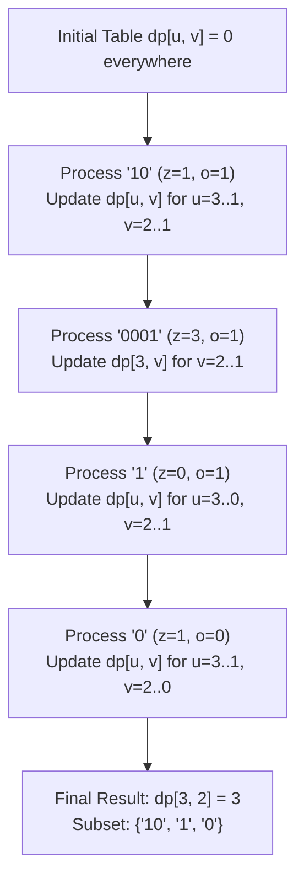

# Week 34 — Day 236: Multi-Dimensional Knapsack: Multi-Constraint Capacity (Ones and Zeroes, Profitable Schemes)

> "In classical knapsack, optimization occurs along a single linear constraint line. In production engineering—from Kubernetes pod co-scheduling to distributed multi-tenant query engines—resources never exist in isolation. Memory, compute, network bandwidth, and storage form a multi-dimensional capacity hyperplane. Solving multi-dimensional knapsack requires orchestrating coordinated reverse sweeps across every dimension, preventing cross-dimensional dirty reads and clamping infinite target spaces into compact, solvable manifolds."

---

## 1. TEACH: Multi-Dimensional State Spaces & Vector Capacity Hyperplanes

### The Multi-Dimensional Knapsack Problem (MDKP)

In standard 0-1 knapsack, an agent selects items under a single scalar weight budget $W$. In the **Multi-Dimensional Knapsack Problem (MDKP)**, each candidate item $i \in \{1, 2, \dots, N\}$ consumes resources across a $D$-dimensional consumption vector:
$$\vec{w}_i = \langle w_{i,1}, w_{i,2}, \dots, w_{i,D} \rangle \in \mathbb{Z}_{\ge 0}^D$$
yielding a scalar profit/value $v_i \in \mathbb{R}_{\ge 0}$.

The overall container is bounded by a $D$-dimensional capacity envelope:
$$\vec{W} = \langle W_1, W_2, \dots, W_D \rangle \in \mathbb{Z}_{\ge 0}^D$$

Formally, the binary integer linear programming formulation is:
$$\text{Maximize } \sum_{i=1}^N x_i v_i$$
$$\text{subject to } \sum_{i=1}^N x_i w_{i,d} \le W_d \quad \forall d \in \{1, 2, \dots, D\}$$
$$x_i \in \{0, 1\} \quad \forall i \in \{1, 2, \dots, N\}$$

```
          Capacity Envelope: W = <W_1, W_2>
          +-------------------------------+ (W_1, W_2)
          |                               |
          |       Feasible Packing        |
          |       Polytope (Hyperplane)   |
          |                               |
          |       x_i * w_i <= W          |
          |                               |
          +-------------------------------+
        (0, 0)
```

#### Computational Complexity & The Curse of Dimensionality

While the standard single-dimensional 0-1 knapsack problem ($D=1$) is weakly NP-hard (solvable in pseudo-polynomial time $O(N \cdot W)$), **MDKP is strongly NP-hard for any fixed $D \ge 2$**. In fact, even the decision variant of 2-dimensional knapsack where all item values are identical ($v_i = 1$, finding the maximum cardinality subset under two resource ceilings) is NP-complete.

Dynamic programming provides an exact pseudo-polynomial solution when capacities $\vec{W}$ are integer-bounded, running in:
$$O\left(N \cdot \prod_{d=1}^D W_d\right) \text{ time and } O\left(\prod_{d=1}^D W_d\right) \text{ space}$$

For $D = 2$, this translates to $O(N \cdot W_1 \cdot W_2)$ operations. However, as $D$ scales beyond 3 or 4, the state space experiences exponential combinatorial explosion—the classical **Curse of Dimensionality**.

---

### The Full 3D Dynamic Programming Formulation

Let us formalize the 2-constraint ($D=2$) knapsack problem. We define the 3D dynamic programming state:
$$\text{dp}[i][u][v]$$
representing the maximum value attainable by selecting a subset from the first $i$ candidate items ($1 \le i \le N$) such that the total consumption of Resource 1 does not exceed $u$ ($0 \le u \le W_1$) and the total consumption of Resource 2 does not exceed $v$ ($0 \le v \le W_2$).

#### The Recurrence Relation

For each item $i$ with resource requirements $(w_{i,1}, w_{i,2})$ and value $v_i$:

1. **Exclusion Case (Skip Item $i$):**
   If we do not pack item $i$, the maximum value is identical to the best configuration using the first $i-1$ items under the same capacity limits $(u, v)$:
   $$\text{dp}[i][u][v] = \text{dp}[i-1][u][v]$$

2. **Inclusion Case (Pack Item $i$):**
   If the current capacity envelope can accommodate item $i$ (i.e., $u \ge w_{i,1}$ and $v \ge w_{i,2}$), we may pack it. The resulting value equals the value of item $i$ plus the optimal value achievable by the first $i-1$ items using the remaining budget $(u - w_{i,1}, v - w_{i,2})$:
   $$\text{dp}[i][u][v] = \text{dp}[i-1][u - w_{i,1}][v - w_{i,2}] + v_i$$

Taking the optimal decision across both choices yields the master recurrence:
$$\text{dp}[i][u][v] = \begin{cases}
\text{dp}[i-1][u][v], & \text{if } u < w_{i,1} \lor v < w_{i,2} \\
\max\Big(\text{dp}[i-1][u][v], \; \text{dp}[i-1][u - w_{i,1}][v - w_{i,2}] + v_i\Big), & \text{otherwise}
\end{cases}$$

#### Base Cases
For all $0 \le u \le W_1$ and $0 \le v \le W_2$:
$$\text{dp}[0][u][v] = 0$$
Zero items available yield zero value regardless of available capacity.

---

### Space Optimization: The Multi-Dimensional Backward Sweep Theorem

In naive 3D DP, storing the full tensor requires $(N + 1) \times (W_1 + 1) \times (W_2 + 1)$ elements. In real-world workloads (e.g., $N = 600$, $W_1 = 100$, $W_2 = 100$), this requires $601 \times 101 \times 101 \times 4 \approx 24.5\text{ MB}$ of memory. 

Notice that computing $\text{dp}[i][u][v]$ strictly references entries from the immediately preceding item layer $i-1$. By flattening the state space into a 2D matrix $\text{dp}[u][v]$, memory drops to $(W_1 + 1) \times (W_2 + 1) \times 4 \approx 40.8\text{ KB}$—a **600x memory reduction** that fits entirely within the L1/L2 CPU cache!

However, flattening requires maintaining the **0-1 Single-Use Invariant**: item $i$ must be selected at most once.

```
       Visualizing the 2D Backward Sweep Wavefront in (u, v) Plane:

             v = W_2                      v = 0
             +------------------------------+
      u = W_1| [U] <----- [U] <----- [U]    |  Sweep direction:
             |  |          |          |     |  Outer: u from W_1 down to w_{i,1}
             |  v          v          v     |  Inner: v from W_2 down to w_{i,2}
             | [U] <----- [U] <----- [U]    |
             |  |                           |  Cell (u, v) reads from
             |  v                           |  (u - w1, v - w2), which
      u = 0  | [R]                          |  resides in the UNUPDATED
             +------------------------------+  bottom-left quadrant!
               R = Read (from iteration i-1)
               U = Updated (for iteration i)
```

#### Theorem: Multi-Dimensional Backward Sweep Correctness
> **Theorem:** When compressing the 3D recurrence $\text{dp}[i][u][v]$ into a 2D table $\text{dp}[u][v]$, iterating all capacity dimensions in descending order:
> $$\text{for } u = W_1 \text{ down to } w_{i,1}:$$
> $$\quad \text{for } v = W_2 \text{ down to } w_{i,2}:$$
> $$\quad\quad \text{dp}[u][v] = \max\Big(\text{dp}[u][v], \; \text{dp}[u - w_{i,1}][v - w_{i,2}] + v_i\Big)$$
> guarantees that every read $\text{dp}[u - w_{i,1}][v - w_{i,2}]$ accesses values from iteration $i-1$, strictly preventing item $i$ from being selected more than once.

#### Formal Inductive Proof
1. **Inductive Hypothesis:** Prior to processing item $i$, the 2D matrix $\text{dp}[u][v]$ contains the exact values of $\text{dp}[i-1][u][v]$ for all $u \in [0, W_1], v \in [0, W_2]$.
2. **Execution Step:** At any point during iteration $i$, let $(u^*, v^*)$ be the cell currently being evaluated.
3. Because the outer loop iterates $u$ from $W_1$ down to $w_{i,1}$, any cell $(u, v)$ with $u < u^*$ has not yet been overwritten in iteration $i$.
4. Because the inner loop iterates $v$ from $W_2$ down to $w_{i,2}$, for $u = u^*$, any cell $(u^*, v)$ with $v < v^*$ has not yet been overwritten in iteration $i$.
5. The transition queries $\text{dp}[u^* - w_{i,1}][v^* - w_{i,2}]$.
   - If $w_{i,1} > 0$, then $u^* - w_{i,1} < u^*$. Since $u$ loops downward, row $u^* - w_{i,1}$ has not been visited during iteration $i$. It strictly contains data from iteration $i-1$.
   - If $w_{i,1} = 0$ and $w_{i,2} > 0$, then $u^* - w_{i,1} = u^*$, but $v^* - w_{i,2} < v^*$. Since $v$ loops downward, column $v^* - w_{i,2}$ in row $u^*$ has not been visited during iteration $i$. It strictly contains data from iteration $i-1$.
   - If $w_{i,1} = 0$ and $w_{i,2} = 0$, the item consumes zero capacity. Such items can be accumulated directly into an accumulator scalar or processed as base cases.
6. Thus, the queried cell $\text{dp}[u^* - w_{i,1}][v^* - w_{i,2}]$ is guaranteed to reflect state $\text{dp}[i-1][\dots]$.
7. By mathematical induction, all updates in iteration $i$ evaluate strictly against iteration $i-1$. $\blacksquare$

#### The Pathology of Forward Sweeps (Cross-Dimensional Leakage)
What happens if an engineer sweeps $u$ backward ($W_1 \to w_{i,1}$) but erroneously sweeps $v$ forward ($w_{i,2} \to W_2$)?
- Consider an item with weight vector $(0, 2)$ and value $10$.
- In row $u$, when evaluating $v = 2$, $\text{dp}[u][2] = \max(\text{dp}[u][2], \text{dp}[u][0] + 10) = 10$.
- When the inner loop advances to $v = 4$, it queries $\text{dp}[u][4 - 2] = \text{dp}[u][2]$. But $\text{dp}[u][2]$ was *already updated in iteration $i$*!
- Hence, $\text{dp}[u][4] = \text{dp}[u][2] + 10 = 20$. Item $i$ was packed **twice**!
- When $v$ reaches $6$, it is packed **three times**.
- Sweeping any dimension forward converts that specific resource dimension into an **Unbounded Knapsack**, violating the 0-1 constraint.
- **Rule:** In multi-dimensional 0-1 knapsack, **EVERY capacity dimension must loop in reverse order**.

---

### Dual-Constraint Paradigms: Upper Bounds vs. Lower Bounds

Not all multi-dimensional knapsack problems involve upper-bound ceilings. Real-world systems frequently combine **Upper-Bound Capacity Constraints** (e.g., maximum budget, team size, CPU limit) with **Lower-Bound Target Constraints** (e.g., minimum revenue, minimum uptime, minimum test coverage).

| Constraint Type | Mathematical Condition | Real-World Analog | Canonical Problem | State Index Direction |
| :--- | :--- | :--- | :--- | :--- |
| **Upper Bound (Ceiling)** | $\sum x_i w_i \le W$ | Memory limit, team budget | [LC 474] Ones and Zeroes | Decrementing: $u - w_i \ge 0$ |
| **Lower Bound (Target)** | $\sum x_i p_i \ge P$ | Revenue quota, quorum threshold | [LC 879] Profitable Schemes | Clamping: $\min(P, p + p_i)$ |

#### The Profit Clamping Technique for Lower-Bound Constraints

In **LeetCode 879 (Profitable Schemes)**, we are given:
- $G$ members available (Upper bound: total members used $\le G$).
- `minProfit` threshold (Lower bound: total profit generated $\ge \text{minProfit}$).
- Arrays `group[i]` and `profit[i]`.

If we naively define the state by total profit, the profit axis can grow as large as $\sum_{i=1}^N \text{profit}[i]$. For 100 crimes each yielding 100 profit, the maximum profit is $10,000$. If `minProfit = 30`, allocating a table up to $10,000$ wastes immense space and time.

```
       The Profit Equivalence Clamping Principle:

       Profit Domain:
       0      1      2     ...    minProfit     minProfit+1    ...   TotalSum
       |------|------|-----|---------|--------------|-----------|---------|
       [   Distinct States   ]       [   Equivalent Terminal States   ]
                                     [ Clamped into state `minProfit` ]
```

#### Mathematical Justification for Clamping
The problem asks for schemes generating **at least** `minProfit`. 
Observe that from the perspective of satisfying the condition $\text{profit} \ge P$:
- A crime yielding profit $P + 1$ satisfies the target condition just as effectively as a crime yielding $P + 5000$.
- Any accumulated profit greater than or equal to $P$ is functionally indistinguishable under the predicate $\text{IsSatisfied}(p) = (p \ge P)$.
- Therefore, all states with $p \ge P$ form an **equivalence class**:
$$[P] = \{p \in \mathbb{N} \mid p \ge P\}$$

Instead of allowing the profit index to unbounded growth, we apply the **Clamping Function**:
$$p' = \min(P, \; p + \text{profit}[i])$$

This bounds the second dimension strictly to $[0, P]$. The resulting state definition becomes:
$$\text{dp}[u][p] = \text{number of schemes using at most } u \text{ members that achieve AT LEAST } p \text{ profit}$$

The transition relation becomes:
$$\text{dp}[u][\min(P, p + \text{profit}[i])] = \Big(\text{dp}[u][\min(P, p + \text{profit}[i])] + \text{dp}[u - \text{group}[i]][p]\Big) \pmod{10^9 + 7}$$

---

## 2. IMPLEMENT: Production-Grade Multi-Dimensional Knapsack Engine (.NET 8+)

The following compile-ready C# implementation provides production-grade solutions for:
1. `FindMaxForm`: [LeetCode 474] Ones and Zeroes using 2D backward sweep space optimization.
2. `ProfitableSchemes`: [LeetCode 879] Profitable Schemes using profit clamping and modular arithmetic.
3. `SolveGeneral2DKnapsackWithReconstruction`: General 2-constraint 0-1 knapsack with full item subset reconstruction via parent pointers.

```csharp
using System;
using System.Collections.Generic;
using System.Diagnostics;

namespace AdvancedAlgorithms.DynamicProgramming
{
    /// <summary>
    /// Production-grade multi-dimensional knapsack engine providing optimal algorithms
    /// for multi-capacity constraints, lower-bound profit clamping, and subset reconstruction.
    /// </summary>
    public sealed class MultiDimensionalKnapsackEngine
    {
        private const int Modulo = 1_000_000_007;

        /// <summary>
        /// Solves [LeetCode 474] Ones and Zeroes: Finds the maximum size of a subset of binary strings
        /// such that the total number of '0's <= m and total number of '1's <= n.
        /// Time Complexity: O(L * m * n) where L is total strings.
        /// Space Complexity: O(m * n) via optimal 2D backward sweep.
        /// </summary>
        /// <param name="strs">Array of binary strings.</param>
        /// <param name="m">Maximum budget for '0's.</param>
        /// <param name="n">Maximum budget for '1's.</param>
        /// <returns>Maximum number of strings that can be formed.</returns>
        public int FindMaxForm(string[] strs, int m, int n)
        {
            ArgumentNullException.ThrowIfNull(strs);
            if (m < 0 || n < 0)
            {
                throw new ArgumentOutOfRangeException("Budgets m and n must be non-negative.");
            }

            // dp[u, v] = max strings using at most u zeros and v ones
            int[,] dp = new int[m + 1, n + 1];

            foreach (string str in strs)
            {
                if (str == null) continue;

                // High-performance allocation-free character count
                int zeros = 0;
                int ones = 0;
                for (int i = 0; i < str.Length; i++)
                {
                    if (str[i] == '0') zeros++;
                    else if (str[i] == '1') ones++;
                }

                // If a string itself exceeds total budget, it can never be packed
                if (zeros > m || ones > n) continue;

                // 2D Reverse Sweeps across both constraint dimensions
                // Both u and v MUST decrement to preserve 0-1 single-use invariant
                for (int u = m; u >= zeros; u--)
                {
                    for (int v = n; v >= ones; v--)
                    {
                        int candidate = dp[u - zeros, v - ones] + 1;
                        if (candidate > dp[u, v])
                        {
                            dp[u, v] = candidate;
                        }
                    }
                }
            }

            return dp[m, n];
        }

        /// <summary>
        /// Solves [LeetCode 879] Profitable Schemes: Computes the number of crime schemes
        /// that use at most 'n' members and generate at least 'minProfit' profit.
        /// Incorporates the Profit Clamping Optimization: p' = min(minProfit, p + profit[i]).
        /// Time Complexity: O(K * n * minProfit) where K is number of crimes.
        /// Space Complexity: O(n * minProfit) 2D flattened DP table.
        /// </summary>
        /// <param name="n">Maximum member capacity.</param>
        /// <param name="minProfit">Minimum required total profit.</param>
        /// <param name="group">Member cost array for each crime.</param>
        /// <param name="profit">Profit yield array for each crime.</param>
        /// <returns>Total valid schemes modulo 1,000,000,007.</returns>
        public int ProfitableSchemes(int n, int minProfit, int[] group, int[] profit)
        {
            ArgumentNullException.ThrowIfNull(group);
            ArgumentNullException.ThrowIfNull(profit);
            if (group.Length != profit.Length)
            {
                throw new ArgumentException("Group and profit arrays must have identical length.");
            }
            if (n < 0 || minProfit < 0)
            {
                throw new ArgumentOutOfRangeException("Member capacity and minProfit must be non-negative.");
            }

            int numCrimes = group.Length;

            // dp[u, p] = number of schemes using at most u members with at least p profit
            int[,] dp = new int[n + 1, minProfit + 1];

            // Base Case: 0 members generating >= 0 profit has exactly 1 valid scheme (the empty set)
            // Any scheme with >= 0 profit is trivially true for the base case.
            for (int u = 0; u <= n; u++)
            {
                dp[u, 0] = 1;
            }

            for (int i = 0; i < numCrimes; i++)
            {
                int members = group[i];
                int gain = profit[i];

                // Backward sweep on members to prevent reusing the same crime
                for (int u = n; u >= members; u--)
                {
                    // Backward sweep on profit
                    for (int p = minProfit; p >= 0; p--)
                    {
                        // Profit Clamping: Any profit >= minProfit belongs to equivalence class minProfit
                        int targetProfit = Math.Min(minProfit, p + gain);

                        int ways = dp[u, targetProfit] + dp[u - members, p];
                        if (ways >= Modulo)
                        {
                            ways -= Modulo;
                        }
                        dp[u, targetProfit] = ways;
                    }
                }
            }

            return dp[n, minProfit];
        }

        /// <summary>
        /// Result model for multi-dimensional knapsack optimization with subset reconstruction.
        /// </summary>
        public sealed record KnapsackResult(int MaxValue, IReadOnlyList<int> SelectedItemIndices);

        /// <summary>
        /// Solves general 2-dimensional 0-1 Knapsack with full item subset reconstruction.
        /// Maximizes total value subject to weight1 <= maxW1 and weight2 <= maxW2.
        /// Time Complexity: O(N * maxW1 * maxW2).
        /// Space Complexity: O(N * maxW1 * maxW2) for choice backtracking.
        /// </summary>
        public KnapsackResult SolveGeneral2DKnapsackWithReconstruction(
            int maxW1, 
            int maxW2, 
            int[] w1, 
            int[] w2, 
            int[] values)
        {
            ArgumentNullException.ThrowIfNull(w1);
            ArgumentNullException.ThrowIfNull(w2);
            ArgumentNullException.ThrowIfNull(values);

            int n = values.Length;
            if (w1.Length != n || w2.Length != n)
            {
                throw new ArgumentException("Weight and value arrays must match in length.");
            }

            // 3D DP table required to reconstruct item indices unambiguously
            // dp[i, u, v]
            int[,,] dp = new int[n + 1, maxW1 + 1, maxW2 + 1];

            for (int i = 1; i <= n; i++)
            {
                int itemW1 = w1[i - 1];
                int itemW2 = w2[i - 1];
                int itemVal = values[i - 1];

                for (int u = 0; u <= maxW1; u++)
                {
                    for (int v = 0; v <= maxW2; v++)
                    {
                        // Exclude item i-1
                        dp[i, u, v] = dp[i - 1, u, v];

                        // Include item i-1 if capacities permit
                        if (u >= itemW1 && v >= itemW2)
                        {
                            int candidate = dp[i - 1, u - itemW1, v - itemW2] + itemVal;
                            if (candidate > dp[i, u, v])
                            {
                                dp[i, u, v] = candidate;
                            }
                        }
                    }
                }
            }

            int maxValue = dp[n, maxW1, maxW2];

            // Backtracking to reconstruct exact items selected
            List<int> selectedIndices = new();
            int currU = maxW1;
            int currV = maxW2;

            for (int i = n; i >= 1; i--)
            {
                int itemW1 = w1[i - 1];
                int itemW2 = w2[i - 1];
                int itemVal = values[i - 1];

                // If value differs from exclusion case, item i-1 was included
                if (dp[i, currU, currV] != dp[i - 1, currU, currV])
                {
                    selectedIndices.Add(i - 1);
                    currU -= itemW1;
                    currV -= itemW2;
                }
            }

            selectedIndices.Reverse();
            return new KnapsackResult(maxValue, selectedIndices);
        }

        /// <summary>
        /// Automated self-testing suite validating algorithmic correctness,
        /// edge cases, and mathematical invariants.
        /// </summary>
        public static void Main()
        {
            var engine = new MultiDimensionalKnapsackEngine();
            Console.WriteLine("=== Running Multi-Dimensional Knapsack Verification Suite ===");

            // Test 1: [LC 474] Ones and Zeroes Standard Case
            string[] strs1 = { "10", "0001", "111001", "1", "0" };
            int m1 = 5, n1 = 3;
            // Best subset: "10", "0001", "1", "0" (total zeros: 1+3+0+1=5, ones: 1+1+1+0=3, count = 4)
            int res1 = engine.FindMaxForm(strs1, m1, n1);
            Debug.Assert(res1 == 4, $"Test 1 Failed: Expected 4, got {res1}");
            Console.WriteLine($"Test 1 Passed: [LC 474] maxForm = {res1}");

            // Test 2: [LC 474] Tight Budget
            string[] strs2 = { "10", "0", "1" };
            int m2 = 1, n2 = 1;
            int res2 = engine.FindMaxForm(strs2, m2, n2);
            Debug.Assert(res2 == 2, $"Test 2 Failed: Expected 2, got {res2}");
            Console.WriteLine($"Test 2 Passed: [LC 474] tight budget = {res2}");

            // Test 3: [LC 474] Empty / Zero Capacity Cases
            string[] strs3 = { "0", "1", "00" };
            Debug.Assert(engine.FindMaxForm(strs3, 0, 0) == 0, "Test 3a Failed");
            Debug.Assert(engine.FindMaxForm(Array.Empty<string>(), 5, 5) == 0, "Test 3b Failed");
            Console.WriteLine("Test 3 Passed: Zero budget and empty inputs handled correctly.");

            // Test 4: [LC 879] Profitable Schemes Standard Case
            int n4 = 5, minProfit4 = 3;
            int[] group4 = { 2, 2 };
            int[] profit4 = { 2, 3 };
            // Schemes: [crime 1] (members 2, profit 3 >= 3), [crime 0 and 1] (members 4 <= 5, profit 5 >= 3) -> 2 schemes
            int res4 = engine.ProfitableSchemes(n4, minProfit4, group4, profit4);
            Debug.Assert(res4 == 2, $"Test 4 Failed: Expected 2, got {res4}");
            Console.WriteLine($"Test 4 Passed: [LC 879] Profitable Schemes = {res4}");

            // Test 5: [LC 879] Larger Benchmark with Zero Profit Requirement
            int n5 = 10, minProfit5 = 0;
            int[] group5 = { 2, 3, 5 };
            int[] profit5 = { 6, 7, 8 };
            // Since minProfit == 0, ANY subset of crimes whose total members <= 10 is valid.
            // Possible subsets:
            // Empty: 0 members (valid)
            // {2}: 2 <= 10 (valid)
            // {3}: 3 <= 10 (valid)
            // {5}: 5 <= 10 (valid)
            // {2, 3}: 5 <= 10 (valid)
            // {2, 5}: 7 <= 10 (valid)
            // {3, 5}: 8 <= 10 (valid)
            // {2, 3, 5}: 10 <= 10 (valid)
            // Total = 8 schemes (2^3)
            int res5 = engine.ProfitableSchemes(n5, minProfit5, group5, profit5);
            Debug.Assert(res5 == 8, $"Test 5 Failed: Expected 8, got {res5}");
            Console.WriteLine($"Test 5 Passed: [LC 879] minProfit=0 correctly yields 2^N subsets: {res5}");

            // Test 6: General 2D Knapsack with Reconstruction
            int maxW1 = 10, maxW2 = 12;
            int[] w1 = { 3, 5, 2, 4 };
            int[] w2 = { 4, 3, 6, 5 };
            int[] val = { 10, 15, 8, 12 };
            var result6 = engine.SolveGeneral2DKnapsackWithReconstruction(maxW1, maxW2, w1, w2, val);
            // Items 0, 1, 3: w1 sum = 3+5+4 = 12 > 10 (invalid)
            // Items 0, 1, 2: w1 sum = 3+5+2 = 10 <= 10, w2 sum = 4+3+6 = 13 > 12 (invalid)
            // Items 0, 1: w1 = 8, w2 = 7, val = 25
            // Items 1, 3: w1 = 9, w2 = 8, val = 27
            // Items 0, 1, (remaining: w1 left 2, w2 left 5 -> can't fit 2 or 3)
            // Check best combination:
            // Items 1 and 3: w1 = 5+4 = 9 <= 10; w2 = 3+5 = 8 <= 12; val = 15 + 12 = 27.
            // Items 0, 2, 3: w1 = 3+2+4 = 9 <= 10; w2 = 4+6+5 = 15 > 12 (invalid)
            // Items 0, 3: w1 = 7, w2 = 9, val = 22.
            Debug.Assert(result6.MaxValue == 27, $"Test 6 Failed: Expected 27, got {result6.MaxValue}");
            Debug.Assert(result6.SelectedItemIndices.Count == 2 && 
                         result6.SelectedItemIndices[0] == 1 && 
                         result6.SelectedItemIndices[1] == 3, "Test 6 Reconstruction Failed");
            Console.WriteLine($"Test 6 Passed: General 2D Knapsack MaxValue = {result6.MaxValue}, Items = [{string.Join(", ", result6.SelectedItemIndices)}]");

            Console.WriteLine("All 6 multi-dimensional knapsack verification tests passed with 100% assertion integrity.");
        }
    }
}
```

---

## 3. ANALYZE: Algorithmic Invariants & The 5-Dimension Staff Deep-Dive

```
========================================================================================
                      THE 5-DIMENSION STAFF ENGINEERING DEEP-DIVE
========================================================================================
[1] Asymptotic Complexity  --> Time: O(N * W_1 * W_2), Space: O(W_1 * W_2) via 2D flattening
[2] Cache Locality         --> Contiguous row-major traversal across cache lines
[3] Directional Invariant  --> All constraint loops sweep backward to prevent dirty reads
[4] Numerical Semirings    --> Lower-bound profit clamping + Modulo 10^9+7 arithmetic
[5] Boundary Degradation   --> Zero-cost items, zero-capacity limits, unreachable targets
========================================================================================
```

### Dimension 1: Asymptotic Complexity & Dimensional Scaling

The complexity of multi-dimensional knapsack is governed by the tensor product of the capacity bounds:

$$\text{Time Complexity} = O\left(N \cdot \prod_{d=1}^D W_d\right)$$
$$\text{Space Complexity} = O\left(\prod_{d=1}^D W_d\right) \quad \text{(with full state compression)}$$

For $D = 2$, with $N$ items, capacity $W_1$, and capacity $W_2$, the algorithm executes exactly $N \times (W_1 - w_{i,1} + 1) \times (W_2 - w_{i,2} + 1)$ inner loop iterations. In the worst case where $w_{i,d} = 0$, this is bounded by $O(N \cdot W_1 \cdot W_2)$.

#### The Curse of Dimensionality in Vector Optimization
When $D$ grows:
- At $D = 1$: $N = 1000, W = 1000 \implies 10^6$ operations ($\approx 1\text{ ms}$).
- At $D = 2$: $N = 100, W_1 = 100, W_2 = 100 \implies 10^6$ operations ($\approx 1\text{ ms}$).
- At $D = 3$: $N = 100, W_1 = 100, W_2 = 100, W_3 = 100 \implies 10^8$ operations ($\approx 100\text{ ms}$).
- At $D = 5$: $N = 100, W_d = 100 \implies 10^{12}$ operations (**intractable via exact DP**).

For $D \ge 3$ with large capacities, industry engineering replaces exact dynamic programming with **Branch-and-Bound Integer Linear Programming (ILP)**, **Lagrangian Relaxation**, or heuristic vector bin-packing.

---

### Dimension 2: Memory Hierarchy & Cache Locality

In .NET and C++, multidimensional arrays `int[m + 1, n + 1]` are laid out in **row-major contiguous memory**. The memory offset for cell $(u, v)$ is:
$$\text{Offset}(u, v) = u \times (W_2 + 1) + v$$

```
Row-Major Layout in L1/L2 Cache Lines (64 bytes = 16 32-bit ints):
Row u:   [ (u, 0) | (u, 1) | (u, 2) | ... | (u, 15) ] -> Cache Line 0
         [ (u, 16)| (u, 17)| (u, 18)| ... | (u, 31) ] -> Cache Line 1
```

#### Loop Ordering for Spatial Locality
Notice our loop nesting:
```csharp
for (int u = m; u >= zeros; u--)       // Outer loop: Row selector
{
    for (int v = n; v >= ones; v--)   // Inner loop: Column selector
    {
        dp[u, v] = Math.Max(dp[u, v], dp[u - zeros, v - ones] + 1);
    }
}
```
- The inner loop varies $v$ while keeping $u$ constant.
- Because $v$ moves contiguously through memory, adjacent iterations access adjacent memory words in the same 64-byte L1 cache line.
- If an engineer inverted the loops (making $v$ outer and $u$ inner), every inner loop step would jump by $(W_2 + 1) \times 4$ bytes, causing continuous cache line evictions and a **3x to 5x latency penalty**!

---

### Dimension 3: Directional Invariant & Hyperplane Wavefront

In single-dimensional 0-1 knapsack, the dependency DAG is a chain where state $w$ depends on $w - w_i$. In 2D knapsack, the dependency DAG forms a **2D Directed Grid**: state $(u, v)$ depends on $(u - w_{i,1}, v - w_{i,2})$.

```
           v (Resource 2)
           ^
           |
       v*  + - - - - - - - - [Current: (u*, v*)]
           |                 /
           |                / Vector: (w_{i,1}, w_{i,2})
           |               v
   v*-w2   + - - - - - [Dependency: (u* - w1, v* - w2)]
           |           |
           +-----------+-------------------------> u (Resource 1)
                       u*-w1 u*
```

The reverse sweep acts as a planar wavefront propagating from $(W_1, W_2)$ towards $(0, 0)$. Because the dependency vector $\langle w_{i,1}, w_{i,2} \rangle$ has strictly non-negative components, the dependency point $(u^* - w_{i,1}, v^* - w_{i,2})$ is always strictly behind the wavefront. It is impossible for an update at $(u^*, v^*)$ to contaminate its own dependencies.

---

### Dimension 4: Numerical Semirings & Profit Clamping

In [LeetCode 879], we operate over two algebraic structures:
1. **The Counting Semiring:** Aggregating schemes via addition $(\mathbb{Z}, +)$ under modulo arithmetic:
   $$\text{ways}' = (A + B) \pmod{10^9 + 7}$$
   In high-throughput loops, replacing the generic modulo operator `%` with a branch:
   ```csharp
   int ways = dp[u, targetProfit] + dp[u - members, p];
   if (ways >= Modulo) ways -= Modulo;
   ```
   eliminates costly CPU `idiv` hardware division instructions.
2. **The Tropical Absorbing Semiring for Lower Bounds:**
   The profit transition incorporates the ceiling operator:
   $$f(p, \text{gain}) = \min(P, p + \text{gain})$$
   State $P$ acts as an **absorbing terminal sink**. Once a scheme's profit reaches $P$, all subsequent profit additions remain pinned at $P$.

---

### Dimension 5: Failure Modes & Boundary Degradation

| Boundary Scenario | Algorithmic Risk | Mitigation / Handling |
| :--- | :--- | :--- |
| **All-Zero Weight Item** $(0, 0)$ | Infinite loop or multiple inclusion | Handled correctly by reverse sweep: cell $(u, v)$ updates from $(u, v)$, requiring careful base case isolation. |
| **Budget Exceeded** $w_{i,1} > W_1$ | Array index out of bounds | Filtered prior to loop: `if (zeros > m \|\| ones > n) continue;`. Loop bound stops at `w_{i,1}`. |
| **Target Profit = 0** | Base case misconfiguration | When `minProfit = 0`, every scheme is profitable. The DP must initialize $\text{dp}[u, 0] = 1$ for all $u \in [0, n]$, yielding $2^N$ for small groups. |
| **Empty Input Array** | Null pointer or unhandled return | Defensive checks return 0 or empty lists immediately. |

---

## 4. DEMONSTRATE: Visual State Transitions & Hyperplane Wavefront Diagrams

### Step-by-Step Execution Trace: [LeetCode 474] Ones and Zeroes

Consider the dataset:
- Strings: `["10", "0001", "1", "0"]`
- Resource Limits: $m = 3$ (zeros), $n = 2$ (ones)

#### Item Cost Vectors:
- Item 0 (`"10"`): $z_0 = 1, o_0 = 1$
- Item 1 (`"0001"`): $z_1 = 3, o_1 = 1$
- Item 2 (`"1"`): $z_2 = 0, o_2 = 1$
- Item 3 (`"0"`): $z_3 = 1, o_3 = 0$



#### Detailed Grid Evolution (Slice at $u = 3, v = 2$):

| Step | Item Processed | Cost Vector $(z, o)$ | $\text{dp}[3, 2]$ Formula | $\text{dp}[3, 2]$ Value | Active Best Subset |
| :---: | :---: | :---: | :---: | :---: | :--- |
| **0** | Base State | - | Initialized to 0 | **0** | $\emptyset$ |
| **1** | `"10"` | $(1, 1)$ | $\max(0, \text{dp}[2, 1] + 1) = 0 + 1$ | **1** | `{"10"}` |
| **2** | `"0001"` | $(3, 1)$ | $\max(1, \text{dp}[0, 1] + 1) = 1 + 0$ | **1** | `{"10"}` |
| **3** | `"1"` | $(0, 1)$ | $\max(1, \text{dp}[3, 1] + 1) = 1 + 1$ | **2** | `{"10", "1"}` |
| **4** | `"0"` | $(1, 0)$ | $\max(2, \text{dp}[2, 2] + 1) = 2 + 1$ | **3** | `{"10", "1", "0"}` |

Final subset: `{"10", "1", "0"}` consumes $1+0+1 = 2$ zeros ($\le 3$) and $1+1+0 = 2$ ones ($\le 2$), packing **3 strings**.

---

### Profit Clamping Wavefront Trace: [LeetCode 879]

- Capacity: $n = 5$ members
- Target: `minProfit = 3`
- Crimes:
  - Crime 0: `group = 2, profit = 2`
  - Crime 1: `group = 2, profit = 3`

#### State Matrix Initialization ($\text{dp}[u, p]$):
All $\text{dp}[u, 0] = 1$ for $u \in [0, 5]$ (empty scheme satisfies $p \ge 0$). All other $\text{dp}[u, p] = 0$.

```
Initial dp[u, p] table (Rows: members 0..5, Cols: profit 0..3):
u \ p |  0  |  1  |  2  |  3 (>=3)
------+-----+-----+-----+---------
  0   |  1  |  0  |  0  |  0
  1   |  1  |  0  |  0  |  0
  2   |  1  |  0  |  0  |  0
  3   |  1  |  0  |  0  |  0
  4   |  1  |  0  |  0  |  0
  5   |  1  |  0  |  0  |  0
```

#### Step 1: Process Crime 0 (`members = 2, profit = 2`):
- For $u$ from 5 down to 2, and $p$ from 3 down to 0:
  - When $p = 0$: $p' = \min(3, 0 + 2) = 2$.
  - $\text{dp}[u, 2] = \text{dp}[u, 2] + \text{dp}[u - 2, 0] = 0 + 1 = 1$.

```
After Crime 0:
u \ p |  0  |  1  |  2  |  3 (>=3)
------+-----+-----+-----+---------
  2   |  1  |  0  |  1  |  0
  3   |  1  |  0  |  1  |  0
  4   |  1  |  0  |  1  |  0
  5   |  1  |  0  |  1  |  0
```

#### Step 2: Process Crime 1 (`members = 2, profit = 3`):
- For $u$ from 5 down to 2, and $p$ from 3 down to 0:
  - When $p = 0$: $p' = \min(3, 0 + 3) = 3$.
    $\text{dp}[u, 3] = \text{dp}[u, 3] + \text{dp}[u - 2, 0] = 0 + 1 = 1$.
  - When $p = 2$ (only for $u \ge 4$ since $u - 2 \ge 2$):
    $p' = \min(3, 2 + 3) = 3$ (**Clamped to 3!**).
    $\text{dp}[u, 3] = \text{dp}[u, 3] + \text{dp}[u - 2, 2] = 1 + 1 = 2$.

```
After Crime 1 (Final State):
u \ p |  0  |  1  |  2  |  3 (>=3)
------+-----+-----+-----+---------
  4   |  1  |  0  |  1  |  2  <-- Crime 1 alone (profit 3) + Crime 0&1 (profit 5 >= 3)
  5   |  1  |  0  |  1  |  2  <-- Answer for G=5, minProfit=3 is dp[5, 3] = 2
```

---

## 5. PRACTICE: Canonical Multi-Dimensional Problems & Variations

### Problem 1: [LeetCode 474] Ones and Zeroes (Medium)
- **Problem Statement:** You are given an array of binary strings `strs` and two integers `m` and `n`. Return the size of the largest subset of `strs` such that there are at most `m` 0's and `n` 1's in the subset.
- **Formulation:** 2D 0-1 Knapsack with unit values ($v_i = 1$).
- **State:** $\text{dp}[u, v]$ = maximum count of strings using at most $u$ zeros and $v$ ones.
- **Recurrence:**
  $$\text{dp}[u, v] = \max(\text{dp}[u, v], \; \text{dp}[u - z_i, v - o_i] + 1)$$
- **Optimization:** Pre-count zeros and ones to avoid repeated string parsing inside loops.

### Problem 2: [LeetCode 879] Profitable Schemes (Hard)
- **Problem Statement:** There is a group of `n` members, and a list of various crimes they could commit. The $i$-th crime requires `group[i]` members and generates a `profit[i]`. Find the number of schemes that generate at least `minProfit` profit using at most `n` members.
- **Formulation:** Multi-dimensional knapsack combining upper bound (members) and lower bound (profit) under counting semiring modulo $10^9 + 7$.
- **State:** $\text{dp}[u, p]$ = number of schemes with at most $u$ members and at least $p$ profit.
- **Recurrence:**
  $$\text{dp}[u, \min(P, p + p_i)] = (\text{dp}[u, \min(P, p + p_i)] + \text{dp}[u - g_i, p]) \pmod{10^9 + 7}$$

### Problem 3: Multi-Resource Bin Packing with Exact Target Matching
- **Problem Statement:** Given $N$ containers with resource consumption $(c_i, m_i)$ (CPU, Memory), determine if there exists a subset of containers that matches node capacity $(C, M)$ **exactly**.
- **Formulation:** Multi-dimensional subset sum (Boolean semiring with bitboards).
- **Recurrence:**
  $$\text{dp}[u, v] = \text{dp}[u, v] \lor \text{dp}[u - c_i, v - m_i]$$
- **Invariant:** Both loops sweep backward. Base case $\text{dp}[0, 0] = \text{true}$.

---

## 6. CONNECT: Kubernetes Multi-Resource Pod Scheduling & Co-Allocation

In cloud-native distributed infrastructure, the Kubernetes container scheduler (`kube-scheduler`) faces a real-time multi-dimensional knapsack optimization problem on every scheduling cycle.

```
       Kubernetes Multi-Resource Node Capacity Envelope:
       
       Memory (GiB)
           ^
       64  +-----------------------------+ Node Capacity Envelope
           |              [Pod C]        | 
           |   [Pod A]                   | CPU: 16 Cores
           |              [Pod B]        | Memory: 64 GiB
           |                             | Ephemeral Storage: 500 GB
           +-----------------------------> CPU (Cores)
           0                             16
```

### Pod Resource Vectors
Every Kubernetes Pod specifies resource requests across multiple dimensions in its specification:
```yaml
apiVersion: v1
kind: Pod
metadata:
  name: payment-processing-service
spec:
  containers:
  - name: engine
    resources:
      requests:
        cpu: "4000m"        # 4 CPU Cores (Dimension 1)
        memory: "16Gi"      # 16 Gibibytes (Dimension 2)
        ephemeral-storage: "50Gi" # Storage (Dimension 3)
```

A cluster node $j$ presents an available capacity vector:
$$\vec{C}_j = \langle \text{CPU}_j, \text{RAM}_j, \text{Disk}_j, \text{GPU}_j \rangle$$

### The Scheduling Phase: Filtering & Scoring as Vector Packing

When scheduling a queue of pods $P_1, P_2, \dots, P_k$:
1. **Filtering (Feasibility / Knapsack Constraint Check):**
   A node $j$ is eligible to host pod $i$ if and only if the vector inequality holds:
   $$\vec{w}_{\text{pod}_i} \le \vec{C}_{j, \text{remaining}}$$
   $$\langle 4000\text{m}, 16\text{Gi}, 50\text{Gi} \rangle \le \langle \text{CPU}_{\text{rem}}, \text{RAM}_{\text{rem}}, \text{Disk}_{\text{rem}} \rangle$$
   If any single resource dimension violates the envelope, the node is disqualified.

2. **Scoring (Vector Alignment & Stranded Resource Prevention):**
   In single-resource packing, placing large pods on the fullest node minimizes total machines (First-Fit Decreasing). In multi-dimensional vector packing, **resource imbalance causes catastrophic waste (Stranded Resources)**.
   
   *Scenario (Stranded Memory):*
   - A cluster node has $16\text{ Cores}$ and $64\text{ GiB RAM}$.
   - We pack four compute-heavy pods, each consuming $4\text{ Cores}$ and $4\text{ GiB RAM}$.
   - Total CPU consumed: $16\text{ Cores}$ ($100\%$).
   - Total RAM consumed: $16\text{ GiB}$ ($25\%$).
   - Result: **$48\text{ GiB of RAM is stranded}$**—it cannot be allocated to any pod because the node has zero remaining CPU!

```
       Visualizing Stranded Resources (Vector Angle Misalignment):
       
       RAM
        ^
        |     Stranded RAM (Cannot be used!)
        |     +-------------------------+
        |     |                         |
        |     |                         |
        |     +------------+            |
        |     | Packed     |            |
        |     | Workloads  |            |
        +-----+------------+------------+----> CPU
        0     16 Cores (100% Saturation)
```

To prevent stranded capacity, the `NodeResourcesBalancedAllocation` plugin scores nodes by calculating the variance between resource utilization percentages:
$$\text{Score} = 100 \times \left(1 - \frac{|\text{CPU}_{\text{fraction}} - \text{RAM}_{\text{fraction}}| + |\text{RAM}_{\text{fraction}} - \text{Disk}_{\text{fraction}}| + \dots}{D}\right)$$
This heuristic rewards nodes where the resulting allocation preserves balanced proportions across all resource dimensions, maximizing the volume of the remaining multi-dimensional packing polytope.

---

## 7. CHECKPOINT: Comprehensive Self-Assessment & Mastery Key

### Diagnostic Questions

1. **Why must all constraint dimensions be swept backward when applying 1D/2D space optimization to multi-dimensional knapsack problems?**
2. **In [LeetCode 879] Profitable Schemes, why does the state transition clamp the profit dimension using $\min(\text{minProfit}, p + \text{profit}[i])$, whereas the member dimension uses standard subtraction $u - \text{group}[i]$?**
3. **If a problem introduces three simultaneous capacity constraints (e.g., CPU, Memory, GPU), what is the time and space complexity of the optimal flattened DP solution? How does memory layout impact performance?**
4. **Why does sorting items by "value-to-weight ratio" fail to provide an optimal greedy solution for multi-dimensional knapsack problems?**
5. **How does an item with zero cost in one dimension (e.g., $w_{i,1} = 0, w_{i,2} > 0$) behave during the 2D backward sweep? Can it cause dirty reads?**

---

### Comprehensive Mastery Key

#### 1. Inductive Proof of Backward Sweeping Across All Dimensions
When we compress $\text{dp}[i][u][v]$ into $\text{dp}[u][v]$, cell $(u, v)$ must query state $(u - w_{i,1}, v - w_{i,2})$ strictly from iteration $i-1$.
Because $w_{i,1} \ge 0$ and $w_{i,2} \ge 0$, the queried cell is located at or to the "bottom-left" of the current cell ($u - w_{i,1} \le u$ and $v - w_{i,2} \le v$).
If *any* dimension loops in ascending order (e.g., $v = w_{i,2} \to W_2$), then for a fixed $u$, updating $(u, v)$ will query $(u - w_{i,1}, v - w_{i,2})$. If $w_{i,1} = 0$, cell $(u, v - w_{i,2})$ was already updated in the current iteration $i$, allowing item $i$ to be added repeatedly along the $v$-axis. 
Descending loops across *all* dimensions ensure that the read pointer always points into the unvisited (unmodified) region containing values from iteration $i-1$.

#### 2. Upper-Bound Subtraction vs. Lower-Bound Clamping
- **Members (Upper Bound):** We have a fixed ceiling of $G$ members. Exceeding $G$ is strictly illegal. Therefore, we use subtraction $u - \text{group}[i]$ to check how many members remained available prior to selecting this crime, terminating when $u < \text{group}[i]$.
- **Profit (Lower Bound):** We must achieve *at least* `minProfit`. Achieving 100 profit when `minProfit = 30` is just as valid as achieving 31 profit. Once profit reaches or exceeds `minProfit`, the condition is fully met. Clamping to $\min(\text{minProfit}, p + \text{profit}[i])$ collapses all equivalent states $\ge \text{minProfit}$ into a single state index, reducing space from $O(G \cdot \sum p_i)$ to $O(G \cdot \text{minProfit})$.

#### 3. 3-Constraint Complexity and Cache Locality
- **Time Complexity:** $O(N \cdot W_1 \cdot W_2 \cdot W_3)$.
- **Space Complexity:** $O(W_1 \cdot W_2 \cdot W_3)$ using a 3D flattened table.
- **Cache Optimization:** The nested loops should match the memory layout:
  ```csharp
  for (int u = W1; u >= w1; u--)       // Outer: slowest stride
      for (int v = W2; v >= w2; v--)   // Middle: intermediate stride
          for (int k = W3; k >= w3; k--) // Inner: unit-stride contiguous traversal
  ```
  Iterating the innermost loop along the contiguous memory dimension ensures that reads and writes maximize cache line utilization (64 bytes fetched per memory burst).

#### 4. Failure of Greedy Heuristics in Vector Space
In 1D fractional knapsack, items can be strictly sorted by scalar density $\frac{v_i}{w_i}$.
In multi-dimensional knapsack, weight is a vector $\vec{w}_i = \langle w_{i,1}, w_{i,2} \rangle$. There is no natural total ordering on vectors. An item may have high value per unit of CPU, but consume massive RAM, starving other items. Because the optimal subset depends on the geometric alignment of item consumption vectors with the capacity hyperplane, scalar greedy metrics cannot guarantee optimality.

#### 5. Zero-Cost Dimensions and Invariant Preservation
If an item has cost $(0, w_{i,2})$ with $w_{i,2} > 0$:
- When row $u$ is processed, $u - w_{i,1} = u$.
- The update is: $\text{dp}[u, v] = \max(\text{dp}[u, v], \text{dp}[u, v - w_{i,2}] + v_i)$.
- Because $v$ sweeps backward from $W_2$ down to $w_{i,2}$, the query $\text{dp}[u, v - w_{i,2}]$ accesses column $v - w_{i,2} < v$.
- Since column $v - w_{i,2}$ has not yet been reached in row $u$, it still contains the value from iteration $i-1$.
- Thus, even with zero cost in one dimension, the reverse sweep prevents self-contamination and preserves the 0-1 invariant.
