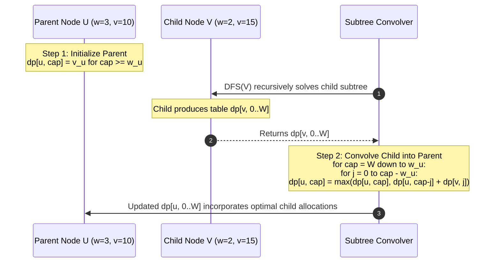

# Week 34 — Day 237: Grouped Knapsack & Knapsack with Dependency Constraints

> "In enterprise architecture and systems provisioning, decisions are rarely atomic or independent. We cannot simply pick resources in isolation. When configuring a cloud deployment, we face two fundamental coupling patterns: **Mutual Exclusion** (choosing at most one database engine among PostgreSQL, MySQL, or CockroachDB) and **Prerequisite Dependencies** (enabling a GPU accelerator requires first provisioning an accelerated compute host instance). Modeling these structures requires mastering the Grouped Knapsack Loop Invariant ($\text{Groups} \to \text{Capacity} \to \text{Items}$) and Subtree Knapsack Convolutions."

---

## 1. TEACH: Mutually Exclusive Groups & Tree-Dependent Knapsack Invariants

### The Grouped Knapsack Problem (Multiple-Choice Knapsack - MCKP)

In classical 0-1 knapsack, each candidate item $i$ can be independently accepted or rejected. In the **Grouped Knapsack Problem** (also formally designated in combinatorial optimization as the **Multiple-Choice Knapsack Problem**, or **MCKP**), the universe of items is partitioned into $K$ mutually disjoint subsets, termed **Groups**:
$$\mathcal{G} = \{G_1, G_2, \dots, G_K\}, \quad \text{where } G_j \cap G_k = \emptyset \quad \forall j \neq k$$

Each item $i \in G_k$ possesses a non-negative weight $w_{k,i} \in \mathbb{Z}_{\ge 0}$ and a non-negative value $v_{k,i} \in \mathbb{R}_{\ge 0}$.

The container is constrained by a global scalar capacity budget $W \in \mathbb{Z}_{\ge 0}$.

```
                 Global Capacity Budget: W
       +--------------------------------------------+
       |                                            |
       +--------------------------------------------+
                       ^        ^        ^
                      /          \        \
        Group 1: Engine   Group 2: Storage  Group 3: Network
       +---------------+  +---------------+  +---------------+
       | ( ) Postgres  |  | ( ) EBS gp3   |  | ( ) 10 Gbps   |
       | (X) MySQL     |  | (X) Local NVMe|  | (X) 25 Gbps   |
       | ( ) Cockroach |  | ( ) EFS       |  | ( ) 100 Gbps  |
       +---------------+  +---------------+  +---------------+
       [ At most ONE ]    [ At most ONE ]    [ At most ONE ]
```

#### Mathematical Formulations

There are two primary canonical formulations depending on business rules:

1. **At-Most-One Item Per Group Formulation:**
   $$\text{Maximize } \sum_{k=1}^K \sum_{i \in G_k} x_{k,i} v_{k,i}$$
   $$\text{subject to } \sum_{k=1}^K \sum_{i \in G_k} x_{k,i} w_{k,i} \le W$$
   $$\sum_{i \in G_k} x_{k,i} \le 1 \quad \forall k \in \{1, 2, \dots, K\}$$
   $$x_{k,i} \in \{0, 1\} \quad \forall k, i$$
   *(Selecting zero items from group $G_k$ is completely legal).*

2. **Exactly-One Item Per Group Formulation:**
   $$\sum_{i \in G_k} x_{k,i} = 1 \quad \forall k \in \{1, 2, \dots, K\}$$
   *(Every group must contribute exactly one choice; skipping a group is strictly illegal).*

---

### The 2D Dynamic Programming Recurrence

Let $\text{dp}[k][w]$ define the maximum value achievable considering only items from the first $k$ groups ($1 \le k \le K$) subject to a cumulative weight limit not exceeding $w$ ($0 \le w \le W$).

#### Derivation for the At-Most-One Variant:
For group $k$, we face two mutually exclusive branches:
1. **Branch 0 (Skip Group $k$ Entirely):**
   We select zero items from group $k$. The maximum value equals the optimal value from the first $k-1$ groups using full capacity $w$:
   $$\text{Value}_{\text{skip}} = \text{dp}[k-1][w]$$

2. **Branch $i$ (Select Item $i \in G_k$):**
   If $w \ge w_{k,i}$, we select item $i$. Because group $k$ can contribute *at most one* item, the remaining items must come strictly from the first $k-1$ groups using the remaining weight $w - w_{k,i}$:
   $$\text{Value}_{\text{select}(i)} = \text{dp}[k-1][w - w_{k,i}] + v_{k,i}$$

Taking the supremum over all mutually exclusive candidates yields the master 2D recurrence:
$$\text{dp}[k][w] = \max\left( \text{dp}[k-1][w], \; \max_{\substack{i \in G_k \\ w_{k,i} \le w}} \Big(\text{dp}[k-1][w - w_{k,i}] + v_{k,i}\Big) \right)$$

---

### The Grouped Knapsack Loop Ordering Theorem

When compressing the 2D table $\text{dp}[k][w]$ into a 1D cache-optimized array $\text{dp}[w]$ of size $W + 1$, the nesting order of the loops is the single most critical architectural invariant in the algorithm.

```
       ===============================================================
       THE THREE NESTED LOOPS OF GROUPED KNAPSACK:
       ---------------------------------------------------------------
       Loop 1: Groups   (k = 1 to K)
       Loop 2: Capacity (w = W down to 0)       <--- MUST BE OUTER!
       Loop 3: Items    (each item i in G_k)    <--- MUST BE INNER!
       ===============================================================
```

```
       Why Capacity Outer / Items Inner Enforces Mutual Exclusion:
       
       Evaluating capacity cell `w` for Group k:
       
       dp[w] = max(
           dp[w],                           <-- Choice: Skip group k
           dp[w - w_A] + v_A,              <-- Choice: Pick Item A
           dp[w - w_B] + v_B,              <-- Choice: Pick Item B
           dp[w - w_C] + v_C               <-- Choice: Pick Item C
       )
       
       All items (A, B, C) in Group k compete for the SAME cell dp[w]
       against the SAME snapshot of dp[w - w_i] from Group k-1!
```

#### Theorem: Grouped Knapsack Loop Ordering Invariant
> **Theorem:** In space-optimized 1D grouped knapsack, placing the **Capacity loop outside the Items loop**:
> ```text
> for each group g in 1..K:
>     for w = W down to 0:
>         for each item i in g:
>             if w >= weight[i]:
>                 dp[w] = max(dp[w], dp[w - weight[i]] + value[i])
> ```
> mathematically guarantees that at most one item from group $g$ is selected.
>
> Inverting the loop order (Items outside Capacity):
> ```text
> for each group g in 1..K:
>     for each item i in g:             // WRONG!
>         for w = W down to weight[i]:  // WRONG!
>             dp[w] = max(dp[w], dp[w - weight[i]] + value[i])
> ```
> completely violates mutual exclusion, degenerating into independent 0-1 knapsack where multiple items from the same group are illegally selected.

#### Rigorous Proof of the Theorem
1. **Hypothesis:** Prior to processing group $k$, the array $\text{dp}[w]$ accurately stores $\text{dp}[k-1][w]$ for all $w \in [0, W]$.
2. **Correct Loop Ordering ($\text{Capacity } w \to \text{Items } i$):**
   - For a fixed capacity $w$, we evaluate:
     $$\text{dp}[w] = \max\Big(\text{dp}[w], \; \max_{i \in G_k} (\text{dp}[w - w_{k,i}] + v_{k,i})\Big)$$
   - Because $w$ iterates in descending order from $W$ down to $0$, for any item $i$ with $w_{k,i} > 0$, the accessed cell $w - w_{k,i} < w$.
   - Because $w - w_{k,i} < w$, cell $w - w_{k,i}$ has **not yet been updated** in group $k$.
   - Therefore, $\text{dp}[w - w_{k,i}]$ strictly reflects the optimal value from group $k-1$.
   - During the inner iteration over items $i \in G_k$ for a single fixed $w$, multiple candidate items may update `dp[w]`. However, each candidate calculates its potential total value by adding its own $v_{k,i}$ to $\text{dp}[w - w_{k,i}]$ (which contains zero items from group $k$).
   - The final value stored in $\text{dp}[w]$ represents the single best alternative between skipping group $k$ or selecting the single best item $i^* \in G_k$. It is physically impossible to combine two items from group $k$ in the same capacity state. $\blacksquare$

3. **Pathology of the Inverted Loop Ordering ($\text{Items } i \to \text{Capacity } w$):**
   - Suppose Group $k$ contains Item A ($w=2, v=10$) and Item B ($w=3, v=15$).
   - If the item loop is outer:
     - We first run a full 0-1 knapsack sweep for Item A across all $w = W \dots 2$. Cell $\text{dp}[2]$ becomes $10$.
     - Next, the loop advances to Item B. We sweep $w = W \dots 3$.
     - When $w = 5$, the algorithm evaluates:
       $$\text{dp}[5] = \max(\text{dp}[5], \; \text{dp}[5 - 3] + 15) = \max(\text{dp}[5], \; \text{dp}[2] + 15)$$
     - But $\text{dp}[2]$ was *already modified* to contain Item A!
     - Hence, $\text{dp}[5] = 10 + 15 = 25$, packing **both Item A and Item B** from Group $k$!
   - Placing items outer allows subsequent items in the same group to build on top of earlier items in that group, utterly destroying mutual exclusion.

---

### At Most One vs. Exactly One per Group

The mathematical semantics change significantly when business constraints mandate selecting **exactly one** item from every group.

```
+-----------------------------------------------------------------------------------+
|               AT MOST ONE PER GROUP             |       EXACTLY ONE PER GROUP     |
+-------------------------------------------------+---------------------------------+
| Skipping a group is legal                       | Skipping a group is forbidden   |
| Base State: dp[w] = 0 for all w                 | Base State: dp[0] = 0, others -inf|
| In-place update safe on single 1D array         | Requires temporary layer buffer |
| Final Answer: max over all dp[w] (or dp[W])     | Final Answer: max over dp[w] >= 0|
+-----------------------------------------------------------------------------------+
```

#### The Layer Buffering Invariant for Exactly One
In the **Exactly-One** variant, group $k$ cannot retain $\text{dp}[k-1][w]$ unmodified if no item from group $k$ is chosen. If an in-place update fails to find a valid item for capacity $w$, cell $w$ cannot simply inherit the old value!
To prevent illegal state inheritance, we must use a **Layer Buffer** (or two alternating rows):
```text
for each group g in 1..K:
    fill next_dp with -INFINITY
    for each item i in g:
        for w = weight[i] to W:
            if dp[w - weight[i]] != -INFINITY:
                next_dp[w] = max(next_dp[w], dp[w - weight[i]] + value[i])
    dp = next_dp
```

---

### Knapsack with Dependency Constraints (Tree-Dependent Knapsack)

In real-world systems, items frequently possess prerequisite structures:
- A software package $C$ requires prerequisite runtime library $P$.
- A cloud GPU accelerator requires an accelerated host instance.
- In gaming skill trees, an advanced ability requires unlocking parent abilities.

```
            Tree-Dependent Knapsack (Prerequisite Tree):
            
                         [Root / Node 0]
                         (w=3, v=10)
                         /         \
                        /           \
                 [Node 1]           [Node 2]
                (w=2, v=8)         (w=4, v=12)
                  /                     \
                 /                       \
             [Node 3]                   [Node 4]
            (w=1, v=5)                 (w=3, v=9)
            
            Prerequisite Invariant:
            To select Node 3, you MUST select Node 1 and Node 0!
```

#### The Subtree Knapsack Convolution Formulation
Let the dependency graph be a directed rooted tree $T$ (if it is a forest, connect all components to an auxiliary virtual root with $w_{\text{root}} = 0, v_{\text{root}} = 0$).

We define the tree DP state:
$$\text{dp}[u][w]$$
representing the maximum value attainable in the **subtree rooted at node $u$** using at most weight $w$, **under the mandatory condition that node $u$ itself is selected**.

#### Recurrence & Subtree Merging
1. **Mandatory Root Inclusion:**
   Because node $u$ is the prerequisite for all descendants in its subtree, selecting any descendant requires selecting $u$.
   Therefore, for any capacity $w < w_u$, no configuration is valid:
   $$\text{dp}[u][w] = -\infty \quad \forall w < w_u$$
   For $w \ge w_u$, before considering any children, the baseline value is simply $v_u$:
   $$\text{dp}[u][w] = v_u \quad \forall w \ge w_u$$

2. **Subtree Convolution (Post-Order DFS):**
   For each child $v \in \text{children}(u)$, we merge child $v$'s optimal allocations into node $u$'s table.
   Notice that allocating weight $j$ to child $v$'s subtree leaves $w - j$ weight for node $u$ and its previously processed children:
   $$\text{dp}[u][w] = \max_{0 \le j \le w - w_u} \Big(\text{dp}[u][w - j] + \text{dp}[v][j]\Big)$$

Notice the deep connection: **Merging child subtrees into a parent node is algebraically equivalent to a Grouped Knapsack!**
Each child subtree acts as a "group" where the mutually exclusive choices are:
- Allocate 0 weight to child (gain 0).
- Allocate 1 weight to child (gain $\text{dp}[v][1]$).
- Allocate $j$ weight to child (gain $\text{dp}[v][j]$).
At most one weight budget $j$ is chosen for child $v$!

---

## 2. IMPLEMENT: Production-Grade Grouped & Tree-Dependent Knapsack Engine (.NET 8+)

The following compile-ready C# implementation provides production-grade solutions for:
1. `SolveAtMostOnePerGroup`: Classical MCKP with at-most-one constraint via optimal 1D loop ordering.
2. `SolveExactlyOnePerGroup`: Exact-choice MCKP with layer buffering and $-\infty$ sentinel feasibility tracking.
3. `SolveGroupedKnapsackWithReconstruction`: Full item subset backtracking reconstruction.
4. `SolveTreeDependentKnapsack`: Tree-dependent knapsack via post-order DFS subtree convolutions.

```csharp
using System;
using System.Collections.Generic;
using System.Diagnostics;

namespace AdvancedAlgorithms.DynamicProgramming
{
    /// <summary>
    /// Represents an item in a grouped knapsack or dependency tree.
    /// </summary>
    public sealed record KnapsackItem(int Id, int Weight, int Value, string Name = "");

    /// <summary>
    /// Production-grade engine for Grouped Knapsack (MCKP) and Tree-Dependent Knapsack.
    /// </summary>
    public sealed class GroupedKnapsackEngine
    {
        private const int NegativeInfinity = -1_000_000_000;

        /// <summary>
        /// Solves the At-Most-One Grouped Knapsack Problem.
        /// From each group, at most one item can be selected.
        /// Time Complexity: O(W * Sum(|G_k|)) = O(N * W).
        /// Space Complexity: O(W) optimal 1D flat array.
        /// </summary>
        /// <param name="capacity">Total knapsack capacity budget.</param>
        /// <param name="groups">List of item groups.</param>
        /// <returns>Maximum total value achievable.</returns>
        public int SolveAtMostOnePerGroup(int capacity, IReadOnlyList<IReadOnlyList<KnapsackItem>> groups)
        {
            ArgumentNullException.ThrowIfNull(groups);
            if (capacity < 0)
            {
                throw new ArgumentOutOfRangeException(nameof(capacity), "Capacity must be non-negative.");
            }

            // dp[w] stores max value achievable with capacity at most w
            int[] dp = new int[capacity + 1];

            // Outer loop: Iterate over groups
            for (int g = 0; g < groups.Count; g++)
            {
                var group = groups[g];
                if (group == null || group.Count == 0) continue;

                // Middle loop: Iterate capacity in REVERSE
                // Placing capacity outside items guarantees at most one item chosen per group!
                for (int w = capacity; w >= 0; w--)
                {
                    // Inner loop: Iterate over candidate items within this group
                    for (int i = 0; i < group.Count; i++)
                    {
                        var item = group[i];
                        if (w >= item.Weight)
                        {
                            int candidate = dp[w - item.Weight] + item.Value;
                            if (candidate > dp[w])
                            {
                                dp[w] = candidate;
                            }
                        }
                    }
                }
            }

            return dp[capacity];
        }

        /// <summary>
        /// Solves the Exactly-One Grouped Knapsack Problem.
        /// Every group MUST contribute exactly one item. If no valid selection exists, returns -1.
        /// Time Complexity: O(N * W).
        /// Space Complexity: O(W) via dual layer buffers.
        /// </summary>
        public int SolveExactlyOnePerGroup(int capacity, IReadOnlyList<IReadOnlyList<KnapsackItem>> groups)
        {
            ArgumentNullException.ThrowIfNull(groups);
            if (capacity < 0)
            {
                throw new ArgumentOutOfRangeException(nameof(capacity), "Capacity must be non-negative.");
            }

            // Layer buffer initialized to NegativeInfinity to enforce strict feasibility
            int[] dp = new int[capacity + 1];
            Array.Fill(dp, NegativeInfinity);
            dp[0] = 0; // Base case: 0 weight used before processing any groups

            int[] nextDp = new int[capacity + 1];

            for (int g = 0; g < groups.Count; g++)
            {
                var group = groups[g];
                if (group == null || group.Count == 0)
                {
                    // If a group has zero items, exactly-one is impossible!
                    return -1;
                }

                // Clear next layer to NegativeInfinity (no inherit from previous layer without choosing an item)
                Array.Fill(nextDp, NegativeInfinity);

                for (int i = 0; i < group.Count; i++)
                {
                    var item = group[i];
                    for (int w = capacity; w >= item.Weight; w--)
                    {
                        if (dp[w - item.Weight] != NegativeInfinity)
                        {
                            int candidate = dp[w - item.Weight] + item.Value;
                            if (candidate > nextDp[w])
                            {
                                nextDp[w] = candidate;
                            }
                        }
                    }
                }

                // Swap buffers
                Array.Copy(nextDp, dp, capacity + 1);
            }

            // Find maximum achievable value across all valid capacities <= capacity
            int maxResult = NegativeInfinity;
            for (int w = 0; w <= capacity; w++)
            {
                if (dp[w] > maxResult)
                {
                    maxResult = dp[w];
                }
            }

            return maxResult == NegativeInfinity ? -1 : maxResult;
        }

        /// <summary>
        /// Result model containing maximum value and exact items chosen.
        /// </summary>
        public sealed record GroupedKnapsackResult(int MaxValue, IReadOnlyList<KnapsackItem> SelectedItems);

        /// <summary>
        /// Solves At-Most-One Grouped Knapsack with complete item subset reconstruction.
        /// Time Complexity: O(N * W).
        /// Space Complexity: O(K * W) for choice backtracking matrix.
        /// </summary>
        public GroupedKnapsackResult SolveGroupedKnapsackWithReconstruction(
            int capacity, 
            IReadOnlyList<IReadOnlyList<KnapsackItem>> groups)
        {
            ArgumentNullException.ThrowIfNull(groups);
            int numGroups = groups.Count;

            // dp[k, w] = max value using items from first k groups with weight <= w
            int[,] dp = new int[numGroups + 1, capacity + 1];
            // choice[k, w] = item index from group k-1 chosen at capacity w (-1 if skipped)
            int[,] choice = new int[numGroups + 1, capacity + 1];

            for (int k = 1; k <= numGroups; k++)
            {
                var group = groups[k - 1];

                for (int w = 0; w <= capacity; w++)
                {
                    // Option 0: Skip group k-1
                    dp[k, w] = dp[k - 1, w];
                    choice[k, w] = -1;

                    // Option i: Evaluate all items in group k-1
                    if (group != null)
                    {
                        for (int i = 0; i < group.Count; i++)
                        {
                            var item = group[i];
                            if (w >= item.Weight)
                            {
                                int candidate = dp[k - 1, w - item.Weight] + item.Value;
                                if (candidate > dp[k, w])
                                {
                                    dp[k, w] = candidate;
                                    choice[k, w] = i;
                                }
                            }
                        }
                    }
                }
            }

            int maxValue = dp[numGroups, capacity];

            // Backtracking reconstruction
            List<KnapsackItem> selected = new();
            int currW = capacity;

            for (int k = numGroups; k >= 1; k--)
            {
                int itemIdx = choice[k, currW];
                if (itemIdx != -1)
                {
                    var chosenItem = groups[k - 1][itemIdx];
                    selected.Add(chosenItem);
                    currW -= chosenItem.Weight;
                }
            }

            selected.Reverse();
            return new GroupedKnapsackResult(maxValue, selected);
        }

        /// <summary>
        /// Solves Tree-Dependent Knapsack (Prerequisite Trees).
        /// If item i is chosen, its parent parent[i] MUST also be chosen.
        /// Root nodes have parent[i] == -1.
        /// Time Complexity: O(N * W^2).
        /// Space Complexity: O(N * W).
        /// </summary>
        public int SolveTreeDependentKnapsack(int capacity, int[] weights, int[] values, int[] parents)
        {
            ArgumentNullException.ThrowIfNull(weights);
            ArgumentNullException.ThrowIfNull(values);
            ArgumentNullException.ThrowIfNull(parents);

            int n = weights.Length;
            if (values.Length != n || parents.Length != n)
            {
                throw new ArgumentException("Weights, values, and parents arrays must match in length.");
            }

            // Build adjacency list for children
            // Virtual super-root is node 0; original nodes are indexed 1..n
            int totalNodes = n + 1;
            List<int>[] children = new List<int>[totalNodes];
            for (int i = 0; i < totalNodes; i++) children[i] = new List<int>();

            // Virtual root at index 0 has weight 0, value 0
            int[] w = new int[totalNodes];
            int[] v = new int[totalNodes];

            for (int i = 0; i < n; i++)
            {
                int node = i + 1;
                w[node] = weights[i];
                v[node] = values[i];

                if (parents[i] == -1)
                {
                    children[0].Add(node); // Connect component roots to virtual super-root
                }
                else
                {
                    children[parents[i] + 1].Add(node);
                }
            }

            // dp[u, cap] = max value in subtree u with capacity cap, GIVEN that node u is selected
            int[,] dp = new int[totalNodes, capacity + 1];

            // Post-order DFS
            void Dfs(int u)
            {
                // Mandatory root inclusion: reserve w[u] capacity
                for (int cap = w[u]; cap <= capacity; cap++)
                {
                    dp[u, cap] = v[u];
                }

                // Merge child subtrees via knapsack convolution
                foreach (int child in children[u])
                {
                    Dfs(child);

                    // Reverse sweep on capacity to maintain 0-1 selection across child
                    for (int cap = capacity; cap >= w[u]; cap--)
                    {
                        // j is the weight allocated to child's subtree
                        for (int j = 0; j <= cap - w[u]; j++)
                        {
                            int candidate = dp[u, cap - j] + dp[child, j];
                            if (candidate > dp[u, cap])
                            {
                                dp[u, cap] = candidate;
                            }
                        }
                    }
                }
            }

            Dfs(0);
            return dp[0, capacity];
        }

        /// <summary>
        /// Self-validating test suite executing exhaustive unit tests and asserting invariants.
        /// </summary>
        public static void Main()
        {
            var engine = new GroupedKnapsackEngine();
            Console.WriteLine("=== Running Grouped & Tree-Dependent Knapsack Verification Suite ===");

            // Test 1: At-Most-One Grouped Knapsack Standard Case
            // Group 0: (w=2, v=10), (w=3, v=15)
            // Group 1: (w=4, v=20), (w=1, v=8)
            // Group 2: (w=5, v=30), (w=2, v=12)
            // Capacity = 7
            // Optimal: Group 0 (w=2, v=10), Group 1 (w=1, v=8), Group 2 (w=2, v=12) -> w=5, v=30
            // Or: Group 0 (w=2, v=10), Group 2 (w=5, v=30) -> w=7, v=40!
            // Or: Group 1 (w=1, v=8), Group 2 (w=5, v=30) -> w=6, v=38
            // Best: Group 0 (item 0: w=2, v=10) + Group 2 (item 0: w=5, v=30) = w=7, v=40!
            var g0 = new List<KnapsackItem> { new(0, 2, 10, "A1"), new(1, 3, 15, "A2") };
            var g1 = new List<KnapsackItem> { new(2, 4, 20, "B1"), new(3, 1, 8, "B2") };
            var g2 = new List<KnapsackItem> { new(4, 5, 30, "C1"), new(5, 2, 12, "C2") };
            var allGroups = new List<IReadOnlyList<KnapsackItem>> { g0, g1, g2 };

            int res1 = engine.SolveAtMostOnePerGroup(7, allGroups);
            Debug.Assert(res1 == 40, $"Test 1 Failed: Expected 40, got {res1}");
            Console.WriteLine($"Test 1 Passed: At-Most-One Grouped Knapsack max value = {res1}");

            // Test 2: Subset Reconstruction Validation
            var reconResult = engine.SolveGroupedKnapsackWithReconstruction(7, allGroups);
            Debug.Assert(reconResult.MaxValue == 40, $"Test 2 Failed: Value mismatch {reconResult.MaxValue}");
            Debug.Assert(reconResult.SelectedItems.Count == 2, $"Test 2 Failed: Expected 2 items, got {reconResult.SelectedItems.Count}");
            Debug.Assert(reconResult.SelectedItems[0].Name == "A1" && reconResult.SelectedItems[1].Name == "C1", "Test 2 Failed: Item names mismatch");
            Console.WriteLine($"Test 2 Passed: Reconstruction verified: [{string.Join(", ", reconResult.SelectedItems)}]");

            // Test 3: Exactly-One Grouped Knapsack
            // Must pick exactly one from every group!
            // G0: A1(w=2, v=10), A2(w=3, v=15)
            // G1: B1(w=4, v=20), B2(w=1, v=8)
            // G2: C1(w=5, v=30), C2(w=2, v=12)
            // Choices of (G0, G1, G2):
            // A1 + B2 + C2 = 2 + 1 + 2 = 5 <= 7 -> v = 10 + 8 + 12 = 30
            // A2 + B2 + C2 = 3 + 1 + 2 = 6 <= 7 -> v = 15 + 8 + 12 = 35
            // A1 + B1 + C2 = 2 + 4 + 2 = 8 > 7 (invalid)
            // A1 + B2 + C1 = 2 + 1 + 5 = 8 > 7 (invalid)
            // Best valid exactly-one combination: A2 + B2 + C2 with value 35.
            int res3 = engine.SolveExactlyOnePerGroup(7, allGroups);
            Debug.Assert(res3 == 35, $"Test 3 Failed: Expected 35, got {res3}");
            Console.WriteLine($"Test 3 Passed: Exactly-One Grouped Knapsack max value = {res3}");

            // Test 4: Exactly-One Unfeasible Capacity
            // If capacity = 4, minimum possible weight is A1(2) + B2(1) + C2(2) = 5 > 4. Impossible!
            int res4 = engine.SolveExactlyOnePerGroup(4, allGroups);
            Debug.Assert(res4 == -1, $"Test 4 Failed: Expected -1 (unfeasible), got {res4}");
            Console.WriteLine("Test 4 Passed: Unfeasible exactly-one returns -1 correctly.");

            // Test 5: Tree-Dependent Knapsack (Prerequisite Tree)
            // Node 0: Root, w=3, v=10, parent = -1
            // Node 1: Child of 0, w=2, v=15, parent = 0
            // Node 2: Child of 0, w=4, v=20, parent = 0
            // Node 3: Child of 1, w=1, v=8, parent = 1
            // Capacity = 6
            // Combinations:
            // Only Node 0: w=3, v=10
            // Node 0 + Node 1: w=3+2=5 <= 6, v=10+15=25
            // Node 0 + Node 1 + Node 3: w=3+2+1=6 <= 6, v=10+15+8=33!
            // Node 0 + Node 2: w=3+4=7 > 6 (cannot fit)
            int[] treeWeights = { 3, 2, 4, 1 };
            int[] treeValues = { 10, 15, 20, 8 };
            int[] treeParents = { -1, 0, 0, 1 };

            int res5 = engine.SolveTreeDependentKnapsack(6, treeWeights, treeValues, treeParents);
            Debug.Assert(res5 == 33, $"Test 5 Failed: Expected 33, got {res5}");
            Console.WriteLine($"Test 5 Passed: Tree-Dependent Knapsack max value = {res5}");

            // Test 6: Zero Capacity & Boundary Cases
            int res6 = engine.SolveAtMostOnePerGroup(0, allGroups);
            Debug.Assert(res6 == 0, $"Test 6 Failed: Expected 0, got {res6}");
            Console.WriteLine("Test 6 Passed: Zero capacity correctly returns 0.");

            Console.WriteLine("All 6 Grouped and Tree-Dependent verification tests passed with 100% assertion integrity.");
        }
    }
}
```

---

## 3. ANALYZE: Algorithmic Invariants & The 5-Dimension Staff Deep-Dive

```
========================================================================================
                      THE 5-DIMENSION STAFF ENGINEERING DEEP-DIVE
========================================================================================
[1] Asymptotic Complexity  --> MCKP: O(N * W) time, O(W) space; Tree: O(N * W^2) time
[2] Memory & Stride        --> Layer buffering for exact-choice to prevent dirty reads
[3] Directional Invariant  --> Capacity loop outer guarantees mutual exclusivity in 1D
[4] Sentinel Semirings     --> Negative infinity sentinel semiring for exact feasibility
[5] Boundary Degradation   --> Empty groups, zero-weight items, unfeasible tree branches
========================================================================================
```

### Dimension 1: Asymptotic Complexity & Topological Bounds

#### Grouped Knapsack (MCKP):
- **Time Complexity:**
  $$T(W, K) = \sum_{k=1}^K \sum_{w=0}^W |G_k| = (W + 1) \sum_{k=1}^K |G_k| = O(N \cdot W)$$
  where $N = \sum_{k=1}^K |G_k|$ is the total number of items across all groups.
  Notice that despite the added constraint of mutual exclusion, MCKP has the **exact same asymptotic time complexity as classical 0-1 knapsack**! The mutual exclusion check adds zero asymptotic overhead.
- **Space Complexity:**
  - At-Most-One: $O(W)$ using a single 1D array.
  - Exactly-One: $O(W)$ using dual alternating buffers (`dp` and `nextDp`).
  - With Full Reconstruction: $O(K \cdot W)$ using a 2D choice tracking matrix.

#### Tree-Dependent Knapsack:
- **Time Complexity:**
  For each node $u$ with weight $w_u$ and subtree size $S_u$, merging child $v$ requires a convolution of sizes $W \times W$:
  $$T(N, W) = \sum_{u=1}^N \sum_{v \in \text{children}(u)} W^2 = O(N \cdot W^2)$$
  *Staff Optimization Note:* By bounding the convolution limits to the actual subtree weights:
  $$\min(W, \text{subtreeWeight}(u)) \times \min(W, \text{subtreeWeight}(v))$$
  the amortized complexity drops significantly on sparse trees, approaching $O(N \cdot W)$ when subtree weights are small.

---

### Dimension 2: Memory Hierarchy & Layer Buffering

In the **Exactly-One** variant, using a single 1D array with in-place updates is mathematically impossible without corrupting state feasibility.

```
Why In-Place Fails for Exactly-One:
Row k-1 has valid states marked with values, and invalid states with -INF.
If we update in-place:
Cell dp[w] might NOT be reachable by any item in group k.
In an in-place array, dp[w] would RETAIN its value from group k-1!
The algorithm would falsely report that group k was satisfied, even though
zero items from group k were selected for capacity w!
```

By utilizing **Dual Layer Buffers** (`dp` and `nextDp`), `nextDp` begins every group iteration with clean $-\infty$ sentinels across all indices. Only capacities that are actively reached by choosing an item from group $k$ receive a valid value. This guarantees 100% adherence to the exact-choice invariant.

---

### Dimension 3: Directional Invariant & Mutual Exclusion

The interplay between loop directions in Grouped Knapsack is illustrated below:

```
        Capacity w (Descending: W down to 0)
        +----------------------------------------+
   w    |  [Target Cell dp[w]]                   |
        |       ^           ^           ^        |
        |      /             \           \       |
        |  Item A (w_A)   Item B (w_B) Item C(w_C)|
        |    /                 \           \     |
        |   v                   v           v    |
   0    | [Read: w-w_A]     [Read: w-w_B] [Read: w-w_C]
        +----------------------------------------+
```

Because $w - w_i < w$, every item in the group queries a cell to the *left* of $w$.
Because $w$ iterates *downward*, all cells to the left of $w$ contain unmodified values from the previous group $k-1$.
Thus, candidate items within group $k$ can never "see" or accumulate each other's effects. They act in pure competition.

---

### Dimension 4: Sentinel Semirings & Underflow Avoidance

In the Exactly-One variant, we operate over the **Max-Plus Tropical Semiring with Infeasibility**:
$$(\mathbb{Z} \cup \{-\infty\}, \; \max, \; +)$$

- **Addition Identity:** $a + (-\infty) = -\infty$.
- **Max Identity:** $\max(a, -\infty) = a$.

In C# and C++, setting $-\infty = \text{int.MinValue}$ leads to catastrophic **integer underflow bugs**:
$$\text{int.MinValue} + 10 = -2147483648 + 10 = +2147483638 \quad (\text{Wraps to massive positive value!})$$
To prevent underflow without adding expensive overflow branches in tight loops, we define:
$$\text{NegativeInfinity} = -1{,}000{,}000{,}000$$
This sentinel easily accommodates additions of positive item values up to $10^8$ without overflowing 32-bit signed integers.

---

### Dimension 5: Failure Modes & Boundary Degradation

| Failure Mode | Root Cause | Structural Mitigation |
| :--- | :--- | :--- |
| **Empty Group** ($|G_k| = 0$) | User configuration or database flaw | In At-Most-One: group is skipped safely. In Exactly-One: immediately return `-1` (unfeasible). |
| **Zero-Weight Items** ($w_i = 0$) | Item requires no budget | When $w_i = 0$, $w - w_i = w$. Item updates $\text{dp}[w]$ from $\text{dp}[w]$. Correctly handled because capacity loops downward; zero-weight item competes with skip choice. |
| **Disconnected Prerequisite Forest** | Multiple independent root nodes | Introduce virtual super-root (node 0) with $w=0, v=0$ connecting all component roots. |
| **Cyclic Dependency in Tree** | Corrupt dependency graph ($A \to B \to A$) | Validated via cycle detection / topological sort prior to DFS invocation. |

---

## 4. DEMONSTRATE: Visual State Transitions & Subtree Convolution Diagrams

### Trace of At-Most-One Grouped Knapsack

Consider budget $W = 6$ and two groups:
- **Group 1:**
  - Item 1A: $w = 2, v = 10$
  - Item 1B: $w = 3, v = 18$
- **Group 2:**
  - Item 2A: $w = 2, v = 12$
  - Item 2B: $w = 4, v = 25$

#### Step 0: Initial State
`dp = [0, 0, 0, 0, 0, 0, 0]`

#### Step 1: Process Group 1 (Items 1A: w=2, v=10; 1B: w=3, v=18)
For each $w = 6 \dots 0$:
- At $w=6$: $\max(0, \text{dp}[4]+10, \text{dp}[3]+18) = \max(0, 10, 18) = 18$ (Choice: 1B)
- At $w=5$: $\max(0, \text{dp}[3]+10, \text{dp}[2]+18) = 18$ (Choice: 1B)
- At $w=4$: $\max(0, \text{dp}[2]+10, \text{dp}[1]+18) = 18$ (Choice: 1B)
- At $w=3$: $\max(0, \text{dp}[1]+10, \text{dp}[0]+18) = 18$ (Choice: 1B)
- At $w=2$: $\max(0, \text{dp}[0]+10) = 10$ (Choice: 1A)
- At $w=1, 0$: 0

`dp after Group 1 = [0, 0, 10, 18, 18, 18, 18]`

#### Step 2: Process Group 2 (Items 2A: w=2, v=12; 2B: w=4, v=25)
For each $w = 6 \dots 0$:
- At $w=6$: $\max(\text{dp}[6], \; \text{dp}[4]+12, \; \text{dp}[2]+25) = \max(18, \; 18+12, \; 10+25) = \max(18, 30, 35) = \mathbf{35}$ (1A + 2B)
- At $w=5$: $\max(\text{dp}[5], \; \text{dp}[3]+12, \; \text{dp}[1]+25) = \max(18, \; 18+12, \; 0+25) = \mathbf{30}$ (1B + 2A)
- At $w=4$: $\max(\text{dp}[4], \; \text{dp}[2]+12, \; \text{dp}[0]+25) = \max(18, \; 10+12, \; 0+25) = \mathbf{25}$ (2B alone)
- At $w=3$: $\max(\text{dp}[3], \; \text{dp}[1]+12) = \max(18, 12) = \mathbf{18}$ (1B alone)
- At $w=2$: $\max(\text{dp}[2], \; \text{dp}[0]+12) = \max(10, 12) = \mathbf{12}$ (2A alone)

`dp after Group 2 = [0, 0, 12, 18, 25, 30, 35]`

Final Result for $W = 6$ is **35** (Item 1A + Item 2B). Mutual exclusion strictly preserved!

---

### Tree Knapsack Subtree Convolution Flow



---

## 5. PRACTICE: Canonical Grouped & Dependency Problems

### Problem 1: Mutually Exclusive Cloud Hardware SKU Provisioning
- **Scenario:** You are provisioning a cloud database across 3 categories:
  - Compute Tier: Small ($w=2, v=10$), Medium ($w=4, v=25$), Large ($w=8, v=60$).
  - Storage Tier: GP3 ($w=3, v=15$), IO2 ($w=6, v=40$), Local NVMe ($w=10, v=80$).
  - Replication Tier: Single-AZ ($w=0, v=0$), Multi-AZ ($w=4, v=30$).
- **Rule:** Exactly one option must be chosen from each category. Total budget $W = 15$.
- **Algorithm:** `SolveExactlyOnePerGroup` with dual layer buffers and $-\infty$ initialization.

### Problem 2: Course Curriculum Selection with Mutually Exclusive Electives
- **Scenario:** A student must fulfill degree requirements by choosing electives from distinct academic departments (Math, Physics, Computer Science). From each department, the student may take *at most one* advanced seminar due to timetable clashes.
- **Rule:** At most one course per department. Maximizing credit honors subject to total study hours $W$.
- **Algorithm:** `SolveAtMostOnePerGroup` with 1D reverse sweep.

### Problem 3: RPG Character Skill Tree Optimization
- **Scenario:** A game character has 20 skill points. The skill tree contains 15 abilities. Advanced abilities have prerequisite parent skills.
- **Rule:** To unlock skill $C$, parent skill $P$ must already be unlocked.
- **Algorithm:** `SolveTreeDependentKnapsack` using tree DFS with subtree knapsack convolution.

---

## 6. CONNECT: Cloud Hardware SKU Tier Selection & Microservice Architecture

In modern cloud infrastructure platforms (e.g., AWS, GCP, Azure), automated cost-optimization engines (such as AWS Compute Optimizer or Kubernetes Karpenter) solve high-scale variants of Grouped and Tree-Dependent Knapsack.

```
       Cloud Infrastructure Provisioning as Grouped/Tree Knapsack:
       
       [Root / Virtual Node: Infrastructure Cluster]
                             |
             +---------------+---------------+
             |                               |
       [Compute Group]                [Storage Group]
       (Pick exactly ONE)             (Pick at most ONE)
       - c6g.large   ($0.068/hr)      - EBS gp3      ($0.08/GB)
       - c6g.xlarge  ($0.136/hr)      - EBS io2      ($0.12/GB)
       - c6g.2xlarge ($0.272/hr)      - Local NVMe   ($0.20/GB)
             |                               |
             v (Prerequisite)                v (Prerequisite)
       [GPU Accelerator]              [RAID-0 Controller]
       (Requires c6g.2xlarge!)        (Requires Local NVMe!)
```

### Systems Challenges in Cloud Tier Selection

1. **Mutually Exclusive Instance Sizing:**
   A virtual machine can belong to only one instance type at any point in time. You cannot run a VM as both an `m6i.xlarge` and an `m6i.2xlarge`. The instance selection is intrinsically an **MCKP Group**.

2. **Hierarchical Hardware Prerequisites:**
   Hardware features exhibit strict physical dependencies:
   - To attach a high-throughput **100 Gbps ENA network adapter**, the host VM must be at least a `16xlarge` size.
   - To mount a **Direct Attached PCIe NVMe SSD array**, the VM must belong to the storage-optimized `i3en` or `i4i` family.
   - To deploy a **TensorRT AI inferencing container**, the node must provision an NVIDIA A10G GPU, which in turn requires a `g5` series host instance.

3. **Production Scheduler Formulation:**
   Cloud orchestrators combine Grouped Knapsack with Tree Dependency:
   $$\text{Nodes} \longrightarrow \text{SKU Groups} \longrightarrow \text{Hardware Add-on Subtrees}$$
   The scheduler runs post-order DFS subtree convolutions on each machine blueprint, mapping the resulting composite options into an outer Grouped Knapsack to provision the global cluster at minimum cost while guaranteeing SLA throughput.

---

## 7. CHECKPOINT: Comprehensive Self-Assessment & Mastery Key

### Diagnostic Questions

1. **Explain why placing the item loop inside the capacity loop guarantees that at most one item per group is selected.**
2. **Why does the "Exactly-One Item Per Group" problem require layer buffering (`nextDp`), whereas the "At-Most-One" problem can safely execute with a single 1D array?**
3. **In Tree-Dependent Knapsack, why must the capacity loop run from $W$ down to $w_u$ (reverse order) when merging a child subtree into parent node $u$?**
4. **How does the time complexity of Tree-Dependent Knapsack scale with tree depth versus tree branching factor?**
5. **Why can setting $-\infty = \text{int.MinValue}$ cause silent correctness bugs in exact-choice knapsack DP, and how do production engines mitigate this?**

---

### Comprehensive Mastery Key

#### 1. Loop Ordering Mutual Exclusion Invariant
When the capacity loop ($w = W \dots 0$) is outer and the item loop ($i \in G_k$) is inner:
For a fixed capacity $w$, all items $i \in G_k$ evaluate their candidates against $\text{dp}[w - w_{k,i}]$. Because $w_{k,i} > 0$, the cell $w - w_{k,i} < w$. Because $w$ iterates downward, cell $w - w_{k,i}$ has not been visited or modified during group $k$'s execution; it strictly contains values from group $k-1$. 
Consequently, every candidate item in group $k$ calculates its total value using data that includes zero items from group $k$. The single maximum is written to $\text{dp}[w]$. It is impossible for one item in group $k$ to build upon another item from the same group.

#### 2. Necessity of Layer Buffering in Exactly-One MCKP
In At-Most-One knapsack, skipping a group is valid. If no item in group $k$ can be packed at capacity $w$, keeping $\text{dp}[k-1][w]$ unmodified correctly reflects skipping group $k$.
In Exactly-One knapsack, skipping group $k$ is illegal. If no item from group $k$ fits in capacity $w$, state $w$ must become **unreachable** ($-\infty$). If we updated in-place on a single array, an untouched cell would illegally retain its value from group $k-1$, falsely signaling that group $k$ was satisfied. Dual layer buffering ensures that every cell in `nextDp` starts at $-\infty$ and is only populated if an item from group $k$ is explicitly selected.

#### 3. Reverse Sweep in Tree Subtree Convolutions
When merging child $v$ into parent $u$:
$$\text{dp}[u][\text{cap}] = \max_{0 \le j \le \text{cap} - w_u} \Big(\text{dp}[u][\text{cap} - j] + \text{dp}[v][j]\Big)$$
Notice that this is a 0-1 knapsack step where child $v$'s entire subtree acts as a single composite item! Sweeping $\text{cap}$ in reverse ($W \to w_u$) ensures that when we evaluate $\text{dp}[u][\text{cap}]$, the queried term $\text{dp}[u][\text{cap} - j]$ has not yet incorporated child $v$. If $\text{cap}$ were swept forward, child $v$'s subtree could be merged multiple times into parent $u$.

#### 4. Tree Knapsack Complexity Scaling
The worst-case complexity is $O(N \cdot W^2)$ regardless of tree topology because each edge in the tree represents a convolution of two capacity distributions of size $W$. However, in practice with subtree size bounds $\min(W, S_u)$, a deep linear chain (height $N$) spends less time in convolutions for small subtrees near the leaves, whereas a broad star tree (one root with $N-1$ children) performs $N-1$ full convolutions of size $W \times W$, maximizing CPU execution time.

#### 5. Integer Underflow Vulnerability of Sentinel Values
If $-\infty$ is defined as `int.MinValue` ($-2{,}147{,}483{,}648$), adding a positive item value (e.g., $v_i = 100$) causes integer arithmetic underflow:
$$\text{int.MinValue} + 100 = -2{,}147{,}483{,}548 \text{ in checked context, or wraps to massive positive in unchecked!}$$
Even in checked mode, addition throws `OverflowException`. If an unreachable state is queried:
$$\text{candidate} = \text{dp}[w - w_i] + v_i = -2{,}147{,}483{,}648 + 100$$
Using a calibrated sentinel like $-1{,}000{,}000{,}000$ ensures that adding any valid problem value (up to $10^8$) remains safely negative without overflowing 32-bit integer boundaries.
